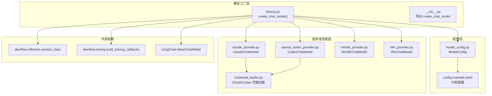
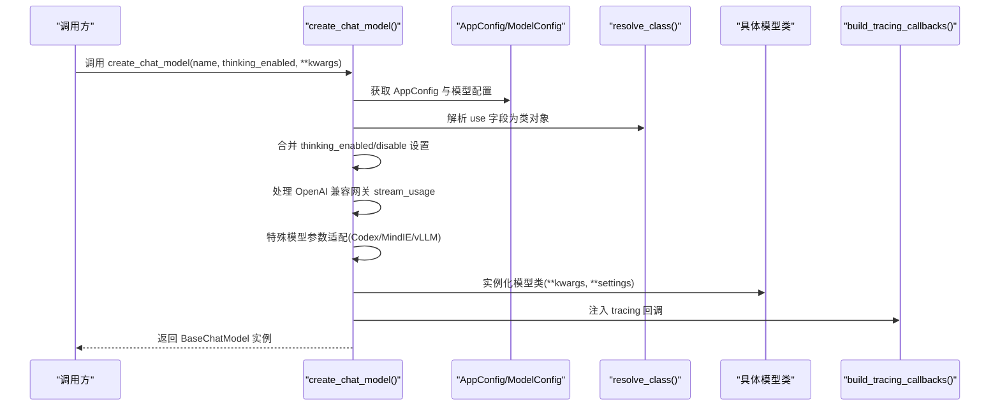
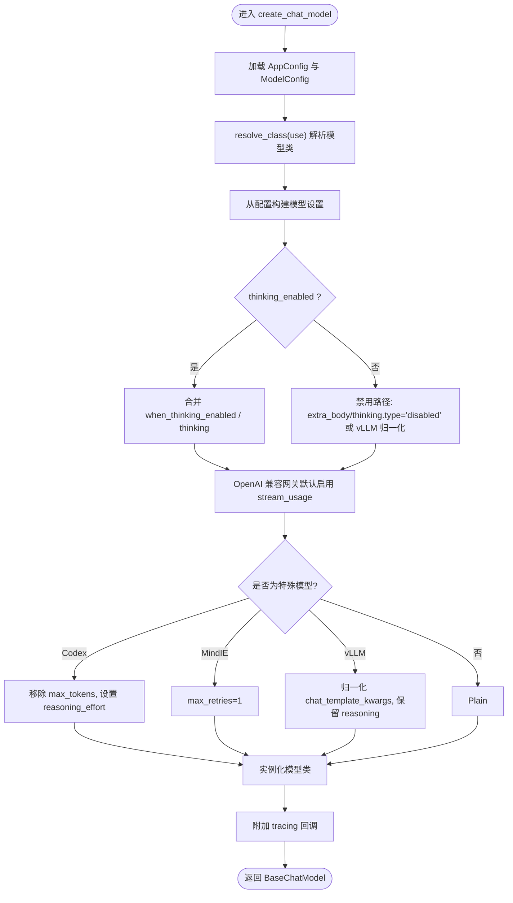
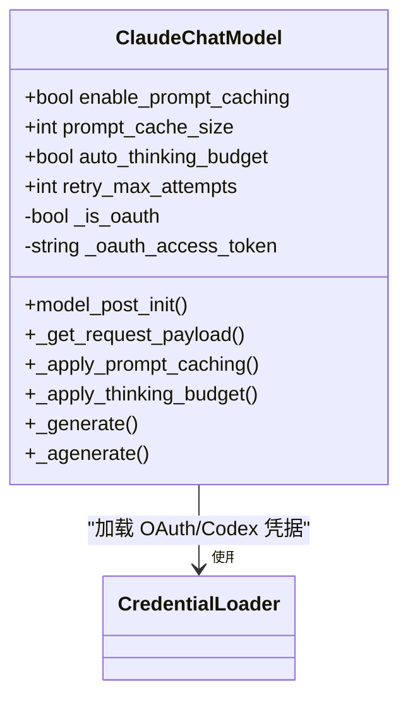
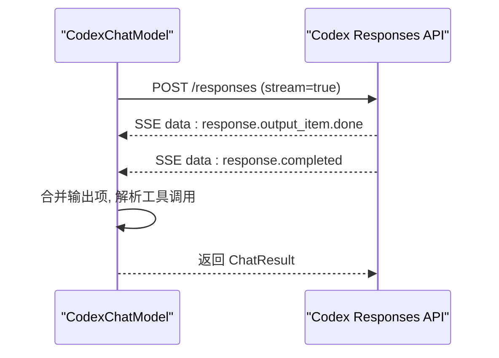
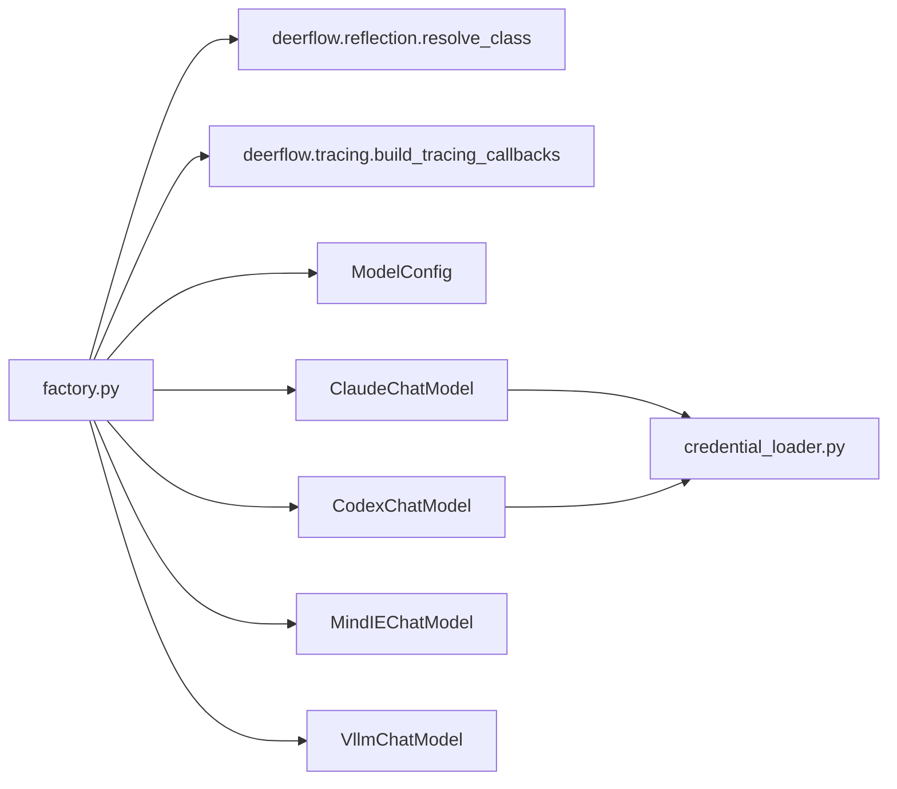

# 模型工厂系统

<cite>
**本文档引用的文件**
- [factory.py](file://backend/packages/harness/deerflow/models/factory.py)
- [__init__.py](file://backend/packages/harness/deerflow/models/__init__.py)
- [model_config.py](file://backend/packages/harness/deerflow/config/model_config.py)
- [credential_loader.py](file://backend/packages/harness/deerflow/models/credential_loader.py)
- [claude_provider.py](file://backend/packages/harness/deerflow/models/claude_provider.py)
- [openai_codex_provider.py](file://backend/packages/harness/deerflow/models/openai_codex_provider.py)
- [mindie_provider.py](file://backend/packages/harness/deerflow/models/mindie_provider.py)
- [vllm_provider.py](file://backend/packages/harness/deerflow/models/vllm_provider.py)
- [test_model_factory.py](file://backend/tests/test_model_factory.py)
- [test_model_config.py](file://backend/tests/test_model_config.py)
- [config.example.yaml](file://config.example.yaml)
</cite>

## 目录
1. [简介](#简介)
2. [项目结构](#项目结构)
3. [核心组件](#核心组件)
4. [架构总览](#架构总览)
5. [详细组件分析](#详细组件分析)
6. [依赖分析](#依赖分析)
7. [性能考虑](#性能考虑)
8. [故障排查指南](#故障排查指南)
9. [结论](#结论)
10. [附录](#附录)

## 简介
本文件面向 DeerFlow 的模型工厂系统，系统性阐述模型工厂的设计模式与动态创建机制，重点覆盖以下方面：
- create_chat_model() 的工作原理与反射系统应用
- 支持的模型提供商：OpenAI、Anthropic、DeepSeek、MindIE、vLLM、Codex 等第三方集成
- 模型配置加载机制、API 密钥管理与环境变量解析
- 模型切换策略、性能调优与故障恢复最佳实践
- 具体配置示例与调试指南

## 项目结构
模型工厂位于后端包 deerflow 的 models 子模块中，核心入口为 factory.py 的 create_chat_model()，配合 config.model_config.ModelConfig 与 deerflow.reflection.resolve_class 实现动态类解析与实例化。

图表来源
- [factory.py:50-158](file://backend/packages/harness/deerflow/models/factory.py#L50-L158)
- [__init__.py:1-4](file://backend/packages/harness/deerflow/models/__init__.py#L1-L4)
- [model_config.py:4-42](file://backend/packages/harness/deerflow/config/model_config.py#L4-L42)
- [credential_loader.py:149-220](file://backend/packages/harness/deerflow/models/credential_loader.py#L149-L220)
- [claude_provider.py:44-364](file://backend/packages/harness/deerflow/models/claude_provider.py#L44-L364)
- [openai_codex_provider.py:61-461](file://backend/packages/harness/deerflow/models/openai_codex_provider.py#L61-L461)
- [mindie_provider.py:162-250](file://backend/packages/harness/deerflow/models/mindie_provider.py#L162-L250)
- [vllm_provider.py:159-259](file://backend/packages/harness/deerflow/models/vllm_provider.py#L159-L259)

章节来源
- [factory.py:1-158](file://backend/packages/harness/deerflow/models/factory.py#L1-L158)
- [__init__.py:1-4](file://backend/packages/harness/deerflow/models/__init__.py#L1-L4)
- [model_config.py:1-42](file://backend/packages/harness/deerflow/config/model_config.py#L1-L42)
- [config.example.yaml:1-348](file://config.example.yaml#L1-L348)

## 核心组件
- 模型工厂函数 create_chat_model()
  - 动态解析配置，使用 deerflow.reflection.resolve_class 将 use 字段映射到具体模型类
  - 合并 thinking_enabled/disable 的配置，处理 extra_body/thinking 参数差异
  - 为 OpenAI 兼容网关自动启用 stream_usage，确保 token usage 可追踪
  - 针对 Codex、MindIE、vLLM 等特殊模型进行参数兼容与增强
  - 注入 tracing 回调，统一可观测性接入
- 配置模型 ModelConfig
  - 定义模型配置字段，支持 supports_thinking、supports_reasoning_effort、thinking 快捷字段、when_thinking_enabled/disabled 等
  - 支持 use_responses_api、output_version 等 OpenAI Responses API 相关字段
- 凭据加载 credential_loader
  - 自动从 Claude Code CLI 与 Codex CLI 加载 OAuth/Codex 凭据，支持环境变量与文件描述符
  - 提供 Claude Code OAuth 令牌检测与过期判断
- 提供者适配器
  - ClaudeChatModel：OAuth Bearer 认证、Prompt 缓存、智能思考预算
  - CodexChatModel：Responses API、流式 SSE、工具调用、重试机制
  - MindIEChatModel：消息兼容、XML 工具调用解析、流式回退
  - VllmChatModel：保留 reasoning 字段、流式 delta 处理、payload 修复

章节来源
- [factory.py:50-158](file://backend/packages/harness/deerflow/models/factory.py#L50-L158)
- [model_config.py:4-42](file://backend/packages/harness/deerflow/config/model_config.py#L4-L42)
- [credential_loader.py:149-220](file://backend/packages/harness/deerflow/models/credential_loader.py#L149-L220)
- [claude_provider.py:44-364](file://backend/packages/harness/deerflow/models/claude_provider.py#L44-L364)
- [openai_codex_provider.py:61-461](file://backend/packages/harness/deerflow/models/openai_codex_provider.py#L61-L461)
- [mindie_provider.py:162-250](file://backend/packages/harness/deerflow/models/mindie_provider.py#L162-L250)
- [vllm_provider.py:159-259](file://backend/packages/harness/deerflow/models/vllm_provider.py#L159-L259)

## 架构总览
模型工厂采用“配置驱动 + 反射解析 + 适配器扩展”的架构，实现多提供商、多模式的统一创建接口。

图表来源
- [factory.py:50-158](file://backend/packages/harness/deerflow/models/factory.py#L50-L158)

章节来源
- [factory.py:50-158](file://backend/packages/harness/deerflow/models/factory.py#L50-L158)

## 详细组件分析

### 模型工厂 create_chat_model() 设计与实现
- 输入参数与默认行为
  - name=None 时，默认使用配置中的第一个模型
  - thinking_enabled 控制是否启用思考模式；当启用且模型不支持时抛出错误
- 配置合并与优先级
  - when_thinking_enabled 与 thinking 快捷字段合并，优先级：显式 kwargs > when_thinking_enabled > thinking
  - when_thinking_disabled 优先于内置禁用逻辑，确保用户自定义覆盖
- OpenAI 兼容网关增强
  - 当 use 为 langchain_openai:ChatOpenAI 且存在 base_url/openai_api_base 时，默认开启 stream_usage，保证 token usage 可见
- 特殊模型适配
  - CodexChatModel：移除 max_tokens，根据 thinking_enabled 与显式 reasoning_effort 设置 reasoning_effort
  - MindIEChatModel：强制 max_retries=1，避免级联超时
  - vLLM：将 extra_body.chat_template_kwargs.thinking 归一化为 enable_thinking，保留 reasoning 字段
- 回调注入
  - 通过 deerflow.tracing.build_tracing_callbacks 获取回调，附加到模型实例

图表来源
- [factory.py:50-158](file://backend/packages/harness/deerflow/models/factory.py#L50-L158)

章节来源
- [factory.py:50-158](file://backend/packages/harness/deerflow/models/factory.py#L50-L158)

### 配置模型 ModelConfig
- 关键字段
  - name/display_name/description：模型标识与展示信息
  - use：类路径，如 "langchain_openai:ChatOpenAI" 或 "deerflow.models.claude_provider:ClaudeChatModel"
  - model：实际 API 模型名
  - supports_thinking/supports_reasoning_effort：能力声明
  - when_thinking_enabled/when_thinking_disabled：启用/禁用时的额外参数
  - thinking：快捷字段，等价于在启用时合并的参数
  - use_responses_api/output_version：OpenAI Responses API 相关
- 额外字段：支持任意额外键值，便于扩展

章节来源
- [model_config.py:4-42](file://backend/packages/harness/deerflow/config/model_config.py#L4-L42)
- [test_model_config.py:1-31](file://backend/tests/test_model_config.py#L1-L31)

### 凭据加载 credential_loader
- Claude Code OAuth
  - 支持环境变量 $CLAUDE_CODE_OAUTH_TOKEN/$ANTHROPIC_AUTH_TOKEN、$CLAUDE_CODE_OAUTH_TOKEN_FILE_DESCRIPTOR
  - 支持 $CLAUDE_CODE_CREDENTIALS_PATH 或 ~/.claude/.credentials.json
  - 自动检测 OAuth 令牌前缀，设置 anthropic-beta 头部，禁用 prompt caching
- Codex CLI
  - 从 ~/.codex/auth.json 加载 access_token/account_id
  - 支持嵌套 tokens 结构与旧版顶层字段
- 过期与错误处理
  - OAuth 令牌过期检查与日志警告
  - 文件读取失败与 JSON 解析异常的容错

章节来源
- [credential_loader.py:149-220](file://backend/packages/harness/deerflow/models/credential_loader.py#L149-L220)

### 提供者适配器

#### ClaudeChatModel（Anthropic）
- OAuth Bearer 认证：检测 sk-ant-oat 前缀，替换 api_key 为 auth_token，并添加 anthropic-beta 头
- Prompt 缓存：在系统、最近消息与工具定义上应用 cache_control，限制断点数量
- 思考预算：自动分配 max_tokens 的 80% 作为思考预算
- 重试机制：指数退避 + 抖动，支持 Retry-After 头

图表来源
- [claude_provider.py:44-364](file://backend/packages/harness/deerflow/models/claude_provider.py#L44-L364)

章节来源
- [claude_provider.py:44-364](file://backend/packages/harness/deerflow/models/claude_provider.py#L44-L364)

#### CodexChatModel（OpenAI Responses API）
- 使用 chatgpt.com/backend-api/codex/responses 接口
- 流式 SSE 解析，合并最终响应
- 工具调用：function_call/function_call_output 映射
- 重试：429/500/529 状态码指数退避

图表来源
- [openai_codex_provider.py:205-294](file://backend/packages/harness/deerflow/models/openai_codex_provider.py#L205-L294)

章节来源
- [openai_codex_provider.py:61-461](file://backend/packages/harness/deerflow/models/openai_codex_provider.py#L61-L461)

#### MindIEChatModel（OpenAI 兼容）
- 消息兼容：将 AIMessage 的 tool_calls 转换为 XML 文本，ToolMessage 包裹为 HumanMessage
- 流式回退：当 tools 存在时，非流式生成并模拟分片输出
- 工具调用解析：从 XML 中提取函数名与参数，还原为标准格式

章节来源
- [mindie_provider.py:162-250](file://backend/packages/harness/deerflow/models/mindie_provider.py#L162-L250)

#### VllmChatModel（OpenAI 兼容）
- Payload 归一化：将 extra_body.chat_template_kwargs.thinking 归一化为 enable_thinking
- Reasoning 保留：非流式与流式 delta 中均保留 reasoning 字段
- Multi-turn 修复：在请求 payload 中回注先前助手消息的 reasoning

章节来源
- [vllm_provider.py:159-259](file://backend/packages/harness/deerflow/models/vllm_provider.py#L159-L259)

## 依赖分析
- 内部依赖
  - factory.py 依赖 deerflow.config.get_app_config、deerflow.reflection.resolve_class、deerflow.tracing.build_tracing_callbacks
  - 各提供者依赖 deerflow.models.credential_loader（OAuth/Codex）
- 外部依赖
  - LangChain BaseChatModel 体系
  - anthropic、httpx、openai 等第三方 SDK
- 耦合与内聚
  - 工厂与提供者通过 use 类路径解耦，新增提供商仅需实现 LangChain 兼容接口并注册类路径
  - 配置模型集中管理，便于扩展字段与验证

图表来源
- [factory.py:5-10](file://backend/packages/harness/deerflow/models/factory.py#L5-L10)
- [claude_provider.py:73-77](file://backend/packages/harness/deerflow/models/claude_provider.py#L73-L77)
- [openai_codex_provider.py:25-25](file://backend/packages/harness/deerflow/models/openai_codex_provider.py#L25-L25)

章节来源
- [factory.py:1-10](file://backend/packages/harness/deerflow/models/factory.py#L1-L10)
- [claude_provider.py:73-77](file://backend/packages/harness/deerflow/models/claude_provider.py#L73-L77)
- [openai_codex_provider.py:25-25](file://backend/packages/harness/deerflow/models/openai_codex_provider.py#L25-L25)

## 性能考虑
- 流式使用量统计
  - 对 OpenAI 兼容网关默认启用 stream_usage，确保 token usage 可见，避免第三方网关下统计为空
- 重试与退避
  - ClaudeChatModel：指数退避 + 抖动，尊重 Retry-After 头
  - CodexChatModel：针对 429/500/529 状态码重试
  - MindIEChatModel：max_retries=1，防止级联超时
- Prompt 缓存
  - ClaudeChatModel 在系统、近期消息与工具定义上应用缓存断点，减少重复计算
- vLLM reasoning 保留
  - 非流式与流式 delta 中均保留 reasoning，避免多轮交互丢失推理上下文

章节来源
- [factory.py:34-48](file://backend/packages/harness/deerflow/models/factory.py#L34-L48)
- [claude_provider.py:302-346](file://backend/packages/harness/deerflow/models/claude_provider.py#L302-L346)
- [openai_codex_provider.py:230-246](file://backend/packages/harness/deerflow/models/openai_codex_provider.py#L230-L246)
- [mindie_provider.py:173-189](file://backend/packages/harness/deerflow/models/mindie_provider.py#L173-L189)
- [vllm_provider.py:159-259](file://backend/packages/harness/deerflow/models/vllm_provider.py#L159-L259)

## 故障排查指南
- 模型未找到
  - 现象：ValueError 提示模型不存在
  - 排查：确认 config.yaml 中 models 列表包含目标 name，或调用时传入正确 name
- 不支持思考模式
  - 现象：启用 thinking_enabled 时报错
  - 排查：在 ModelConfig 中将 supports_thinking 设为 true，或不要设置 when_thinking_enabled
- OAuth/Codex 凭据问题
  - 现象：Anthropic/OAuth 请求失败或提示 billing
  - 排查：检查 $CLAUDE_CODE_OAUTH_TOKEN/$ANTHROPIC_AUTH_TOKEN、$CLAUDE_CODE_CREDENTIALS_PATH、~/.codex/auth.json 是否存在且有效
- 流式使用量为空
  - 现象：TokenUsageMiddleware 无统计数据
  - 排查：确认使用 OpenAI 兼容网关时已启用 stream_usage（工厂默认行为）
- vLLM 思维/工具调用异常
  - 现象：多轮交互丢失 reasoning 或工具调用格式不正确
  - 排查：确保使用 VllmChatModel，检查 extra_body.chat_template_kwargs.thinking 是否被正确归一化

章节来源
- [factory.py:63-64](file://backend/packages/harness/deerflow/models/factory.py#L63-L64)
- [credential_loader.py:149-220](file://backend/packages/harness/deerflow/models/credential_loader.py#L149-L220)
- [vllm_provider.py:39-62](file://backend/packages/harness/deerflow/models/vllm_provider.py#L39-L62)

## 结论
DeerFlow 模型工厂通过“配置驱动 + 反射解析 + 适配器扩展”实现了对多提供商、多模式的统一抽象。工厂函数在参数合并、网关增强、特殊模型适配与可观测性注入等方面提供了完善的机制，结合各提供者适配器，能够稳定地支撑复杂场景下的模型切换与性能优化。

## 附录

### 支持的模型提供商与关键特性
- OpenAI 兼容（ChatOpenAI）
  - 支持 base_url、api_key、stream_usage 等通用字段
  - 工厂默认为网关启用 stream_usage
- Anthropic（Claude）
  - 支持 OAuth Bearer 认证、Prompt 缓存、思考预算、重试
- DeepSeek（PatchedChatDeepSeek）
  - 通过 use 指向 deerflow.models.patched_deepseek
- MindIE（MindIEChatModel）
  - 消息兼容、XML 工具调用解析、流式回退
- vLLM（VllmChatModel）
  - reasoning 字段保留、chat_template_kwargs 归一化
- Codex（CodexChatModel）
  - Responses API、流式 SSE、工具调用、重试

章节来源
- [config.example.yaml:36-115](file://config.example.yaml#L36-L115)
- [factory.py:117-149](file://backend/packages/harness/deerflow/models/factory.py#L117-L149)
- [vllm_provider.py:39-62](file://backend/packages/harness/deerflow/models/vllm_provider.py#L39-L62)

### 配置示例要点
- 基本模型配置
  - name/display_name/use/model/api_key/base_url/temperature/max_tokens 等
- 思考模式配置
  - supports_thinking、supports_reasoning_effort、thinking/when_thinking_enabled/when_thinking_disabled
- OpenAI Responses API
  - use_responses_api、output_version

章节来源
- [config.example.yaml:18-115](file://config.example.yaml#L18-L115)
- [test_model_config.py:15-31](file://backend/tests/test_model_config.py#L15-L31)

### 调试建议
- 使用测试用例参考行为预期
  - test_model_factory.py 展示了 thinking_enabled/disable、when_thinking_disabled、stream_usage、Codex reasoning_effort 等行为
- 关注 tracing 回调注入
  - 确认 deerflow.tracing.build_tracing_callbacks 返回的回调已附加到模型实例
- 验证凭据加载
  - 检查 credential_loader 的日志输出，确认 OAuth/Codex 凭据来源与有效性

章节来源
- [test_model_factory.py:86-800](file://backend/tests/test_model_factory.py#L86-L800)
- [credential_loader.py:149-220](file://backend/packages/harness/deerflow/models/credential_loader.py#L149-L220)