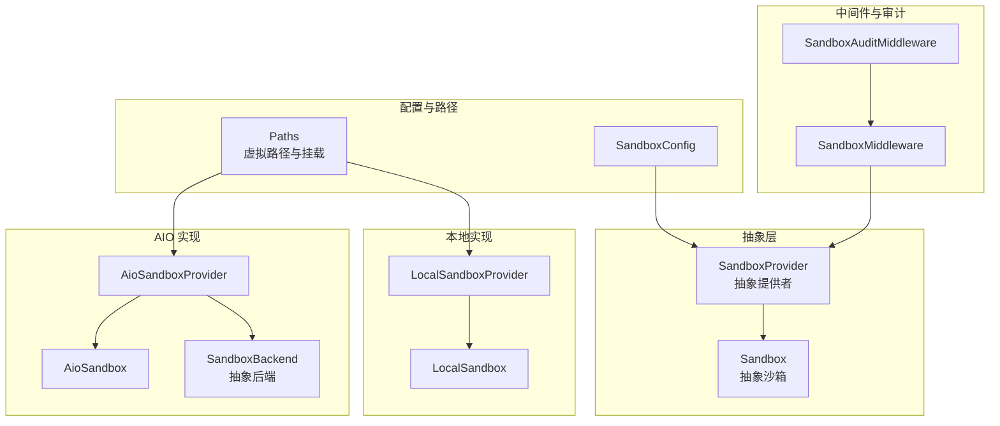
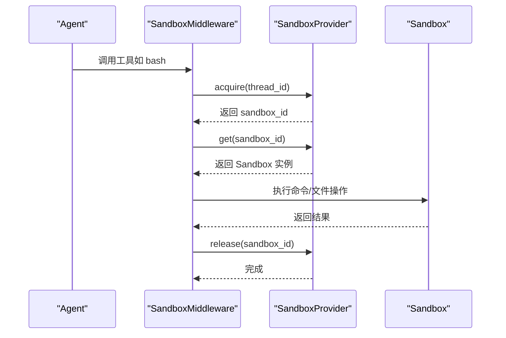
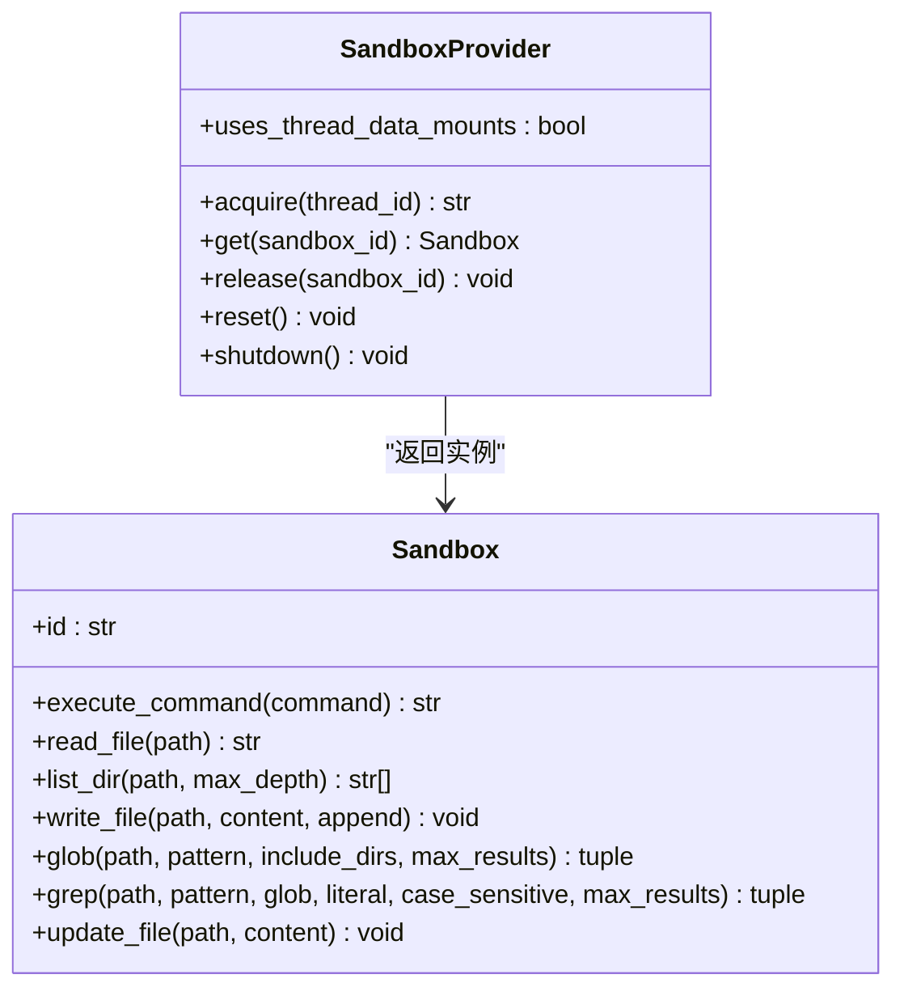
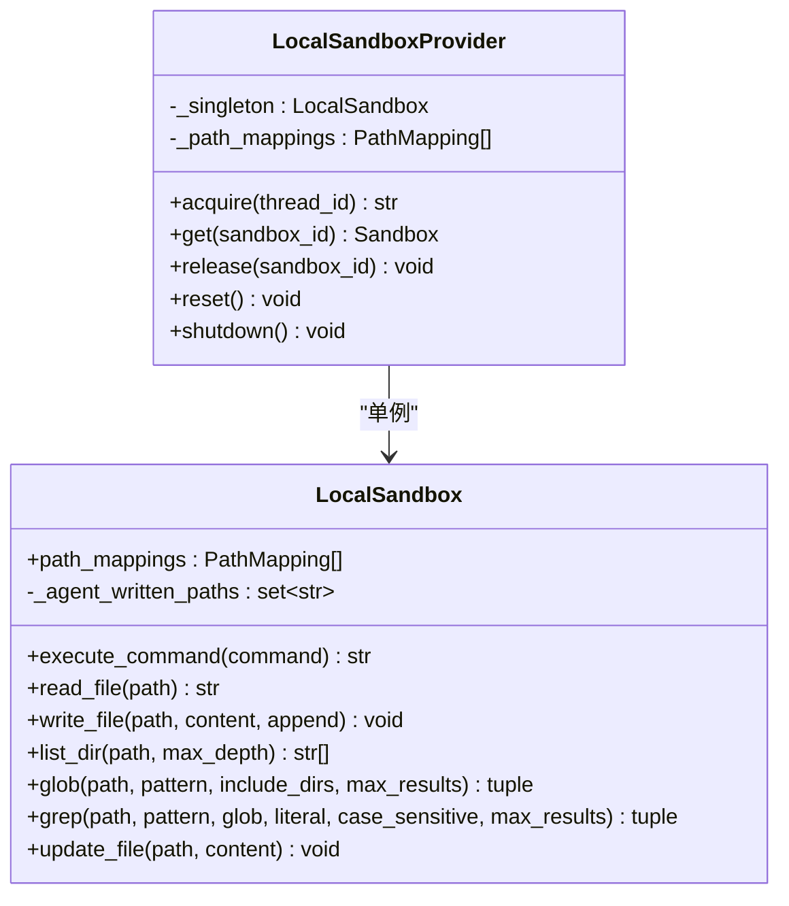
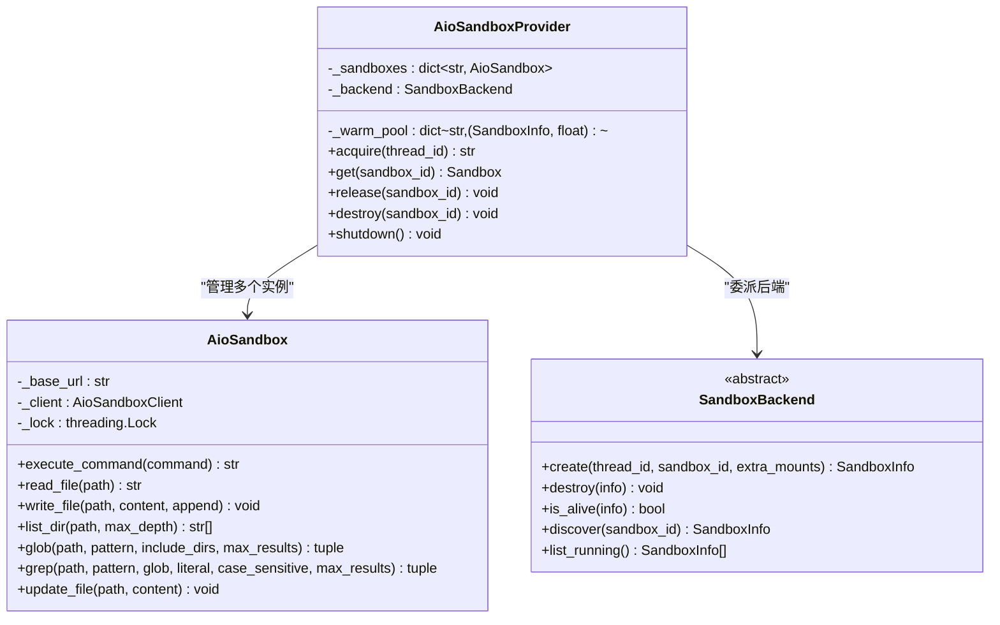
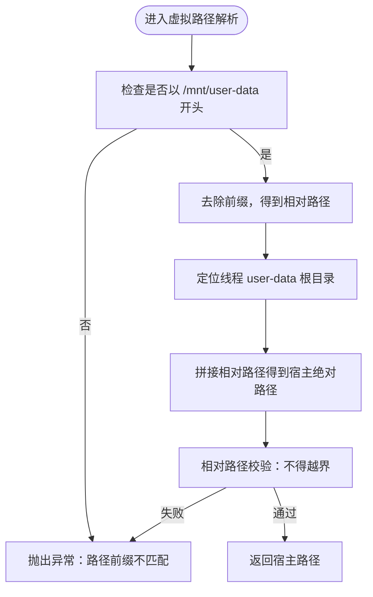
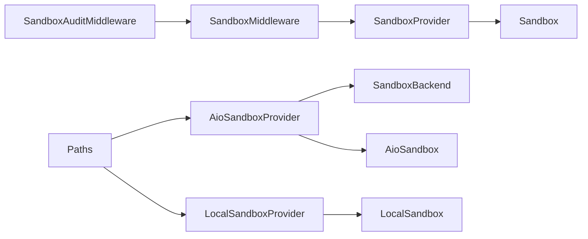

# 沙箱执行系统

<cite>
**本文档引用的文件**
- [sandbox_provider.py](file://backend/packages/harness/deerflow/sandbox/sandbox_provider.py)
- [sandbox.py](file://backend/packages/harness/deerflow/sandbox/sandbox.py)
- [local_sandbox_provider.py](file://backend/packages/harness/deerflow/sandbox/local/local_sandbox_provider.py)
- [local_sandbox.py](file://backend/packages/harness/deerflow/sandbox/local/local_sandbox.py)
- [aio_sandbox_provider.py](file://backend/packages/harness/deerflow/community/aio_sandbox/aio_sandbox_provider.py)
- [aio_sandbox.py](file://backend/packages/harness/deerflow/community/aio_sandbox/aio_sandbox.py)
- [backend.py](file://backend/packages/harness/deerflow/community/aio_sandbox/backend.py)
- [paths.py](file://backend/packages/harness/deerflow/config/paths.py)
- [sandbox_config.py](file://backend/packages/harness/deerflow/config/sandbox_config.py)
- [middleware.py](file://backend/packages/harness/deerflow/sandbox/middleware.py)
- [sandbox_audit_middleware.py](file://backend/packages/harness/deerflow/agents/middlewares/sandbox_audit_middleware.py)
- [file_operation_lock.py](file://backend/packages/harness/deerflow/sandbox/file_operation_lock.py)
- [test_aio_sandbox.py](file://backend/tests/test_aio_sandbox.py)
- [test_local_sandbox_provider_mounts.py](file://backend/tests/test_local_sandbox_provider_mounts.py)
- [test_docker_sandbox_mode_detection.py](file://backend/tests/test_docker_sandbox_mode_detection.py)
</cite>

## 目录
1. [简介](#简介)
2. [项目结构](#项目结构)
3. [核心组件](#核心组件)
4. [架构总览](#架构总览)
5. [详细组件分析](#详细组件分析)
6. [依赖关系分析](#依赖关系分析)
7. [性能考量](#性能考量)
8. [故障排除指南](#故障排除指南)
9. [结论](#结论)

## 简介
本文件面向 DeerFlow 沙箱执行系统，系统性阐述沙箱架构设计、抽象基类职责划分、本地与 AIO 两种沙箱提供者的实现差异与适用场景，并详解虚拟路径映射机制（/mnt/user-data/workspace、/mnt/user-data/uploads、/mnt/user-data/outputs、/mnt/skills 等）、安全隔离策略、性能优化手段与常见问题排查方法。目标是帮助开发者与运维人员快速理解并正确使用该沙箱体系。

## 项目结构
沙箱系统主要分布在以下模块：
- 抽象层：Sandbox 抽象类与 SandboxProvider 抽象类，定义统一接口与生命周期管理
- 本地沙箱：LocalSandbox 与 LocalSandboxProvider，基于宿主机直接执行命令与文件操作
- AIO 沙箱：AioSandbox 与 AioSandboxProvider，通过容器运行 AIO Sandbox 并以 HTTP API 访问
- 路径与挂载：Paths 与虚拟路径前缀，负责线程数据目录与挂载映射
- 中间件与审计：SandboxMiddleware 与 SandboxAuditMiddleware，负责沙箱获取释放与命令安全审计
- 配置：SandboxConfig，定义沙箱提供者与运行参数

图表来源
- [sandbox_provider.py:8-42](file://backend/packages/harness/deerflow/sandbox/sandbox_provider.py#L8-L42)
- [sandbox.py:6-28](file://backend/packages/harness/deerflow/sandbox/sandbox.py#L6-L28)
- [local_sandbox_provider.py:13-20](file://backend/packages/harness/deerflow/sandbox/local/local_sandbox_provider.py#L13-L20)
- [local_sandbox.py:29-77](file://backend/packages/harness/deerflow/sandbox/local/local_sandbox.py#L29-L77)
- [aio_sandbox_provider.py:69-110](file://backend/packages/harness/deerflow/community/aio_sandbox/aio_sandbox_provider.py#L69-L110)
- [aio_sandbox.py:17-38](file://backend/packages/harness/deerflow/community/aio_sandbox/aio_sandbox.py#L17-L38)
- [backend.py:38-98](file://backend/packages/harness/deerflow/community/aio_sandbox/backend.py#L38-L98)
- [paths.py:62-122](file://backend/packages/harness/deerflow/config/paths.py#L62-L122)
- [sandbox_config.py:12-65](file://backend/packages/harness/deerflow/config/sandbox_config.py#L12-L65)
- [middleware.py:32-83](file://backend/packages/harness/deerflow/sandbox/middleware.py#L32-L83)
- [sandbox_audit_middleware.py:204-221](file://backend/packages/harness/deerflow/agents/middlewares/sandbox_audit_middleware.py#L204-L221)

章节来源
- [sandbox_provider.py:8-110](file://backend/packages/harness/deerflow/sandbox/sandbox_provider.py#L8-L110)
- [paths.py:62-122](file://backend/packages/harness/deerflow/config/paths.py#L62-L122)

## 核心组件
- 抽象基类
  - Sandbox：定义统一的命令执行、文件读写、目录遍历、搜索等能力接口
  - SandboxProvider：定义 acquire/get/release/reset/shutdown 等生命周期管理接口
- 具体实现
  - LocalSandboxProvider：单例本地沙箱，支持自定义路径映射与只读挂载
  - AioSandboxProvider：多实例容器沙箱，支持热池复用、空闲回收、跨进程发现与远程后端
  - AioSandbox：通过 HTTP API 访问容器内沙箱，序列化并发请求避免会话污染
- 路径与挂载
  - Paths：集中管理线程数据目录布局与虚拟路径解析，提供 /mnt/user-data 下的 workspace、uploads、outputs 与 /mnt/skills 挂载
- 安全与中间件
  - SandboxMiddleware：在工具调用前后自动获取/释放沙箱
  - SandboxAuditMiddleware：对 bash 命令进行高/中风险检测与审计日志记录

章节来源
- [sandbox.py:6-94](file://backend/packages/harness/deerflow/sandbox/sandbox.py#L6-L94)
- [sandbox_provider.py:8-110](file://backend/packages/harness/deerflow/sandbox/sandbox_provider.py#L8-L110)
- [local_sandbox_provider.py:13-132](file://backend/packages/harness/deerflow/sandbox/local/local_sandbox_provider.py#L13-L132)
- [aio_sandbox_provider.py:69-132](file://backend/packages/harness/deerflow/community/aio_sandbox/aio_sandbox_provider.py#L69-L132)
- [aio_sandbox.py:17-56](file://backend/packages/harness/deerflow/community/aio_sandbox/aio_sandbox.py#L17-L56)
- [paths.py:62-326](file://backend/packages/harness/deerflow/config/paths.py#L62-L326)
- [middleware.py:32-83](file://backend/packages/harness/deerflow/sandbox/middleware.py#L32-L83)
- [sandbox_audit_middleware.py:204-371](file://backend/packages/harness/deerflow/agents/middlewares/sandbox_audit_middleware.py#L204-L371)

## 架构总览
沙箱系统采用“抽象接口 + 多实现 + 统一中间件”的分层设计：
- 上层：LangGraph 工具链通过 SandboxMiddleware 获取沙箱实例，调用 Sandbox 接口执行命令或文件操作
- 中层：SandboxProvider 决定具体实现（本地或容器），并负责生命周期管理
- 下层：LocalSandbox/AioSandbox 分别对接宿主机或容器内的 AIO Sandbox API

图表来源
- [middleware.py:45-83](file://backend/packages/harness/deerflow/sandbox/middleware.py#L45-L83)
- [sandbox_provider.py:13-38](file://backend/packages/harness/deerflow/sandbox/sandbox_provider.py#L13-L38)
- [aio_sandbox.py:57-87](file://backend/packages/harness/deerflow/community/aio_sandbox/aio_sandbox.py#L57-L87)

## 详细组件分析

### 抽象基类：Sandbox 与 SandboxProvider
- Sandbox
  - 职责：统一命令执行、文件读写、目录遍历、glob/grep 搜索、二进制更新等能力
  - 设计要点：接口清晰、职责单一；便于替换不同后端实现
- SandboxProvider
  - 职责：提供 acquire/get/release/reset/shutdown 生命周期管理；通过配置解析类名动态实例化
  - 设计要点：单例缓存、重置与优雅关闭；支持自定义注入

图表来源
- [sandbox.py:6-94](file://backend/packages/harness/deerflow/sandbox/sandbox.py#L6-L94)
- [sandbox_provider.py:8-110](file://backend/packages/harness/deerflow/sandbox/sandbox_provider.py#L8-L110)

章节来源
- [sandbox.py:6-94](file://backend/packages/harness/deerflow/sandbox/sandbox.py#L6-L94)
- [sandbox_provider.py:8-110](file://backend/packages/harness/deerflow/sandbox/sandbox_provider.py#L8-L110)

### 本地沙箱：LocalSandboxProvider 与 LocalSandbox
- LocalSandboxProvider
  - 单例模式：全局共享一个 LocalSandbox 实例，避免重复初始化
  - 路径映射：从配置加载 skills 与自定义挂载，校验绝对路径与保留前缀冲突
  - 只读策略：skills 目录默认只读，自定义挂载可配置 read_only
- LocalSandbox
  - 路径解析：支持容器路径到宿主路径的映射与反向映射，防止越界访问
  - 命令执行：根据平台选择 shell，将容器路径替换为宿主路径后再执行
  - 文件操作：写入内容中的容器路径会被替换为宿主路径；仅对“代理作者写入”的文件进行输出路径反解析
  - 并发控制：通过弱引用锁表为特定文件提供细粒度互斥

图表来源
- [local_sandbox_provider.py:13-132](file://backend/packages/harness/deerflow/sandbox/local/local_sandbox_provider.py#L13-L132)
- [local_sandbox.py:29-452](file://backend/packages/harness/deerflow/sandbox/local/local_sandbox.py#L29-L452)

章节来源
- [local_sandbox_provider.py:13-132](file://backend/packages/harness/deerflow/sandbox/local/local_sandbox_provider.py#L13-L132)
- [local_sandbox.py:29-452](file://backend/packages/harness/deerflow/sandbox/local/local_sandbox.py#L29-L452)
- [file_operation_lock.py:13-28](file://backend/packages/harness/deerflow/sandbox/file_operation_lock.py#L13-L28)

### AIO 沙箱：AioSandboxProvider 与 AioSandbox
- AioSandboxProvider
  - 多实例容器：按线程生成确定性 sandbox_id，支持跨进程发现与热池复用
  - 后端抽象：LocalContainerBackend（本地容器）与 RemoteSandboxBackend（远端 URL）
  - 挂载策略：线程数据目录与 skills 目录自动挂载；支持额外自定义挂载
  - 空闲回收：定时检查空闲沙箱，超时销毁；热池容器可快速复用
  - 信号处理：注册 SIGTERM/SIGINT/SIGHUP，确保优雅退出
- AioSandbox
  - 并发序列化：所有 shell/exec 请求串行执行，避免会话污染；检测到错误观测时自动重试
  - 文件操作：通过 HTTP API 读写文件，支持 base64 编码二进制更新
  - 搜索能力：支持 glob 与正则检索，限制最大结果数并截断

图表来源
- [aio_sandbox_provider.py:69-132](file://backend/packages/harness/deerflow/community/aio_sandbox/aio_sandbox_provider.py#L69-L132)
- [aio_sandbox.py:17-56](file://backend/packages/harness/deerflow/community/aio_sandbox/aio_sandbox.py#L17-L56)
- [backend.py:38-98](file://backend/packages/harness/deerflow/community/aio_sandbox/backend.py#L38-L98)

章节来源
- [aio_sandbox_provider.py:69-708](file://backend/packages/harness/deerflow/community/aio_sandbox/aio_sandbox_provider.py#L69-L708)
- [aio_sandbox.py:17-239](file://backend/packages/harness/deerflow/community/aio_sandbox/aio_sandbox.py#L17-L239)
- [backend.py:16-115](file://backend/packages/harness/deerflow/community/aio_sandbox/backend.py#L16-L115)

### 虚拟路径映射机制
- 虚拟路径前缀：/mnt/user-data
- 线程数据目录布局（宿主侧）：threads/{thread_id}/user-data/{workspace|uploads|outputs}
- 映射规则
  - /mnt/user-data/workspace → threads/{thread_id}/user-data/workspace
  - /mnt/user-data/uploads → threads/{thread_id}/user-data/uploads
  - /mnt/user-data/outputs → threads/{thread_id}/user-data/outputs
  - /mnt/skills → skills 目录（只读）
  - /mnt/acp-workspace → threads/{thread_id}/acp-workspace（只读）
- 解析与校验
  - Paths.resolve_virtual_path 对虚拟路径进行严格前缀匹配与路径穿越检测
  - 确保容器内访问受限于线程隔离边界

图表来源
- [paths.py:291-326](file://backend/packages/harness/deerflow/config/paths.py#L291-L326)

章节来源
- [paths.py:62-326](file://backend/packages/harness/deerflow/config/paths.py#L62-L326)

### 安全隔离机制
- 路径隔离
  - 虚拟路径解析严格限定在 /mnt/user-data 下，防止路径穿越
  - 本地沙箱对只读挂载进行强制校验，写入时拒绝越权
- 命令安全
  - SandboxAuditMiddleware 对 bash 命令进行高/中风险检测，阻断高危命令，告警中危命令
- 并发安全
  - AIO 沙箱对 shell/exec 请求加锁，避免会话污染
  - 本地沙箱对文件操作使用弱引用锁表，避免并发覆盖
- 进程与容器边界
  - AIO 沙箱通过容器隔离命令执行环境，网络与文件系统受容器策略约束

章节来源
- [paths.py:291-326](file://backend/packages/harness/deerflow/config/paths.py#L291-L326)
- [sandbox_audit_middleware.py:31-196](file://backend/packages/harness/deerflow/agents/middlewares/sandbox_audit_middleware.py#L31-L196)
- [aio_sandbox.py:57-87](file://backend/packages/harness/deerflow/community/aio_sandbox/aio_sandbox.py#L57-L87)
- [file_operation_lock.py:13-28](file://backend/packages/harness/deerflow/sandbox/file_operation_lock.py#L13-L28)

### 性能优化策略
- 热池复用（AIO）
  - 已释放的沙箱容器保留在热池中，继续运行以便快速复用，减少冷启动开销
  - 通过 replicas 限制热池规模，超出时按最久未使用驱逐
- 空闲回收
  - 定时扫描空闲沙箱，超过 idle_timeout 的容器销毁，释放资源
- 并发控制
  - AIO 沙箱串行化命令执行，避免会话状态竞争
  - 本地沙箱对文件写入加细粒度锁，降低竞态概率
- 输出截断
  - 配置项限制 bash/read_file/ls 输出长度，避免超大输出影响性能

章节来源
- [aio_sandbox_provider.py:308-375](file://backend/packages/harness/deerflow/community/aio_sandbox/aio_sandbox_provider.py#L308-L375)
- [aio_sandbox.py:57-87](file://backend/packages/harness/deerflow/community/aio_sandbox/aio_sandbox.py#L57-L87)
- [sandbox_config.py:67-81](file://backend/packages/harness/deerflow/config/sandbox_config.py#L67-L81)

### 适用场景与差异对比
- LocalSandboxProvider
  - 适合本地开发与受信任环境，无需容器隔离
  - 支持自定义挂载与只读策略，适合调试与小规模任务
- AioSandboxProvider
  - 适合生产环境与需要强隔离的场景
  - 支持本地容器与远端后端，具备热池与空闲回收能力
  - 通过中间件与审计中间件形成完整的安全闭环

章节来源
- [local_sandbox_provider.py:13-132](file://backend/packages/harness/deerflow/sandbox/local/local_sandbox_provider.py#L13-L132)
- [aio_sandbox_provider.py:69-132](file://backend/packages/harness/deerflow/community/aio_sandbox/aio_sandbox_provider.py#L69-L132)

## 依赖关系分析
- 组件耦合
  - SandboxMiddleware 依赖 SandboxProvider 获取/释放沙箱
  - SandboxAuditMiddleware 依赖工具调用上下文提取 thread_id 并记录审计日志
  - AioSandboxProvider 依赖 SandboxBackend 抽象后端，屏蔽本地/远端差异
- 外部依赖
  - AIO 沙箱通过 agent-infra/sandbox HTTP API 通信
  - 本地沙箱通过子进程执行命令

图表来源
- [middleware.py:45-83](file://backend/packages/harness/deerflow/sandbox/middleware.py#L45-L83)
- [sandbox_audit_middleware.py:204-371](file://backend/packages/harness/deerflow/agents/middlewares/sandbox_audit_middleware.py#L204-L371)
- [aio_sandbox_provider.py:69-110](file://backend/packages/harness/deerflow/community/aio_sandbox/aio_sandbox_provider.py#L69-L110)
- [local_sandbox_provider.py:13-20](file://backend/packages/harness/deerflow/sandbox/local/local_sandbox_provider.py#L13-L20)
- [paths.py:62-122](file://backend/packages/harness/deerflow/config/paths.py#L62-L122)

章节来源
- [middleware.py:32-83](file://backend/packages/harness/deerflow/sandbox/middleware.py#L32-L83)
- [sandbox_audit_middleware.py:204-371](file://backend/packages/harness/deerflow/agents/middlewares/sandbox_audit_middleware.py#L204-L371)
- [aio_sandbox_provider.py:69-132](file://backend/packages/harness/deerflow/community/aio_sandbox/aio_sandbox_provider.py#L69-L132)
- [local_sandbox_provider.py:13-20](file://backend/packages/harness/deerflow/sandbox/local/local_sandbox_provider.py#L13-L20)
- [paths.py:62-122](file://backend/packages/harness/deerflow/config/paths.py#L62-L122)

## 性能考量
- AIO 沙箱
  - 热池与空闲回收显著降低容器冷启动成本
  - 并发串行化避免会话状态竞争，提高稳定性
- 本地沙箱
  - 单例模式减少初始化开销
  - 文件级锁避免并发写入冲突
- 输出截断
  - 通过配置限制输出长度，平衡可观测性与内存占用

章节来源
- [aio_sandbox_provider.py:308-375](file://backend/packages/harness/deerflow/community/aio_sandbox/aio_sandbox_provider.py#L308-L375)
- [aio_sandbox.py:57-87](file://backend/packages/harness/deerflow/community/aio_sandbox/aio_sandbox.py#L57-L87)
- [sandbox_config.py:67-81](file://backend/packages/harness/deerflow/config/sandbox_config.py#L67-L81)

## 故障排除指南
- AIO 沙箱并发问题
  - 症状：命令输出包含错误观测或会话状态异常
  - 处理：确认 AioSandbox 的锁机制正常工作；若仍出现，检查是否存在多进程共享同一沙箱且未正确序列化
  - 参考测试：并发命令串行化与错误观测重试验证
- 热池容量不足
  - 症状：频繁创建新容器，冷启动频繁
  - 处理：调整 replicas 与 idle_timeout；观察空闲回收日志
- 路径解析错误
  - 症状：虚拟路径访问报错或被拒绝
  - 处理：检查虚拟路径前缀与线程数据目录权限；确认未发生路径穿越尝试
- 本地挂载冲突
  - 症状：自定义挂载未生效或被忽略
  - 处理：确认 host_path 为绝对路径、container_path 以 / 开头且不与保留前缀冲突；确保宿主路径存在

章节来源
- [test_aio_sandbox.py:20-236](file://backend/tests/test_aio_sandbox.py#L20-L236)
- [test_local_sandbox_provider_mounts.py:456-787](file://backend/tests/test_local_sandbox_provider_mounts.py#L456-L787)
- [paths.py:291-326](file://backend/packages/harness/deerflow/config/paths.py#L291-L326)
- [aio_sandbox_provider.py:308-375](file://backend/packages/harness/deerflow/community/aio_sandbox/aio_sandbox_provider.py#L308-L375)

## 结论
DeerFlow 沙箱执行系统通过抽象接口与多实现分离，结合严格的路径隔离、命令安全审计与并发控制，既满足本地开发的灵活性，又能在生产环境中提供强隔离与高性能。AIO 沙箱的热池与空闲回收进一步优化了资源利用率；本地沙箱的单例与细粒度锁保证了稳定与效率。配合完善的测试与故障排除指引，系统可在复杂场景下保持可靠运行。