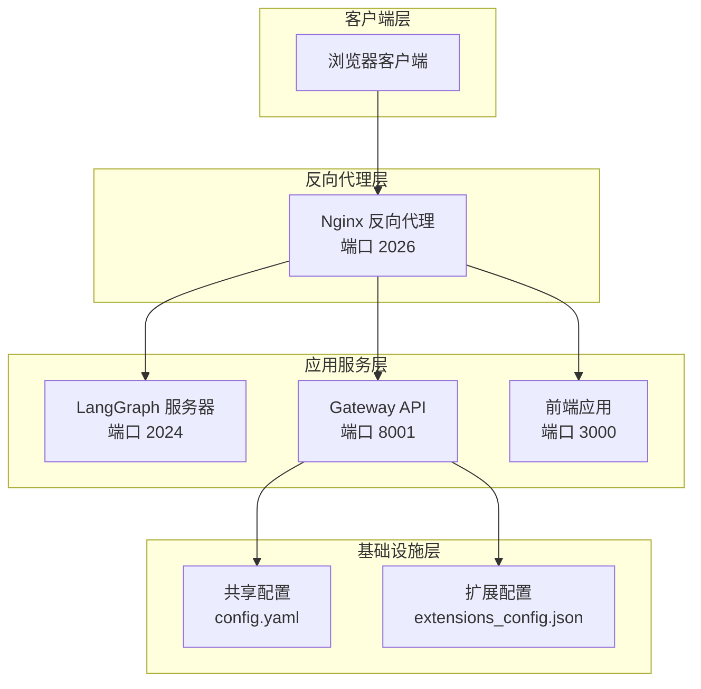
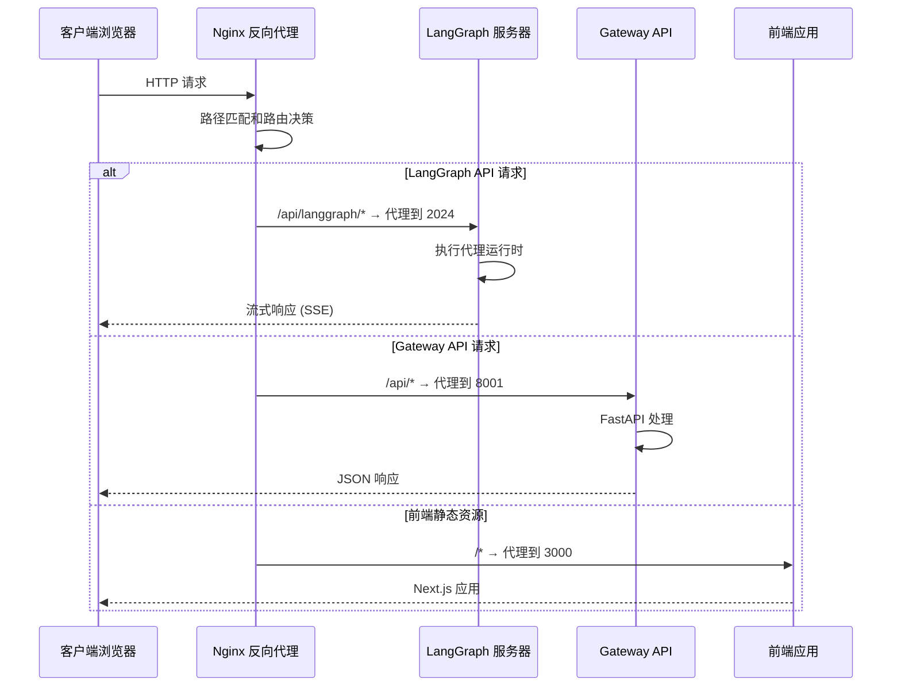
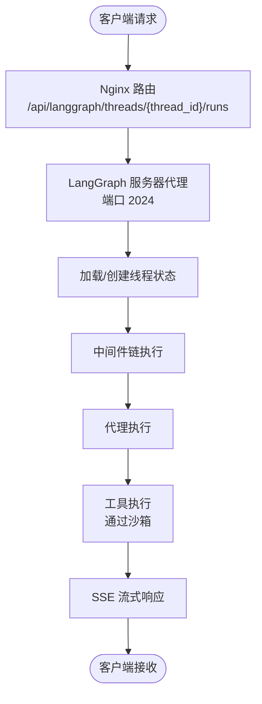
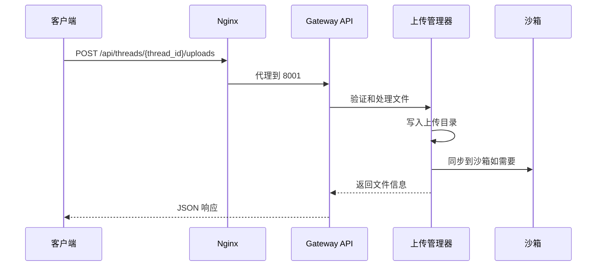
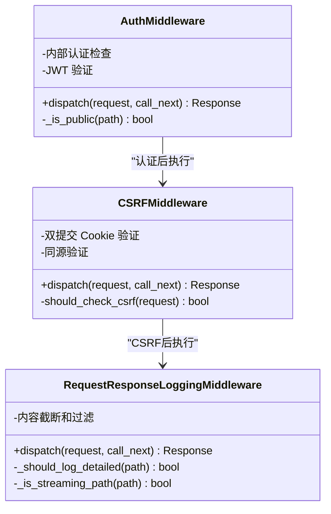
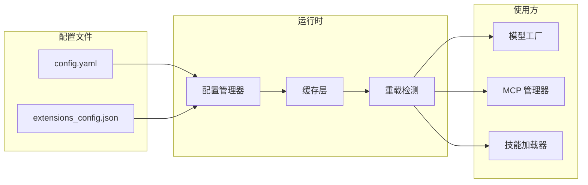
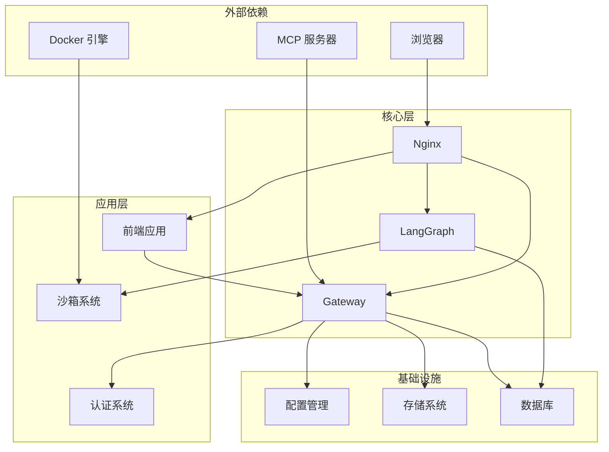

# 系统架构概览

<cite>
**本文档引用的文件**
- [ARCHITECTURE.md](file://backend/docs/ARCHITECTURE.md)
- [nginx.conf](file://docker/nginx/nginx.conf)
- [docker-compose.yaml](file://docker/docker-compose.yaml)
- [app.py](file://backend/app/gateway/app.py)
- [next.config.js](file://frontend/next.config.js)
- [langgraph.json](file://backend/langgraph.json)
- [config.example.yaml](file://config.example.yaml)
- [threads.py](file://backend/app/gateway/routers/threads.py)
- [artifacts.py](file://backend/app/gateway/routers/artifacts.py)
- [uploads.py](file://backend/app/gateway/routers/uploads.py)
- [env.js](file://frontend/src/env.js)
- [auth_middleware.py](file://backend/app/gateway/auth_middleware.py)
- [csrf_middleware.py](file://backend/app/gateway/csrf_middleware.py)
- [logging_middleware.py](file://backend/app/gateway/logging_middleware.py)
</cite>

## 目录
1. [引言](#引言)
2. [项目结构](#项目结构)
3. [核心组件](#核心组件)
4. [架构总览](#架构总览)
5. [详细组件分析](#详细组件分析)
6. [依赖关系分析](#依赖关系分析)
7. [性能考量](#性能考量)
8. [故障排查指南](#故障排查指南)
9. [结论](#结论)

## 引言

DeerFlow 是一个基于 LangGraph 的 AI 代理后端系统，采用分层架构设计，包含客户端浏览器、Nginx 反向代理、LangGraph 服务器和 Gateway API 以及前端应用。该系统通过统一入口点（Nginx）实现路由分流，将不同类型的请求分别转发到 LangGraph 服务器或 Gateway API，并通过虚拟路径映射实现沙箱隔离的安全执行环境。

## 项目结构

系统采用容器化部署，主要组件包括：

**图表来源**
- [nginx.conf:20-234](file://docker/nginx/nginx.conf#L20-L234)
- [docker-compose.yaml:25-150](file://docker/docker-compose.yaml#L25-L150)

**章节来源**
- [ARCHITECTURE.md:1-51](file://backend/docs/ARCHITECTURE.md#L1-L51)
- [docker-compose.yaml:1-150](file://docker/docker-compose.yaml#L1-L150)

## 核心组件

### Nginx 反向代理

Nginx 作为统一入口点，负责请求路由、CORS 处理和流式传输支持：

- **端口配置**: 监听 2026 端口，支持 IPv4 和 IPv6
- **路径路由**: 
  - `/api/langgraph/*` → LangGraph 服务器 (2024)
  - `/api/*` → Gateway API (8001)  
  - `/*` → 前端应用 (3000)
- **CORS 处理**: 中央化处理跨域请求，隐藏上游 CORS 头部
- **流式传输**: 支持 SSE/长连接，禁用代理缓冲

### LangGraph 服务器

基于 LangGraph 的核心代理运行时，提供多代理工作流编排：

- **入口点**: `packages/harness/deerflow/agents/lead_agent/agent.py:make_lead_agent`
- **核心功能**:
  - 代理创建和配置
  - 线程状态管理
  - 中间件链执行
  - 工具执行编排
  - 实时响应流式传输

### Gateway API

FastAPI 应用程序，提供非代理相关的 REST 端点：

- **路由组织**: 模型管理、MCP 配置、技能管理、文件上传等
- **认证中间件**: 全局认证保护，支持内部认证和 JWT 验证
- **CSRF 保护**: 双提交 Cookie 模式的 CSRF 防护
- **日志记录**: 请求/响应跟踪，过滤大型流式输出

### 前端应用

Next.js 生产服务器，提供用户界面和 API 代理：

- **环境变量**: 支持通过 `DEER_FLOW_INTERNAL_GATEWAY_BASE_URL` 配置网关基础 URL
- **重写规则**: 将 `/api/langgraph` 重写到网关，实现 LangGraph 兼容性
- **国际化**: 支持中英文双语

**章节来源**
- [ARCHITECTURE.md:55-95](file://backend/docs/ARCHITECTURE.md#L55-L95)
- [nginx.conf:20-234](file://docker/nginx/nginx.conf#L20-L234)
- [app.py:248-431](file://backend/app/gateway/app.py#L248-L431)

## 架构总览

系统采用统一入口点设计理念，通过 Nginx 实现智能路由：

**图表来源**
- [nginx.conf:47-234](file://docker/nginx/nginx.conf#L47-L234)
- [docker-compose.yaml:25-150](file://docker/docker-compose.yaml#L25-L150)

## 详细组件分析

### 请求处理流程

系统支持多种请求类型，每种都有特定的处理流程：

#### LangGraph 代理请求流程

**图表来源**
- [ARCHITECTURE.md:344-380](file://backend/docs/ARCHITECTURE.md#L344-L380)

#### 文件上传处理流程

**图表来源**
- [uploads.py:170-293](file://backend/app/gateway/routers/uploads.py#L170-L293)

### 中间件体系

系统采用多层次中间件架构确保安全性：

**图表来源**
- [auth_middleware.py:67-146](file://backend/app/gateway/auth_middleware.py#L67-L146)
- [csrf_middleware.py:169-225](file://backend/app/gateway/csrf_middleware.py#L169-L225)
- [logging_middleware.py:76-153](file://backend/app/gateway/logging_middleware.py#L76-L153)

**章节来源**
- [auth_middleware.py:67-146](file://backend/app/gateway/auth_middleware.py#L67-L146)
- [csrf_middleware.py:169-225](file://backend/app/gateway/csrf_middleware.py#L169-L225)
- [logging_middleware.py:76-153](file://backend/app/gateway/logging_middleware.py#L76-L153)

### 配置管理系统

系统采用集中式配置管理，支持动态重载：

**图表来源**
- [config.example.yaml:1-348](file://config.example.yaml#L1-L348)
- [ARCHITECTURE.md:427-443](file://backend/docs/ARCHITECTURE.md#L427-L443)

**章节来源**
- [config.example.yaml:1-348](file://config.example.yaml#L1-L348)
- [ARCHITECTURE.md:427-443](file://backend/docs/ARCHITECTURE.md#L427-L443)

## 依赖关系分析

系统组件间的依赖关系呈现清晰的分层结构：

**图表来源**
- [docker-compose.yaml:25-150](file://docker/docker-compose.yaml#L25-L150)
- [ARCHITECTURE.md:1-51](file://backend/docs/ARCHITECTURE.md#L1-L51)

**章节来源**
- [docker-compose.yaml:25-150](file://docker/docker-compose.yaml#L25-L150)
- [ARCHITECTURE.md:1-51](file://backend/docs/ARCHITECTURE.md#L1-L51)

## 性能考量

系统在多个层面考虑了性能优化：

### 缓存策略
- **MCP 工具缓存**: 基于文件修改时间的缓存失效机制
- **配置缓存**: 配置文件一次性加载，变更时重新加载
- **技能缓存**: 技能在启动时解析并缓存在内存中

### 流式传输
- **SSE 支持**: 实时响应流式传输，减少首 token 时间
- **长连接优化**: 600 秒超时设置支持长时间运行的请求
- **缓冲控制**: 禁用代理缓冲确保实时性

### 资源隔离
- **沙箱隔离**: 本地沙箱用于开发，Docker 沙箱用于生产
- **路径映射**: 虚拟路径到物理路径的安全映射
- **权限控制**: 文件操作的路径遍历防护

## 故障排查指南

### 常见问题诊断

#### Nginx 路由问题
- 检查 `/api/langgraph` 重写规则是否正确
- 验证上游服务地址解析（Docker 内部 DNS）
- 查看代理头部设置和 CORS 配置

#### 认证失败
- 确认访问令牌是否存在且未过期
- 检查 JWT 令牌格式和签名验证
- 验证用户状态和权限

#### 文件上传失败
- 检查文件大小限制和总大小限制
- 验证上传目录权限和磁盘空间
- 确认沙箱同步状态

**章节来源**
- [auth_middleware.py:90-146](file://backend/app/gateway/auth_middleware.py#L90-L146)
- [uploads.py:170-293](file://backend/app/gateway/routers/uploads.py#L170-L293)

## 结论

DeerFlow 系统通过统一入口点的反向代理架构，实现了清晰的分层设计和高效的请求路由。该架构具有以下优势：

1. **统一入口**: Nginx 作为单一入口点，简化了部署和运维
2. **功能分离**: LangGraph 专注于代理运行时，Gateway 专注业务逻辑
3. **安全隔离**: 多层中间件确保请求安全性和数据完整性
4. **可扩展性**: 容器化部署支持水平扩展和弹性伸缩
5. **开发友好**: 清晰的配置管理和热重载机制

这种架构设计在保证系统稳定性的同时，也为未来的功能扩展和技术演进提供了良好的基础。