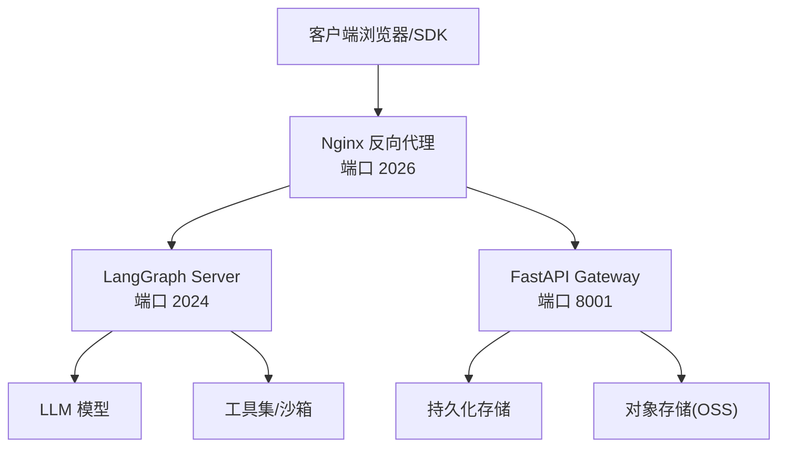
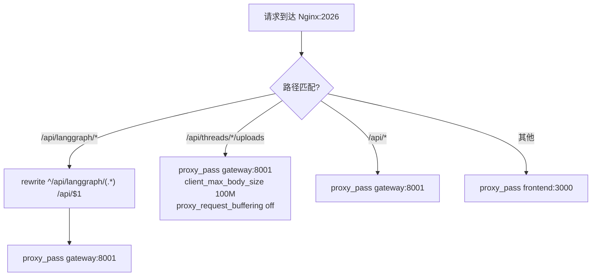
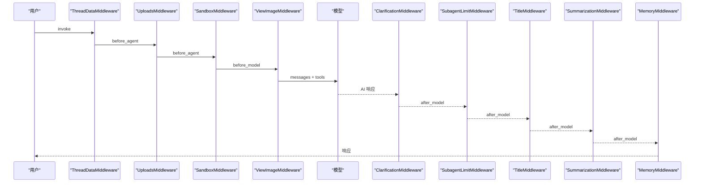
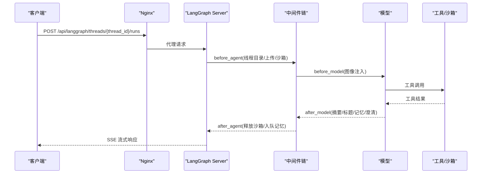
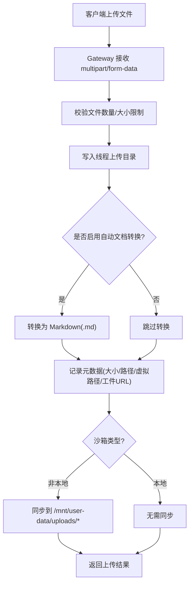
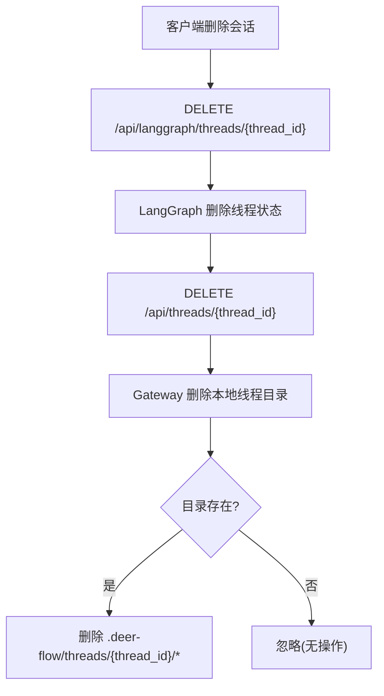
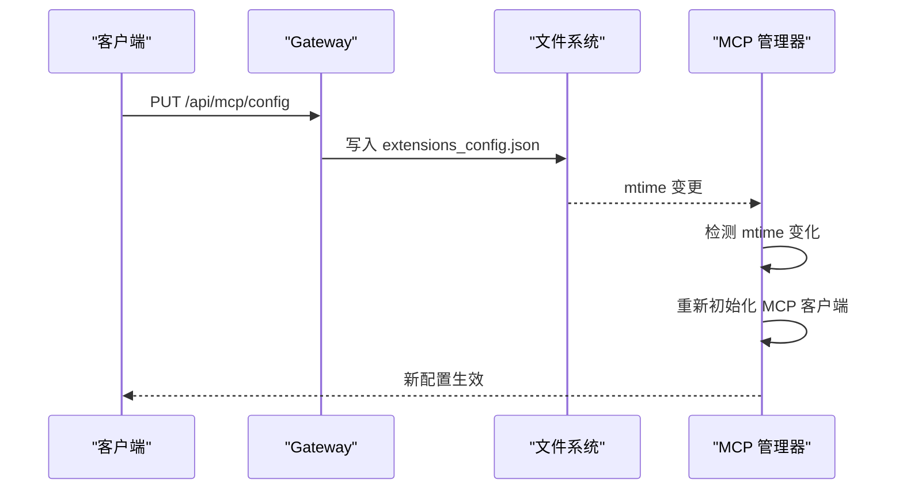
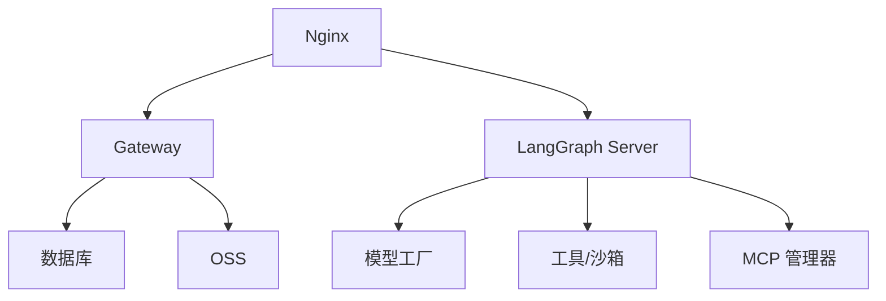

# 请求处理流程

<cite>
**本文引用的文件**
- [架构总览](file://backend/docs/ARCHITECTURE.md)
- [中间件执行流程](file://backend/docs/middleware-execution-flow.md)
- [API 参考](file://backend/docs/API.md)
- [文件上传功能](file://backend/docs/FILE_UPLOAD.md)
- [配置指南](file://backend/docs/CONFIGURATION.md)
- [Nginx 配置](file://docker/nginx/nginx.conf)
- [网关应用入口](file://backend/app/gateway/app.py)
- [上传路由](file://backend/app/gateway/routers/uploads.py)
- [认证中间件](file://backend/app/gateway/auth_middleware.py)
- [CSRF 中间件](file://backend/app/gateway/csrf_middleware.py)
- [日志中间件](file://backend/app/gateway/logging_middleware.py)
- [OSS 上传工具](file://backend/deerflow/utils/oss_upload.py)
- [LangGraph Lead Agent](file://backend/packages/harness/deerflow/agents/lead_agent/agent.py)
- [线程数据中间件](file://backend/packages/harness/deerflow/agents/middlewares/thread_data_middleware.py)
- [上传中间件](file://backend/packages/harness/deerflow/agents/middlewares/uploads_middleware.py)
</cite>

## 目录
1. [简介](#简介)
2. [项目结构](#项目结构)
3. [核心组件](#核心组件)
4. [架构总览](#架构总览)
5. [详细组件分析](#详细组件分析)
6. [依赖分析](#依赖分析)
7. [性能考虑](#性能考虑)
8. [故障排查指南](#故障排查指南)
9. [结论](#结论)
10. [附录](#附录)

## 简介
本技术文档围绕 DeerFlow 的请求处理流程展开，覆盖从客户端请求到最终响应的完整数据流，重点说明：
- 用户发送消息到代理的完整路径
- Nginx、LangGraph Server 和 Gateway 之间的路由机制
- 中间件链的执行顺序、状态传递和异常处理
- 文件上传流程、线程清理流程和配置热重载的详细步骤
- 请求示例、响应格式和错误码说明

## 项目结构
DeerFlow 后端采用“Nginx 反向代理 + LangGraph Server + FastAPI Gateway”的三层架构：
- Nginx：统一入口，基于路径将请求转发至 LangGraph 或 Gateway
- LangGraph Server：代理运行时，负责多智能体编排、中间件链执行、工具调用与流式输出
- Gateway：提供非代理类 API（模型、MCP、技能、文件上传、工件等）

图表来源
- [架构总览](file://backend/docs/ARCHITECTURE.md)
- [Nginx 配置](file://docker/nginx/nginx.conf)

章节来源
- [架构总览](file://backend/docs/ARCHITECTURE.md)
- [Nginx 配置](file://docker/nginx/nginx.conf)

## 核心组件
- Nginx 路由：根据路径将 /api/langgraph/* 重写并代理到 Gateway，其他 /api/* 直接代理到 Gateway，未匹配则转到前端
- Gateway：FastAPI 应用，挂载多路由（模型、MCP、技能、上传、工件、线程清理等），内置认证、CSRF、日志中间件
- LangGraph Server：代理运行时，构建 Lead Agent，执行中间件链，调用模型与工具，通过 SSE 流式返回
- 中间件链：线程数据、上传、沙箱、摘要、标题、计划任务、图像、澄清等，严格控制执行顺序与状态传递

章节来源
- [网关应用入口](file://backend/app/gateway/app.py)
- [LangGraph Lead Agent](file://backend/packages/harness/deerflow/agents/lead_agent/agent.py)
- [中间件执行流程](file://backend/docs/middleware-execution-flow.md)

## 架构总览
Nginx 作为统一入口，将不同路径的请求分发到相应服务：
- /api/langgraph/*：重写为 /api/* 后代理到 Gateway，LangGraph Server 通过 /api/langgraph/* 直接访问
- /api/*：直接代理到 Gateway
- 其他：代理到前端

LangGraph Server 的代理运行时负责：
- 解析运行配置（模型名、思考模式、计划模式、并发子代理等）
- 构建中间件链并执行
- 调用模型与工具，通过 SSE 返回流式结果

Gateway 的职责包括：
- 文件上传与管理（多文件、自动文档转换、沙箱同步）
- 线程清理（删除本地线程数据）
- MCP 配置更新与热重载
- 模型、技能、工件等 API

章节来源
- [架构总览](file://backend/docs/ARCHITECTURE.md)
- [Nginx 配置](file://docker/nginx/nginx.conf)
- [API 参考](file://backend/docs/API.md)

## 详细组件分析

### Nginx 路由机制
- /api/langgraph/*：使用 rewrite 将路径改写为 /api/*，然后代理到 Gateway
- /api/threads/{thread_id}/uploads：支持大文件上传，设置 client_max_body_size 与 proxy_request_buffering off
- 其他 /api/*：直接代理到 Gateway
- 未匹配：代理到前端（Next.js）

图表来源
- [Nginx 配置](file://docker/nginx/nginx.conf)

章节来源
- [Nginx 配置](file://docker/nginx/nginx.conf)

### Gateway 中间件链与执行顺序
中间件链的执行顺序遵循“before_agent 正序、before_model 正序、after_model 反序、after_agent 反序”的规则。核心顺序要点：
- ThreadDataMiddleware 必须在 SandboxMiddleware 之前，确保线程目录可用
- ClarificationMiddleware 必须在链表末尾，以便最先拦截模型输出中的澄清请求
- SummarizationMiddleware 应尽早执行，减少上下文长度
- TitleMiddleware 在首次交换后生成标题
- MemoryMiddleware 在标题之后入队记忆

图表来源
- [中间件执行流程](file://backend/docs/middleware-execution-flow.md)

章节来源
- [中间件执行流程](file://backend/docs/middleware-execution-flow.md)

### 用户发送消息到代理的完整路径
1) 客户端向 Nginx 发送 POST /api/langgraph/threads/{thread_id}/runs，请求体包含输入消息与运行配置
2) Nginx 将请求代理到 LangGraph Server（端口 2024）
3) LangGraph Server 加载/创建线程状态，执行中间件链：
   - ThreadDataMiddleware：创建线程目录
   - UploadsMiddleware：注入上传文件列表
   - SandboxMiddleware：获取沙箱环境
   - ViewImageMiddleware：注入图片 base64
   - 模型推理与工具调用
   - SummarizationMiddleware：上下文压缩
   - TitleMiddleware：生成标题
   - MemoryMiddleware：入队记忆
   - ClarificationMiddleware：拦截澄清请求
4) 通过 SSE 流式返回响应

图表来源
- [架构总览](file://backend/docs/ARCHITECTURE.md)
- [LangGraph Lead Agent](file://backend/packages/harness/deerflow/agents/lead_agent/agent.py)
- [中间件执行流程](file://backend/docs/middleware-execution-flow.md)

章节来源
- [架构总览](file://backend/docs/ARCHITECTURE.md)
- [API 参考](file://backend/docs/API.md)

### 文件上传流程
- 客户端向 Gateway 发送 POST /api/threads/{thread_id}/uploads，multipart/form-data
- Gateway 校验文件数量、单文件大小、总大小限制
- 写入线程隔离的上传目录 backend/.deer-flow/threads/{thread_id}/user-data/uploads
- 如启用自动文档转换，将 PDF/PPT/XLS/DOC 等转换为 Markdown
- 若非本地沙箱，将文件同步到沙箱虚拟路径 /mnt/user-data/uploads/*
- 返回包含文件元数据、虚拟路径与工件 URL 的响应
- 下次代理运行时，UploadsMiddleware 会将文件列表注入到人类消息中

图表来源
- [文件上传功能](file://backend/docs/FILE_UPLOAD.md)
- [上传路由](file://backend/app/gateway/routers/uploads.py)

章节来源
- [文件上传功能](file://backend/docs/FILE_UPLOAD.md)
- [上传路由](file://backend/app/gateway/routers/uploads.py)

### 线程清理流程
- 客户端先通过 LangGraph 删除线程状态：DELETE /api/langgraph/threads/{thread_id}
- 然后通过 Gateway 清理本地线程数据：DELETE /api/threads/{thread_id}
- Gateway 删除 backend/.deer-flow/threads/{thread_id} 目录，不存在目录视为无操作，非法 thread_id 拒绝

图表来源
- [架构总览](file://backend/docs/ARCHITECTURE.md)

章节来源
- [架构总览](file://backend/docs/ARCHITECTURE.md)

### 配置热重载（MCP）
- 客户端更新 MCP 配置：PUT /api/mcp/config
- Gateway 写入 extensions_config.json，修改文件时间戳
- MCP 管理器通过文件时间戳检测变更，重新初始化 MCP 客户端并加载新配置
- 下次代理运行时使用新的工具

图表来源
- [架构总览](file://backend/docs/ARCHITECTURE.md)

章节来源
- [架构总览](file://backend/docs/ARCHITECTURE.md)

### 中间件链状态传递与异常处理
- 状态传递：中间件通过 AgentState 字典传递 thread_data、uploaded_files、artifacts 等字段
- 异常处理：
  - 线程数据中间件：缺少 thread_id 时抛出错误
  - 上传中间件：历史文件存在性校验，不存在则跳过
  - 认证中间件：OPTIONS 预检放行，公共路径放行，否则严格校验 Cookie/JWT
  - CSRF 中间件：对 POST/PUT/DELETE/PATCH 进行令牌校验，认证端点例外
  - 日志中间件：过滤流式响应，避免日志膨胀

章节来源
- [线程数据中间件](file://backend/packages/harness/deerflow/agents/middlewares/thread_data_middleware.py)
- [上传中间件](file://backend/packages/harness/deerflow/agents/middlewares/uploads_middleware.py)
- [认证中间件](file://backend/app/gateway/auth_middleware.py)
- [CSRF 中间件](file://backend/app/gateway/csrf_middleware.py)
- [日志中间件](file://backend/app/gateway/logging_middleware.py)

### 请求示例与响应格式
- LangGraph 运行（SSE 流式）：
  - 请求：POST /api/langgraph/threads/{thread_id}/runs
  - 响应：SSE 事件（values/messages/end）
- 文件上传：
  - 请求：POST /api/threads/{thread_id}/uploads（multipart/form-data）
  - 响应：包含 files 数组（filename、size、path、virtual_path、artifact_url 等）
- 线程清理：
  - 请求：DELETE /api/threads/{thread_id}
  - 响应：{"success": true, "message": "..."}
- 错误响应：
  - 统一格式：{"detail": "错误信息"}
  - 常见状态码：400（参数错误）、404（资源不存在）、413（上传过大）、422（校验失败）、500（服务器错误）

章节来源
- [API 参考](file://backend/docs/API.md)
- [文件上传功能](file://backend/docs/FILE_UPLOAD.md)

## 依赖分析
- 组件耦合：
  - Gateway 依赖 Nginx 的路径转发与上传缓冲配置
  - LangGraph Server 依赖中间件链与工具/沙箱提供者
  - 中间件之间存在强依赖：ThreadData 在 Sandbox 之前；Clarification 在末尾
- 外部依赖：
  - MCP 服务器（extensions_config.json）
  - OSS（Aliyun Object Storage）
  - 数据库（持久化）

图表来源
- [架构总览](file://backend/docs/ARCHITECTURE.md)
- [Nginx 配置](file://docker/nginx/nginx.conf)

章节来源
- [架构总览](file://backend/docs/ARCHITECTURE.md)
- [Nginx 配置](file://docker/nginx/nginx.conf)

## 性能考虑
- 缓存：MCP 工具基于文件时间戳缓存；配置一次性加载，变更时重载
- 流式传输：SSE 减少首 token 时间，提升交互体验
- 上下文管理：摘要中间件在接近阈值时压缩上下文，保留近期消息
- 上传优化：非本地沙箱场景下，Gateway 会将文件同步到沙箱虚拟路径，避免重复 IO

章节来源
- [架构总览](file://backend/docs/ARCHITECTURE.md)
- [文件上传功能](file://backend/docs/FILE_UPLOAD.md)

## 故障排查指南
- 文件上传失败：
  - 检查文件大小是否超过限制（max_file_size/max_total_size）
  - 检查 Gateway 是否正常运行
  - 检查磁盘空间
  - 查看 Gateway 日志：make gateway
- 文档转换失败：
  - 确认 markitdown 已正确安装
  - 查看日志中的具体错误
  - 某些损坏或加密文档可能无法转换，但原文件仍会保存
- Agent 看不到上传的文件：
  - 确认 UploadsMiddleware 已注册
  - 检查 thread_id 是否正确
  - 确认文件确实已上传到线程目录
  - 非本地沙箱场景下，确认上传接口未报错（需要成功完成沙箱同步）
- 认证/CSRF 问题：
  - OPTIONS 预检请求会被放行
  - 认证端点（如登录/注册）例外
  - CSRF 令牌缺失或不匹配会导致 403

章节来源
- [文件上传功能](file://backend/docs/FILE_UPLOAD.md)
- [认证中间件](file://backend/app/gateway/auth_middleware.py)
- [CSRF 中间件](file://backend/app/gateway/csrf_middleware.py)

## 结论
DeerFlow 的请求处理流程通过 Nginx 的路径路由与 Gateway/LangGraph 的职责分离，实现了清晰的扩展性与可维护性。中间件链的严格顺序保证了状态一致性与安全边界，文件上传与线程清理流程确保了数据隔离与生命周期管理。配置热重载机制使 MCP 工具能够在不重启服务的情况下动态更新。

## 附录

### API 端点速览
- LangGraph API（/api/langgraph/*）
  - POST /api/langgraph/threads：创建线程
  - GET /api/langgraph/threads/{thread_id}/state：获取线程状态
  - POST /api/langgraph/threads/{thread_id}/runs：运行代理（SSE）
  - GET /api/langgraph/threads/{thread_id}/runs：获取运行历史
  - POST /api/langgraph/threads/{thread_id}/runs/stream：流式运行
- Gateway API（/api/*）
  - GET /api/models：列出模型
  - GET /api/mcp/config：获取 MCP 配置
  - PUT /api/mcp/config：更新 MCP 配置
  - POST /api/threads/{thread_id}/uploads：上传文件
  - GET /api/threads/{thread_id}/uploads/list：列出文件
  - DELETE /api/threads/{thread_id}/uploads/{filename}：删除文件
  - DELETE /api/threads/{thread_id}：清理线程本地数据
  - GET /api/threads/{thread_id}/artifacts/{path}：下载工件

章节来源
- [API 参考](file://backend/docs/API.md)