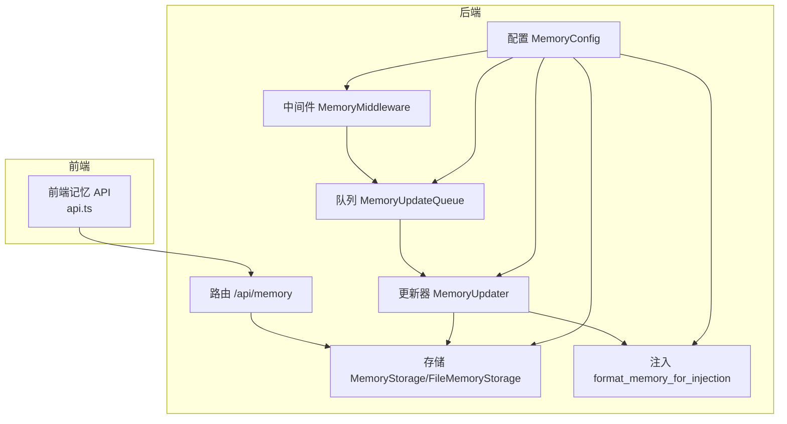
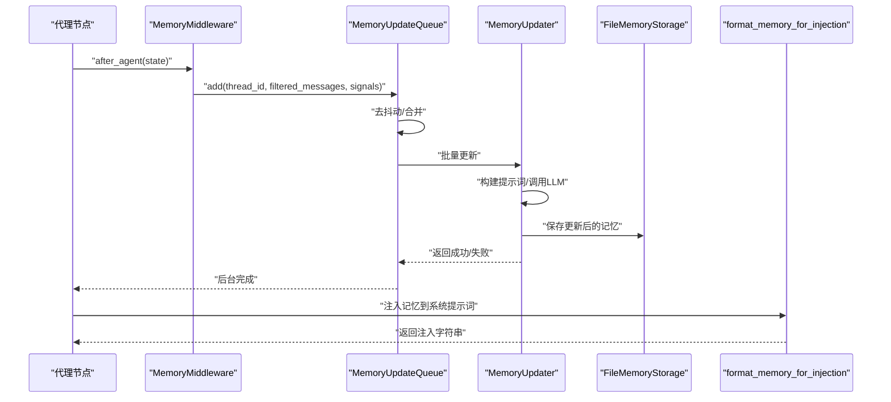
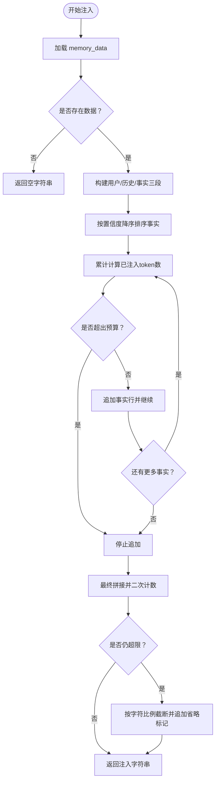
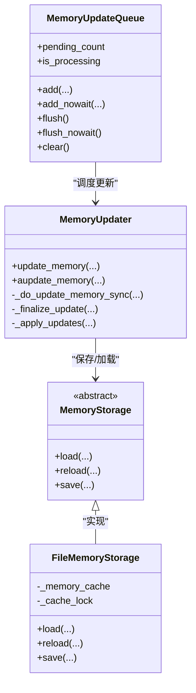
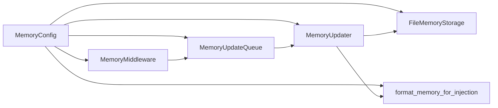

# 上下文工程与长期记忆

<cite>
**本文引用的文件**
- [backend/app/gateway/routers/memory.py](file://backend/app/gateway/routers/memory.py)
- [backend/packages/harness/deerflow/agents/memory/prompt.py](file://backend/packages/harness/deerflow/agents/memory/prompt.py)
- [backend/packages/harness/deerflow/agents/memory/storage.py](file://backend/packages/harness/deerflow/agents/memory/storage.py)
- [backend/packages/harness/deerflow/agents/memory/updater.py](file://backend/packages/harness/deerflow/agents/memory/updater.py)
- [backend/packages/harness/deerflow/agents/memory/queue.py](file://backend/packages/harness/deerflow/agents/memory/queue.py)
- [backend/packages/harness/deerflow/agents/middlewares/memory_middleware.py](file://backend/packages/harness/deerflow/agents/middlewares/memory_middleware.py)
- [backend/packages/harness/deerflow/config/memory_config.py](file://backend/packages/harness/deerflow/config/memory_config.py)
- [backend/docs/MEMORY_IMPROVEMENTS.md](file://backend/docs/MEMORY_IMPROVEMENTS.md)
- [backend/docs/memory-settings-sample.json](file://backend/docs/memory-settings-sample.json)
- [backend/tests/test_memory_prompt_injection.py](file://backend/tests/test_memory_prompt_injection.py)
- [backend/tests/test_memory_queue.py](file://backend/tests/test_memory_queue.py)
- [backend/tests/test_memory_router.py](file://backend/tests/test_memory_router.py)
- [backend/tests/test_memory_storage.py](file://backend/tests/test_memory_storage.py)
- [frontend/src/core/memory/api.ts](file://frontend/src/core/memory/api.ts)
- [frontend/src/core/memory/types.ts](file://frontend/src/core/memory/types.ts)
</cite>

## 目录
1. [简介](#简介)
2. [项目结构](#项目结构)
3. [核心组件](#核心组件)
4. [架构总览](#架构总览)
5. [详细组件分析](#详细组件分析)
6. [依赖关系分析](#依赖关系分析)
7. [性能考量](#性能考量)
8. [故障排查指南](#故障排查指南)
9. [结论](#结论)
10. [附录](#附录)

## 简介
本文件面向 DeerFlow 的上下文工程与长期记忆系统，系统性阐述记忆架构设计、上下文提取算法与持久化存储机制，明确短期记忆与长期记忆的边界与协同方式；详述记忆的类型、格式与管理策略（新增、删除、更新、导入导出、截断与清理）；给出检索、注入、压缩与清理机制；提供可操作的配置示例以优化性能（内存管理、索引策略与查询优化）；并说明记忆系统与代理的交互方式与最佳实践。

## 项目结构
记忆子系统主要由以下层次构成：
- 配置层：集中定义启用开关、存储路径、模型、去抖动窗口、最大事实数、置信度阈值、注入开关与最大注入 token 数等参数。
- 中间件层：在代理执行后自动收集对话片段，过滤工具调用，检测纠正/强化信号，并将对话入队等待异步更新。
- 队列层：带去抖动的批处理队列，合并同一会话的多次更新，降低 LLM 调用频率。
- 更新器层：基于对话内容与当前记忆，调用 LLM 生成结构化更新，应用变更并落盘。
- 存储层：抽象存储接口与文件实现，支持用户隔离、缓存与原子写入。
- 注入层：将记忆按“用户上下文/历史/事实”三段式注入到系统提示词中，使用 tiktoken 精确计数并按置信度排序。
- API 层：提供记忆数据的增删改查、导入导出、状态查询等接口；前端通过统一 API 进行交互。

图表来源
- [backend/packages/harness/deerflow/agents/middlewares/memory_middleware.py:28-111](file://backend/packages/harness/deerflow/agents/middlewares/memory_middleware.py#L28-L111)
- [backend/packages/harness/deerflow/agents/memory/queue.py:28-278](file://backend/packages/harness/deerflow/agents/memory/queue.py#L28-L278)
- [backend/packages/harness/deerflow/agents/memory/updater.py:276-612](file://backend/packages/harness/deerflow/agents/memory/updater.py#L276-L612)
- [backend/packages/harness/deerflow/agents/memory/storage.py:43-232](file://backend/packages/harness/deerflow/agents/memory/storage.py#L43-L232)
- [backend/packages/harness/deerflow/agents/memory/prompt.py:201-364](file://backend/packages/harness/deerflow/agents/memory/prompt.py#L201-L364)
- [backend/packages/harness/deerflow/config/memory_config.py:6-84](file://backend/packages/harness/deerflow/config/memory_config.py#L6-L84)
- [backend/app/gateway/routers/memory.py:18-357](file://backend/app/gateway/routers/memory.py#L18-L357)

章节来源
- [backend/packages/harness/deerflow/config/memory_config.py:6-84](file://backend/packages/harness/deerflow/config/memory_config.py#L6-L84)
- [backend/packages/harness/deerflow/agents/middlewares/memory_middleware.py:28-111](file://backend/packages/harness/deerflow/agents/middlewares/memory_middleware.py#L28-L111)
- [backend/packages/harness/deerflow/agents/memory/queue.py:28-278](file://backend/packages/harness/deerflow/agents/memory/queue.py#L28-L278)
- [backend/packages/harness/deerflow/agents/memory/updater.py:276-612](file://backend/packages/harness/deerflow/agents/memory/updater.py#L276-L612)
- [backend/packages/harness/deerflow/agents/memory/storage.py:43-232](file://backend/packages/harness/deerflow/agents/memory/storage.py#L43-L232)
- [backend/packages/harness/deerflow/agents/memory/prompt.py:201-364](file://backend/packages/harness/deerflow/agents/memory/prompt.py#L201-L364)
- [backend/app/gateway/routers/memory.py:18-357](file://backend/app/gateway/routers/memory.py#L18-L357)

## 核心组件
- 记忆配置 MemoryConfig：控制启用/禁用、存储类、去抖动时间、模型名、最大事实数、事实置信度阈值、是否注入、最大注入 token 数等。
- 记忆中间件 MemoryMiddleware：在代理执行后收集对话片段，过滤工具调用，检测纠正/强化信号，入队等待异步更新。
- 内存更新队列 MemoryUpdateQueue：带去抖动的批处理队列，合并同一会话的多次更新，避免频繁调用 LLM。
- 记忆更新器 MemoryUpdater：构建更新提示词，调用 LLM，解析结构化响应，应用更新并持久化；支持同步/异步两种路径。
- 记忆存储 MemoryStorage/FileMemoryStorage：抽象存储接口与文件实现，支持用户隔离、缓存、原子写入与路径校验。
- 记忆注入 format_memory_for_injection：将用户上下文、历史与事实按置信度排序并注入到系统提示词，使用 tiktoken 精确计数并受预算限制。
- 记忆路由 /api/memory：提供获取、重载、清空、创建、删除、更新、导出、导入、配置与状态查询等接口。
- 前端记忆 API：封装后端 /api/memory 接口，供前端页面与设置页使用。

章节来源
- [backend/packages/harness/deerflow/config/memory_config.py:6-84](file://backend/packages/harness/deerflow/config/memory_config.py#L6-L84)
- [backend/packages/harness/deerflow/agents/middlewares/memory_middleware.py:28-111](file://backend/packages/harness/deerflow/agents/middlewares/memory_middleware.py#L28-L111)
- [backend/packages/harness/deerflow/agents/memory/queue.py:28-278](file://backend/packages/harness/deerflow/agents/memory/queue.py#L28-L278)
- [backend/packages/harness/deerflow/agents/memory/updater.py:276-612](file://backend/packages/harness/deerflow/agents/memory/updater.py#L276-L612)
- [backend/packages/harness/deerflow/agents/memory/storage.py:43-232](file://backend/packages/harness/deerflow/agents/memory/storage.py#L43-L232)
- [backend/packages/harness/deerflow/agents/memory/prompt.py:201-364](file://backend/packages/harness/deerflow/agents/memory/prompt.py#L201-L364)
- [backend/app/gateway/routers/memory.py:18-357](file://backend/app/gateway/routers/memory.py#L18-L357)
- [frontend/src/core/memory/api.ts:1-150](file://frontend/src/core/memory/api.ts#L1-L150)
- [frontend/src/core/memory/types.ts:1-55](file://frontend/src/core/memory/types.ts#L1-L55)

## 架构总览
记忆系统采用“被动采集 + 批量更新 + 结构化注入”的模式：
- 代理执行完成后，中间件从状态中抽取人类输入与最终 AI 回复，过滤工具调用与上传痕迹，检测纠正/强化信号，入队等待去抖动。
- 队列在去抖动窗口结束后批量拉取上下文，交由更新器调用 LLM 生成结构化更新，应用后持久化。
- 注入阶段将用户上下文、历史与事实按置信度排序，使用 tiktoken 计算 token 并在预算内拼接注入。

图表来源
- [backend/packages/harness/deerflow/agents/middlewares/memory_middleware.py:52-111](file://backend/packages/harness/deerflow/agents/middlewares/memory_middleware.py#L52-L111)
- [backend/packages/harness/deerflow/agents/memory/queue.py:156-205](file://backend/packages/harness/deerflow/agents/memory/queue.py#L156-L205)
- [backend/packages/harness/deerflow/agents/memory/updater.py:369-500](file://backend/packages/harness/deerflow/agents/memory/updater.py#L369-L500)
- [backend/packages/harness/deerflow/agents/memory/storage.py:160-189](file://backend/packages/harness/deerflow/agents/memory/storage.py#L160-L189)
- [backend/packages/harness/deerflow/agents/memory/prompt.py:201-318](file://backend/packages/harness/deerflow/agents/memory/prompt.py#L201-L318)

## 详细组件分析

### 记忆类型、格式与管理策略
- 类型与字段
  - 用户上下文 user：包含 workContext、personalContext、topOfMind，每个子项含 summary 与 updatedAt。
  - 历史上下文 history：包含 recentMonths、earlierContext、longTermBackground，每个子项含 summary 与 updatedAt。
  - 事实 facts：每条事实包含 id、content、category、confidence、createdAt、source、可选 sourceError。
- 管理策略
  - 新增：手动创建或由更新器生成；自动生成时附带 thread_id 或 unknown 作为 source。
  - 删除：按 id 删除；若不存在则抛出未找到错误。
  - 更新：支持部分更新，保留未提供的字段；content 不能为空；confidence 必须在 [0,1]。
  - 导入/导出：支持整包导入覆盖与导出备份；导入后标准化并落盘。
  - 清空：重置为空记忆结构并落盘。
  - 截断与清理：当事实数量超过 max_facts 时，按置信度降序保留前 N；同时移除上传事件相关的句子，避免未来会话搜索不到非持久化文件。
  - 版本与时间戳：整体结构包含 version 与 lastUpdated；各子项包含 updatedAt。

章节来源
- [backend/app/gateway/routers/memory.py:21-101](file://backend/app/gateway/routers/memory.py#L21-L101)
- [backend/packages/harness/deerflow/agents/memory/updater.py:96-191](file://backend/packages/harness/deerflow/agents/memory/updater.py#L96-L191)
- [backend/packages/harness/deerflow/agents/memory/storage.py:24-40](file://backend/packages/harness/deerflow/agents/memory/storage.py#L24-L40)
- [backend/docs/memory-settings-sample.json:1-115](file://backend/docs/memory-settings-sample.json#L1-L115)

### 上下文提取与注入算法
- 上下文提取
  - 仅保留人类输入与最终 AI 回复，过滤工具调用与多模态块中的非文本部分；对上传文件标记进行剥离，避免将临时文件信息写入长期记忆。
  - 检测纠正/强化信号，用于在更新提示词中强调修正与确认，提升记忆质量。
- 注入格式
  - 用户上下文：Work、Personal、Current Focus 三段摘要。
  - 历史上下文：Recent、Earlier、Background 三段摘要。
  - 事实列表：按置信度降序，逐条拼接，使用 tiktoken 精确计数，直到达到 max_injection_tokens 预算；不足时按比例截断并追加省略标记。
- 计数与回退
  - 优先使用 tiktoken（cl100k_base）计数；若不可用或报错，则回退到字符长度估算。

图表来源
- [backend/packages/harness/deerflow/agents/memory/prompt.py:201-318](file://backend/packages/harness/deerflow/agents/memory/prompt.py#L201-L318)

章节来源
- [backend/packages/harness/deerflow/agents/memory/prompt.py:134-364](file://backend/packages/harness/deerflow/agents/memory/prompt.py#L134-L364)
- [backend/packages/harness/deerflow/agents/middlewares/memory_middleware.py:82-111](file://backend/packages/harness/deerflow/agents/middlewares/memory_middleware.py#L82-L111)
- [backend/docs/MEMORY_IMPROVEMENTS.md:19-66](file://backend/docs/MEMORY_IMPROVEMENTS.md#L19-L66)

### 持久化存储机制
- 抽象与实现
  - MemoryStorage 定义 load/reload/save 抽象；FileMemoryStorage 实现文件读写、路径解析、缓存与原子写入。
- 路径与隔离
  - 支持全局、按用户、按代理三种粒度；支持绝对路径与相对路径；相对路径基于 Paths.base_dir 解析。
- 缓存与并发
  - 基于 (user_id, agent_name) 的内存缓存，结合文件 mtime 校验；线程锁保护跨线程访问。
- 原子写入
  - 先写临时文件再替换，确保写入过程失败不破坏现有数据；写入后更新缓存。

章节来源
- [backend/packages/harness/deerflow/agents/memory/storage.py:43-232](file://backend/packages/harness/deerflow/agents/memory/storage.py#L43-L232)

### 记忆更新与队列机制
- 去抖动与批处理
  - MemoryUpdateQueue 维护按 thread_id 去重的上下文队列，去抖动窗口结束后批量处理；支持立即刷新与清空。
- 同步/异步路径
  - MemoryUpdater 提供同步与异步两种更新路径；异步路径使用线程池避免事件循环冲突，保证连接池隔离。
- 更新流程
  - 构建更新提示词（包含当前记忆、对话文本、可选纠正/强化提示），调用 LLM 获取结构化更新，应用后持久化；对上传事件进行清理。

图表来源
- [backend/packages/harness/deerflow/agents/memory/queue.py:28-278](file://backend/packages/harness/deerflow/agents/memory/queue.py#L28-L278)
- [backend/packages/harness/deerflow/agents/memory/updater.py:276-612](file://backend/packages/harness/deerflow/agents/memory/updater.py#L276-L612)
- [backend/packages/harness/deerflow/agents/memory/storage.py:43-232](file://backend/packages/harness/deerflow/agents/memory/storage.py#L43-L232)

章节来源
- [backend/packages/harness/deerflow/agents/memory/queue.py:28-278](file://backend/packages/harness/deerflow/agents/memory/queue.py#L28-L278)
- [backend/packages/harness/deerflow/agents/memory/updater.py:276-612](file://backend/packages/harness/deerflow/agents/memory/updater.py#L276-L612)

### API 与前端交互
- 后端路由
  - GET /api/memory：获取当前记忆数据。
  - POST /api/memory/reload：从文件强制重载。
  - DELETE /api/memory：清空所有记忆。
  - POST /api/memory/facts：创建单个事实。
  - DELETE /api/memory/facts/{fact_id}：按 id 删除事实。
  - PATCH /api/memory/facts/{fact_id}：部分更新事实。
  - GET /api/memory/export：导出记忆。
  - POST /api/memory/import：导入记忆。
  - GET /api/memory/config：获取配置。
  - GET /api/memory/status：获取配置与数据。
- 前端 API
  - 封装上述接口，统一错误格式化与响应解析。

章节来源
- [backend/app/gateway/routers/memory.py:18-357](file://backend/app/gateway/routers/memory.py#L18-L357)
- [frontend/src/core/memory/api.ts:1-150](file://frontend/src/core/memory/api.ts#L1-L150)
- [frontend/src/core/memory/types.ts:1-55](file://frontend/src/core/memory/types.ts#L1-L55)

## 依赖关系分析
- 配置驱动：所有组件通过 get_memory_config() 获取统一配置，确保行为一致。
- 中间件依赖：依赖消息过滤、纠正/强化检测与队列；通过运行时上下文获取 thread_id。
- 队列依赖：依赖更新器执行实际更新；内部使用线程定时器与锁。
- 更新器依赖：依赖存储、提示词模板、LLM 模型工厂；异步路径使用线程池。
- 注入依赖：依赖 tiktoken 计数与事实置信度排序。
- 存储依赖：依赖路径解析与文件系统权限；提供缓存与原子写入。

图表来源
- [backend/packages/harness/deerflow/config/memory_config.py:69-84](file://backend/packages/harness/deerflow/config/memory_config.py#L69-L84)
- [backend/packages/harness/deerflow/agents/middlewares/memory_middleware.py:40-111](file://backend/packages/harness/deerflow/agents/middlewares/memory_middleware.py#L40-L111)
- [backend/packages/harness/deerflow/agents/memory/queue.py:36-155](file://backend/packages/harness/deerflow/agents/memory/queue.py#L36-L155)
- [backend/packages/harness/deerflow/agents/memory/updater.py:279-440](file://backend/packages/harness/deerflow/agents/memory/updater.py#L279-L440)
- [backend/packages/harness/deerflow/agents/memory/storage.py:196-232](file://backend/packages/harness/deerflow/agents/memory/storage.py#L196-L232)
- [backend/packages/harness/deerflow/agents/memory/prompt.py:201-318](file://backend/packages/harness/deerflow/agents/memory/prompt.py#L201-L318)

章节来源
- [backend/packages/harness/deerflow/config/memory_config.py:69-84](file://backend/packages/harness/deerflow/config/memory_config.py#L69-L84)
- [backend/packages/harness/deerflow/agents/middlewares/memory_middleware.py:40-111](file://backend/packages/harness/deerflow/agents/middlewares/memory_middleware.py#L40-L111)
- [backend/packages/harness/deerflow/agents/memory/queue.py:36-155](file://backend/packages/harness/deerflow/agents/memory/queue.py#L36-L155)
- [backend/packages/harness/deerflow/agents/memory/updater.py:279-440](file://backend/packages/harness/deerflow/agents/memory/updater.py#L279-L440)
- [backend/packages/harness/deerflow/agents/memory/storage.py:196-232](file://backend/packages/harness/deerflow/agents/memory/storage.py#L196-L232)
- [backend/packages/harness/deerflow/agents/memory/prompt.py:201-318](file://backend/packages/harness/deerflow/agents/memory/prompt.py#L201-L318)

## 性能考量
- 计数与预算
  - 使用 tiktoken 精确计数，避免过拟合；预算上限 max_injection_tokens 受控，不足时按比例截断。
- 去抖动与批处理
  - debounce_seconds 控制合并窗口，减少 LLM 调用次数；批量处理提升吞吐。
- 最大事实数与置信度
  - max_facts 限制事实规模；fact_confidence_threshold 过滤低置信度事实，避免噪声。
- 异步与线程池
  - 异步更新通过线程池执行同步 LLM 调用，避免事件循环冲突与连接池污染。
- 存储与缓存
  - 文件缓存结合 mtime 校验，减少重复 IO；原子写入保障一致性。
- 建议
  - 对高并发场景适当提高 debounce_seconds 与 max_facts，平衡延迟与容量。
  - 在预算紧张时降低 max_injection_tokens，确保系统提示词不超限。
  - 对长对话场景启用去抖动，避免频繁更新。

## 故障排查指南
- 常见错误与定位
  - 创建/更新事实时 content 为空或 confidence 越界：返回 400，需检查请求体。
  - 删除事实时 id 不存在：返回 404，需确认事实 id。
  - 写入失败：返回 500，检查存储路径权限与磁盘空间。
  - 注入超限：检查 max_injection_tokens 与事实数量，必要时降低预算或精简事实。
- 单元测试参考
  - 内存注入回归测试：验证事实注入、置信度排序与预算限制。
  - 队列行为测试：验证去抖动、批处理与立即刷新。
  - 路由与存储测试：验证 API 行为与文件读写。

章节来源
- [backend/app/gateway/routers/memory.py:66-73](file://backend/app/gateway/routers/memory.py#L66-L73)
- [backend/tests/test_memory_prompt_injection.py](file://backend/tests/test_memory_prompt_injection.py)
- [backend/tests/test_memory_queue.py](file://backend/tests/test_memory_queue.py)
- [backend/tests/test_memory_router.py](file://backend/tests/test_memory_router.py)
- [backend/tests/test_memory_storage.py](file://backend/tests/test_memory_storage.py)

## 结论
DeerFlow 的记忆系统通过“中间件采集 + 队列去抖 + LLM 结构化更新 + 文件持久化 + 精准注入”的闭环，实现了稳定、可控且可扩展的长期记忆能力。当前已实现精确计数、置信度排序与预算约束；计划中的 TF-IDF 语义检索与上下文感知评分将进一步提升检索质量。配合合理的配置与最佳实践，可在性能与效果之间取得良好平衡。

## 附录

### 配置示例与优化建议
- 基础配置要点
  - enabled：是否启用记忆机制。
  - storage_path：存储路径；为空时按用户隔离；绝对路径将使所有用户共享同一文件。
  - storage_class：存储实现类路径，默认文件存储。
  - debounce_seconds：去抖动秒数，建议 30~60。
  - model_name：用于记忆更新的模型名称；None 使用默认模型。
  - max_facts：最大事实数，建议 100~200。
  - fact_confidence_threshold：事实置信度阈值，建议 0.7。
  - injection_enabled：是否注入记忆到系统提示词。
  - max_injection_tokens：最大注入 token 数，建议 2000。
- 优化建议
  - 高并发：增大 debounce_seconds 与 max_facts，降低 LLM 调用频率。
  - 预算紧张：减小 max_injection_tokens，确保系统提示词不超限。
  - 数据质量：提高 fact_confidence_threshold，减少噪声事实。
  - 存储安全：使用相对路径并确保目录权限，避免写入失败。

章节来源
- [backend/packages/harness/deerflow/config/memory_config.py:6-84](file://backend/packages/harness/deerflow/config/memory_config.py#L6-L84)
- [backend/docs/MEMORY_IMPROVEMENTS.md:19-66](file://backend/docs/MEMORY_IMPROVEMENTS.md#L19-L66)
- [backend/docs/memory-settings-sample.json:1-115](file://backend/docs/memory-settings-sample.json#L1-L115)