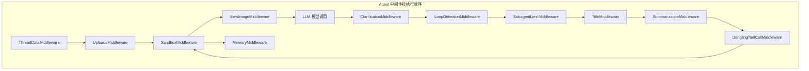
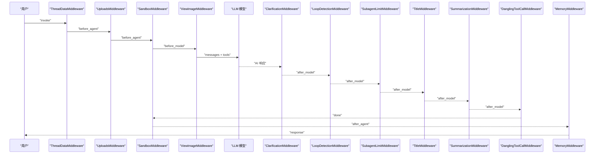
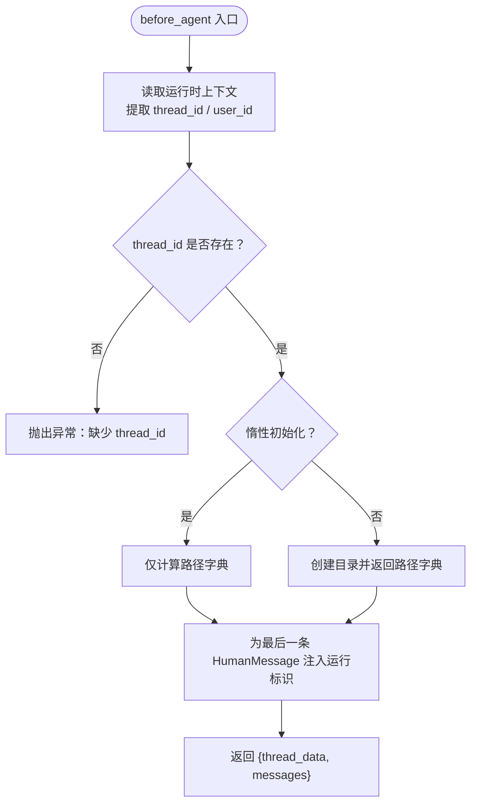
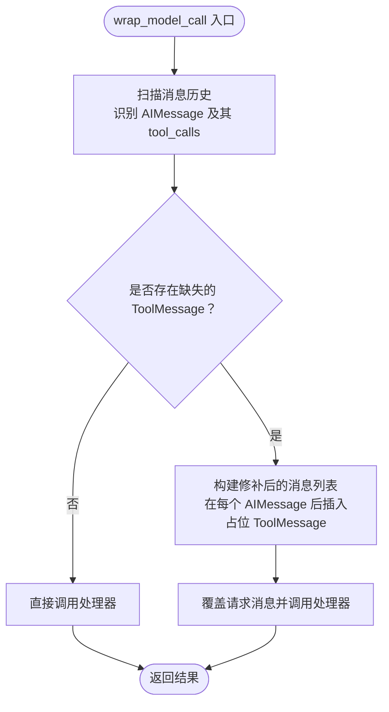
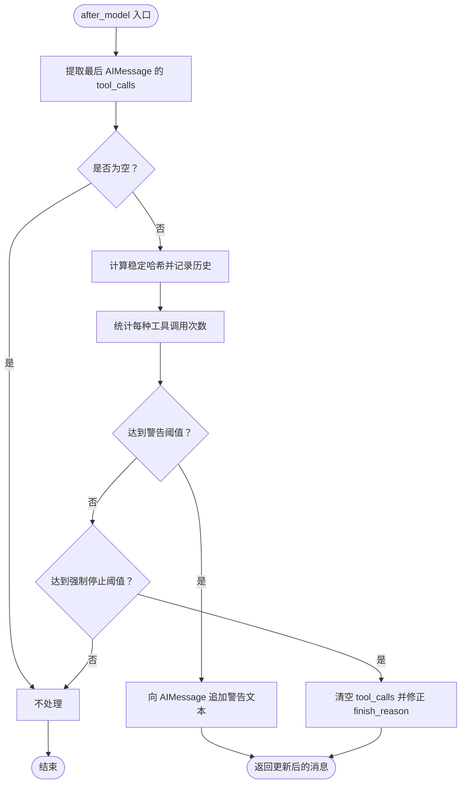
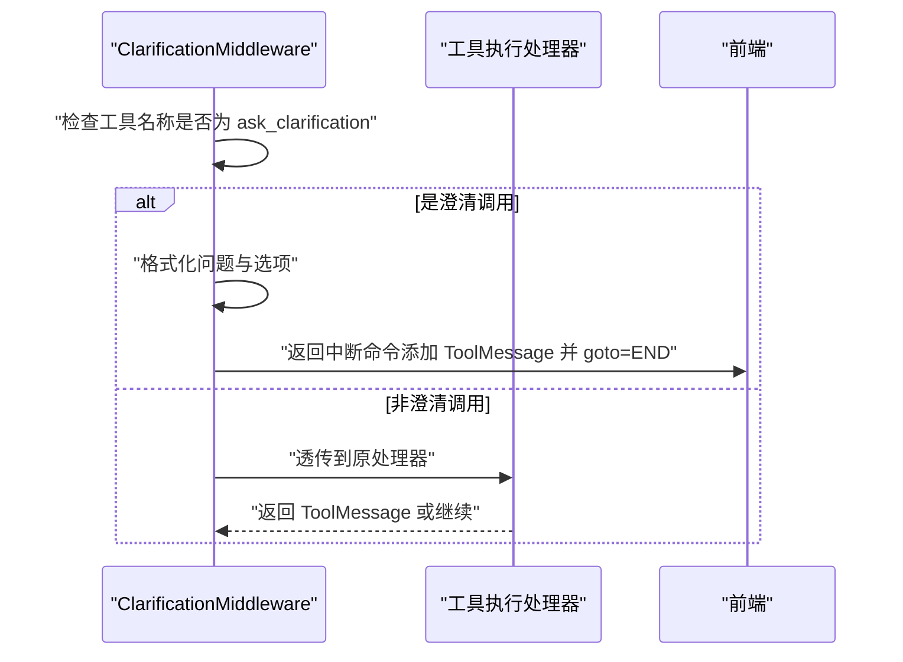
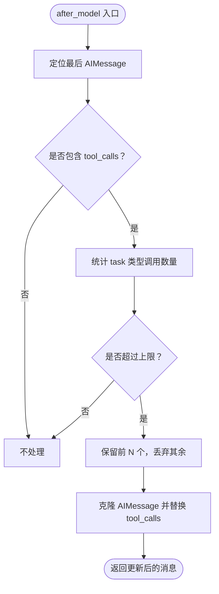
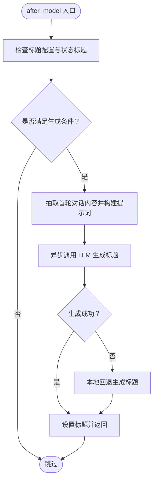
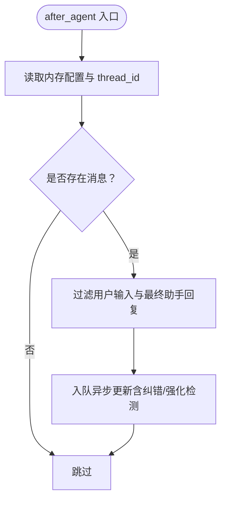
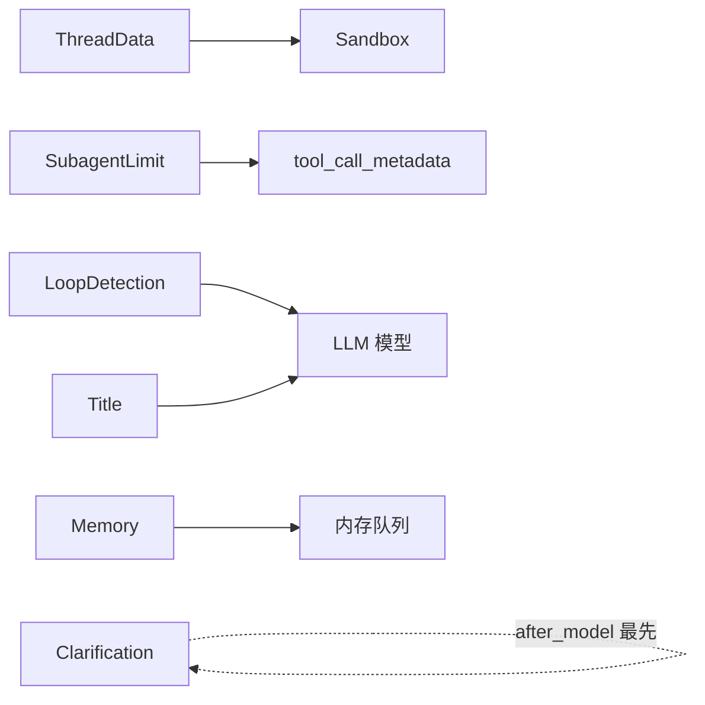

# 中间件链系统

<cite>
**本文引用的文件**
- [middleware-execution-flow.md](file://backend/docs/middleware-execution-flow.md)
- [thread_data_middleware.py](file://backend/packages/harness/deerflow/agents/middlewares/thread_data_middleware.py)
- [memory_middleware.py](file://backend/packages/harness/deerflow/agents/middlewares/memory_middleware.py)
- [clarification_middleware.py](file://backend/packages/harness/deerflow/agents/middlewares/clarification_middleware.py)
- [dangling_tool_call_middleware.py](file://backend/packages/harness/deerflow/agents/middlewares/dangling_tool_call_middleware.py)
- [loop_detection_middleware.py](file://backend/packages/harness/deerflow/agents/middlewares/loop_detection_middleware.py)
- [subagent_limit_middleware.py](file://backend/packages/harness/deerflow/agents/middlewares/subagent_limit_middleware.py)
- [title_middleware.py](file://backend/packages/harness/deerflow/agents/middlewares/title_middleware.py)
- [tool_call_metadata.py](file://backend/packages/harness/deerflow/agents/middlewares/tool_call_metadata.py)
- [logging_middleware.py](file://backend/app/gateway/logging_middleware.py)
</cite>

## 目录
1. [引言](#引言)
2. [项目结构](#项目结构)
3. [核心组件](#核心组件)
4. [架构总览](#架构总览)
5. [详细组件分析](#详细组件分析)
6. [依赖关系分析](#依赖关系分析)
7. [性能考量](#性能考量)
8. [故障排查指南](#故障排查指南)
9. [结论](#结论)
10. [附录](#附录)

## 引言
本文件系统化阐述 DeerFlow 的中间件链体系，覆盖九个核心中间件的设计理念、执行顺序、职责分工与交互方式。文档基于仓库中“中间件执行流程”说明与各中间件源码进行提炼总结，并提供架构图、序列图与流程图帮助理解。同时给出自定义中间件的开发要点、状态管理与性能优化建议，以及调试技巧。

## 项目结构
中间件链位于后端包路径 backend/packages/harness/deerflow/agents/middlewares 下，围绕 Agent 中间件接口组织；另有网关层 HTTP 请求日志中间件位于 backend/app/gateway。执行流程与顺序由文档 middleware-execution-flow.md 明确，包含 before_agent/before_model/after_model/after_agent 与 wrap_tool_call 等钩子的正序/反序执行规则。

图表来源
- [middleware-execution-flow.md:32-75](file://backend/docs/middleware-execution-flow.md#L32-L75)

章节来源
- [middleware-execution-flow.md:1-292](file://backend/docs/middleware-execution-flow.md#L1-L292)

## 核心组件
- ThreadDataMiddleware：在 before_agent 阶段创建线程数据目录与路径，支持惰性/急切初始化，确保后续中间件与工具可访问工作区、上传与输出目录。
- DanglingToolCallMiddleware：在 wrap_model_call 阶段扫描并修补缺失 ToolMessage 的 AIMessage，保证消息历史格式完整，避免 LLM 报错。
- LoopDetectionMiddleware：在 after_model 阶段检测重复工具调用与同工具高频率调用，必要时注入警告或强制停止，防止死循环。
- ClarificationMiddleware：在 wrap_tool_call 阶段拦截 ask_clarification 工具调用，格式化用户提示并返回中断命令，使前端可直接展示澄清问题。
- SubagentLimitMiddleware：在 after_model 阶段限制单次响应中并发 task 工具调用数量，保留前 N 个并丢弃多余调用。
- TitleMiddleware：在 after_model 阶段根据首轮对话内容生成标题，支持异步 LLM 生成与本地回退策略。
- MemoryMiddleware：在 after_agent 阶段将对话片段入队记忆，过滤用户输入与最终助手回复，异步批量更新记忆。
- ViewImageMiddleware：在 before_model 阶段注入图片 base64 数据，增强视觉理解能力。
- SummarizationMiddleware：在 after_model 阶段对上下文进行压缩，减少 token 使用并提升后续推理效率。
- SandboxMiddleware：在 before_agent 获取沙箱，在 after_agent 释放沙箱，形成对称生命周期。

章节来源
- [thread_data_middleware.py:24-119](file://backend/packages/harness/deerflow/agents/middlewares/thread_data_middleware.py#L24-L119)
- [dangling_tool_call_middleware.py:29-150](file://backend/packages/harness/deerflow/agents/middlewares/dangling_tool_call_middleware.py#L29-L150)
- [loop_detection_middleware.py:144-440](file://backend/packages/harness/deerflow/agents/middlewares/loop_detection_middleware.py#L144-L440)
- [clarification_middleware.py:28-204](file://backend/packages/harness/deerflow/agents/middlewares/clarification_middleware.py#L28-L204)
- [subagent_limit_middleware.py:25-77](file://backend/packages/harness/deerflow/agents/middlewares/subagent_limit_middleware.py#L25-L77)
- [title_middleware.py:29-185](file://backend/packages/harness/deerflow/agents/middlewares/title_middleware.py#L29-L185)
- [memory_middleware.py:28-111](file://backend/packages/harness/deerflow/agents/middlewares/memory_middleware.py#L28-L111)
- [logging_middleware.py:76-153](file://backend/app/gateway/logging_middleware.py#L76-L153)

## 架构总览
中间件链采用“管道 + 钩子”的非对称洋葱模型：大多数中间件仅使用单一钩子，before_* 正序执行，after_* 反序执行。SandboxMiddleware 是唯一具有对称生命周期的中间件。ClarificationMiddleware 位于链尾，after_model 反序执行时最先拦截 ask_clarification，确保第一时间中断并展示澄清问题。

图表来源
- [middleware-execution-flow.md:79-154](file://backend/docs/middleware-execution-flow.md#L79-L154)

章节来源
- [middleware-execution-flow.md:26-292](file://backend/docs/middleware-execution-flow.md#L26-L292)

## 详细组件分析

### ThreadDataMiddleware 分析
- 设计理念：为每次线程执行准备持久化目录，支持惰性初始化以降低启动开销。
- 执行时机：before_agent，读取运行时上下文中的 thread_id 与 user_id，计算工作区/上传/输出路径。
- 状态传递：向下游中间件与工具暴露 thread_data 字典，包含三类路径键值。
- 异常处理：缺少 thread_id 时抛出错误；惰性模式下仅记录路径，不创建目录。
- 性能优化：惰性初始化默认开启，仅在首次需要时创建目录；对最后一条 HumanMessage 注入运行标识与时间戳，便于追踪。

图表来源
- [thread_data_middleware.py:81-119](file://backend/packages/harness/deerflow/agents/middlewares/thread_data_middleware.py#L81-L119)

章节来源
- [thread_data_middleware.py:24-119](file://backend/packages/harness/deerflow/agents/middlewares/thread_data_middleware.py#L24-L119)

### DanglingToolCallMiddleware 分析
- 设计理念：修复 AIMessage 中存在 tool_calls 却缺少对应 ToolMessage 的“悬挂调用”问题，确保消息历史格式正确。
- 执行时机：wrap_model_call，拦截模型请求，插入占位 ToolMessage，位置紧邻对应的 AIMessage。
- 状态传递：通过修改请求消息列表，保持消息顺序与配对一致性。
- 异常处理：对原始 provider payload 进行解析与归一化，兼容不同序列化形式；记录注入数量用于告警。
- 性能优化：仅在检测到缺失时才构建新消息列表，避免不必要的复制。

图表来源
- [dangling_tool_call_middleware.py:129-150](file://backend/packages/harness/deerflow/agents/middlewares/dangling_tool_call_middleware.py#L129-L150)

章节来源
- [dangling_tool_call_middleware.py:29-150](file://backend/packages/harness/deerflow/agents/middlewares/dangling_tool_call_middleware.py#L29-L150)

### LoopDetectionMiddleware 分析
- 设计理念：双重防护——集合哈希去重与工具类型频率统计，防止无限工具调用循环。
- 执行时机：after_model，从最后一条 AIMessage 提取 tool_calls，计算稳定哈希并维护滑动窗口。
- 状态传递：当达到阈值时，向 AIMessage 内容追加警告文本或清空 tool_calls 并修正 finish_reason，强制生成自然语言回答。
- 异常处理：多线程安全，使用锁保护共享状态；LRU 淘汰过期线程跟踪；对不同工具名支持独立频率阈值覆盖。
- 性能优化：哈希计算与排序去序无关，减少误报；滑动窗口控制内存占用；频率检测补充哈希检测的盲区。

图表来源
- [loop_detection_middleware.py:419-426](file://backend/packages/harness/deerflow/agents/middlewares/loop_detection_middleware.py#L419-L426)

章节来源
- [loop_detection_middleware.py:144-440](file://backend/packages/harness/deerflow/agents/middlewares/loop_detection_middleware.py#L144-L440)

### ClarificationMiddleware 分析
- 设计理念：拦截 ask_clarification 工具调用，统一格式化为用户可读的消息，返回中断命令，使前端直接展示澄清问题。
- 执行时机：wrap_tool_call（同步/异步），在工具执行前判断名称并拦截。
- 状态传递：构造 ToolMessage 并返回 Command(goto=END)，将执行流引导至结束，等待用户响应。
- 异常处理：对模型参数序列化差异进行兼容处理；为重复调用生成稳定消息 ID，避免重复追加。
- 性能优化：仅在命中 ask_clarification 时进行格式化与命令构造，其他工具透传。

图表来源
- [clarification_middleware.py:161-204](file://backend/packages/harness/deerflow/agents/middlewares/clarification_middleware.py#L161-L204)

章节来源
- [clarification_middleware.py:28-204](file://backend/packages/harness/deerflow/agents/middlewares/clarification_middleware.py#L28-L204)

### SubagentLimitMiddleware 分析
- 设计理念：限制单次响应中并发 task 工具调用的数量，保留前 N 个，其余丢弃，提高稳定性与可控性。
- 执行时机：after_model，扫描最后 AIMessage 的 tool_calls，统计 task 类型调用数量。
- 状态传递：通过工具元数据辅助函数克隆 AIMessage 并替换 tool_calls，保持消息 ID 一致以触发替换。
- 异常处理：超出范围自动钳制到有效区间；记录丢弃数量用于告警。
- 性能优化：仅在需要时构造新消息对象；复用工具元数据工具函数，避免重复逻辑。

图表来源
- [subagent_limit_middleware.py:70-77](file://backend/packages/harness/deerflow/agents/middlewares/subagent_limit_middleware.py#L70-L77)

章节来源
- [subagent_limit_middleware.py:25-77](file://backend/packages/harness/deerflow/agents/middlewares/subagent_limit_middleware.py#L25-L77)

### TitleMiddleware 分析
- 设计理念：在首次完整对话交换后自动生成标题，支持异步 LLM 生成与本地回退。
- 执行时机：after_model，检查状态中是否已有标题、消息数量与类型，满足条件后生成标题。
- 状态传递：返回包含 title 的状态更新；若异步失败则回退到本地标题生成。
- 异常处理：对不同内容结构进行归一化；剥离思考标签；设置运行名与标签以便追踪。
- 性能优化：异步生成失败时快速回退本地生成；限制内容长度与字符数，避免过度计算。

图表来源
- [title_middleware.py:178-185](file://backend/packages/harness/deerflow/agents/middlewares/title_middleware.py#L178-L185)

章节来源
- [title_middleware.py:29-185](file://backend/packages/harness/deerflow/agents/middlewares/title_middleware.py#L29-L185)

### MemoryMiddleware 分析
- 设计理念：在代理完成后将对话片段入队记忆，异步批量更新，减少主线程阻塞。
- 执行时机：after_agent，过滤用户输入与最终助手回复，检测纠错/强化信号，入队异步队列。
- 状态传递：通常不返回状态变更，而是副作用地将任务投递到内存队列。
- 异常处理：若无 thread_id 或消息为空则跳过；若队列不可用则记录调试信息。
- 性能优化：消息过滤与去抖动批处理，避免频繁写入；在入队时捕获 user_id，避免跨线程上下文丢失。

图表来源
- [memory_middleware.py:52-111](file://backend/packages/harness/deerflow/agents/middlewares/memory_middleware.py#L52-L111)

章节来源
- [memory_middleware.py:28-111](file://backend/packages/harness/deerflow/agents/middlewares/memory_middleware.py#L28-L111)

### ViewImageMiddleware 与 SummarizationMiddleware
- ViewImageMiddleware：在 before_model 阶段注入图片 base64 数据，增强视觉理解能力。
- SummarizationMiddleware：在 after_model 阶段对上下文进行压缩，减少 token 使用并提升后续推理效率。

章节来源
- [middleware-execution-flow.md:7-23](file://backend/docs/middleware-execution-flow.md#L7-L23)

### SandboxMiddleware
- 生命周期：在 before_agent 获取沙箱，在 after_agent 释放沙箱，形成对称的外层进入/外层退出模式，天然具备洋葱对称性。

章节来源
- [middleware-execution-flow.md:7-23](file://backend/docs/middleware-execution-flow.md#L7-L23)

### 工具元数据辅助工具
- clone_ai_message_with_tool_calls：在更新 AIMessage 的 tool_calls 时，同步保持原始 provider 的 tool_calls 元数据一致性，避免序列化不匹配。

章节来源
- [tool_call_metadata.py:18-51](file://backend/packages/harness/deerflow/agents/middlewares/tool_call_metadata.py#L18-L51)

### 网关层日志中间件
- RequestResponseLoggingMiddleware：对 API 请求/响应进行结构化日志记录，过滤大体积流式响应，支持路径前缀白名单/黑名单与负载截断。

章节来源
- [logging_middleware.py:76-153](file://backend/app/gateway/logging_middleware.py#L76-L153)

## 依赖关系分析
- 执行顺序依赖
  - ThreadData 必须在 Sandbox 之前，因为沙箱需要线程目录。
  - Clarification 必须在链尾，after_model 反序执行时最先拦截 ask_clarification。
- 功能耦合
  - SubagentLimit 与工具元数据工具协作，确保 AIMessage 更新时保留原始 provider 元数据。
  - LoopDetection 与 Memory/Title 等中间件在 after_model 阶段共同作用，前者负责安全控制，后者负责质量与可观测性。
- 外部依赖
  - 与 LangGraph 运行时上下文交互，读取 thread_id 与 configurable 元数据。
  - 与 LLM 模型调用集成，部分中间件（Title、Memory）会发起额外的 LLM 调用。

图表来源
- [middleware-execution-flow.md:265-269](file://backend/docs/middleware-execution-flow.md#L265-L269)
- [subagent_limit_middleware.py:10-11](file://backend/packages/harness/deerflow/agents/middlewares/subagent_limit_middleware.py#L10-L11)
- [tool_call_metadata.py:1-51](file://backend/packages/harness/deerflow/agents/middlewares/tool_call_metadata.py#L1-L51)

章节来源
- [middleware-execution-flow.md:265-269](file://backend/docs/middleware-execution-flow.md#L265-L269)

## 性能考量
- 惰性初始化：ThreadData 默认惰性创建目录，减少冷启动开销。
- 滑动窗口与 LRU：LoopDetection 使用固定大小窗口与 LRU 淘汰，控制内存占用与并发线程上限。
- 批处理与去抖动：MemoryMiddleware 通过队列批处理与去抖动，降低写入频率。
- 内容截断与长度限制：TitleMiddleware 限制输入与输出长度，避免昂贵的 LLM 调用。
- 流式响应过滤：网关日志中间件对流式响应进行特殊处理，避免日志风暴。

## 故障排查指南
- 线程目录未创建
  - 现象：后续中间件无法访问工作区/上传/输出目录。
  - 排查：确认 ThreadData 的 thread_id 来源（运行时上下文或 LangGraph configurable），检查惰性/急切初始化配置。
- 悬挂工具调用导致 LLM 报错
  - 现象：模型因消息配对不完整而报错。
  - 排查：启用 DanglingToolCallMiddleware，观察日志中占位注入数量；检查消息历史中 AIMessage 与 ToolMessage 的对应关系。
- 无限循环或高频率工具调用
  - 现象：模型反复调用同一工具或同类型工具。
  - 排查：查看 LoopDetection 日志中的警告/强制停止事件；调整阈值或频率覆盖；必要时在工具层增加幂等性保障。
- 澄清问题未显示
  - 现象：ask_clarification 被调用但前端未展示。
  - 排查：确认 ClarificationMiddleware 位于链尾且 after_model 反序执行生效；检查工具名称是否严格匹配。
- 标题生成失败
  - 现象：异步生成失败，标题为空或不准确。
  - 排查：查看 TitleMiddleware 回退逻辑；检查 LLM 调用配置与提示词模板；确认首轮对话内容充足。
- 记忆未更新
  - 现象：会话结束后未产生记忆。
  - 排查：确认 MemoryMiddleware 已启用；检查过滤规则与消息类型；查看队列是否正常工作。

章节来源
- [thread_data_middleware.py:81-119](file://backend/packages/harness/deerflow/agents/middlewares/thread_data_middleware.py#L81-L119)
- [dangling_tool_call_middleware.py:129-150](file://backend/packages/harness/deerflow/agents/middlewares/dangling_tool_call_middleware.py#L129-L150)
- [loop_detection_middleware.py:274-341](file://backend/packages/harness/deerflow/agents/middlewares/loop_detection_middleware.py#L274-L341)
- [clarification_middleware.py:161-204](file://backend/packages/harness/deerflow/agents/middlewares/clarification_middleware.py#L161-L204)
- [title_middleware.py:178-185](file://backend/packages/harness/deerflow/agents/middlewares/title_middleware.py#L178-L185)
- [memory_middleware.py:52-111](file://backend/packages/harness/deerflow/agents/middlewares/memory_middleware.py#L52-L111)

## 结论
DeerFlow 的中间件链通过明确的钩子分层与严格的执行顺序，实现了从环境准备、输入增强、安全控制、质量治理到记忆沉淀的全链路闭环。九个核心中间件各司其职：ThreadData 提供基础设施，DanglingToolCall 保证消息完整性，LoopDetection 保障安全性，Clarification 提升交互体验，SubagentLimit 控制并发风险，Title 与 Summarization 改善质量与效率，Memory 将对话沉淀为长期记忆。遵循本文的架构图、时序图与流程图，可高效扩展与调试中间件链。

## 附录
- 开发自定义中间件要点
  - 选择合适的钩子：before_agent/before_model/after_model/after_agent/wrap_tool_call/wrap_model_call。
  - 明确状态 Schema：继承 AgentState 并声明所需字段，便于与其他中间件共享。
  - 保持幂等与可恢复：对写操作进行幂等校验，必要时引入重试与回滚。
  - 注意执行顺序：受 after_model 反序与 wrap_* 钩子影响，需评估与其他中间件的交互。
  - 性能与可观测性：避免在钩子中做重型计算；为关键路径打点与限流。
- 调试技巧
  - 使用网关日志中间件观察请求/响应结构与大小，定位流式输出问题。
  - 在关键中间件中增加结构化日志，记录输入输出摘要与决策依据。
  - 通过最小化用例验证中间件组合效果，逐步加入其他中间件。
  - 对异步中间件（如 Title、Memory）关注失败回退路径与重试策略。