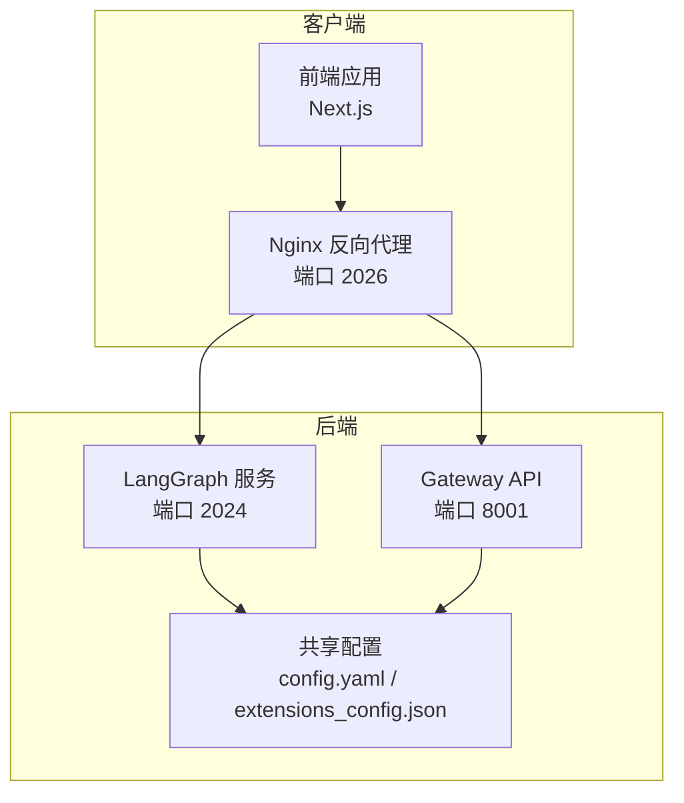
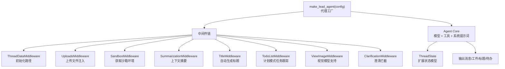
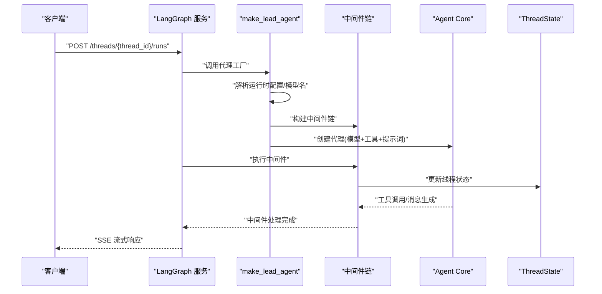
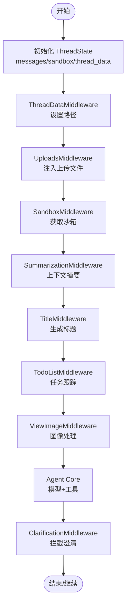
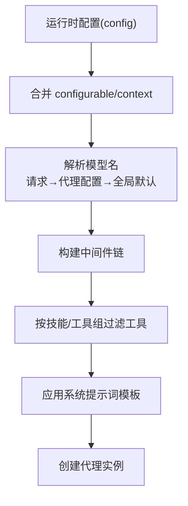
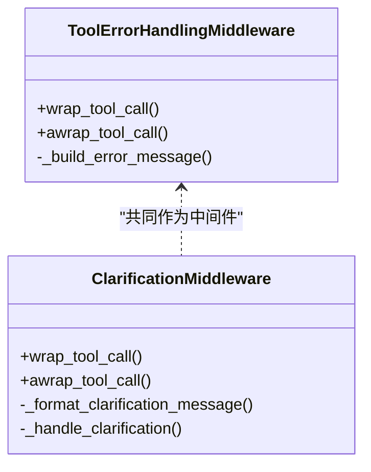
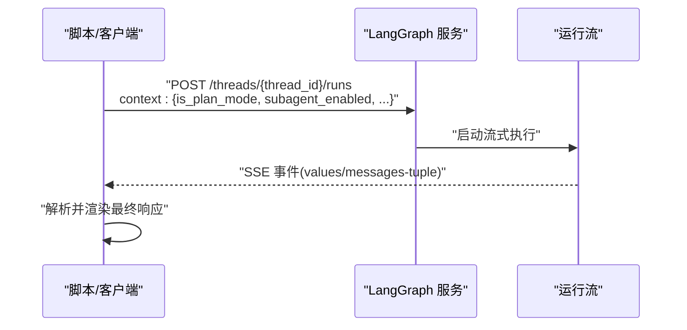
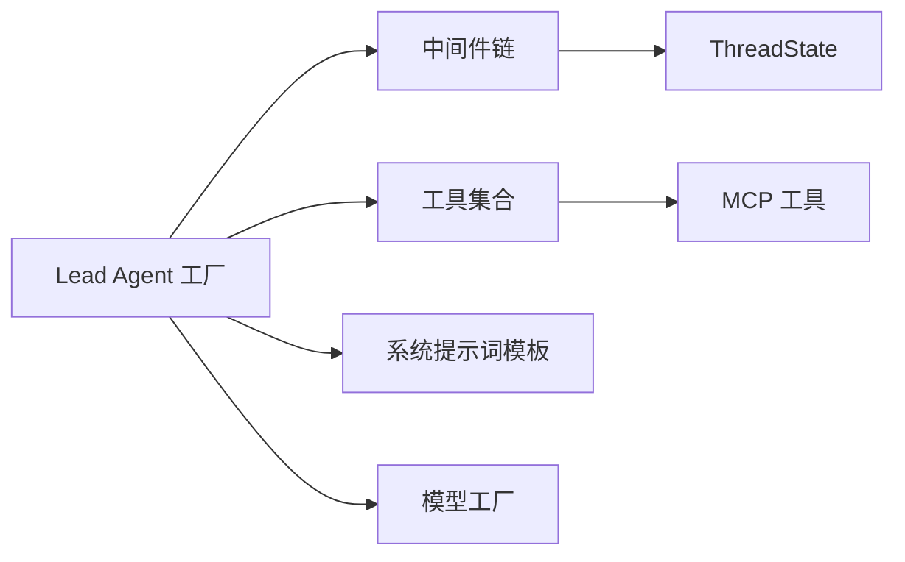

# 代理运行时系统

<cite>
**本文引用的文件**
- [backend/packages/harness/deerflow/agents/lead_agent/agent.py](file://backend/packages/harness/deerflow/agents/lead_agent/agent.py)
- [backend/packages/harness/deerflow/agents/lead_agent/__init__.py](file://backend/packages/harness/deerflow/agents/lead_agent/__init__.py)
- [backend/packages/harness/deerflow/agents/thread_state.py](file://backend/packages/harness/deerflow/agents/thread_state.py)
- [backend/packages/harness/deerflow/agents/middlewares/tool_error_handling_middleware.py](file://backend/packages/harness/deerflow/agents/middlewares/tool_error_handling_middleware.py)
- [backend/packages/harness/deerflow/agents/middlewares/clarification_middleware.py](file://backend/packages/harness/deerflow/agents/middlewares/clarification_middleware.py)
- [backend/packages/harness/deerflow/config/agents_config.py](file://backend/packages/harness/deerflow/config/agents_config.py)
- [backend/packages/harness/deerflow/tools/__init__.py](file://backend/packages/harness/deerflow/tools/__init__.py)
- [backend/docs/ARCHITECTURE.md](file://backend/docs/ARCHITECTURE.md)
- [backend/README.md](file://backend/README.md)
- [skills/public/bootstrap/SKILL.md](file://skills/public/bootstrap/SKILL.md)
- [skills/public/bootstrap/templates/SOUL.template.md](file://skills/public/bootstrap/templates/SOUL.template.md)
- [backend/tests/test_create_deerflow_agent.py](file://backend/tests/test_create_deerflow_agent.py)
- [backend/tests/test_lead_agent_prompt.py](file://backend/tests/test_lead_agent_prompt.py)
- [backend/tests/test_lead_agent_skills.py](file://backend/tests/test_lead_agent_skills.py)
- [backend/tests/test_lead_agent_model_resolution.py](file://backend/tests/test_lead_agent_model_resolution.py)
- [skills/public/claude-to-deerflow/scripts/chat.sh](file://skills/public/claude-to-deerflow/scripts/chat.sh)
</cite>

## 目录
1. [引言](#引言)
2. [项目结构](#项目结构)
3. [核心组件](#核心组件)
4. [架构总览](#架构总览)
5. [详细组件分析](#详细组件分析)
6. [依赖分析](#依赖分析)
7. [性能考虑](#性能考虑)
8. [故障排查指南](#故障排查指南)
9. [结论](#结论)
10. [附录](#附录)

## 引言
本文件面向 DeerFlow 代理运行时系统，聚焦 Lead Agent 的设计理念、代理生命周期管理与配置机制，系统阐述代理的核心架构、状态管理、消息路由与执行流程。文档同时覆盖代理创建过程、配置参数、中间件集成、错误处理与性能优化策略，并给出与 LangGraph 的集成方式与最佳实践。为便于不同背景读者理解，内容采用渐进式层次组织，并辅以多种可视化图示。

## 项目结构
DeerFlow 后端采用“LangGraph 服务 + 网关 API + 前端”的三层架构。代理运行时的核心入口位于 LangGraph 服务中，通过统一的代理工厂函数创建 Lead Agent；网关负责非代理类的 REST 能力（模型、技能、上传、工件等）；前端提供交互界面与实时流式体验。

图表来源
- [backend/docs/ARCHITECTURE.md:1-51](file://backend/docs/ARCHITECTURE.md#L1-L51)

章节来源
- [backend/docs/ARCHITECTURE.md:1-51](file://backend/docs/ARCHITECTURE.md#L1-L51)

## 核心组件
- Lead Agent 工厂与创建流程：通过代理工厂函数创建具备中间件链、工具集合与系统提示词的代理实例，支持运行时参数注入与模型解析。
- 中间件体系：围绕线程数据、上传、沙箱、上下文摘要、标题生成、任务跟踪、图像处理、循环检测、错误处理与澄清请求拦截等职责构建。
- 状态模型：在 LangGraph AgentState 基础上扩展沙箱、线程数据、工件、待办事项、已查看图像等字段，支撑多轮对话与多模态交互。
- 配置与工具：支持按用户隔离的自定义代理配置、SOUL.md 注入、工具组过滤与技能允许工具策略，以及 MCP 工具动态加载。

章节来源
- [backend/packages/harness/deerflow/agents/lead_agent/agent.py:343-447](file://backend/packages/harness/deerflow/agents/lead_agent/agent.py#L343-L447)
- [backend/packages/harness/deerflow/agents/thread_state.py:48-56](file://backend/packages/harness/deerflow/agents/thread_state.py#L48-L56)
- [backend/packages/harness/deerflow/agents/middlewares/tool_error_handling_middleware.py:73-171](file://backend/packages/harness/deerflow/agents/middlewares/tool_error_handling_middleware.py#L73-L171)
- [backend/packages/harness/deerflow/config/agents_config.py:38-129](file://backend/packages/harness/deerflow/config/agents_config.py#L38-L129)

## 架构总览
下图展示了 Lead Agent 的运行时架构与关键组件交互：

图表来源
- [backend/docs/ARCHITECTURE.md:96-127](file://backend/docs/ARCHITECTURE.md#L96-L127)
- [backend/packages/harness/deerflow/agents/lead_agent/agent.py:240-318](file://backend/packages/harness/deerflow/agents/lead_agent/agent.py#L240-L318)
- [backend/packages/harness/deerflow/agents/thread_state.py:48-56](file://backend/packages/harness/deerflow/agents/thread_state.py#L48-L56)

章节来源
- [backend/docs/ARCHITECTURE.md:96-127](file://backend/docs/ARCHITECTURE.md#L96-L127)

## 详细组件分析

### Lead Agent 设计理念与生命周期
- 设计理念
  - 以“可插拔中间件”为核心，通过可配置的中间件链实现线程数据初始化、上传处理、沙箱获取、上下文摘要、标题生成、任务跟踪、图像处理、循环检测、错误处理与澄清拦截等功能。
  - 支持“引导代理”与“自定义代理”两类：引导代理用于首次创建与配置，自定义代理支持按用户隔离的配置与 SOUL.md 注入。
- 生命周期管理
  - 创建阶段：解析运行时配置、模型名称解析与回退、中间件链构建、工具集合过滤与注入、系统提示词模板应用。
  - 执行阶段：按顺序执行中间件链，随后进入代理核心，模型根据历史消息与工具调用生成响应。
  - 结束阶段：根据中间件钩子与状态变更，生成标题、维护工件列表、更新内存与上传队列。

图表来源
- [backend/packages/harness/deerflow/agents/lead_agent/agent.py:343-447](file://backend/packages/harness/deerflow/agents/lead_agent/agent.py#L343-L447)
- [backend/docs/ARCHITECTURE.md:344-380](file://backend/docs/ARCHITECTURE.md#L344-L380)

章节来源
- [backend/packages/harness/deerflow/agents/lead_agent/agent.py:343-447](file://backend/packages/harness/deerflow/agents/lead_agent/agent.py#L343-L447)

### 状态管理与消息路由
- ThreadState 扩展
  - 在 AgentState 的 messages 基础上新增 sandbox、thread_data、title、artifacts、todos、uploaded_files、viewed_images 等字段。
  - 提供合并器（如 artifacts 合并去重、viewed_images 合并与清空语义）保证状态一致性。
- 消息路由
  - 中间件在执行前/后对消息进行增强（如注入当前日期、上传文件列表、图像元数据、澄清问题等），确保下游模型与工具获得完整上下文。
  - 澄清请求通过 ClarificationMiddleware 截获并中断执行，等待用户反馈后再继续。

图表来源
- [backend/packages/harness/deerflow/agents/thread_state.py:48-56](file://backend/packages/harness/deerflow/agents/thread_state.py#L48-L56)
- [backend/packages/harness/deerflow/agents/middlewares/clarification_middleware.py:28-204](file://backend/packages/harness/deerflow/agents/middlewares/clarification_middleware.py#L28-L204)

章节来源
- [backend/packages/harness/deerflow/agents/thread_state.py:48-56](file://backend/packages/harness/deerflow/agents/thread_state.py#L48-L56)
- [backend/packages/harness/deerflow/agents/middlewares/clarification_middleware.py:28-204](file://backend/packages/harness/deerflow/agents/middlewares/clarification_middleware.py#L28-L204)

### 配置机制与代理创建
- 运行时配置合并
  - 将 config 中的 configurable 与 context 合并，形成最终运行时配置，支持 is_plan_mode、subagent_enabled、max_concurrent_subagents、model_name/model、agent_name 等参数。
- 模型解析与回退
  - 优先使用请求中的 model_name/model，其次使用代理配置中的 model，最后回退到全局默认模型；未知模型名会记录警告并回退。
- 中间件构建顺序
  - 严格遵循执行顺序：ThreadDataMiddleware → UploadsMiddleware → SandboxMiddleware → SummarizationMiddleware → TitleMiddleware → TodoListMiddleware → ViewImageMiddleware → 其他自定义中间件 → ClarificationMiddleware。
- 工具与技能策略
  - 通过工具组与技能允许工具策略过滤可用工具，确保安全与可控。
- 引导代理与自定义代理
  - 引导代理仅加载 bootstrap 技能与必要工具，用于首次创建流程；自定义代理支持 SOUL.md 注入与按用户隔离的配置目录。

图表来源
- [backend/packages/harness/deerflow/agents/lead_agent/agent.py:29-50](file://backend/packages/harness/deerflow/agents/lead_agent/agent.py#L29-L50)
- [backend/packages/harness/deerflow/agents/lead_agent/agent.py:240-318](file://backend/packages/harness/deerflow/agents/lead_agent/agent.py#L240-L318)
- [backend/packages/harness/deerflow/agents/lead_agent/agent.py:411-446](file://backend/packages/harness/deerflow/agents/lead_agent/agent.py#L411-L446)

章节来源
- [backend/packages/harness/deerflow/agents/lead_agent/agent.py:29-50](file://backend/packages/harness/deerflow/agents/lead_agent/agent.py#L29-L50)
- [backend/packages/harness/deerflow/agents/lead_agent/agent.py:240-318](file://backend/packages/harness/deerflow/agents/lead_agent/agent.py#L240-L318)
- [backend/packages/harness/deerflow/agents/lead_agent/agent.py:411-446](file://backend/packages/harness/deerflow/agents/lead_agent/agent.py#L411-L446)

### 中间件集成与错误处理
- 工具错误处理中间件
  - 将工具异常转换为 ToolMessage，保留 LangGraph 控制信号（中断/暂停/恢复），避免因单个工具失败导致整个流程中断。
- 澄清请求中间件
  - 拦截 ask_clarification 工具调用，格式化用户友好消息并返回 Command 中断执行，等待用户输入后再继续。
- 其他关键中间件
  - 动态上下文、上下文摘要、标题生成、任务跟踪、图像处理、循环检测、沙箱审计、上传处理等，均在中间件链中有序执行。

图表来源
- [backend/packages/harness/deerflow/agents/middlewares/tool_error_handling_middleware.py:24-71](file://backend/packages/harness/deerflow/agents/middlewares/tool_error_handling_middleware.py#L24-L71)
- [backend/packages/harness/deerflow/agents/middlewares/clarification_middleware.py:28-204](file://backend/packages/harness/deerflow/agents/middlewares/clarification_middleware.py#L28-L204)

章节来源
- [backend/packages/harness/deerflow/agents/middlewares/tool_error_handling_middleware.py:73-171](file://backend/packages/harness/deerflow/agents/middlewares/tool_error_handling_middleware.py#L73-L171)
- [backend/packages/harness/deerflow/agents/middlewares/clarification_middleware.py:28-204](file://backend/packages/harness/deerflow/agents/middlewares/clarification_middleware.py#L28-L204)

### LangGraph 集成与最佳实践
- 集成方式
  - LangGraph 服务通过代理工厂函数创建 Lead Agent，使用 langgraph.json 指定代理路径。
  - 客户端通过 /api/langgraph/threads/{thread_id}/runs 发起流式请求，LangGraph 服务按中间件链执行并返回 SSE。
- 最佳实践
  - 使用 context 注入 is_plan_mode、subagent_enabled、max_concurrent_subagents 等参数，按需启用计划模式与子代理并发。
  - 在生产环境启用上下文摘要与循环检测中间件，降低长对话上下文开销与死循环风险。
  - 对于视觉模型，启用 ViewImageMiddleware 并确保模型支持视觉能力。

图表来源
- [backend/docs/ARCHITECTURE.md:344-380](file://backend/docs/ARCHITECTURE.md#L344-L380)
- [skills/public/claude-to-deerflow/scripts/chat.sh:47-90](file://skills/public/claude-to-deerflow/scripts/chat.sh#L47-L90)

章节来源
- [backend/docs/ARCHITECTURE.md:344-380](file://backend/docs/ARCHITECTURE.md#L344-L380)
- [skills/public/claude-to-deerflow/scripts/chat.sh:47-90](file://skills/public/claude-to-deerflow/scripts/chat.sh#L47-L90)

### 代理创建与配置示例（路径指引）
以下为创建与配置代理的关键步骤与参考路径（不直接展示代码内容）：
- 创建引导代理（首次创建流程）
  - 参考路径：[引导代理创建流程:413-427](file://backend/packages/harness/deerflow/agents/lead_agent/agent.py#L413-L427)
  - 引导技能：[bootstrap 技能说明](file://skills/public/bootstrap/SKILL.md)
  - 引导模板：[SOUL 模板](file://skills/public/bootstrap/templates/SOUL.template.md)
- 创建自定义代理
  - 参考路径：[自定义代理创建流程:429-446](file://backend/packages/harness/deerflow/agents/lead_agent/agent.py#L429-L446)
  - 用户隔离配置：[按用户隔离的代理目录:54-79](file://backend/packages/harness/deerflow/config/agents_config.py#L54-L79)
  - SOUL.md 注入：[SOUL.md 加载:131-153](file://backend/packages/harness/deerflow/config/agents_config.py#L131-L153)
- 工具与技能策略
  - 参考路径：[工具可用性与过滤:1-12](file://backend/packages/harness/deerflow/tools/__init__.py#L1-L12)
  - 参考路径：[技能允许工具策略:329-341](file://backend/packages/harness/deerflow/agents/lead_agent/agent.py#L329-L341)

章节来源
- [backend/packages/harness/deerflow/agents/lead_agent/agent.py:413-446](file://backend/packages/harness/deerflow/agents/lead_agent/agent.py#L413-L446)
- [backend/packages/harness/deerflow/config/agents_config.py:54-79](file://backend/packages/harness/deerflow/config/agents_config.py#L54-L79)
- [backend/packages/harness/deerflow/config/agents_config.py:131-153](file://backend/packages/harness/deerflow/config/agents_config.py#L131-L153)
- [backend/packages/harness/deerflow/tools/__init__.py:1-12](file://backend/packages/harness/deerflow/tools/__init__.py#L1-L12)

## 依赖分析
- 组件耦合
  - Lead Agent 工厂与中间件链存在强耦合，中间件顺序影响执行结果与性能。
  - ThreadState 与多个中间件存在读写耦合，需确保合并器正确性。
- 外部依赖
  - LangGraph 服务、LangChain 模型工厂、MCP 工具系统、沙箱提供者等。
- 循环依赖
  - 通过延迟导入与工厂函数避免循环依赖。

图表来源
- [backend/packages/harness/deerflow/agents/lead_agent/agent.py:343-447](file://backend/packages/harness/deerflow/agents/lead_agent/agent.py#L343-L447)
- [backend/packages/harness/deerflow/agents/thread_state.py:48-56](file://backend/packages/harness/deerflow/agents/thread_state.py#L48-L56)

章节来源
- [backend/packages/harness/deerflow/agents/lead_agent/agent.py:343-447](file://backend/packages/harness/deerflow/agents/lead_agent/agent.py#L343-L447)

## 性能考虑
- 缓存与重载
  - MCP 工具基于文件 mtime 缓存，配置文件变更触发重载。
  - 技能解析一次性缓存，减少重复开销。
- 流式传输
  - 使用 SSE 实现实时响应，降低首 token 时间，提升长任务可见性。
- 上下文管理
  - 上下文摘要中间件在接近阈值时自动摘要旧消息，保留近期关键信息。
- 沙箱隔离
  - 生产环境推荐 Docker 沙箱，确保资源隔离与审计。

章节来源
- [backend/docs/ARCHITECTURE.md:466-485](file://backend/docs/ARCHITECTURE.md#L466-L485)

## 故障排查指南
- 工具异常处理
  - 工具执行失败会被转换为 ToolMessage 并继续流程，日志包含工具名与调用 ID，便于定位。
  - 参考路径：[工具错误处理中间件:24-71](file://backend/packages/harness/deerflow/agents/middlewares/tool_error_handling_middleware.py#L24-L71)
- 澄清请求中断
  - 模型调用 ask_clarification 时，中间件会格式化消息并中断执行，等待用户输入。
  - 参考路径：[澄清请求中间件:120-204](file://backend/packages/harness/deerflow/agents/middlewares/clarification_middleware.py#L120-L204)
- 模型解析错误
  - 未知模型名会回退到默认模型并记录警告；检查配置文件与请求参数。
  - 参考路径：[模型解析与回退:38-50](file://backend/packages/harness/deerflow/agents/lead_agent/agent.py#L38-L50)
- 中间件顺序问题
  - 确保 ThreadDataMiddleware 在 SandboxMiddleware 之前，UploadsMiddleware 在 ThreadDataMiddleware 之后，ClarificationMiddleware 放在最后。
  - 参考路径：[中间件顺序注释:240-318](file://backend/packages/harness/deerflow/agents/lead_agent/agent.py#L240-L318)

章节来源
- [backend/packages/harness/deerflow/agents/middlewares/tool_error_handling_middleware.py:24-71](file://backend/packages/harness/deerflow/agents/middlewares/tool_error_handling_middleware.py#L24-L71)
- [backend/packages/harness/deerflow/agents/middlewares/clarification_middleware.py:120-204](file://backend/packages/harness/deerflow/agents/middlewares/clarification_middleware.py#L120-L204)
- [backend/packages/harness/deerflow/agents/lead_agent/agent.py:38-50](file://backend/packages/harness/deerflow/agents/lead_agent/agent.py#L38-L50)
- [backend/packages/harness/deerflow/agents/lead_agent/agent.py:240-318](file://backend/packages/harness/deerflow/agents/lead_agent/agent.py#L240-L318)

## 结论
DeerFlow 的代理运行时系统以 LangGraph 为核心，通过可配置的中间件链实现强大的状态管理、消息路由与工具执行能力。其设计强调安全性（沙箱隔离、MCP 安全、Guardrails）、可观测性（SSE 流式、RunJournal 标签、令牌用量统计）与可扩展性（技能系统、MCP 工具、用户隔离代理）。遵循本文的最佳实践与排障指南，可在保证安全的前提下高效扩展与优化代理功能。

## 附录
- 安全注意事项
  - 默认仅限本地可信环境访问，公网部署需严格白名单、前置认证与网络隔离。
  - 参考路径：[安全使用说明:709-716](file://backend/README.md#L709-L716)
- 关键测试用例（路径指引）
  - 代理创建：[test_create_deerflow_agent.py](file://backend/tests/test_create_deerflow_agent.py)
  - 提示词与技能：[test_lead_agent_prompt.py](file://backend/tests/test_lead_agent_prompt.py), [test_lead_agent_skills.py](file://backend/tests/test_lead_agent_skills.py)
  - 模型解析：[test_lead_agent_model_resolution.py](file://backend/tests/test_lead_agent_model_resolution.py)

章节来源
- [backend/README.md:709-716](file://backend/README.md#L709-L716)
- [backend/tests/test_create_deerflow_agent.py](file://backend/tests/test_create_deerflow_agent.py)
- [backend/tests/test_lead_agent_prompt.py](file://backend/tests/test_lead_agent_prompt.py)
- [backend/tests/test_lead_agent_skills.py](file://backend/tests/test_lead_agent_skills.py)
- [backend/tests/test_lead_agent_model_resolution.py](file://backend/tests/test_lead_agent_model_resolution.py)