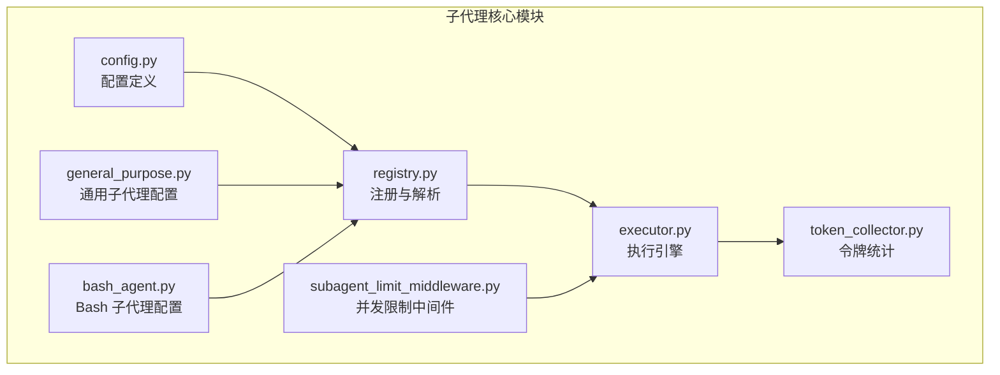
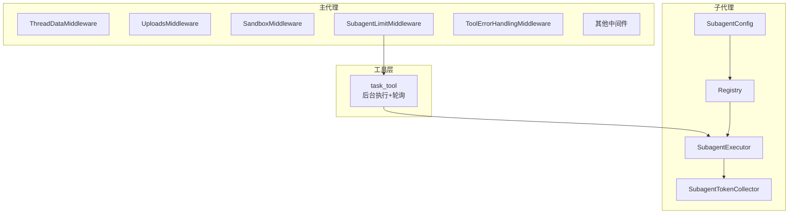
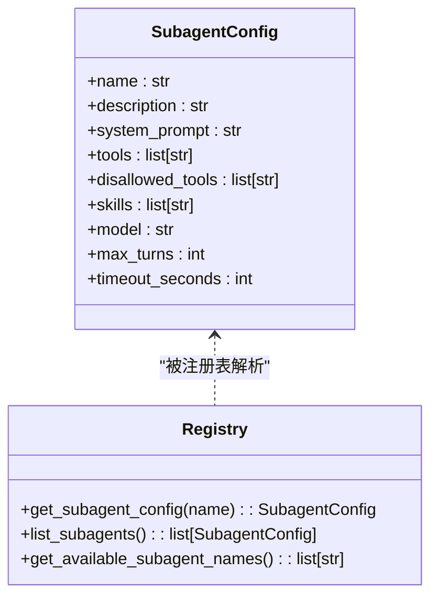
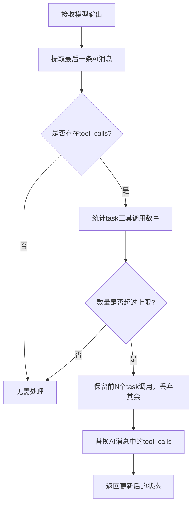
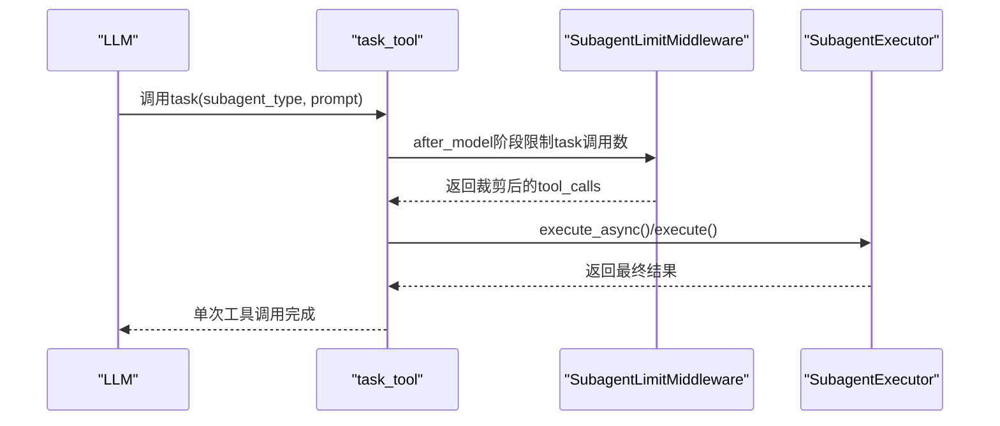
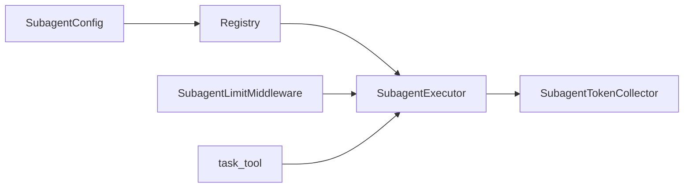

# 子代理系统

<cite>
**本文引用的文件**
- [executor.py](file://backend/packages/harness/deerflow/subagents/executor.py)
- [config.py](file://backend/packages/harness/deerflow/subagents/config.py)
- [registry.py](file://backend/packages/harness/deerflow/subagents/registry.py)
- [__init__.py](file://backend/packages/harness/deerflow/subagents/__init__.py)
- [general_purpose.py](file://backend/packages/harness/deerflow/subagents/builtins/general_purpose.py)
- [bash_agent.py](file://backend/packages/harness/deerflow/subagents/builtins/bash_agent.py)
- [subagent_limit_middleware.py](file://backend/packages/harness/deerflow/agents/middlewares/subagent_limit_middleware.py)
- [token_collector.py](file://backend/packages/harness/deerflow/subagents/token_collector.py)
- [task_tool_improvements.md](file://backend/docs/task_tool_improvements.md)
- [middleware-execution-flow.md](file://backend/docs/middleware-execution-flow.md)
- [rfc-create-deerflow-agent.md](file://backend/docs/rfc-create-deerflow-agent.md)
- [agent.py](file://backend/packages/harness/deerflow/agents/lead_agent/agent.py)
- [thread_runs.py](file://backend/app/gateway/routers/thread_runs.py)
- [services.py](file://backend/app/gateway/services.py)
</cite>

## 目录
1. [简介](#简介)
2. [项目结构](#项目结构)
3. [核心组件](#核心组件)
4. [架构总览](#架构总览)
5. [详细组件分析](#详细组件分析)
6. [依赖关系分析](#依赖关系分析)
7. [性能考量](#性能考量)
8. [故障排查指南](#故障排查指南)
9. [结论](#结论)
10. [附录](#附录)

## 简介
本文件系统性阐述 DeerFlow 子代理系统的架构设计、并行执行机制与任务委托管理。重点覆盖以下方面：
- 子代理的创建、配置、调度与协调机制
- 生命周期管理、资源分配、并发控制与超时保护
- 负载均衡与故障恢复策略
- 与主代理的交互模式及性能优化技巧
- 复杂工作流的设计与实现范式（任务分解、结果聚合、状态同步）

## 项目结构
子代理系统位于后端包 deerflow.harness 内部，围绕配置、执行器、注册表与中间件协作展开，并通过工具层与主代理的中间件链路集成。



图表来源
- [config.py:10-36](file://backend/packages/harness/deerflow/subagents/config.py#L10-L36)
- [registry.py:14-117](file://backend/packages/harness/deerflow/subagents/registry.py#L14-L117)
- [executor.py:224-298](file://backend/packages/harness/deerflow/subagents/executor.py#L224-L298)
- [token_collector.py:15-64](file://backend/packages/harness/deerflow/subagents/token_collector.py#L15-L64)
- [general_purpose.py:5-51](file://backend/packages/harness/deerflow/subagents/builtins/general_purpose.py#L5-L51)
- [bash_agent.py:5-51](file://backend/packages/harness/deerflow/subagents/builtins/bash_agent.py#L5-L51)
- [subagent_limit_middleware.py:25-77](file://backend/packages/harness/deerflow/agents/middlewares/subagent_limit_middleware.py#L25-L77)

章节来源
- [__init__.py:1-13](file://backend/packages/harness/deerflow/subagents/__init__.py#L1-L13)
- [registry.py:14-166](file://backend/packages/harness/deerflow/subagents/registry.py#L14-L166)

## 核心组件
- 配置层：定义子代理名称、描述、系统提示、工具白/黑名单、技能加载策略、模型继承、最大轮次与超时等参数。
- 注册表：合并内置与自定义子代理配置，应用 per-agent 覆盖与全局默认值，暴露可用子代理名称。
- 执行器：负责构建初始状态、加载技能、过滤工具、创建子代理、流式执行、收集令牌用量、并发与超时控制、后台任务管理与取消。
- 中间件：在主代理侧限制单轮响应中并发的 task 工具调用数量，避免过载。
- 令牌收集器：在子代理执行期间记录 LLM 使用量，便于统一上报与计费。

章节来源
- [config.py:10-57](file://backend/packages/harness/deerflow/subagents/config.py#L10-L57)
- [registry.py:50-117](file://backend/packages/harness/deerflow/subagents/registry.py#L50-L117)
- [executor.py:224-594](file://backend/packages/harness/deerflow/subagents/executor.py#L224-L594)
- [subagent_limit_middleware.py:25-77](file://backend/packages/harness/deerflow/agents/middlewares/subagent_limit_middleware.py#L25-L77)
- [token_collector.py:15-64](file://backend/packages/harness/deerflow/subagents/token_collector.py#L15-L64)

## 架构总览
子代理系统采用“配置驱动 + 执行器 + 中间件约束”的分层架构。主代理在中间件链中插入并发限制，子代理通过工具调用触发；执行器负责异步执行、流式增量返回、令牌统计与后台任务管理；注册表负责配置解析与覆盖。



图表来源
- [middleware-execution-flow.md:32-75](file://backend/docs/middleware-execution-flow.md#L32-L75)
- [rfc-create-deerflow-agent.md:433-479](file://backend/docs/rfc-create-deerflow-agent.md#L433-L479)
- [registry.py:50-117](file://backend/packages/harness/deerflow/subagents/registry.py#L50-L117)
- [executor.py:224-298](file://backend/packages/harness/deerflow/subagents/executor.py#L224-L298)
- [token_collector.py:15-64](file://backend/packages/harness/deerflow/subagents/token_collector.py#L15-L64)
- [task_tool_improvements.md:68-90](file://backend/docs/task_tool_improvements.md#L68-L90)

## 详细组件分析

### 配置与注册表
- SubagentConfig 定义了子代理的核心参数，包括系统提示、工具白/黑名单、技能选择、模型继承、最大轮次与超时。
- 注册表优先解析内置子代理，再合并自定义配置，最后应用 per-agent 覆盖（如 timeout、max_turns、model、skills），并考虑沙箱能力决定是否暴露 bash 子代理。
- 支持列出所有可用子代理名称与完整配置，供工具层与主代理使用。



图表来源
- [config.py:10-57](file://backend/packages/harness/deerflow/subagents/config.py#L10-L57)
- [registry.py:50-166](file://backend/packages/harness/deerflow/subagents/registry.py#L50-L166)

章节来源
- [config.py:10-57](file://backend/packages/harness/deerflow/subagents/config.py#L10-L57)
- [registry.py:50-166](file://backend/packages/harness/deerflow/subagents/registry.py#L50-L166)
- [general_purpose.py:5-51](file://backend/packages/harness/deerflow/subagents/builtins/general_purpose.py#L5-L51)
- [bash_agent.py:5-51](file://backend/packages/harness/deerflow/subagents/builtins/bash_agent.py#L5-L51)

### 执行器与生命周期
- 初始化：根据配置解析模型名、过滤工具、准备沙箱与线程数据、生成 trace_id。
- 初始状态构建：加载技能内容作为系统消息注入，组合系统提示与任务，注入父级沙箱与线程上下文。
- 流式执行：使用 astream 获取增量 AI 消息，支持协作式取消；最终提取 AIMessage 内容作为结果。
- 令牌统计：在子代理执行期间收集 LLM 使用量，完成后快照记录。
- 并发与超时：执行器内部维护隔离事件循环，支持同步/异步两种执行路径；后台执行通过调度池与执行池分离，设置两层超时保护。
- 后台任务管理：提供 execute_async、get_background_task_result、request_cancel_background_task、cleanup_background_task 等接口。

```mermaid
sequenceDiagram
participant TT as "task_tool"
participant EXE as "SubagentExecutor"
participant LOOP as "隔离事件循环"
participant AG as "子代理Agent"
participant TOK as "令牌收集器"
TT->>EXE : execute_async(task, task_id)
EXE->>LOOP : 提交 run_task()
LOOP->>EXE : _aexecute(task, result_holder)
EXE->>TOK : 创建收集器
EXE->>AG : 流式执行 astream()
AG-->>EXE : 增量AI消息
EXE-->>TT : 返回最终结果
EXE->>TOK : 快照记录
```

图表来源
- [executor.py:677-746](file://backend/packages/harness/deerflow/subagents/executor.py#L677-L746)
- [executor.py:404-594](file://backend/packages/harness/deerflow/subagents/executor.py#L404-L594)
- [token_collector.py:15-64](file://backend/packages/harness/deerflow/subagents/token_collector.py#L15-L64)
- [task_tool_improvements.md:68-90](file://backend/docs/task_tool_improvements.md#L68-L90)

章节来源
- [executor.py:224-791](file://backend/packages/harness/deerflow/subagents/executor.py#L224-L791)
- [token_collector.py:15-64](file://backend/packages/harness/deerflow/subagents/token_collector.py#L15-L64)

### 并发限制与负载均衡
- 主代理中间件链在 after_model 阶段裁剪单轮响应中的 task 工具调用数量，防止过度并发。
- 限制范围限定在 2–4 之间，超出部分会被丢弃，确保系统稳定与资源可控。
- 该中间件仅作用于主代理，子代理运行时使用精简的中间件集合。



图表来源
- [subagent_limit_middleware.py:41-77](file://backend/packages/harness/deerflow/agents/middlewares/subagent_limit_middleware.py#L41-L77)
- [rfc-create-deerflow-agent.md:480-503](file://backend/docs/rfc-create-deerflow-agent.md#L480-L503)

章节来源
- [subagent_limit_middleware.py:25-77](file://backend/packages/harness/deerflow/agents/middlewares/subagent_limit_middleware.py#L25-L77)
- [rfc-create-deerflow-agent.md:433-479](file://backend/docs/rfc-create-deerflow-agent.md#L433-L479)

### 与主代理的交互模式
- 工具层：task_tool 触发子代理执行，自动进行后台异步执行与轮询等待，简化 LLM 使用体验。
- 中间件链：主代理在 before_agent/after_model 阶段注入 ThreadData、Uploads、Sandbox 等中间件；在 after_model 阶段插入 SubagentLimitMiddleware 控制并发。
- 子代理链：子代理运行时使用精简中间件集合（ThreadData、Sandbox、Guardrail、ToolErrorHandling），避免冗余处理。



图表来源
- [task_tool_improvements.md:68-90](file://backend/docs/task_tool_improvements.md#L68-L90)
- [middleware-execution-flow.md:77-154](file://backend/docs/middleware-execution-flow.md#L77-L154)
- [rfc-create-deerflow-agent.md:480-503](file://backend/docs/rfc-create-deerflow-agent.md#L480-L503)

章节来源
- [task_tool_improvements.md:1-175](file://backend/docs/task_tool_improvements.md#L1-L175)
- [middleware-execution-flow.md:1-264](file://backend/docs/middleware-execution-flow.md#L1-L264)
- [rfc-create-deerflow-agent.md:190-504](file://backend/docs/rfc-create-deerflow-agent.md#L190-L504)

### 生命周期管理与资源分配
- 生命周期：PENDING → RUNNING → COMPLETED/FAILED/TIMED_OUT/CANCELLED。
- 资源分配：隔离事件循环复用，避免频繁创建/销毁；线程池分离（调度池与执行池）提升资源利用率。
- 超时保护：执行超时（子代理内部）与轮询超时（工具层）双重保护，防止无限等待。
- 取消机制：协作式取消，通过 Event 在 astream 边界检测并优雅退出。

章节来源
- [executor.py:40-82](file://backend/packages/harness/deerflow/subagents/executor.py#L40-L82)
- [executor.py:677-791](file://backend/packages/harness/deerflow/subagents/executor.py#L677-L791)
- [task_tool_improvements.md:92-139](file://backend/docs/task_tool_improvements.md#L92-L139)

### 故障恢复策略
- 超时恢复：执行超时或轮询超时均标记为 TIMED_OUT，并清理相关资源。
- 失败恢复：捕获异常并记录错误信息，确保任务条目可被清理以避免内存泄漏。
- 取消恢复：协作式取消允许在安全点停止，避免强制中断带来的资源不一致。

章节来源
- [executor.py:728-744](file://backend/packages/harness/deerflow/subagents/executor.py#L728-L744)
- [executor.py:752-768](file://backend/packages/harness/deerflow/subagents/executor.py#L752-L768)

### 性能优化技巧
- 减少 API 成本：工具层一次性调用，后台轮询替代 LLM 轮询。
- 降低延迟：流式执行与增量消息收集，缩短首包时间。
- 资源复用：隔离事件循环长期存活，避免每次执行创建新循环。
- 并发控制：通过中间件限制单轮并发 task 调用，避免拥塞。

章节来源
- [task_tool_improvements.md:140-146](file://backend/docs/task_tool_improvements.md#L140-L146)
- [middleware-execution-flow.md:217-264](file://backend/docs/middleware-execution-flow.md#L217-L264)

## 依赖关系分析
- 配置与注册表：配置定义与解析相互独立，注册表负责合并与覆盖。
- 执行器：依赖配置、工具过滤、技能加载、中间件构建、事件循环与令牌收集。
- 中间件：仅在主代理生效，子代理使用精简链路。
- 工具层：通过 task_tool 与执行器交互，实现后台执行与轮询。



图表来源
- [config.py:10-57](file://backend/packages/harness/deerflow/subagents/config.py#L10-L57)
- [registry.py:50-117](file://backend/packages/harness/deerflow/subagents/registry.py#L50-L117)
- [executor.py:224-298](file://backend/packages/harness/deerflow/subagents/executor.py#L224-L298)
- [token_collector.py:15-64](file://backend/packages/harness/deerflow/subagents/token_collector.py#L15-L64)
- [subagent_limit_middleware.py:25-77](file://backend/packages/harness/deerflow/agents/middlewares/subagent_limit_middleware.py#L25-L77)
- [task_tool_improvements.md:68-90](file://backend/docs/task_tool_improvements.md#L68-L90)

章节来源
- [__init__.py:1-13](file://backend/packages/harness/deerflow/subagents/__init__.py#L1-L13)
- [registry.py:119-166](file://backend/packages/harness/deerflow/subagents/registry.py#L119-L166)

## 性能考量
- 事件循环复用：隔离事件循环长期存在，避免频繁创建/关闭带来的额外开销。
- 线程池分离：调度池负责编排，执行池负责实际执行，避免嵌套线程池导致的资源浪费。
- 流式执行：通过 astream 实时收集 AI 消息，减少等待时间，提升用户体验。
- 并发限制：中间件裁剪 task 调用数量，避免系统过载与资源争用。

## 故障排查指南
- 任务未完成：检查轮询超时与执行超时设置，确认工具层轮询逻辑正常。
- 结果为空：确认最终 AIMessage 是否存在，若无则回退到最后一消息内容。
- 资源泄漏：确保在工具层轮询结束后调用清理接口移除已完成任务。
- 取消无效：确认协作式取消在 astream 边界生效，长耗时工具调用需等待下一个边界。

章节来源
- [executor.py:512-581](file://backend/packages/harness/deerflow/subagents/executor.py#L512-L581)
- [executor.py:752-791](file://backend/packages/harness/deerflow/subagents/executor.py#L752-L791)
- [task_tool_improvements.md:147-175](file://backend/docs/task_tool_improvements.md#L147-L175)

## 结论
子代理系统通过清晰的分层设计与严格的中间件约束，在保证稳定性的同时提供了强大的并行执行与任务委托能力。其后台轮询、双层超时保护与协作式取消机制有效提升了可靠性与性能。配合主代理的并发限制中间件，系统能够在复杂工作流中实现高效的任务分解、结果聚合与状态同步。

## 附录

### 使用示例：设计与实现复杂工作流
- 任务分解：将复杂任务拆分为多个子代理步骤，每个步骤使用合适的子代理类型（通用/命令执行）。
- 结果聚合：在主代理中收集各子代理的结果，进行统一格式化与汇总。
- 状态同步：利用线程数据与沙箱状态在父子代理间共享上下文，确保文件与环境一致性。
- 并发控制：通过中间件限制单轮并发 task 调用数量，避免系统过载。
- 超时与重试：为关键步骤设置合理的超时阈值，必要时在工具层进行有限重试。

章节来源
- [general_purpose.py:5-51](file://backend/packages/harness/deerflow/subagents/builtins/general_purpose.py#L5-L51)
- [bash_agent.py:5-51](file://backend/packages/harness/deerflow/subagents/builtins/bash_agent.py#L5-L51)
- [subagent_limit_middleware.py:25-77](file://backend/packages/harness/deerflow/agents/middlewares/subagent_limit_middleware.py#L25-L77)
- [task_tool_improvements.md:1-175](file://backend/docs/task_tool_improvements.md#L1-L175)