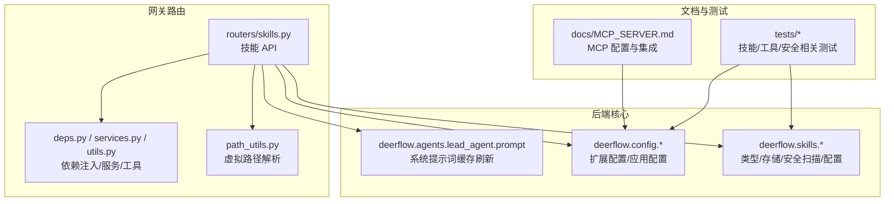
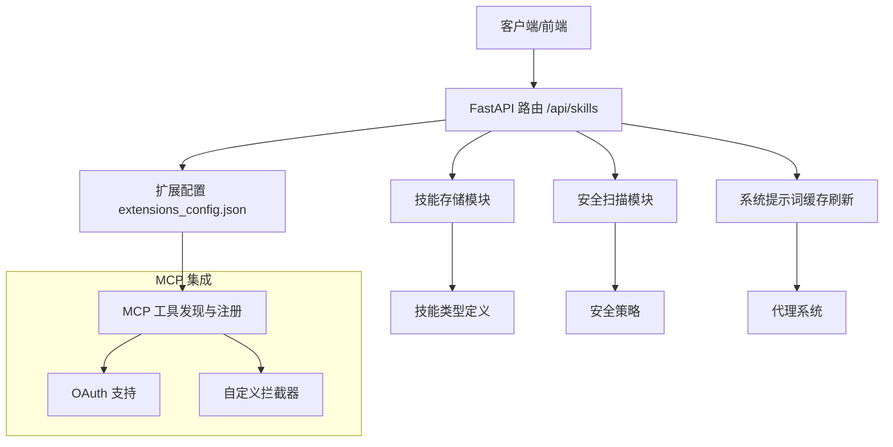
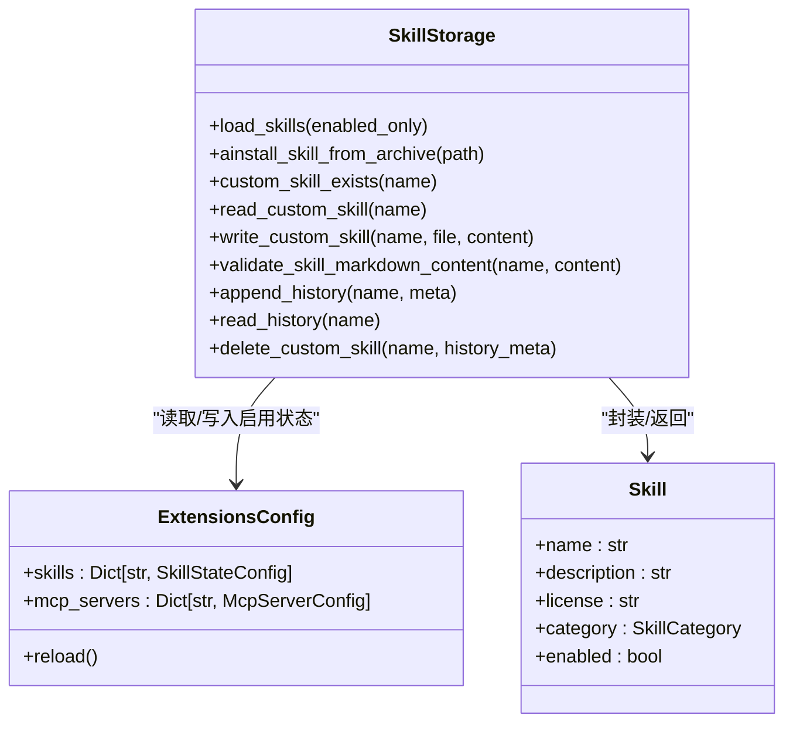
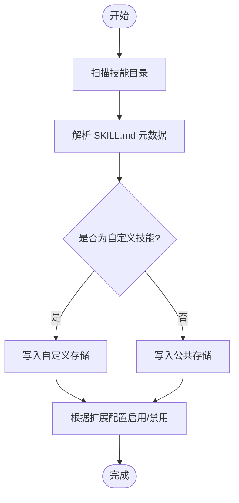
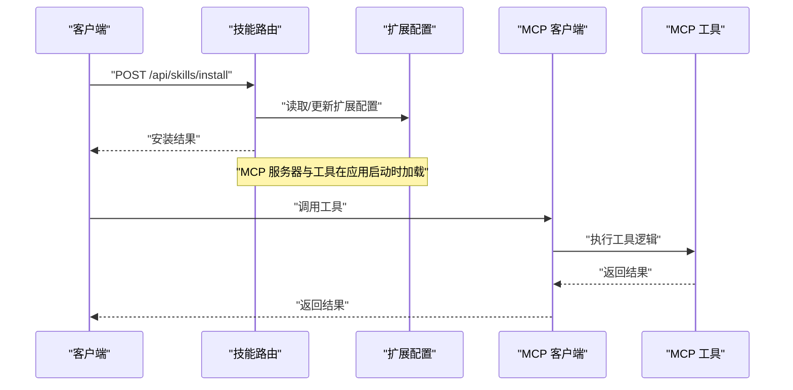
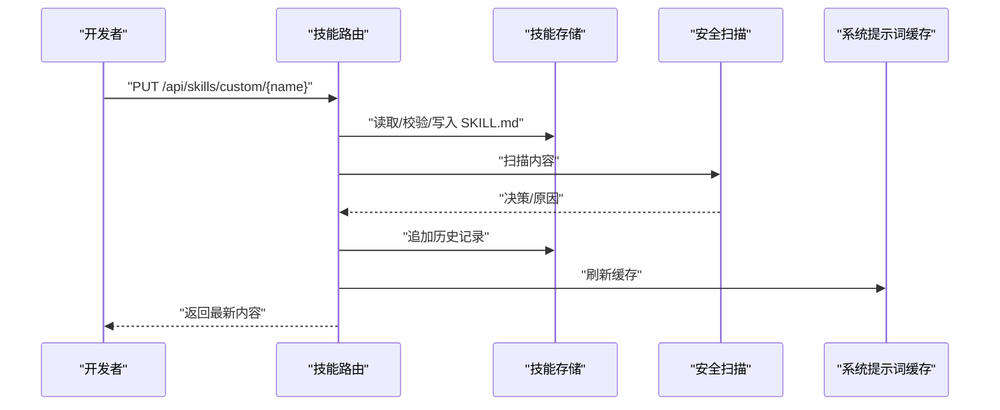
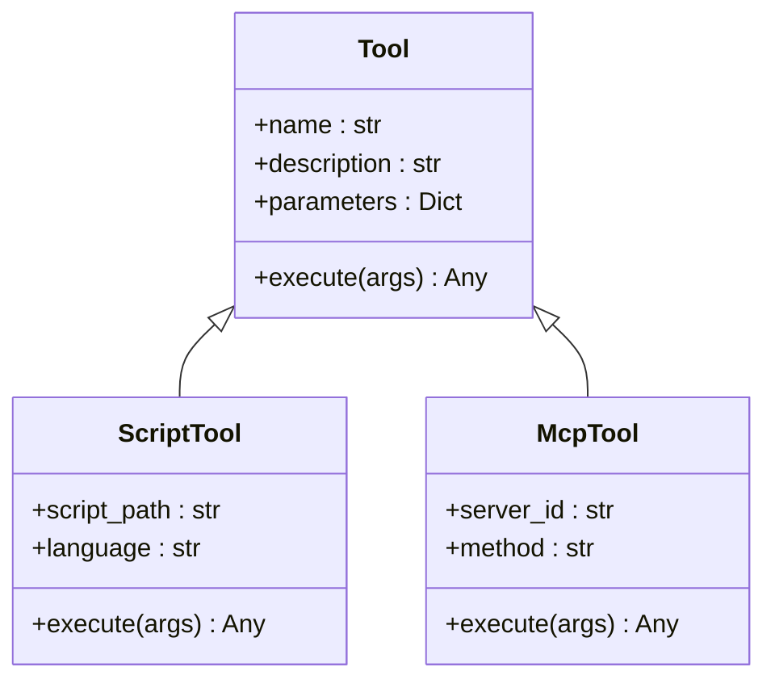
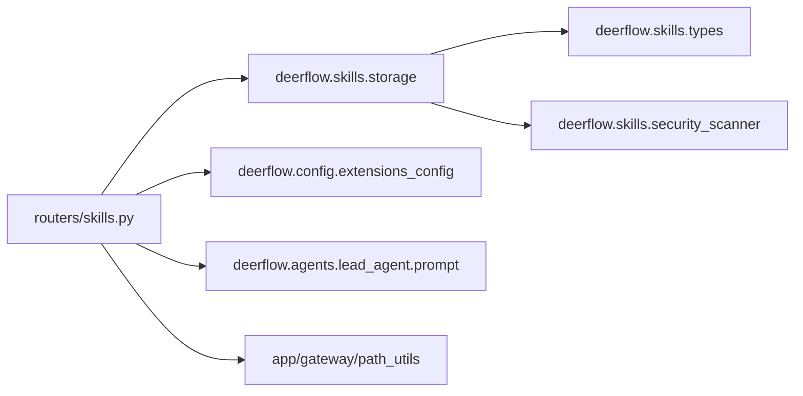

# 技能与工具系统

<cite>
**本文引用的文件**
- [backend/app/gateway/routers/skills.py](file://backend/app/gateway/routers/skills.py)
- [backend/docs/MCP_SERVER.md](file://backend/docs/MCP_SERVER.md)
- [backend/docs/AUTH_TEST_PLAN.md](file://backend/docs/AUTH_TEST_PLAN.md)
- [backend/deerflow/skills/__init__.py](file://backend/deerflow/skills/__init__.py)
- [backend/deerflow/skills/storage.py](file://backend/deerflow/skills/storage.py)
- [backend/deerflow/skills/types.py](file://backend/deerflow/skills/types.py)
- [backend/deerflow/skills/security_scanner.py](file://backend/deerflow/skills/security_scanner.py)
- [backend/deerflow/config/extensions_config.py](file://backend/deerflow/config/extensions_config.py)
- [backend/deerflow/config/app_config.py](file://backend/deerflow/config/app_config.py)
- [backend/deerflow/agents/lead_agent/prompt.py](file://backend/deerflow/agents/lead_agent/prompt.py)
- [backend/app/gateway/path_utils.py](file://backend/app/gateway/path_utils.py)
- [backend/app/gateway/deps.py](file://backend/app/gateway/deps.py)
- [backend/app/gateway/services.py](file://backend/app/gateway/services.py)
- [backend/app/gateway/utils.py](file://backend/app/gateway/utils.py)
- [backend/packages/harness/deerflow/skills/__init__.py](file://backend/packages/harness/deerflow/skills/__init__.py)
- [backend/packages/harness/deerflow/skills/storage.py](file://backend/packages/harness/deerflow/skills/storage.py)
- [backend/packages/harness/deerflow/skills/types.py](file://backend/packages/harness/deerflow/skills/types.py)
- [backend/packages/harness/deerflow/skills/security_scanner.py](file://backend/packages/harness/deerflow/skills/security_scanner.py)
- [backend/packages/harness/deerflow/config/extensions_config.py](file://backend/packages/harness/deerflow/config/extensions_config.py)
- [backend/packages/harness/deerflow/config/app_config.py](file://backend/packages/harness/deerflow/config/app_config.py)
- [backend/packages/harness/deerflow/agents/lead_agent/prompt.py](file://backend/packages/harness/deerflow/agents/lead_agent/prompt.py)
- [backend/packages/harness/deerflow/utils/oss_upload.py](file://backend/packages/harness/deerflow/utils/oss_upload.py)
- [backend/tests/test_skills_loader.py](file://backend/tests/test_skills_loader.py)
- [backend/tests/test_skills_parser.py](file://backend/tests/test_skills_parser.py)
- [backend/tests/test_skills_validation.py](file://backend/tests/test_skills_validation.py)
- [backend/tests/test_skills_installer.py](file://backend/tests/test_skills_installer.py)
- [backend/tests/test_skills_archive_root.py](file://backend/tests/test_skills_archive_root.py)
- [backend/tests/test_skills_custom_router.py](file://backend/tests/test_skills_custom_router.py)
- [backend/tests/test_skill_manage_tool.py](file://backend/tests/test_skill_manage_tool.py)
- [backend/tests/test_mcp_client_config.py](file://backend/tests/test_mcp_client_config.py)
- [backend/tests/test_mcp_oauth.py](file://backend/tests/test_mcp_oauth.py)
- [backend/tests/test_mcp_custom_interceptors.py](file://backend/tests/test_mcp_custom_interceptors.py)
- [backend/tests/test_mcp_sync_wrapper.py](file://backend/tests/test_mcp_sync_wrapper.py)
- [backend/tests/test_tool_error_handling_middleware.py](file://backend/tests/test_tool_error_handling_middleware.py)
- [backend/tests/test_tool_output_truncation.py](file://backend/tests/test_tool_output_truncation.py)
- [backend/tests/test_tool_search.py](file://backend/tests/test_tool_search.py)
- [backend/tests/test_tool_deduplication.py](file://backend/tests/test_tool_deduplication.py)
- [backend/tests/test_tool_args_schema_no_pydantic_warning.py](file://backend/tests/test_tool_args_schema_no_pydantic_warning.py)
- [backend/tests/test_local_sandbox_provider_mounts.py](file://backend/tests/test_local_sandbox_provider_mounts.py)
- [backend/tests/test_local_sandbox_encoding.py](file://backend/tests/test_local_sandbox_encoding.py)
- [backend/tests/test_local_bash_tool_loading.py](file://backend/tests/test_local_bash_tool_loading.py)
- [backend/tests/test_sandbox_tools_security.py](file://backend/tests/test_sandbox_tools_security.py)
- [backend/tests/test_sandbox_audit_middleware.py](file://backend/tests/test_sandbox_audit_middleware.py)
- [backend/tests/test_sandbox_orphan_reconciliation.py](file://backend/tests/test_sandbox_orphan_reconciliation.py)
- [backend/tests/test_sandbox_orphan_reconciliation_e2e.py](file://backend/tests/test_sandbox_orphan_reconciliation_e2e.py)
- [backend/tests/test_sandbox_search_tools.py](file://backend/tests/test_sandbox_search_tools.py)
- [backend/tests/test_security_scanner.py](file://backend/tests/test_security_scanner.py)
- [backend/tests/test_doctor.py](file://backend/tests/test_doctor.py)
- [backend/tests/test_check_script.py](file://backend/tests/test_check_script.py)
- [backend/tests/test_checkpointer.py](file://backend/tests/test_checkpointer.py)
- [backend/tests/test_checkpointer_none_fix.py](file://backend/tests/test_checkpointer_none_fix.py)
- [backend/tests/test_client.py](file://backend/tests/test_client.py)
- [backend/tests/test_client_e2e.py](file://backend/tests/test_client_e2e.py)
- [backend/tests/test_client_live.py](file://backend/tests/test_client_live.py)
- [backend/tests/test_client_message_serialization.py](file://backend/tests/test_client_message_serialization.py)
- [backend/tests/test_config_version.py](file://backend/tests/test_config_version.py)
- [backend/tests/test_converters.py](file://backend/tests/test_converters.py)
- [backend/tests/test_create_deerflow_agent.py](file://backend/tests/test_create_deerflow_agent.py)
- [backend/tests/test_create_deerflow_agent_live.py](file://backend/tests/test_create_deerflow_agent_live.py)
- [backend/tests/test_credential_loader.py](file://backend/tests/test_credential_loader.py)
- [backend/tests/test_csrf_middleware.py](file://backend/tests/test_csrf_middleware.py)
- [backend/tests/test_custom_agent.py](file://backend/tests/test_custom_agent.py)
- [backend/tests/test_dangling_tool_call_middleware.py](file://backend/tests/test_dangling_tool_call_middleware.py)
- [backend/tests/test_detect_uv_extras.py](file://backend/tests/test_detect_uv_extras.py)
- [backend/tests/test_dev_entrypoint.py](file://backend/tests/test_dev_entrypoint.py)
- [backend/tests/test_doctor.py](file://backend/tests/test_doctor.py)
- [backend/tests/test_dynamic_context_middleware.py](file://backend/tests/test_dynamic_context_middleware.py)
- [backend/tests/test_ensure_admin.py](file://backend/tests/test_ensure_admin.py)
- [backend/tests/test_exa_tools.py](file://backend/tests/test_exa_tools.py)
- [backend/tests/test_feedback.py](file://backend/tests/test_feedback.py)
- [backend/tests/test_feishu_parser.py](file://backend/tests/test_feishu_parser.py)
- [backend/tests/test_file_conversion.py](file://backend/tests/test_file_conversion.py)
- [backend/tests/test_firecrawl_tools.py](file://backend/tests/test_firecrawl_tools.py)
- [backend/tests/test_gateway_deps_config.py](file://backend/tests/test_gateway_deps_config.py)
- [backend/tests/test_gateway_docs_toggle.py](file://backend/tests/test_gateway_docs_toggle.py)
- [backend/tests/test_gateway_lifespan_shutdown.py](file://backend/tests/test_gateway_lifespan_shutdown.py)
- [backend/tests/test_gateway_runtime_cleanup.py](file://backend/tests/test_gateway_runtime_cleanup.py)
- [backend/tests/test_gateway_services.py](file://backend/tests/test_gateway_services.py)
- [backend/tests/test_guardrail_middleware.py](file://backend/tests/test_guardrail_middleware.py)
- [backend/tests/test_harness_boundary.py](file://backend/tests/test_harness_boundary.py)
- [backend/tests/test_infoquest_client.py](file://backend/tests/test_infoquest_client.py)
- [backend/tests/test_initialize_admin.py](file://backend/tests/test_initialize_admin.py)
- [backend/tests/test_invoke_acp_agent_tool.py](file://backend/tests/test_invoke_acp_agent_tool.py)
- [backend/tests/test_jina_client.py](file://backend/tests/test_jina_client.py)
- [backend/tests/test_langgraph_auth.py](file://backend/tests/test_langgraph_auth.py)
- [backend/tests/test_lead_agent_model_resolution.py](file://backend/tests/test_lead_agent_model_resolution.py)
- [backend/tests/test_lead_agent_prompt.py](file://backend/tests/test_lead_agent_prompt.py)
- [backend/tests/test_lead_agent_skills.py](file://backend/tests/test_lead_agent_skills.py)
- [backend/tests/test_llm_error_handling_middleware.py](file://backend/tests/test_llm_error_handling_middleware.py)
- [backend/tests/test_local_bash_tool_loading.py](file://backend/tests/test_local_bash_tool_loading.py)
- [backend/tests/test_local_sandbox_encoding.py](file://backend/tests/test_local_sandbox_encoding.py)
- [backend/tests/test_local_sandbox_provider_mounts.py](file://backend/tests/test_local_sandbox_provider_mounts.py)
- [backend/tests/test_local_skill_storage_write.py](file://backend/tests/test_local_skill_storage_write.py)
- [backend/tests/test_logging_level_from_config.py](file://backend/tests/test_logging_level_from_config.py)
- [backend/tests/test_loop_detection_config.py](file://backend/tests/test_loop_detection_config.py)
- [backend/tests/test_loop_detection_middleware.py](file://backend/tests/test_loop_detection_middleware.py)
- [backend/tests/test_mcp_client_config.py](file://backend/tests/test_mcp_client_config.py)
- [backend/tests/test_mcp_oauth.py](file://backend/tests/test_mcp_oauth.py)
- [backend/tests/test_mcp_custom_interceptors.py](file://backend/tests/test_mcp_custom_interceptors.py)
- [backend/tests/test_mcp_sync_wrapper.py](file://backend/tests/test_mcp_sync_wrapper.py)
- [backend/tests/test_memory_prompt_injection.py](file://backend/tests/test_memory_prompt_injection.py)
- [backend/tests/test_memory_queue.py](file://backend/tests/test_memory_queue.py)
- [backend/tests/test_memory_queue_user_isolation.py](file://backend/tests/test_memory_queue_user_isolation.py)
- [backend/tests/test_memory_router.py](file://backend/tests/test_memory_router.py)
- [backend/tests/test_memory_storage.py](file://backend/tests/test_memory_storage.py)
- [backend/tests/test_memory_storage_user_isolation.py](file://backend/tests/test_memory_storage_user_isolation.py)
- [backend/tests/test_memory_thread_meta_isolation.py](file://backend/tests/test_memory_thread_meta_isolation.py)
- [backend/tests/test_memory_updater.py](file://backend/tests/test_memory_updater.py)
- [backend/tests/test_memory_updater_user_isolation.py](file://backend/tests/test_memory_updater_user_isolation.py)
- [backend/tests/test_memory_upload_filtering.py](file://backend/tests/test_memory_upload_filtering.py)
- [backend/tests/test_migration_user_isolation.py](file://backend/tests/test_migration_user_isolation.py)
- [backend/tests/test_model_config.py](file://backend/tests/test_model_config.py)
- [backend/tests/test_model_factory.py](file://backend/tests/test_model_factory.py)
- [backend/tests/test_owner_isolation.py](file://backend/tests/test_owner_isolation.py)
- [backend/tests/test_patched_deepseek.py](file://backend/tests/test_patched_deepseek.py)
- [backend/tests/test_patched_minimax.py](file://backend/tests/test_patched_minimax.py)
- [backend/tests/test_patched_openai.py](file://backend/tests/test_patched_openai.py)
- [backend/tests/test_paths_user_isolation.py](file://backend/tests/test_paths_user_isolation.py)
- [backend/tests/test_persistence_scaffold.py](file://backend/tests/test_persistence_scaffold.py)
- [backend/tests/test_present_file_tool_core_logic.py](file://backend/tests/test_present_file_tool_core_logic.py)
- [backend/tests/test_provisioner_kubeconfig.py](file://backend/tests/test_provisioner_kubeconfig.py)
- [backend/tests/test_provisioner_pvc_volumes.py](file://backend/tests/test_provisioner_pvc_volumes.py)
- [backend/tests/test_readability.py](file://backend/tests/test_readability.py)
- [backend/tests/test_reflection_resolvers.py](file://backend/tests/test_reflection_resolvers.py)
- [backend/tests/test_remote_sandbox_backend.py](file://backend/tests/test_remote_sandbox_backend.py)
- [backend/tests/test_run_event_store.py](file://backend/tests/test_run_event_store.py)
- [backend/tests/test_run_event_store_pagination.py](file://backend/tests/test_run_event_store_pagination.py)
- [backend/tests/test_run_journal.py](file://backend/tests/test_run_journal.py)
- [backend/tests/test_run_manager.py](file://backend/tests/test_run_manager.py)
- [backend/tests/test_run_repository.py](file://backend/tests/test_run_repository.py)
- [backend/tests/test_run_worker_rollback.py](file://backend/tests/test_run_worker_rollback.py)
- [backend/tests/test_runs_api_endpoints.py](file://backend/tests/test_runs_api_endpoints.py)
- [backend/tests/test_runtime_paths.py](file://backend/tests/test_runtime_paths.py)
- [backend/tests/test_sandbox_audit_middleware.py](file://backend/tests/test_sandbox_audit_middleware.py)
- [backend/tests/test_sandbox_orphan_reconciliation.py](file://backend/tests/test_sandbox_orphan_reconciliation.py)
- [backend/tests/test_sandbox_orphan_reconciliation_e2e.py](file://backend/tests/test_sandbox_orphan_reconciliation_e2e.py)
- [backend/tests/test_sandbox_search_tools.py](file://backend/tests/test_sandbox_search_tools.py)
- [backend/tests/test_sandbox_tools_security.py](file://backend/tests/test_sandbox_tools_security.py)
- [backend/tests/test_security_scanner.py](file://backend/tests/test_security_scanner.py)
- [backend/tests/test_serialization.py](file://backend/tests/test_serialization.py)
- [backend/tests/test_serialize_message_content.py](file://backend/tests/test_serialize_message_content.py)
- [backend/tests/test_serper_tools.py](file://backend/tests/test_serper_tools.py)
- [backend/tests/test_setup_agent_tool.py](file://backend/tests/test_setup_agent_tool.py)
- [backend/tests/test_setup_wizard.py](file://backend/tests/test_setup_wizard.py)
- [backend/tests/test_skill_manage_tool.py](file://backend/tests/test_skill_manage_tool.py)
- [backend/tests/test_skills_archive_root.py](file://backend/tests/test_skills_archive_root.py)
- [backend/tests/test_skills_bundled.py](file://backend/tests/test_skills_bundled.py)
- [backend/tests/test_skills_custom_router.py](file://backend/tests/test_skills_custom_router.py)
- [backend/tests/test_skills_installer.py](file://backend/tests/test_skills_installer.py)
- [backend/tests/test_skills_loader.py](file://backend/tests/test_skills_loader.py)
- [backend/tests/test_skills_parser.py](file://backend/tests/test_skills_parser.py)
- [backend/tests/test_skills_validation.py](file://backend/tests/test_skills_validation.py)
- [backend/tests/test_sse_format.py](file://backend/tests/test_sse_format.py)
- [backend/tests/test_stream_bridge.py](file://backend/tests/test_stream_bridge.py)
- [backend/tests/test_subagent_executor.py](file://backend/tests/test_subagent_executor.py)
- [backend/tests/test_subagent_limit_middleware.py](file://backend/tests/test_subagent_limit_middleware.py)
- [backend/tests/test_subagent_prompt_security.py](file://backend/tests/test_subagent_prompt_security.py)
- [backend/tests/test_subagent_skills_config.py](file://backend/tests/test_subagent_skills_config.py)
- [backend/tests/test_subagent_timeout_config.py](file://backend/tests/test_subagent_timeout_config.py)
- [backend/tests/test_subagent_token_collector.py](file://backend/tests/test_subagent_token_collector.py)
- [backend/tests/test_suggestions_router.py](file://backend/tests/test_suggestions_router.py)
- [backend/tests/test_summarization_middleware.py](file://backend/tests/test_summarization_middleware.py)
- [backend/tests/test_task_tool_core_logic.py](file://backend/tests/test_task_tool_core_logic.py)
- [backend/tests/test_thread_data_middleware.py](file://backend/tests/test_thread_data_middleware.py)
- [backend/tests/test_thread_meta_repo.py](file://backend/tests/test_thread_meta_repo.py)
- [backend/tests/test_thread_run_messages_pagination.py](file://backend/tests/test_thread_run_messages_pagination.py)
- [backend/tests/test_thread_token_usage.py](file://backend/tests/test_thread_token_usage.py)
- [backend/tests/test_threads_router.py](file://backend/tests/test_threads_router.py)
- [backend/tests/test_title_generation.py](file://backend/tests/test_title_generation.py)
- [backend/tests/test_title_middleware_core_logic.py](file://backend/tests/test_title_middleware_core_logic.py)
- [backend/tests/test_todo_middleware.py](file://backend/tests/test_todo_middleware.py)
- [backend/tests/test_token_usage.py](file://backend/tests/test_token_usage.py)
- [backend/tests/test_token_usage_config.py](file://backend/tests/test_token_usage_config.py)
- [backend/tests/test_token_usage_middleware.py](file://backend/tests/test_token_usage_middleware.py)
- [backend/tests/test_tool_args_schema_no_pydantic_warning.py](file://backend/tests/test_tool_args_schema_no_pydantic_warning.py)
- [backend/tests/test_tool_deduplication.py](file://backend/tests/test_tool_deduplication.py)
- [backend/tests/test_tool_error_handling_middleware.py](file://backend/tests/test_tool_error_handling_middleware.py)
- [backend/tests/test_tool_output_truncation.py](file://backend/tests/test_tool_output_truncation.py)
- [backend/tests/test_tool_search.py](file://backend/tests/test_tool_search.py)
- [backend/tests/test_tracing_config.py](file://backend/tests/test_tracing_config.py)
- [backend/tests/test_tracing_factory.py](file://backend/tests/test_tracing_factory.py)
- [backend/tests/test_update_agent_tool.py](file://backend/tests/test_update_agent_tool.py)
- [backend/tests/test_uploads_manager.py](file://backend/tests/test_uploads_manager.py)
- [backend/tests/test_uploads_middleware_core_logic.py](file://backend/tests/test_uploads_middleware_core_logic.py)
- [backend/tests/test_uploads_router.py](file://backend/tests/test_uploads_router.py)
- [backend/tests/test_user_context.py](file://backend/tests/test_user_context.py)
- [backend/tests/test_utils_time.py](file://backend/tests/test_utils_time.py)
- [backend/tests/test_view_image_middleware.py](file://backend/tests/test_view_image_middleware.py)
- [backend/tests/test_view_image_tool.py](file://backend/tests/test_view_image_tool.py)
- [backend/tests/test_vllm_provider.py](file://backend/tests/test_vllm_provider.py)
- [backend/tests/test_wechat_channel.py](file://backend/tests/test_wechat_channel.py)
</cite>

## 目录
1. [引言](#引言)
2. [项目结构](#项目结构)
3. [核心组件](#核心组件)
4. [架构总览](#架构总览)
5. [详细组件分析](#详细组件分析)
6. [依赖分析](#依赖分析)
7. [性能考量](#性能考量)
8. [故障排查指南](#故障排查指南)
9. [结论](#结论)
10. [附录](#附录)

## 引言
本文件面向 DeerFlow 的技能与工具系统，提供从架构设计、SKILL.md 标准格式与技能发现机制，到工具分类、内置工具详解、MCP 工具集成与自定义工具开发的全景技术文档。文档同时覆盖技能的安装、配置、调试与性能优化，并给出技能开发与工具扩展的实践指南，包括工具注册、参数校验、错误处理与安全考虑，以及技能与工具之间的协作关系与最佳实践。

## 项目结构
技能与工具系统主要分布在后端包 deerflow 与 FastAPI 路由层中，配合前端与测试用例形成完整的闭环。关键目录与职责如下：
- 后端核心实现位于 backend/deerflow 下，包含技能与工具的类型定义、存储、安全扫描与配置管理等模块。
- FastAPI 路由层位于 backend/app/gateway/routers/skills.py，提供技能的安装、启用/禁用、自定义技能编辑与历史回滚等接口。
- MCP 工具集成与配置说明位于 backend/docs/MCP_SERVER.md，涵盖 OAuth、拦截器与能力边界。
- 安全扫描与工具安全相关测试位于 backend/tests 下，确保工具与技能的安全性与稳定性。

**图表来源**
- [backend/app/gateway/routers/skills.py](file://backend/app/gateway/routers/skills.py)
- [backend/deerflow/skills/__init__.py](file://backend/deerflow/skills/__init__.py)
- [backend/deerflow/config/extensions_config.py](file://backend/deerflow/config/extensions_config.py)
- [backend/deerflow/agents/lead_agent/prompt.py](file://backend/deerflow/agents/lead_agent/prompt.py)
- [backend/app/gateway/path_utils.py](file://backend/app/gateway/path_utils.py)
- [backend/app/gateway/deps.py](file://backend/app/gateway/deps.py)
- [backend/app/gateway/services.py](file://backend/app/gateway/services.py)
- [backend/app/gateway/utils.py](file://backend/app/gateway/utils.py)
- [backend/docs/MCP_SERVER.md](file://backend/docs/MCP_SERVER.md)
- [backend/tests/test_skills_loader.py](file://backend/tests/test_skills_loader.py)

**章节来源**
- [backend/app/gateway/routers/skills.py](file://backend/app/gateway/routers/skills.py)
- [backend/docs/MCP_SERVER.md](file://backend/docs/MCP_SERVER.md)

## 核心组件
- 技能存储与发现：通过技能存储模块加载公共与自定义技能，支持启用/禁用状态管理与历史记录。
- SKILL.md 标准格式：技能元数据与行为规范，用于描述技能用途、参数、输出与安全要求。
- MCP 工具集成：通过扩展配置加载外部 MCP 服务器与工具，支持 OAuth 与拦截器。
- 安全扫描：对自定义技能内容进行安全扫描，阻断高风险内容。
- 系统提示词缓存：技能变更后刷新系统提示词缓存，确保代理上下文一致性。

**章节来源**
- [backend/app/gateway/routers/skills.py](file://backend/app/gateway/routers/skills.py)
- [backend/deerflow/skills/storage.py](file://backend/deerflow/skills/storage.py)
- [backend/deerflow/skills/security_scanner.py](file://backend/deerflow/skills/security_scanner.py)
- [backend/deerflow/agents/lead_agent/prompt.py](file://backend/deerflow/agents/lead_agent/prompt.py)

## 架构总览
技能与工具系统采用“配置驱动 + 路由 API + 存储与安全”的分层架构。技能通过扩展配置启用/禁用，MCP 工具通过配置自动发现并注入代理工具集；自定义技能通过路由 API 进行安装、编辑与回滚，并触发系统提示词缓存刷新。

**图表来源**
- [backend/app/gateway/routers/skills.py](file://backend/app/gateway/routers/skills.py)
- [backend/deerflow/config/extensions_config.py](file://backend/deerflow/config/extensions_config.py)
- [backend/deerflow/skills/storage.py](file://backend/deerflow/skills/storage.py)
- [backend/deerflow/skills/security_scanner.py](file://backend/deerflow/skills/security_scanner.py)
- [backend/deerflow/agents/lead_agent/prompt.py](file://backend/deerflow/agents/lead_agent/prompt.py)
- [backend/docs/MCP_SERVER.md](file://backend/docs/MCP_SERVER.md)

## 详细组件分析

### 技能存储与发现
- 加载策略：公共与自定义技能统一由存储模块加载，支持按启用状态过滤。
- 启用/禁用：通过扩展配置文件维护技能启用状态，写回 JSON 并重载配置。
- 历史与回滚：自定义技能支持历史记录与回滚，回滚前进行安全扫描。
- 安全扫描：对编辑与回滚内容进行安全扫描，阻断高风险内容。

**图表来源**
- [backend/deerflow/skills/storage.py](file://backend/deerflow/skills/storage.py)
- [backend/deerflow/skills/types.py](file://backend/deerflow/skills/types.py)
- [backend/deerflow/config/extensions_config.py](file://backend/deerflow/config/extensions_config.py)

**章节来源**
- [backend/deerflow/skills/storage.py](file://backend/deerflow/skills/storage.py)
- [backend/deerflow/skills/types.py](file://backend/deerflow/skills/types.py)
- [backend/deerflow/config/extensions_config.py](file://backend/deerflow/config/extensions_config.py)

### SKILL.md 标准格式与技能发现机制
- 标准格式：技能元数据与行为规范，用于描述技能用途、参数、输出与安全要求。
- 发现机制：公共与自定义技能目录中的 SKILL.md 文件作为技能元数据来源，结合存储模块进行解析与加载。
- 类别区分：公共技能与自定义技能通过类别字段区分，便于路由层进行筛选与管理。

**图表来源**
- [backend/deerflow/skills/storage.py](file://backend/deerflow/skills/storage.py)
- [backend/deerflow/skills/types.py](file://backend/deerflow/skills/types.py)

**章节来源**
- [backend/deerflow/skills/storage.py](file://backend/deerflow/skills/storage.py)
- [backend/deerflow/skills/types.py](file://backend/deerflow/skills/types.py)

### MCP 工具集成与自定义工具开发
- 配置方式：通过扩展配置文件声明 MCP 服务器与工具，支持 HTTP/SSE 与 OAuth。
- 拦截器：支持注册自定义拦截器，在每次工具调用前注入请求头或执行日志/指标。
- 能力边界：MCP 服务器可暴露文件系统、数据库、外部 API、浏览器自动化等能力。

**图表来源**
- [backend/app/gateway/routers/skills.py](file://backend/app/gateway/routers/skills.py)
- [backend/docs/MCP_SERVER.md](file://backend/docs/MCP_SERVER.md)

**章节来源**
- [backend/docs/MCP_SERVER.md](file://backend/docs/MCP_SERVER.md)

### 自定义技能开发与管理
- 安装：通过路由 API 从线程的用户数据目录中安装 .skill 归档文件。
- 编辑：支持在线编辑 SKILL.md，进行安全扫描与历史记录。
- 回滚：支持基于历史记录的回滚，回滚前进行安全扫描。
- 删除：支持删除自定义技能及其历史记录。

**图表来源**
- [backend/app/gateway/routers/skills.py](file://backend/app/gateway/routers/skills.py)
- [backend/deerflow/skills/security_scanner.py](file://backend/deerflow/skills/security_scanner.py)
- [backend/deerflow/agents/lead_agent/prompt.py](file://backend/deerflow/agents/lead_agent/prompt.py)

**章节来源**
- [backend/app/gateway/routers/skills.py](file://backend/app/gateway/routers/skills.py)
- [backend/deerflow/skills/security_scanner.py](file://backend/deerflow/skills/security_scanner.py)
- [backend/deerflow/agents/lead_agent/prompt.py](file://backend/deerflow/agents/lead_agent/prompt.py)

### 工具系统分类与内置工具详解
- 分类维度：按来源分为公共内置工具与自定义工具；按能力分为文件/脚本工具、数据处理工具、可视化工具、生成类工具等。
- 公共内置工具示例：文本提取、数据分析、图表生成、图像生成、播客生成、PPT 生成、视频生成、知识搜索、深度研究、Bootstrap 引导等。
- 工具注册：通过扩展配置与 MCP 集成自动注册；本地脚本工具通过特定脚本语言与参数约定进行注册。

**图表来源**
- [backend/deerflow/skills/types.py](file://backend/deerflow/skills/types.py)

**章节来源**
- [backend/deerflow/skills/types.py](file://backend/deerflow/skills/types.py)

## 依赖分析
- 路由层依赖：技能路由依赖配置模块、路径解析模块、存储模块与安全扫描模块。
- 配置模块：扩展配置模块负责 MCP 服务器与技能启用状态的读取与写入。
- 存储模块：统一管理公共与自定义技能，提供安装、读写、校验与历史记录能力。
- 安全扫描模块：对自定义技能内容进行安全扫描，阻断高风险内容。
- 代理系统：技能变更后刷新系统提示词缓存，确保代理上下文一致性。

**图表来源**
- [backend/app/gateway/routers/skills.py](file://backend/app/gateway/routers/skills.py)
- [backend/deerflow/skills/storage.py](file://backend/deerflow/skills/storage.py)
- [backend/deerflow/skills/types.py](file://backend/deerflow/skills/types.py)
- [backend/deerflow/skills/security_scanner.py](file://backend/deerflow/skills/security_scanner.py)
- [backend/deerflow/config/extensions_config.py](file://backend/deerflow/config/extensions_config.py)
- [backend/deerflow/agents/lead_agent/prompt.py](file://backend/deerflow/agents/lead_agent/prompt.py)
- [backend/app/gateway/path_utils.py](file://backend/app/gateway/path_utils.py)

**章节来源**
- [backend/app/gateway/routers/skills.py](file://backend/app/gateway/routers/skills.py)
- [backend/deerflow/skills/storage.py](file://backend/deerflow/skills/storage.py)
- [backend/deerflow/skills/types.py](file://backend/deerflow/skills/types.py)
- [backend/deerflow/skills/security_scanner.py](file://backend/deerflow/skills/security_scanner.py)
- [backend/deerflow/config/extensions_config.py](file://backend/deerflow/config/extensions_config.py)
- [backend/deerflow/agents/lead_agent/prompt.py](file://backend/deerflow/agents/lead_agent/prompt.py)
- [backend/app/gateway/path_utils.py](file://backend/app/gateway/path_utils.py)

## 性能考量
- 缓存与刷新：技能启用/禁用与自定义技能编辑后刷新系统提示词缓存，避免频繁重建代理上下文。
- I/O 优化：技能归档安装与自定义技能文件读写采用异步与缓存策略，减少磁盘 I/O 压力。
- 安全扫描：对高风险内容进行阻断，避免恶意脚本执行带来的性能与安全风险。
- MCP 工具：合理设置 MCP 服务器超时与重试策略，避免工具调用成为性能瓶颈。

[本节为通用指导，无需具体文件引用]

## 故障排查指南
- 技能安装失败：检查 .skill 归档完整性与目标路径权限；查看路由层异常日志与 HTTP 状态码。
- 自定义技能编辑失败：检查 SKILL.md 格式与参数合法性；确认安全扫描未阻断。
- 启用/禁用失败：检查扩展配置文件写入权限与 JSON 格式；确认配置重载成功。
- MCP 工具调用失败：检查 MCP 服务器可达性、OAuth 配置与拦截器返回值；查看工具调用链路日志。
- 权限与隔离：确认用户隔离与 CSRF 防护生效；检查会话状态与令牌版本。

**章节来源**
- [backend/app/gateway/routers/skills.py](file://backend/app/gateway/routers/skills.py)
- [backend/tests/test_skills_installer.py](file://backend/tests/test_skills_installer.py)
- [backend/tests/test_skills_validation.py](file://backend/tests/test_skills_validation.py)
- [backend/tests/test_mcp_client_config.py](file://backend/tests/test_mcp_client_config.py)
- [backend/tests/test_mcp_oauth.py](file://backend/tests/test_mcp_oauth.py)
- [backend/tests/test_mcp_custom_interceptors.py](file://backend/tests/test_mcp_custom_interceptors.py)
- [backend/tests/test_tool_error_handling_middleware.py](file://backend/tests/test_tool_error_handling_middleware.py)
- [backend/tests/test_tool_output_truncation.py](file://backend/tests/test_tool_output_truncation.py)
- [backend/tests/test_tool_search.py](file://backend/tests/test_tool_search.py)
- [backend/tests/test_tool_deduplication.py](file://backend/tests/test_tool_deduplication.py)
- [backend/tests/test_tool_args_schema_no_pydantic_warning.py](file://backend/tests/test_tool_args_schema_no_pydantic_warning.py)
- [backend/tests/test_local_sandbox_provider_mounts.py](file://backend/tests/test_local_sandbox_provider_mounts.py)
- [backend/tests/test_local_sandbox_encoding.py](file://backend/tests/test_local_sandbox_encoding.py)
- [backend/tests/test_local_bash_tool_loading.py](file://backend/tests/test_local_bash_tool_loading.py)
- [backend/tests/test_sandbox_tools_security.py](file://backend/tests/test_sandbox_tools_security.py)
- [backend/tests/test_sandbox_audit_middleware.py](file://backend/tests/test_sandbox_audit_middleware.py)
- [backend/tests/test_sandbox_orphan_reconciliation.py](file://backend/tests/test_sandbox_orphan_reconciliation.py)
- [backend/tests/test_sandbox_orphan_reconciliation_e2e.py](file://backend/tests/test_sandbox_orphan_reconciliation_e2e.py)
- [backend/tests/test_sandbox_search_tools.py](file://backend/tests/test_sandbox_search_tools.py)
- [backend/tests/test_security_scanner.py](file://backend/tests/test_security_scanner.py)
- [backend/tests/test_doctor.py](file://backend/tests/test_doctor.py)
- [backend/tests/test_check_script.py](file://backend/tests/test_check_script.py)
- [backend/tests/test_checkpointer.py](file://backend/tests/test_checkpointer.py)
- [backend/tests/test_checkpointer_none_fix.py](file://backend/tests/test_checkpointer_none_fix.py)
- [backend/tests/test_client.py](file://backend/tests/test_client.py)
- [backend/tests/test_client_e2e.py](file://backend/tests/test_client_e2e.py)
- [backend/tests/test_client_live.py](file://backend/tests/test_client_live.py)
- [backend/tests/test_client_message_serialization.py](file://backend/tests/test_client_message_serialization.py)
- [backend/tests/test_config_version.py](file://backend/tests/test_config_version.py)
- [backend/tests/test_converters.py](file://backend/tests/test_converters.py)
- [backend/tests/test_create_deerflow_agent.py](file://backend/tests/test_create_deerflow_agent.py)
- [backend/tests/test_create_deerflow_agent_live.py](file://backend/tests/test_create_deerflow_agent_live.py)
- [backend/tests/test_credential_loader.py](file://backend/tests/test_credential_loader.py)
- [backend/tests/test_csrf_middleware.py](file://backend/tests/test_csrf_middleware.py)
- [backend/tests/test_custom_agent.py](file://backend/tests/test_custom_agent.py)
- [backend/tests/test_dangling_tool_call_middleware.py](file://backend/tests/test_dangling_tool_call_middleware.py)
- [backend/tests/test_detect_uv_extras.py](file://backend/tests/test_detect_uv_extras.py)
- [backend/tests/test_dev_entrypoint.py](file://backend/tests/test_dev_entrypoint.py)
- [backend/tests/test_doctor.py](file://backend/tests/test_doctor.py)
- [backend/tests/test_dynamic_context_middleware.py](file://backend/tests/test_dynamic_context_middleware.py)
- [backend/tests/test_ensure_admin.py](file://backend/tests/test_ensure_admin.py)
- [backend/tests/test_exa_tools.py](file://backend/tests/test_exa_tools.py)
- [backend/tests/test_feedback.py](file://backend/tests/test_feedback.py)
- [backend/tests/test_feishu_parser.py](file://backend/tests/test_feishu_parser.py)
- [backend/tests/test_file_conversion.py](file://backend/tests/test_file_conversion.py)
- [backend/tests/test_firecrawl_tools.py](file://backend/tests/test_firecrawl_tools.py)
- [backend/tests/test_gateway_deps_config.py](file://backend/tests/test_gateway_deps_config.py)
- [backend/tests/test_gateway_docs_toggle.py](file://backend/tests/test_gateway_docs_toggle.py)
- [backend/tests/test_gateway_lifespan_shutdown.py](file://backend/tests/test_gateway_lifespan_shutdown.py)
- [backend/tests/test_gateway_runtime_cleanup.py](file://backend/tests/test_gateway_runtime_cleanup.py)
- [backend/tests/test_gateway_services.py](file://backend/tests/test_gateway_services.py)
- [backend/tests/test_guardrail_middleware.py](file://backend/tests/test_guardrail_middleware.py)
- [backend/tests/test_harness_boundary.py](file://backend/tests/test_harness_boundary.py)
- [backend/tests/test_infoquest_client.py](file://backend/tests/test_infoquest_client.py)
- [backend/tests/test_initialize_admin.py](file://backend/tests/test_initialize_admin.py)
- [backend/tests/test_invoke_acp_agent_tool.py](file://backend/tests/test_invoke_acp_agent_tool.py)
- [backend/tests/test_jina_client.py](file://backend/tests/test_jina_client.py)
- [backend/tests/test_langgraph_auth.py](file://backend/tests/test_langgraph_auth.py)
- [backend/tests/test_lead_agent_model_resolution.py](file://backend/tests/test_lead_agent_model_resolution.py)
- [backend/tests/test_lead_agent_prompt.py](file://backend/tests/test_lead_agent_prompt.py)
- [backend/tests/test_lead_agent_skills.py](file://backend/tests/test_lead_agent_skills.py)
- [backend/tests/test_llm_error_handling_middleware.py](file://backend/tests/test_llm_error_handling_middleware.py)
- [backend/tests/test_local_bash_tool_loading.py](file://backend/tests/test_local_bash_tool_loading.py)
- [backend/tests/test_local_sandbox_encoding.py](file://backend/tests/test_local_sandbox_encoding.py)
- [backend/tests/test_local_sandbox_provider_mounts.py](file://backend/tests/test_local_sandbox_provider_mounts.py)
- [backend/tests/test_local_skill_storage_write.py](file://backend/tests/test_local_skill_storage_write.py)
- [backend/tests/test_logging_level_from_config.py](file://backend/tests/test_logging_level_from_config.py)
- [backend/tests/test_loop_detection_config.py](file://backend/tests/test_loop_detection_config.py)
- [backend/tests/test_loop_detection_middleware.py](file://backend/tests/test_loop_detection_middleware.py)
- [backend/tests/test_mcp_client_config.py](file://backend/tests/test_mcp_client_config.py)
- [backend/tests/test_mcp_oauth.py](file://backend/tests/test_mcp_oauth.py)
- [backend/tests/test_mcp_custom_interceptors.py](file://backend/tests/test_mcp_custom_interceptors.py)
- [backend/tests/test_mcp_sync_wrapper.py](file://backend/tests/test_mcp_sync_wrapper.py)
- [backend/tests/test_memory_prompt_injection.py](file://backend/tests/test_memory_prompt_injection.py)
- [backend/tests/test_memory_queue.py](file://backend/tests/test_memory_queue.py)
- [backend/tests/test_memory_queue_user_isolation.py](file://backend/tests/test_memory_queue_user_isolation.py)
- [backend/tests/test_memory_router.py](file://backend/tests/test_memory_router.py)
- [backend/tests/test_memory_storage.py](file://backend/tests/test_memory_storage.py)
- [backend/tests/test_memory_storage_user_isolation.py](file://backend/tests/test_memory_storage_user_isolation.py)
- [backend/tests/test_memory_thread_meta_isolation.py](file://backend/tests/test_memory_thread_meta_isolation.py)
- [backend/tests/test_memory_updater.py](file://backend/tests/test_memory_updater.py)
- [backend/tests/test_memory_updater_user_isolation.py](file://backend/tests/test_memory_updater_user_isolation.py)
- [backend/tests/test_memory_upload_filtering.py](file://backend/tests/test_memory_upload_filtering.py)
- [backend/tests/test_migration_user_isolation.py](file://backend/tests/test_migration_user_isolation.py)
- [backend/tests/test_model_config.py](file://backend/tests/test_model_config.py)
- [backend/tests/test_model_factory.py](file://backend/tests/test_model_factory.py)
- [backend/tests/test_owner_isolation.py](file://backend/tests/test_owner_isolation.py)
- [backend/tests/test_patched_deepseek.py](file://backend/tests/test_patched_deepseek.py)
- [backend/tests/test_patched_minimax.py](file://backend/tests/test_patched_minimax.py)
- [backend/tests/test_patched_openai.py](file://backend/tests/test_patched_openai.py)
- [backend/tests/test_paths_user_isolation.py](file://backend/tests/test_paths_user_isolation.py)
- [backend/tests/test_persistence_scaffold.py](file://backend/tests/test_persistence_scaffold.py)
- [backend/tests/test_present_file_tool_core_logic.py](file://backend/tests/test_present_file_tool_core_logic.py)
- [backend/tests/test_provisioner_kubeconfig.py](file://backend/tests/test_provisioner_kubeconfig.py)
- [backend/tests/test_provisioner_pvc_volumes.py](file://backend/tests/test_provisioner_pvc_volumes.py)
- [backend/tests/test_readability.py](file://backend/tests/test_readability.py)
- [backend/tests/test_reflection_resolvers.py](file://backend/tests/test_reflection_resolvers.py)
- [backend/tests/test_remote_sandbox_backend.py](file://backend/tests/test_remote_sandbox_backend.py)
- [backend/tests/test_run_event_store.py](file://backend/tests/test_run_event_store.py)
- [backend/tests/test_run_event_store_pagination.py](file://backend/tests/test_run_event_store_pagination.py)
- [backend/tests/test_run_journal.py](file://backend/tests/test_run_journal.py)
- [backend/tests/test_run_manager.py](file://backend/tests/test_run_manager.py)
- [backend/tests/test_run_repository.py](file://backend/tests/test_run_repository.py)
- [backend/tests/test_run_worker_rollback.py](file://backend/tests/test_run_worker_rollback.py)
- [backend/tests/test_runs_api_endpoints.py](file://backend/tests/test_runs_api_endpoints.py)
- [backend/tests/test_runtime_paths.py](file://backend/tests/test_runtime_paths.py)
- [backend/tests/test_sandbox_audit_middleware.py](file://backend/tests/test_sandbox_audit_middleware.py)
- [backend/tests/test_sandbox_orphan_reconciliation.py](file://backend/tests/test_sandbox_orphan_reconciliation.py)
- [backend/tests/test_sandbox_orphan_reconciliation_e2e.py](file://backend/tests/test_sandbox_orphan_reconciliation_e2e.py)
- [backend/tests/test_sandbox_search_tools.py](file://backend/tests/test_sandbox_search_tools.py)
- [backend/tests/test_sandbox_tools_security.py](file://backend/tests/test_sandbox_tools_security.py)
- [backend/tests/test_security_scanner.py](file://backend/tests/test_security_scanner.py)
- [backend/tests/test_serialization.py](file://backend/tests/test_serialization.py)
- [backend/tests/test_serialize_message_content.py](file://backend/tests/test_serialize_message_content.py)
- [backend/tests/test_serper_tools.py](file://backend/tests/test_serper_tools.py)
- [backend/tests/test_setup_agent_tool.py](file://backend/tests/test_setup_agent_tool.py)
- [backend/tests/test_setup_wizard.py](file://backend/tests/test_setup_wizard.py)
- [backend/tests/test_skill_manage_tool.py](file://backend/tests/test_skill_manage_tool.py)
- [backend/tests/test_skills_archive_root.py](file://backend/tests/test_skills_archive_root.py)
- [backend/tests/test_skills_bundled.py](file://backend/tests/test_skills_bundled.py)
- [backend/tests/test_skills_custom_router.py](file://backend/tests/test_skills_custom_router.py)
- [backend/tests/test_skills_installer.py](file://backend/tests/test_skills_installer.py)
- [backend/tests/test_skills_loader.py](file://backend/tests/test_skills_loader.py)
- [backend/tests/test_skills_parser.py](file://backend/tests/test_skills_parser.py)
- [backend/tests/test_skills_validation.py](file://backend/tests/test_skills_validation.py)
- [backend/tests/test_sse_format.py](file://backend/tests/test_sse_format.py)
- [backend/tests/test_stream_bridge.py](file://backend/tests/test_stream_bridge.py)
- [backend/tests/test_subagent_executor.py](file://backend/tests/test_subagent_executor.py)
- [backend/tests/test_subagent_limit_middleware.py](file://backend/tests/test_subagent_limit_middleware.py)
- [backend/tests/test_subagent_prompt_security.py](file://backend/tests/test_subagent_prompt_security.py)
- [backend/tests/test_subagent_skills_config.py](file://backend/tests/test_subagent_skills_config.py)
- [backend/tests/test_subagent_timeout_config.py](file://backend/tests/test_subagent_timeout_config.py)
- [backend/tests/test_subagent_token_collector.py](file://backend/tests/test_subagent_token_collector.py)
- [backend/tests/test_suggestions_router.py](file://backend/tests/test_suggestions_router.py)
- [backend/tests/test_summarization_middleware.py](file://backend/tests/test_summarization_middleware.py)
- [backend/tests/test_task_tool_core_logic.py](file://backend/tests/test_task_tool_core_logic.py)
- [backend/tests/test_thread_data_middleware.py](file://backend/tests/test_thread_data_middleware.py)
- [backend/tests/test_thread_meta_repo.py](file://backend/tests/test_thread_meta_repo.py)
- [backend/tests/test_thread_run_messages_pagination.py](file://backend/tests/test_thread_run_messages_pagination.py)
- [backend/tests/test_thread_token_usage.py](file://backend/tests/test_thread_token_usage.py)
- [backend/tests/test_threads_router.py](file://backend/tests/test_threads_router.py)
- [backend/tests/test_title_generation.py](file://backend/tests/test_title_generation.py)
- [backend/tests/test_title_middleware_core_logic.py](file://backend/tests/test_title_middleware_core_logic.py)
- [backend/tests/test_todo_middleware.py](file://backend/tests/test_todo_middleware.py)
- [backend/tests/test_token_usage.py](file://backend/tests/test_token_usage.py)
- [backend/tests/test_token_usage_config.py](file://backend/tests/test_token_usage_config.py)
- [backend/tests/test_token_usage_middleware.py](file://backend/tests/test_token_usage_middleware.py)
- [backend/tests/test_tool_args_schema_no_pydantic_warning.py](file://backend/tests/test_tool_args_schema_no_pydantic_warning.py)
- [backend/tests/test_tool_deduplication.py](file://backend/tests/test_tool_deduplication.py)
- [backend/tests/test_tool_error_handling_middleware.py](file://backend/tests/test_tool_error_handling_middleware.py)
- [backend/tests/test_tool_output_truncation.py](file://backend/tests/test_tool_output_truncation.py)
- [backend/tests/test_tool_search.py](file://backend/tests/test_tool_search.py)
- [backend/tests/test_tracing_config.py](file://backend/tests/test_tracing_config.py)
- [backend/tests/test_tracing_factory.py](file://backend/tests/test_tracing_factory.py)
- [backend/tests/test_update_agent_tool.py](file://backend/tests/test_update_agent_tool.py)
- [backend/tests/test_uploads_manager.py](file://backend/tests/test_uploads_manager.py)
- [backend/tests/test_uploads_middleware_core_logic.py](file://backend/tests/test_uploads_middleware_core_logic.py)
- [backend/tests/test_uploads_router.py](file://backend/tests/test_uploads_router.py)
- [backend/tests/test_user_context.py](file://backend/tests/test_user_context.py)
- [backend/tests/test_utils_time.py](file://backend/tests/test_utils_time.py)
- [backend/tests/test_view_image_middleware.py](file://backend/tests/test_view_image_middleware.py)
- [backend/tests/test_view_image_tool.py](file://backend/tests/test_view_image_tool.py)
- [backend/tests/test_vllm_provider.py](file://backend/tests/test_vllm_provider.py)
- [backend/tests/test_wechat_channel.py](file://backend/tests/test_wechat_channel.py)

## 结论
DeerFlow 的技能与工具系统通过“配置驱动 + 路由 API + 存储与安全”的架构实现了灵活、可扩展且安全的能力体系。公共与自定义技能统一管理，MCP 工具无缝集成，安全扫描贯穿编辑与回滚流程，确保系统在开放生态下的稳定与可控。建议在实际部署中结合测试用例完善自动化验证，并持续优化缓存与 I/O 策略以提升性能。

[本节为总结性内容，无需具体文件引用]

## 附录
- 安装与配置：参考 MCP 配置文档与扩展配置文件，确保 MCP 服务器与工具正确加载。
- 调试与测试：利用测试用例覆盖技能加载、解析、验证、安装、自定义技能编辑与安全扫描等关键路径。
- 安全与合规：严格遵循安全扫描策略，定期审查自定义技能与工具的参数与输出，防止越权与数据泄露。

**章节来源**
- [backend/docs/MCP_SERVER.md](file://backend/docs/MCP_SERVER.md)
- [backend/tests/test_skills_loader.py](file://backend/tests/test_skills_loader.py)
- [backend/tests/test_skills_parser.py](file://backend/tests/test_skills_parser.py)
- [backend/tests/test_skills_validation.py](file://backend/tests/test_skills_validation.py)
- [backend/tests/test_skills_installer.py](file://backend/tests/test_skills_installer.py)
- [backend/tests/test_skills_archive_root.py](file://backend/tests/test_skills_archive_root.py)
- [backend/tests/test_skills_custom_router.py](file://backend/tests/test_skills_custom_router.py)
- [backend/tests/test_skill_manage_tool.py](file://backend/tests/test_skill_manage_tool.py)
- [backend/tests/test_mcp_client_config.py](file://backend/tests/test_mcp_client_config.py)
- [backend/tests/test_mcp_oauth.py](file://backend/tests/test_mcp_oauth.py)
- [backend/tests/test_mcp_custom_interceptors.py](file://backend/tests/test_mcp_custom_interceptors.py)
- [backend/tests/test_mcp_sync_wrapper.py](file://backend/tests/test_mcp_sync_wrapper.py)
- [backend/tests/test_tool_error_handling_middleware.py](file://backend/tests/test_tool_error_handling_middleware.py)
- [backend/tests/test_tool_output_truncation.py](file://backend/tests/test_tool_output_truncation.py)
- [backend/tests/test_tool_search.py](file://backend/tests/test_tool_search.py)
- [backend/tests/test_tool_deduplication.py](file://backend/tests/test_tool_deduplication.py)
- [backend/tests/test_tool_args_schema_no_pydantic_warning.py](file://backend/tests/test_tool_args_schema_no_pydantic_warning.py)
- [backend/tests/test_local_sandbox_provider_mounts.py](file://backend/tests/test_local_sandbox_provider_mounts.py)
- [backend/tests/test_local_sandbox_encoding.py](file://backend/tests/test_local_sandbox_encoding.py)
- [backend/tests/test_local_bash_tool_loading.py](file://backend/tests/test_local_bash_tool_loading.py)
- [backend/tests/test_sandbox_tools_security.py](file://backend/tests/test_sandbox_tools_security.py)
- [backend/tests/test_sandbox_audit_middleware.py](file://backend/tests/test_sandbox_audit_middleware.py)
- [backend/tests/test_sandbox_orphan_reconciliation.py](file://backend/tests/test_sandbox_orphan_reconciliation.py)
- [backend/tests/test_sandbox_orphan_reconciliation_e2e.py](file://backend/tests/test_sandbox_orphan_reconciliation_e2e.py)
- [backend/tests/test_sandbox_search_tools.py](file://backend/tests/test_sandbox_search_tools.py)
- [backend/tests/test_security_scanner.py](file://backend/tests/test_security_scanner.py)
- [backend/tests/test_doctor.py](file://backend/tests/test_doctor.py)
- [backend/tests/test_check_script.py](file://backend/tests/test_check_script.py)
- [backend/tests/test_checkpointer.py](file://backend/tests/test_checkpointer.py)
- [backend/tests/test_checkpointer_none_fix.py](file://backend/tests/test_checkpointer_none_fix.py)
- [backend/tests/test_client.py](file://backend/tests/test_client.py)
- [backend/tests/test_client_e2e.py](file://backend/tests/test_client_e2e.py)
- [backend/tests/test_client_live.py](file://backend/tests/test_client_live.py)
- [backend/tests/test_client_message_serialization.py](file://backend/tests/test_client_message_serialization.py)
- [backend/tests/test_config_version.py](file://backend/tests/test_config_version.py)
- [backend/tests/test_converters.py](file://backend/tests/test_converters.py)
- [backend/tests/test_create_deerflow_agent.py](file://backend/tests/test_create_deerflow_agent.py)
- [backend/tests/test_create_deerflow_agent_live.py](file://backend/tests/test_create_deerflow_agent_live.py)
- [backend/tests/test_credential_loader.py](file://backend/tests/test_credential_loader.py)
- [backend/tests/test_csrf_middleware.py](file://backend/tests/test_csrf_middleware.py)
- [backend/tests/test_custom_agent.py](file://backend/tests/test_custom_agent.py)
- [backend/tests/test_dangling_tool_call_middleware.py](file://backend/tests/test_dangling_tool_call_middleware.py)
- [backend/tests/test_detect_uv_extras.py](file://backend/tests/test_detect_uv_extras.py)
- [backend/tests/test_dev_entrypoint.py](file://backend/tests/test_dev_entrypoint.py)
- [backend/tests/test_doctor.py](file://backend/tests/test_doctor.py)
- [backend/tests/test_dynamic_context_middleware.py](file://backend/tests/test_dynamic_context_middleware.py)
- [backend/tests/test_ensure_admin.py](file://backend/tests/test_ensure_admin.py)
- [backend/tests/test_exa_tools.py](file://backend/tests/test_exa_tools.py)
- [backend/tests/test_feedback.py](file://backend/tests/test_feedback.py)
- [backend/tests/test_feishu_parser.py](file://backend/tests/test_feishu_parser.py)
- [backend/tests/test_file_conversion.py](file://backend/tests/test_file_conversion.py)
- [backend/tests/test_firecrawl_tools.py](file://backend/tests/test_firecrawl_tools.py)
- [backend/tests/test_gateway_deps_config.py](file://backend/tests/test_gateway_deps_config.py)
- [backend/tests/test_gateway_docs_toggle.py](file://backend/tests/test_gateway_docs_toggle.py)
- [backend/tests/test_gateway_lifespan_shutdown.py](file://backend/tests/test_gateway_lifespan_shutdown.py)
- [backend/tests/test_gateway_runtime_cleanup.py](file://backend/tests/test_gateway_runtime_cleanup.py)
- [backend/tests/test_gateway_services.py](file://backend/tests/test_gateway_services.py)
- [backend/tests/test_guardrail_middleware.py](file://backend/tests/test_guardrail_middleware.py)
- [backend/tests/test_harness_boundary.py](file://backend/tests/test_harness_boundary.py)
- [backend/tests/test_infoquest_client.py](file://backend/tests/test_infoquest_client.py)
- [backend/tests/test_initialize_admin.py](file://backend/tests/test_initialize_admin.py)
- [backend/tests/test_invoke_acp_agent_tool.py](file://backend/tests/test_invoke_acp_agent_tool.py)
- [backend/tests/test_jina_client.py](file://backend/tests/test_jina_client.py)
- [backend/tests/test_langgraph_auth.py](file://backend/tests/test_langgraph_auth.py)
- [backend/tests/test_lead_agent_model_resolution.py](file://backend/tests/test_lead_agent_model_resolution.py)
- [backend/tests/test_lead_agent_prompt.py](file://backend/tests/test_lead_agent_prompt.py)
- [backend/tests/test_lead_agent_skills.py](file://backend/tests/test_lead_agent_skills.py)
- [backend/tests/test_llm_error_handling_middleware.py](file://backend/tests/test_llm_error_handling_middleware.py)
- [backend/tests/test_local_bash_tool_loading.py](file://backend/tests/test_local_bash_tool_loading.py)
- [backend/tests/test_local_sandbox_encoding.py](file://backend/tests/test_local_sandbox_encoding.py)
- [backend/tests/test_local_sandbox_provider_mounts.py](file://backend/tests/test_local_sandbox_provider_mounts.py)
- [backend/tests/test_local_skill_storage_write.py](file://backend/tests/test_local_skill_storage_write.py)
- [backend/tests/test_logging_level_from_config.py](file://backend/tests/test_logging_level_from_config.py)
- [backend/tests/test_loop_detection_config.py](file://backend/tests/test_loop_detection_config.py)
- [backend/tests/test_loop_detection_middleware.py](file://backend/tests/test_loop_detection_middleware.py)
- [backend/tests/test_mcp_client_config.py](file://backend/tests/test_mcp_client_config.py)
- [backend/tests/test_mcp_oauth.py](file://backend/tests/test_mcp_oauth.py)
- [backend/tests/test_mcp_custom_interceptors.py](file://backend/tests/test_mcp_custom_interceptors.py)
- [backend/tests/test_mcp_sync_wrapper.py](file://backend/tests/test_mcp_sync_wrapper.py)
- [backend/tests/test_memory_prompt_injection.py](file://backend/tests/test_memory_prompt_injection.py)
- [backend/tests/test_memory_queue.py](file://backend/tests/test_memory_queue.py)
- [backend/tests/test_memory_queue_user_isolation.py](file://backend/tests/test_memory_queue_user_isolation.py)
- [backend/tests/test_memory_router.py](file://backend/tests/test_memory_router.py)
- [backend/tests/test_memory_storage.py](file://backend/tests/test_memory_storage.py)
- [backend/tests/test_memory_storage_user_isolation.py](file://backend/tests/test_memory_storage_user_isolation.py)
- [backend/tests/test_memory_thread_meta_isolation.py](file://backend/tests/test_memory_thread_meta_isolation.py)
- [backend/tests/test_memory_updater.py](file://backend/tests/test_memory_updater.py)
- [backend/tests/test_memory_updater_user_isolation.py](file://backend/tests/test_memory_updater_user_isolation.py)
- [backend/tests/test_memory_upload_filtering.py](file://backend/tests/test_memory_upload_filtering.py)
- [backend/tests/test_migration_user_isolation.py](file://backend/tests/test_migration_user_isolation.py)
- [backend/tests/test_model_config.py](file://backend/tests/test_model_config.py)
- [backend/tests/test_model_factory.py](file://backend/tests/test_model_factory.py)
- [backend/tests/test_owner_isolation.py](file://backend/tests/test_owner_isolation.py)
- [backend/tests/test_patched_deepseek.py](file://backend/tests/test_patched_deepseek.py)
- [backend/tests/test_patched_minimax.py](file://backend/tests/test_patched_minimax.py)
- [backend/tests/test_patched_openai.py](file://backend/tests/test_patched_openai.py)
- [backend/tests/test_paths_user_isolation.py](file://backend/tests/test_paths_user_isolation.py)
- [backend/tests/test_persistence_scaffold.py](file://backend/tests/test_persistence_scaffold.py)
- [backend/tests/test_present_file_tool_core_logic.py](file://backend/tests/test_present_file_tool_core_logic.py)
- [backend/tests/test_provisioner_kubeconfig.py](file://backend/tests/test_provisioner_kubeconfig.py)
- [backend/tests/test_provisioner_pvc_volumes.py](file://backend/tests/test_provisioner_pvc_volumes.py)
- [backend/tests/test_readability.py](file://backend/tests/test_readability.py)
- [backend/tests/test_reflection_resolvers.py](file://backend/tests/test_reflection_resolvers.py)
- [backend/tests/test_remote_sandbox_backend.py](file://backend/tests/test_remote_sandbox_backend.py)
- [backend/tests/test_run_event_store.py](file://backend/tests/test_run_event_store.py)
- [backend/tests/test_run_event_store_pagination.py](file://backend/tests/test_run_event_store_pagination.py)
- [backend/tests/test_run_journal.py](file://backend/tests/test_run_journal.py)
- [backend/tests/test_run_manager.py](file://backend/tests/test_run_manager.py)
- [backend/tests/test_run_repository.py](file://backend/tests/test_run_repository.py)
- [backend/tests/test_run_worker_rollback.py](file://backend/tests/test_run_worker_rollback.py)
- [backend/tests/test_runs_api_endpoints.py](file://backend/tests/test_runs_api_endpoints.py)
- [backend/tests/test_runtime_paths.py](file://backend/tests/test_runtime_paths.py)
- [backend/tests/test_sandbox_audit_middleware.py](file://backend/tests/test_sandbox_audit_middleware.py)
- [backend/tests/test_sandbox_orphan_reconciliation.py](file://backend/tests/test_sandbox_orphan_reconciliation.py)
- [backend/tests/test_sandbox_orphan_reconciliation_e2e.py](file://backend/tests/test_sandbox_orphan_reconciliation_e2e.py)
- [backend/tests/test_sandbox_search_tools.py](file://backend/tests/test_sandbox_search_tools.py)
- [backend/tests/test_sandbox_tools_security.py](file://backend/tests/test_sandbox_tools_security.py)
- [backend/tests/test_security_scanner.py](file://backend/tests/test_security_scanner.py)
- [backend/tests/test_serialization.py](file://backend/tests/test_serialization.py)
- [backend/tests/test_serialize_message_content.py](file://backend/tests/test_serialize_message_content.py)
- [backend/tests/test_serper_tools.py](file://backend/tests/test_serper_tools.py)
- [backend/tests/test_setup_agent_tool.py](file://backend/tests/test_setup_agent_tool.py)
- [backend/tests/test_setup_wizard.py](file://backend/tests/test_setup_wizard.py)
- [backend/tests/test_skill_manage_tool.py](file://backend/tests/test_skill_manage_tool.py)
- [backend/tests/test_skills_archive_root.py](file://backend/tests/test_skills_archive_root.py)
- [backend/tests/test_skills_bundled.py](file://backend/tests/test_skills_bundled.py)
- [backend/tests/test_skills_custom_router.py](file://backend/tests/test_skills_custom_router.py)
- [backend/tests/test_skills_installer.py](file://backend/tests/test_skills_installer.py)
- [backend/tests/test_skills_loader.py](file://backend/tests/test_skills_loader.py)
- [backend/tests/test_skills_parser.py](file://backend/tests/test_skills_parser.py)
- [backend/tests/test_skills_validation.py](file://backend/tests/test_skills_validation.py)
- [backend/tests/test_sse_format.py](file://backend/tests/test_sse_format.py)
- [backend/tests/test_stream_bridge.py](file://backend/tests/test_stream_bridge.py)
- [backend/tests/test_subagent_executor.py](file://backend/tests/test_subagent_executor.py)
- [backend/tests/test_subagent_limit_middleware.py](file://backend/tests/test_subagent_limit_middleware.py)
- [backend/tests/test_subagent_prompt_security.py](file://backend/tests/test_subagent_prompt_security.py)
- [backend/tests/test_subagent_skills_config.py](file://backend/tests/test_subagent_skills_config.py)
- [backend/tests/test_subagent_timeout_config.py](file://backend/tests/test_subagent_timeout_config.py)
- [backend/tests/test_subagent_token_collector.py](file://backend/tests/test_subagent_token_collector.py)
- [backend/tests/test_suggestions_router.py](file://backend/tests/test_suggestions_router.py)
- [backend/tests/test_summarization_middleware.py](file://backend/tests/test_summarization_middleware.py)
- [backend/tests/test_task_tool_core_logic.py](file://backend/tests/test_task_tool_core_logic.py)
- [backend/tests/test_thread_data_middleware.py](file://backend/tests/test_thread_data_middleware.py)
- [backend/tests/test_thread_meta_repo.py](file://backend/tests/test_thread_meta_repo.py)
- [backend/tests/test_thread_run_messages_pagination.py](file://backend/tests/test_thread_run_messages_pagination.py)
- [backend/tests/test_thread_token_usage.py](file://backend/tests/test_thread_token_usage.py)
- [backend/tests/test_threads_router.py](file://backend/tests/test_threads_router.py)
- [backend/tests/test_title_generation.py](file://backend/tests/test_title_generation.py)
- [backend/tests/test_title_middleware_core_logic.py](file://backend/tests/test_title_middleware_core_logic.py)
- [backend/tests/test_todo_middleware.py](file://backend/tests/test_todo_middleware.py)
- [backend/tests/test_token_usage.py](file://backend/tests/test_token_usage.py)
- [backend/tests/test_token_usage_config.py](file://backend/tests/test_token_usage_config.py)
- [backend/tests/test_token_usage_middleware.py](file://backend/tests/test_token_usage_middleware.py)
- [backend/tests/test_tool_args_schema_no_pydantic_warning.py](file://backend/tests/test_tool_args_schema_no_pydantic_warning.py)
- [backend/tests/test_tool_deduplication.py](file://backend/tests/test_tool_deduplication.py)
- [backend/tests/test_tool_error_handling_middleware.py](file://backend/tests/test_tool_error_handling_middleware.py)
- [backend/tests/test_tool_output_truncation.py](file://backend/tests/test_tool_output_truncation.py)
- [backend/tests/test_tool_search.py](file://backend/tests/test_tool_search.py)
- [backend/tests/test_tracing_config.py](file://backend/tests/test_tracing_config.py)
- [backend/tests/test_tracing_factory.py](file://backend/tests/test_tracing_factory.py)
- [backend/tests/test_update_agent_tool.py](file://backend/tests/test_update_agent_tool.py)
- [backend/tests/test_uploads_manager.py](file://backend/tests/test_uploads_manager.py)
- [backend/tests/test_uploads_middleware_core_logic.py](file://backend/tests/test_uploads_middleware_core_logic.py)
- [backend/tests/test_uploads_router.py](file://backend/tests/test_uploads_router.py)
- [backend/tests/test_user_context.py](file://backend/tests/test_user_context.py)
- [backend/tests/test_utils_time.py](file://backend/tests/test_utils_time.py)
- [backend/tests/test_view_image_middleware.py](file://backend/tests/test_view_image_middleware.py)
- [backend/tests/test_view_image_tool.py](file://backend/tests/test_view_image_tool.py)
- [backend/tests/test_vllm_provider.py](file://backend/tests/test_vllm_provider.py)
- [backend/tests/test_wechat_channel.py](file://backend/tests/test_wechat_channel.py)