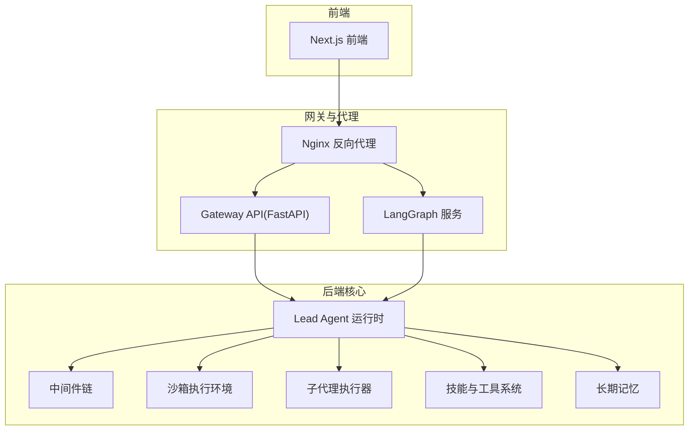
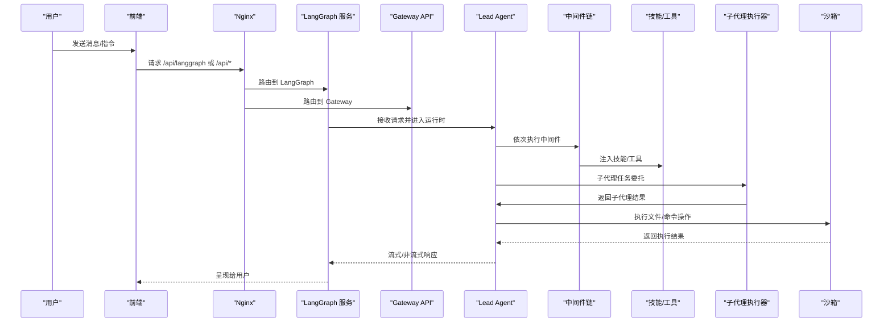
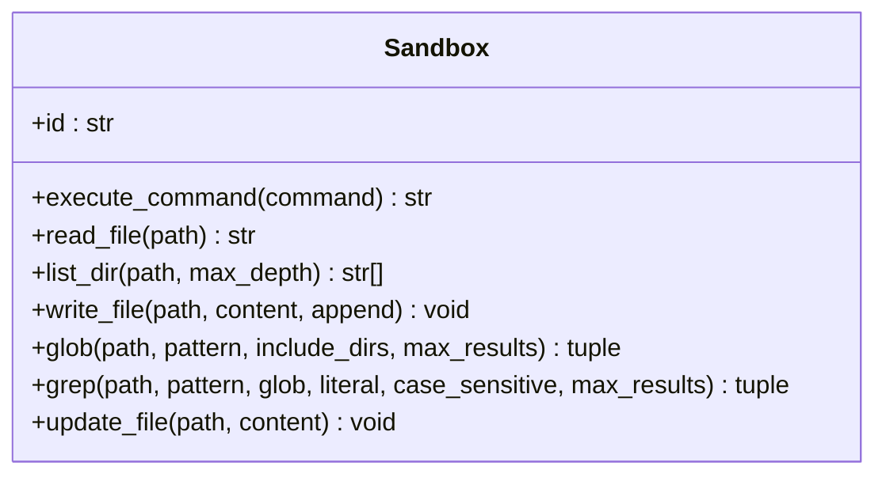
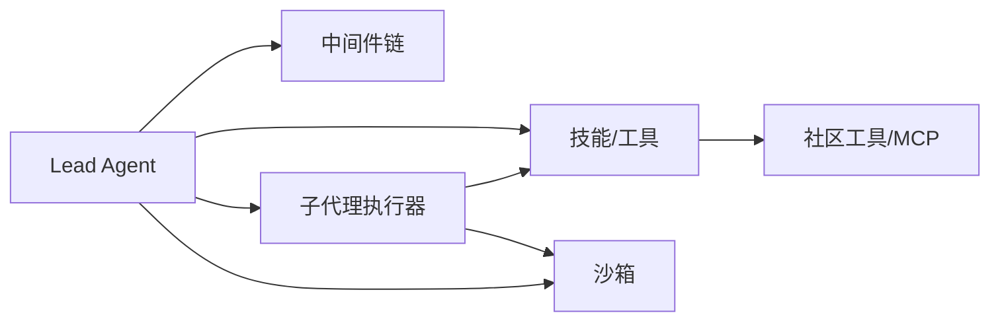

# 核心功能

<cite>
**本文引用的文件**
- [后端总览](file://backend/README.md)
- [项目总览](file://README.md)
- [文档索引](file://backend/docs/README.md)
- [引导技能 SKILL.md](file://backend/skills/public/bootstrap/SKILL.md)
- [深度研究 SKILL.md](file://backend/skills/public/deep-research/SKILL.md)
- [数据分析 SKILL.md](file://backend/skills/public/data-analysis/SKILL.md)
- [嵌入式沙箱接口](file://backend/packages/harness/deerflow/sandbox/sandbox.py)
- [子代理执行器](file://backend/packages/harness/deerflow/subagents/executor.py)
</cite>

## 目录
1. [简介](#简介)
2. [项目结构](#项目结构)
3. [核心组件](#核心组件)
4. [架构总览](#架构总览)
5. [详细组件分析](#详细组件分析)
6. [依赖关系分析](#依赖关系分析)
7. [性能考量](#性能考量)
8. [故障排查指南](#故障排查指南)
9. [结论](#结论)
10. [附录](#附录)

## 简介
本文件面向开发者与高级用户，系统化阐述 DeerFlow 的核心能力：代理运行时系统、技能与工具系统、子代理系统、沙箱与文件系统、上下文工程、长期记忆。文档以“设计目标—实现原理—使用方法”为主线，辅以图示与最佳实践，帮助快速上手并深入掌握。

## 项目结构
- 后端采用分层与按功能域组织的结构：代理运行时（Lead Agent）、中间件链、沙箱执行、子代理编排、工具生态、内存系统、网关 API、IM 渠道等。
- 前端为 Next.js 应用，通过统一反向代理（Nginx）路由到 LangGraph 服务与 Gateway API。
- 文档目录提供配置、API、流式协议、路径示例、摘要策略、计划模式等专题文档。



章节来源
- [后端总览:1-419](file://backend/README.md#L1-L419)
- [项目总览:1-761](file://README.md#L1-L761)
- [文档索引:1-56](file://backend/docs/README.md#L1-L56)

## 核心组件
- 代理运行时系统（Lead Agent）
  - 动态模型选择、思维/视觉支持、中间件链、工具系统、子代理委托、系统提示注入（技能、记忆、工作目录指导）。
- 中间件链（顺序执行，处理跨切关注点）
  - 线程数据隔离、上传注入、沙箱生命周期、摘要、待办、自动标题、记忆队列、图像注入、澄清拦截。
- 沙箱与文件系统
  - 抽象接口：命令执行、文件读写、目录遍历；提供本地与容器两种 Provider；虚拟路径映射到线程隔离目录；技能加载与安全写入策略。
- 子代理系统
  - 内置通用与 Bash 代理；并发限制与超时；后台线程池与状态跟踪；SSE 事件；任务委托与结果聚合。
- 技能与工具系统
  - 标准化技能格式（SKILL.md），按需加载；工具组分类（沙箱、内置、社区、MCP、技能）；可扩展与自定义。
- 长期记忆
  - 自动抽取用户上下文、事实与偏好；结构化存储；去抖更新；系统提示注入；本地 JSON 文件缓存。

章节来源
- [后端总览:44-136](file://backend/README.md#L44-L136)

## 架构总览
下图展示 DeerFlow 的核心交互：前端经 Nginx 路由至 LangGraph 或 Gateway；Agent 在运行时组合中间件、工具、子代理与沙箱；记忆与技能在会话中动态注入。



图表来源
- [后端总览:37-41](file://backend/README.md#L37-L41)

章节来源
- [后端总览:37-41](file://backend/README.md#L37-L41)

## 详细组件分析

### 代理运行时系统（Lead Agent）
- 设计目标
  - 提供统一入口，整合模型、中间件、工具、子代理与沙箱，确保每轮对话具备一致的上下文与执行能力。
- 实现要点
  - 动态模型选择：根据配置与上下文决定推理模型与能力（思维/视觉）。
  - 中间件链：严格顺序执行，覆盖线程隔离、上传注入、沙箱生命周期、摘要、待办、标题、记忆、图像、澄清拦截。
  - 技能注入：在系统提示中注入当前启用的技能内容，避免一次性加载全部技能导致上下文膨胀。
  - 工具系统：内置工具（如任务委托、文件呈现、澄清请求、图像查看）与外部工具（社区搜索、MCP、沙箱命令）统一接入。
- 使用方法
  - 通过 LangGraph 兼容接口发起对话；在会话中触发子代理或直接调用工具；必要时开启计划模式与摘要策略。

章节来源
- [后端总览:46-54](file://backend/README.md#L46-L54)

### 技能与工具系统
- 设计目标
  - 以标准化技能格式承载领域工作流，按需加载，降低上下文开销；工具体系支持内置、社区、MCP 与沙箱扩展。
- 技能标准化格式
  - 使用 SKILL.md 定义名称、描述与工作流；可包含参考材料与模板；安装时支持元信息（版本、作者、兼容性）。
  - 示例技能：
    - 引导技能：通过多轮对话生成个性化 SOUL.md 并完成代理初始化。
    - 深度研究：系统化网络研究方法论，强调多角度、多来源验证与合成检查。
    - 数据分析：基于 DuckDB 的结构化数据探索、SQL 查询、统计摘要与结果导出。
- 工具分类与扩展
  - 沙箱工具：bash、ls、read_file、write_file、str_replace。
  - 内置工具：present_files、ask_clarification、view_image、task（子代理委托）。
  - 社区工具：Tavily、Jina AI、Firecrawl、DuckDuckGo 等。
  - MCP：任意符合 Model Context Protocol 的服务器（stdio/SSE/HTTP）。
  - 技能工具：通过技能注入系统提示，按需提供领域知识与流程约束。
- 最佳实践
  - 优先启用必要的技能，避免一次性加载过多；在复杂任务前显式加载深度研究类技能；使用 MCP 扩展专用能力；谨慎开放 bash 访问权限。

章节来源
- [后端总览:103-112](file://backend/README.md#L103-L112)
- [引导技能 SKILL.md:1-95](file://backend/skills/public/bootstrap/SKILL.md#L1-L95)
- [深度研究 SKILL.md:1-199](file://backend/skills/public/deep-research/SKILL.md#L1-L199)
- [数据分析 SKILL.md:1-249](file://backend/skills/public/data-analysis/SKILL.md#L1-L249)

### 子代理系统
- 设计目标
  - 将复杂任务分解为多个子代理并行执行，提升吞吐与质量；提供统一的任务委托、并发控制与结果聚合。
- 实现原理
  - 内置代理：通用代理（全量工具集）与 Bash 代理（仅在允许主机 Shell 访问时暴露）。
  - 并发与超时：每轮最多 3 个子代理，单个子代理默认 15 分钟超时；后台线程池调度，状态持久化与 SSE 事件上报。
  - 任务委托：父代理调用 task 工具 → 执行器在后台运行子代理 → 轮询完成 → 返回结果。
  - 事件循环复用：为隔离子代理执行维护长驻事件循环，避免频繁创建/销毁带来的资源损耗。
- 使用方法
  - 在父代理中构造任务描述，调用 task 工具提交子代理；通过 execute_async 获取任务 ID，轮询 get_background_task_result 获取状态与结果；必要时调用 request_cancel_background_task 请求取消。
- 关键流程（异步执行）

```mermaid
sequenceDiagram
participant Parent as "父代理"
participant Exec as "子代理执行器"
participant Loop as "隔离事件循环"
participant Agent as "子代理"
participant Tools as "工具集"
participant Store as "后台任务存储"
Parent->>Exec : execute_async(task, task_id)
Exec->>Store : 注册任务(PENDING/RUNNING)
Exec->>Loop : 提交协程执行
Loop->>Agent : 创建子代理(过滤工具/加载技能)
Agent->>Tools : 调用工具(流式/非流式)
Agent-->>Loop : 返回最终状态与消息
Loop-->>Exec : 结果封装(SubagentResult)
Exec->>Store : 更新状态(COMPLETED/FAILED/TIMEOUT)
Parent->>Exec : get_background_task_result(task_id)
Exec-->>Parent : 返回结果
```

图表来源
- [子代理执行器:677-791](file://backend/packages/harness/deerflow/subagents/executor.py#L677-L791)

章节来源
- [后端总览:84-92](file://backend/README.md#L84-L92)
- [子代理执行器:1-829](file://backend/packages/harness/deerflow/subagents/executor.py#L1-L829)

### 沙箱与文件系统
- 设计目标
  - 为代理提供隔离且可执行的文件系统视图，支持文件读写、目录浏览与命令执行（在安全边界内）。
- 实现原理
  - 抽象接口：execute_command、read_file、write_file、list_dir、glob、grep、update_file。
  - 提供商：LocalSandboxProvider（本地文件系统）与 AioSandboxProvider（容器/远程）。
  - 虚拟路径映射：/mnt/user-data/{uploads,workspace,outputs} → 线程隔离物理目录；/mnt/skills → skills/ 目录。
  - 技能加载：递归发现 SKILL.md，保留嵌套容器路径；文件写入采用按 (sandbox.id, path) 的串行化读改写策略，保证并发隔离。
  - 工具集：bash、ls、read_file、write_file、str_replace（append 支持）。
- 使用方法
  - 在沙箱中进行文件操作时，始终使用虚拟路径；当需要 Shell 执行时，优先使用 AioSandboxProvider；在本地开发中谨慎启用主机 bash。
- 类关系图（代码级）



图表来源
- [嵌入式沙箱接口:6-94](file://backend/packages/harness/deerflow/sandbox/sandbox.py#L6-L94)

章节来源
- [后端总览:72-83](file://backend/README.md#L72-L83)
- [嵌入式沙箱接口:1-94](file://backend/packages/harness/deerflow/sandbox/sandbox.py#L1-L94)

### 上下文工程
- 设计目标
  - 在长任务或多步骤场景中，保持上下文清晰、聚焦与可控，避免上下文窗口溢出。
- 实现要点
  - 子代理上下文隔离：每个子代理拥有独立上下文，不互相污染。
  - 会话内摘要：对已完成的子任务与中间结果进行压缩与落盘，减少活跃上下文。
  - 严格工具调用恢复：在中断或错误时，清理原始工具调用元数据并注入占位结果，保证后续模型调用历史合法。
- 最佳实践
  - 对长对话启用摘要中间件；在复杂任务前明确阶段性产出与落盘策略；合理拆分子任务，避免单轮过长。

章节来源
- [后端总览:640-658](file://backend/README.md#L640-L658)

### 长期记忆
- 设计目标
  - 跨会话保留用户画像、偏好与累积知识，持续优化交互体验。
- 实现要点
  - 自动抽取：从对话中提取用户背景、事实与偏好；结构化存储（用户上下文、历史、带置信度的事实）。
  - 去抖更新：批量更新以降低 LLM 调用频率；支持强制重载。
  - 系统提示注入：将精选事实与上下文注入系统提示，增强一致性与个性化。
  - 存储：本地 JSON 文件，基于 mtime 的缓存失效策略。
- 最佳实践
  - 合理设置记忆配置与去抖间隔；定期清理重复事实；在敏感场景下注意数据隐私与最小化采集。

章节来源
- [后端总览:93-102](file://backend/README.md#L93-L102)

## 依赖关系分析
- 组件耦合与内聚
  - Lead Agent 与中间件强耦合（顺序执行与状态共享）；与工具/技能/子代理/沙箱松耦合（通过统一接口与配置驱动）。
  - 子代理执行器依赖工具过滤、技能加载与线程状态；复用长驻事件循环以降低资源消耗。
  - 沙箱抽象屏蔽底层提供商差异，便于切换本地/容器模式。
- 外部依赖与集成
  - LangGraph 与 LangChain 提供多智能体编排与链路抽象；FastAPI 提供网关 API；MCP 适配器支持第三方协议；社区工具（搜索/抓取）增强感知能力。
- 潜在环路与风险
  - 子代理与父代理之间存在调用链，需防止循环委托；工具过滤与技能白名单可降低误用风险。



图表来源
- [后端总览:46-112](file://backend/README.md#L46-L112)

章节来源
- [后端总览:46-112](file://backend/README.md#L46-L112)

## 性能考量
- 中间件顺序与开销
  - 上传注入、沙箱获取、摘要与记忆队列可能引入额外延迟；建议在长任务中启用摘要与去抖策略。
- 子代理并发与资源
  - 并发上限与超时控制可避免资源耗尽；后台线程池与长驻事件循环降低频繁创建/销毁成本。
- 沙箱与文件系统
  - 本地 Provider 在主机执行命令存在安全边界问题；容器 Provider 更安全但有启动/网络开销；合理选择 Provider 与路径映射可平衡性能与安全。
- 记忆与提示注入
  - 仅注入精选事实与上下文，避免一次性注入大量历史；缓存与去抖减少 LLM 调用频次。

## 故障排查指南
- 子代理执行失败
  - 检查任务 ID 与状态；确认是否超时或被取消；查看日志中的异常堆栈；必要时重新提交任务。
- 沙箱访问受限
  - 若使用 LocalSandboxProvider，默认禁用主机 bash；切换到 AioSandboxProvider 或在受控环境下启用主机 bash。
- 记忆未更新
  - 确认记忆配置与去抖参数；尝试强制重载；检查 JSON 存储文件是否存在与可写。
- 工具调用中断
  - 中断后模型历史可能包含悬空工具调用；系统会注入占位结果以修复历史合法性；若仍失败，检查工具返回格式与模型兼容性。

章节来源
- [子代理执行器:752-791](file://backend/packages/harness/deerflow/subagents/executor.py#L752-L791)
- [后端总览:657-658](file://backend/README.md#L657-L658)

## 结论
DeerFlow 通过“运行时 + 中间件 + 工具/技能 + 子代理 + 沙箱 + 记忆”的完整闭环，将多模态、多工具、多代理的能力整合为可扩展的超级代理平台。开发者应遵循“按需加载、隔离执行、并发控制、安全边界”的原则，结合摘要与记忆策略，在保证安全性的同时最大化吞吐与质量。

## 附录
- 快速开始与部署
  - 使用 make 命令启动开发环境或生产镜像；通过 Nginx 统一对外提供服务；在 Docker 环境中注意 tracing 默认关闭，需手动开启。
- 配置与扩展
  - 通过 config.yaml 与 extensions_config.json 管理模型、工具、MCP 与技能；支持 LangSmith/Langfuse 观测；IM 渠道可在配置中启用。
- 文档导航
  - 参考文档索引中的专题文档（API、配置、流式、路径示例、摘要、计划模式、自动标题等）以获得更细粒度的技术细节。

章节来源
- [项目总览:205-248](file://README.md#L205-L248)
- [文档索引:14-56](file://backend/docs/README.md#L14-L56)