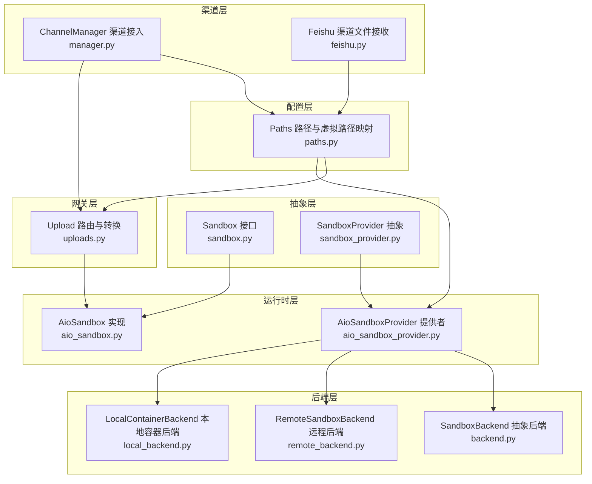
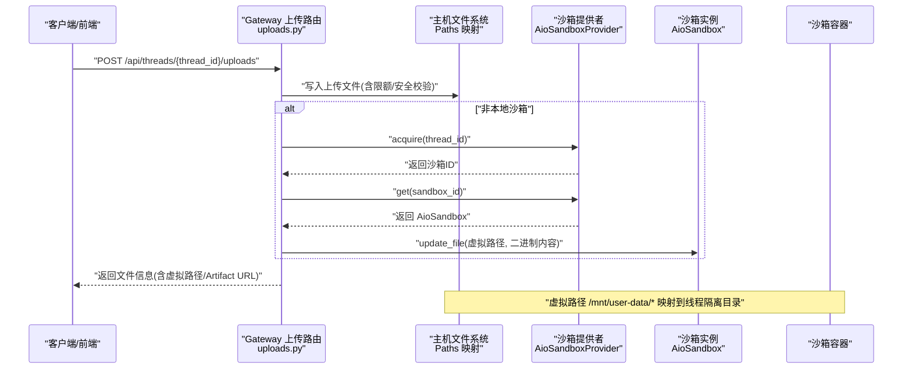
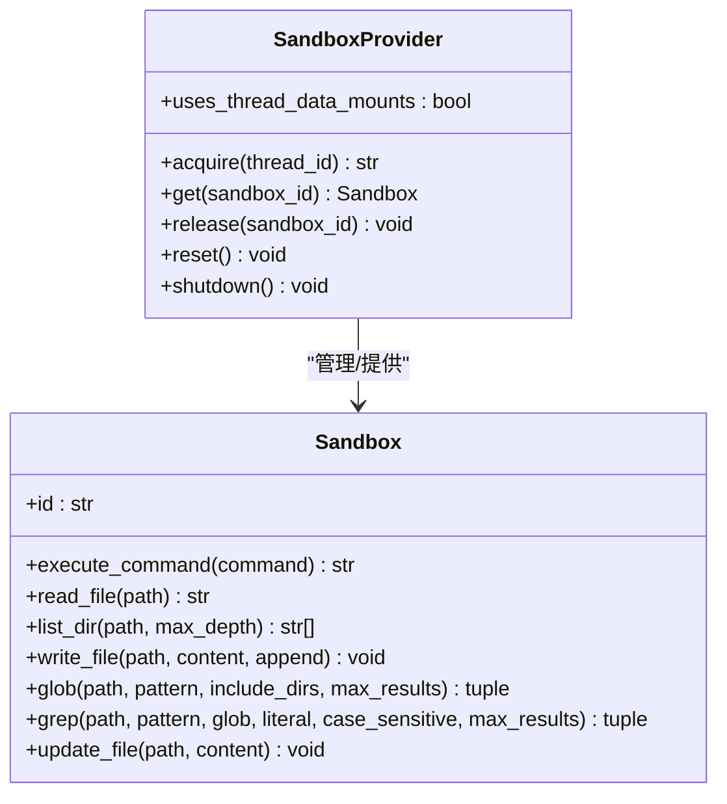
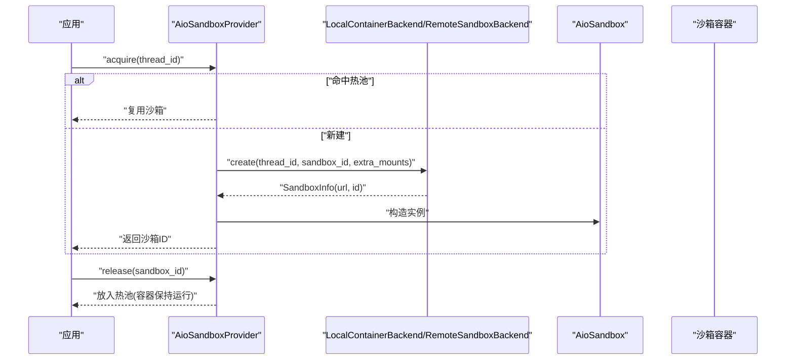
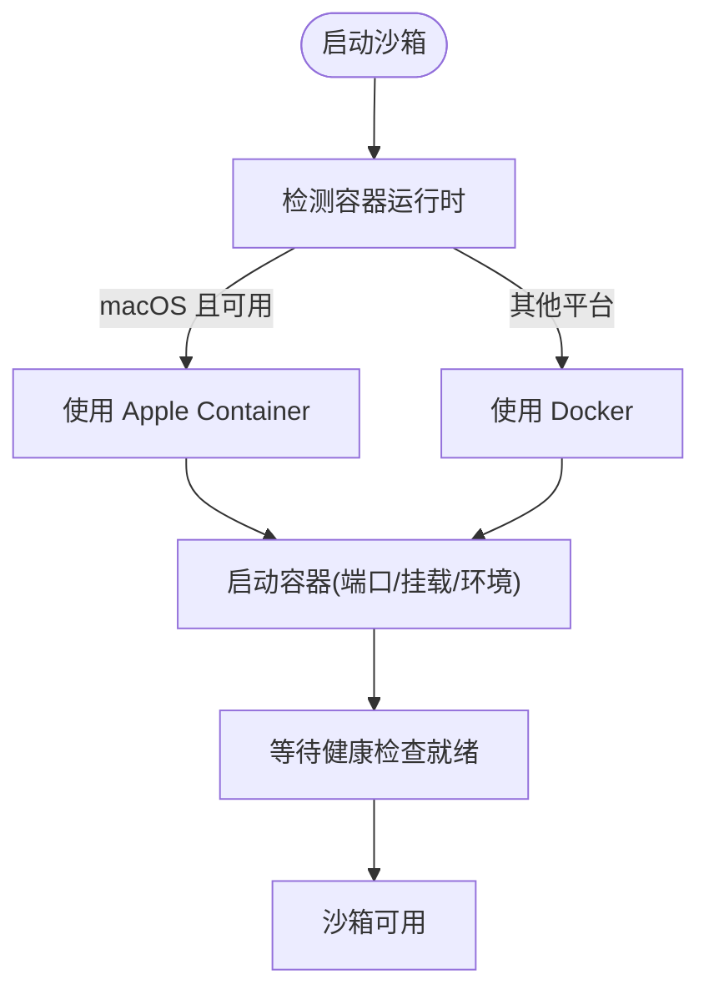
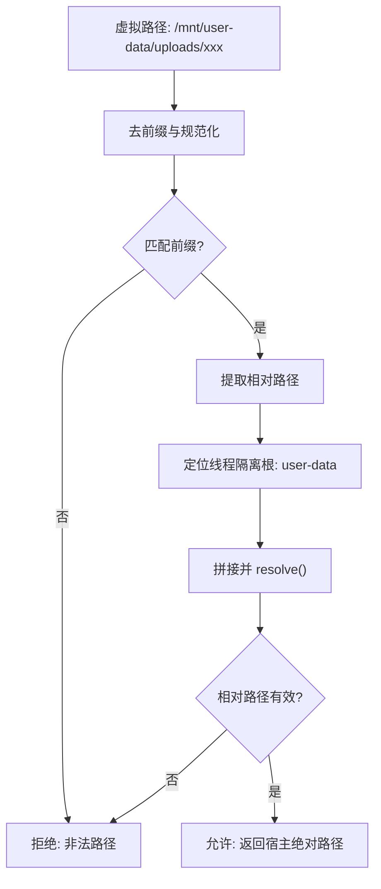
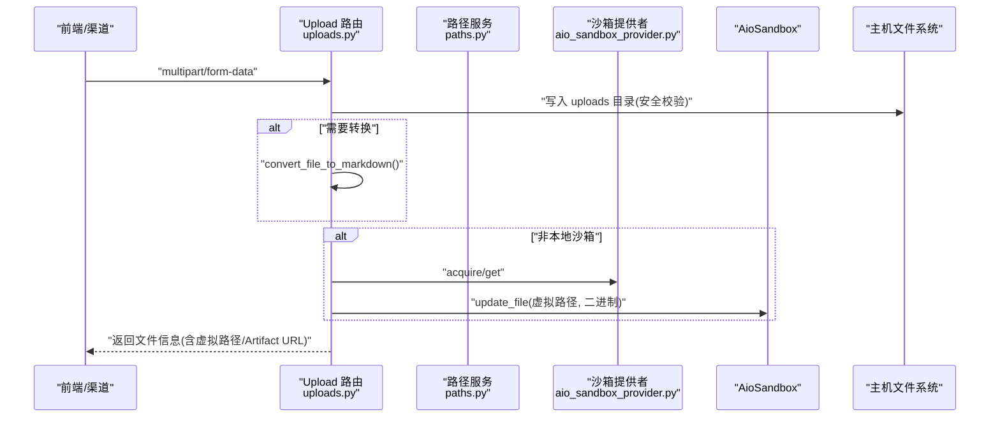
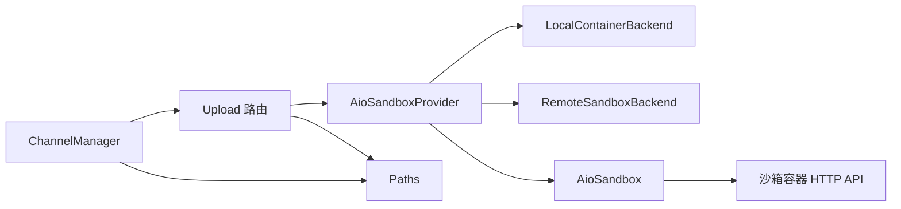

# 沙箱与文件系统

<cite>
**本文引用的文件**
- [sandbox.py](file://backend/packages/harness/deerflow/sandbox/sandbox.py)
- [sandbox_provider.py](file://backend/packages/harness/deerflow/sandbox/sandbox_provider.py)
- [aio_sandbox.py](file://backend/packages/harness/deerflow/community/aio_sandbox/aio_sandbox.py)
- [aio_sandbox_provider.py](file://backend/packages/harness/deerflow/community/aio_sandbox/aio_sandbox_provider.py)
- [local_backend.py](file://backend/packages/harness/deerflow/community/aio_sandbox/local_backend.py)
- [remote_backend.py](file://backend/packages/harness/deerflow/community/aio_sandbox/remote_backend.py)
- [backend.py](file://backend/packages/harness/deerflow/community/aio_sandbox/backend.py)
- [paths.py](file://backend/packages/harness/deerflow/config/paths.py)
- [uploads.py](file://backend/app/gateway/routers/uploads.py)
- [manager.py](file://backend/app/channels/manager.py)
- [feishu.py](file://backend/app/channels/feishu.py)
- [APPLE_CONTAINER.md](file://backend/docs/APPLE_CONTAINER.md)
- [FILE_UPLOAD.md](file://backend/docs/FILE_UPLOAD.md)
- [exceptions.py](file://backend/packages/harness/deerflow/sandbox/exceptions.py)
</cite>

## 目录
1. [简介](#简介)
2. [项目结构](#项目结构)
3. [核心组件](#核心组件)
4. [架构总览](#架构总览)
5. [详细组件分析](#详细组件分析)
6. [依赖分析](#依赖分析)
7. [性能考虑](#性能考虑)
8. [故障排查指南](#故障排查指南)
9. [结论](#结论)
10. [附录](#附录)

## 简介
本文件面向 DeerFlow 的沙箱与文件系统子系统，系统性阐述沙箱架构设计、安全隔离机制与执行环境管理；深入解释文件上传流程、文档转换机制与虚拟路径映射系统；对比本地与 Docker/Apple Container 沙箱的实现差异、安全策略与权限控制；并提供配置示例与最佳实践，帮助读者快速搭建与安全使用沙箱环境。

## 项目结构
沙箱与文件系统相关代码主要分布在以下模块：
- 抽象层：沙箱接口与提供者抽象
- 运行时层：AIO 沙箱实现与提供者
- 后端层：本地容器后端与远程后端
- 配置层：路径与虚拟路径映射
- 网关层：文件上传路由与转换
- 渠道层：IM 渠道对接与文件同步

**图表来源**
- [sandbox.py:1-94](file://backend/packages/harness/deerflow/sandbox/sandbox.py#L1-L94)
- [sandbox_provider.py:1-110](file://backend/packages/harness/deerflow/sandbox/sandbox_provider.py#L1-L110)
- [aio_sandbox.py:1-239](file://backend/packages/harness/deerflow/community/aio_sandbox/aio_sandbox.py#L1-L239)
- [aio_sandbox_provider.py:1-708](file://backend/packages/harness/deerflow/community/aio_sandbox/aio_sandbox_provider.py#L1-L708)
- [local_backend.py:1-620](file://backend/packages/harness/deerflow/community/aio_sandbox/local_backend.py#L1-L620)
- [remote_backend.py:1-201](file://backend/packages/harness/deerflow/community/aio_sandbox/remote_backend.py#L1-L201)
- [backend.py:1-115](file://backend/packages/harness/deerflow/community/aio_sandbox/backend.py#L1-L115)
- [paths.py:1-351](file://backend/packages/harness/deerflow/config/paths.py#L1-L351)
- [uploads.py:1-343](file://backend/app/gateway/routers/uploads.py#L1-L343)
- [manager.py:1-1038](file://backend/app/channels/manager.py#L1-L1038)
- [feishu.py:1-399](file://backend/app/channels/feishu.py#L1-L399)

**章节来源**
- [sandbox.py:1-94](file://backend/packages/harness/deerflow/sandbox/sandbox.py#L1-L94)
- [aio_sandbox_provider.py:1-708](file://backend/packages/harness/deerflow/community/aio_sandbox/aio_sandbox_provider.py#L1-L708)
- [paths.py:1-351](file://backend/packages/harness/deerflow/config/paths.py#L1-L351)
- [uploads.py:1-343](file://backend/app/gateway/routers/uploads.py#L1-L343)
- [manager.py:1-1038](file://backend/app/channels/manager.py#L1-L1038)

## 核心组件
- 沙箱接口与提供者
  - Sandbox 抽象类定义了命令执行、文件读写、目录遍历、搜索等能力，统一不同后端的对外接口。
  - SandboxProvider 抽象类负责获取/释放沙箱实例，提供全局单例与重置/关闭能力。
- AIO 沙箱与提供者
  - AioSandbox 通过 HTTP 客户端连接沙箱容器，序列化并发命令，保证会话一致性。
  - AioSandboxProvider 负责生命周期管理、挂载计算、空闲回收、跨进程发现与销毁。
- 后端抽象与实现
  - SandboxBackend 抽象定义创建/销毁/存活检查/发现等接口。
  - LocalContainerBackend 使用 Docker 或 Apple Container 启动容器，自动检测运行时并处理端口与挂载。
  - RemoteSandboxBackend 将 Pod 生命周期委托给外部 provisioner。
- 路径与虚拟路径映射
  - Paths 提供线程隔离的 host 路径与虚拟路径映射，统一 /mnt/user-data 下的 workspace/uploads/outputs 结构。
- 文件上传与转换
  - Upload 路由实现多文件上传、限额校验、自动转换为 Markdown、沙箱同步与安全写入。
  - 渠道层在接收 IM 文件时，将资源落盘并映射为虚拟路径，供 Agent 使用。

**章节来源**
- [sandbox.py:1-94](file://backend/packages/harness/deerflow/sandbox/sandbox.py#L1-L94)
- [sandbox_provider.py:1-110](file://backend/packages/harness/deerflow/sandbox/sandbox_provider.py#L1-L110)
- [aio_sandbox.py:1-239](file://backend/packages/harness/deerflow/community/aio_sandbox/aio_sandbox.py#L1-L239)
- [aio_sandbox_provider.py:1-708](file://backend/packages/harness/deerflow/community/aio_sandbox/aio_sandbox_provider.py#L1-L708)
- [local_backend.py:1-620](file://backend/packages/harness/deerflow/community/aio_sandbox/local_backend.py#L1-L620)
- [remote_backend.py:1-201](file://backend/packages/harness/deerflow/community/aio_sandbox/remote_backend.py#L1-L201)
- [paths.py:1-351](file://backend/packages/harness/deerflow/config/paths.py#L1-L351)
- [uploads.py:1-343](file://backend/app/gateway/routers/uploads.py#L1-L343)

## 架构总览
下图展示了从网关上传到沙箱执行的整体链路，以及虚拟路径映射与安全隔离策略：

**图表来源**
- [uploads.py:170-293](file://backend/app/gateway/routers/uploads.py#L170-L293)
- [aio_sandbox_provider.py:421-606](file://backend/packages/harness/deerflow/community/aio_sandbox/aio_sandbox_provider.py#L421-L606)
- [aio_sandbox.py:25-38](file://backend/packages/harness/deerflow/community/aio_sandbox/aio_sandbox.py#L25-L38)
- [paths.py:199-232](file://backend/packages/harness/deerflow/config/paths.py#L199-L232)

**章节来源**
- [uploads.py:170-293](file://backend/app/gateway/routers/uploads.py#L170-L293)
- [aio_sandbox_provider.py:421-606](file://backend/packages/harness/deerflow/community/aio_sandbox/aio_sandbox_provider.py#L421-L606)
- [paths.py:199-232](file://backend/packages/harness/deerflow/config/paths.py#L199-L232)

## 详细组件分析

### 沙箱接口与提供者
- Sandbox 抽象定义了命令执行、文件读写、目录遍历、glob/grep 搜索与二进制更新等能力，屏蔽底层差异。
- SandboxProvider 提供全局单例、重置与优雅关闭，支持注入自定义提供者用于测试。

**图表来源**
- [sandbox.py:6-94](file://backend/packages/harness/deerflow/sandbox/sandbox.py#L6-L94)
- [sandbox_provider.py:8-110](file://backend/packages/harness/deerflow/sandbox/sandbox_provider.py#L8-L110)

**章节来源**
- [sandbox.py:1-94](file://backend/packages/harness/deerflow/sandbox/sandbox.py#L1-L94)
- [sandbox_provider.py:1-110](file://backend/packages/harness/deerflow/sandbox/sandbox_provider.py#L1-L110)

### AIO 沙箱与提供者
- AioSandbox 通过 HTTP 客户端与沙箱容器交互，使用锁序列化命令，避免并发导致的会话污染；支持 base64 编码写入二进制文件。
- AioSandboxProvider 负责：
  - 配置加载与环境变量解析
  - 后端选择（本地容器/远程 K8s）
  - 线程级确定性沙箱 ID 生成
  - 额外挂载（线程数据、技能目录）
  - 空闲超时与热池回收
  - 信号处理与优雅停机
  - 跨进程容器发现与启动协调

**图表来源**
- [aio_sandbox_provider.py:421-677](file://backend/packages/harness/deerflow/community/aio_sandbox/aio_sandbox_provider.py#L421-L677)
- [local_backend.py:244-358](file://backend/packages/harness/deerflow/community/aio_sandbox/local_backend.py#L244-L358)
- [remote_backend.py:58-97](file://backend/packages/harness/deerflow/community/aio_sandbox/remote_backend.py#L58-L97)
- [aio_sandbox.py:25-38](file://backend/packages/harness/deerflow/community/aio_sandbox/aio_sandbox.py#L25-L38)

**章节来源**
- [aio_sandbox.py:1-239](file://backend/packages/harness/deerflow/community/aio_sandbox/aio_sandbox.py#L1-L239)
- [aio_sandbox_provider.py:1-708](file://backend/packages/harness/deerflow/community/aio_sandbox/aio_sandbox_provider.py#L1-L708)
- [local_backend.py:1-620](file://backend/packages/harness/deerflow/community/aio_sandbox/local_backend.py#L1-L620)
- [remote_backend.py:1-201](file://backend/packages/harness/deerflow/community/aio_sandbox/remote_backend.py#L1-L201)

### 本地与 Docker/Apple Container 沙箱
- 运行时检测：在 macOS 上优先使用 Apple Container，否则回退到 Docker；其他平台直接使用 Docker。
- 容器管理：自动分配端口、处理端口冲突、容器命名与发现、健康检查等待、停止与端口释放。
- 挂载策略：根据线程 ID 与技能目录动态计算挂载，本地模式下直接绑定线程数据目录，远程模式通过同步或挂载实现。

**图表来源**
- [local_backend.py:215-241](file://backend/packages/harness/deerflow/community/aio_sandbox/local_backend.py#L215-L241)
- [local_backend.py:485-566](file://backend/packages/harness/deerflow/community/aio_sandbox/local_backend.py#L485-L566)
- [APPLE_CONTAINER.md:49-87](file://backend/docs/APPLE_CONTAINER.md#L49-L87)

**章节来源**
- [local_backend.py:1-620](file://backend/packages/harness/deerflow/community/aio_sandbox/local_backend.py#L1-L620)
- [APPLE_CONTAINER.md:1-114](file://backend/docs/APPLE_CONTAINER.md#L1-L114)

### 虚拟路径映射与安全隔离
- 虚拟路径前缀：/mnt/user-data 下划分 workspace、uploads、outputs 三类目录。
- 路径解析：提供 resolve_virtual_path 将虚拟路径解析为宿主绝对路径，并进行前缀匹配与相对路径归一化，防止路径穿越。
- 线程隔离：每个 thread_id 对应独立目录，避免跨线程访问。
- 权限控制：线程目录创建时强制 chmod 0o777，确保沙箱容器可写。

**图表来源**
- [paths.py:291-325](file://backend/packages/harness/deerflow/config/paths.py#L291-L325)

**章节来源**
- [paths.py:1-351](file://backend/packages/harness/deerflow/config/paths.py#L1-L351)

### 文件上传流程与文档转换
- 上传路由：
  - 限额校验（最大文件数/单文件/总大小）
  - 安全落盘（唯一文件名、防路径穿越）
  - 可选自动转换（PDF/PPT/Excel/Word → Markdown）
  - 非本地沙箱场景下，将文件同步至 /mnt/user-data/uploads
- 渠道对接：
  - ChannelManager 在接收 IM 文件时，将资源落盘并替换消息中的占位符为虚拟路径
  - Feishu 渠道示例：下载图片/文件后写入 uploads 目录并映射为虚拟路径

**图表来源**
- [uploads.py:170-293](file://backend/app/gateway/routers/uploads.py#L170-L293)
- [paths.py:199-232](file://backend/packages/harness/deerflow/config/paths.py#L199-L232)
- [aio_sandbox_provider.py:421-606](file://backend/packages/harness/deerflow/community/aio_sandbox/aio_sandbox_provider.py#L421-L606)
- [aio_sandbox.py:225-239](file://backend/packages/harness/deerflow/community/aio_sandbox/aio_sandbox.py#L225-L239)

**章节来源**
- [uploads.py:1-343](file://backend/app/gateway/routers/uploads.py#L1-L343)
- [manager.py:440-518](file://backend/app/channels/manager.py#L440-L518)
- [feishu.py:292-394](file://backend/app/channels/feishu.py#L292-L394)
- [FILE_UPLOAD.md:1-315](file://backend/docs/FILE_UPLOAD.md#L1-L315)

### 安全策略与权限控制
- 路径安全
  - 虚拟路径解析严格校验前缀与相对路径有效性，拒绝路径穿越
  - 上传目录创建强制 0o777 权限，避免沙箱用户写入失败
- 上传安全
  - 文件名标准化与唯一化，避免覆盖与路径穿越
  - 限额与总大小限制，防止滥用
  - 自动转换默认关闭，避免在不受信任环境中解析 Office/PDF
- 沙箱安全
  - 本地容器后端在 Docker 模式下启用 seccomp=unconfined（运行时差异）
  - 热池与空闲回收降低资源占用，避免僵尸容器
  - 优雅停机与信号处理，确保容器清理

**章节来源**
- [paths.py:291-325](file://backend/packages/harness/deerflow/config/paths.py#L291-L325)
- [uploads.py:59-103](file://backend/app/gateway/routers/uploads.py#L59-L103)
- [local_backend.py:507-513](file://backend/packages/harness/deerflow/community/aio_sandbox/local_backend.py#L507-L513)
- [aio_sandbox_provider.py:378-409](file://backend/packages/harness/deerflow/community/aio_sandbox/aio_sandbox_provider.py#L378-L409)

## 依赖分析
- 组件耦合
  - AioSandboxProvider 依赖 SandboxBackend 抽象，通过组合支持本地与远程两种后端
  - AioSandbox 仅依赖 HTTP 客户端与锁，不直接关心后端细节
  - Upload 路由依赖 SandboxProvider 与 Paths，实现上传与同步
- 外部依赖
  - Docker/Apple Container 命令行工具
  - HTTP 客户端与健康检查
  - 文件转换库（可选）

**图表来源**
- [aio_sandbox_provider.py:135-156](file://backend/packages/harness/deerflow/community/aio_sandbox/aio_sandbox_provider.py#L135-L156)
- [local_backend.py:172-214](file://backend/packages/harness/deerflow/community/aio_sandbox/local_backend.py#L172-L214)
- [remote_backend.py:30-55](file://backend/packages/harness/deerflow/community/aio_sandbox/remote_backend.py#L30-L55)
- [aio_sandbox.py:17-38](file://backend/packages/harness/deerflow/community/aio_sandbox/aio_sandbox.py#L17-L38)
- [uploads.py:1-343](file://backend/app/gateway/routers/uploads.py#L1-L343)
- [paths.py:1-351](file://backend/packages/harness/deerflow/config/paths.py#L1-L351)
- [manager.py:1-1038](file://backend/app/channels/manager.py#L1-L1038)

**章节来源**
- [aio_sandbox_provider.py:1-708](file://backend/packages/harness/deerflow/community/aio_sandbox/aio_sandbox_provider.py#L1-L708)
- [local_backend.py:1-620](file://backend/packages/harness/deerflow/community/aio_sandbox/local_backend.py#L1-L620)
- [remote_backend.py:1-201](file://backend/packages/harness/deerflow/community/aio_sandbox/remote_backend.py#L1-L201)
- [aio_sandbox.py:1-239](file://backend/packages/harness/deerflow/community/aio_sandbox/aio_sandbox.py#L1-L239)
- [uploads.py:1-343](file://backend/app/gateway/routers/uploads.py#L1-L343)
- [paths.py:1-351](file://backend/packages/harness/deerflow/config/paths.py#L1-L351)
- [manager.py:1-1038](file://backend/app/channels/manager.py#L1-L1038)

## 性能考虑
- 热池与空闲回收：通过热池避免冷启动，空闲超时回收容器，平衡延迟与资源占用
- 并发控制：AioSandbox 对命令执行加锁，避免会话污染
- 端口与网络：本地后端批量 inspect 减少子进程调用次数，健康检查轮询避免阻塞
- I/O 优化：上传分块写入，转换异步执行，减少内存峰值

[本节为通用指导，无需特定文件引用]

## 故障排查指南
- 沙箱启动失败
  - 检查容器运行时可用性（Apple Container/Docker），查看日志中的检测与启动输出
  - 端口冲突：本地后端会自动重试下一个端口，若连续失败，检查宿主端口占用
- 文件上传失败
  - 超出限额：调整 uploads.* 配置项
  - 路径穿越：确认文件名与目标路径安全
  - 转换失败：检查转换库安装与文档状态
- Agent 看不到文件
  - 确认非本地沙箱场景下已成功同步
  - 检查虚拟路径前缀与解析结果

**章节来源**
- [APPLE_CONTAINER.md:81-114](file://backend/docs/APPLE_CONTAINER.md#L81-L114)
- [local_backend.py:268-292](file://backend/packages/harness/deerflow/community/aio_sandbox/local_backend.py#L268-L292)
- [uploads.py:105-110](file://backend/app/gateway/routers/uploads.py#L105-L110)
- [FILE_UPLOAD.md:253-274](file://backend/docs/FILE_UPLOAD.md#L253-L274)

## 结论
DeerFlow 的沙箱与文件系统通过抽象接口与提供者模式实现了灵活的执行环境管理；借助虚拟路径映射与严格的路径安全校验，既满足 Agent 对文件的透明访问，又保障了跨线程隔离与宿主安全。本地与远程沙箱在配置与后端实现上存在差异，但通过统一的提供者接口与挂载策略，实现了无缝切换与一致的使用体验。结合上传路由的安全策略与文档转换能力，系统在易用性与安全性之间取得了良好平衡。

[本节为总结，无需特定文件引用]

## 附录

### 配置示例与最佳实践
- 沙箱提供者配置（config.yaml）
  - 使用 AioSandboxProvider，指定镜像、端口、容器前缀、空闲超时、副本数与挂载
  - 环境变量支持以 $ 引用外部变量
- 上传路由配置
  - 通过 uploads.max_files、uploads.max_file_size、uploads.max_total_size 控制上传规模
  - uploads.auto_convert_documents 默认关闭，需在可信环境显式开启
- 路径与挂载
  - 线程数据目录在宿主侧以 0o777 权限创建，确保沙箱可写
  - 虚拟路径前缀为 /mnt/user-data，映射 workspace/uploads/outputs

**章节来源**
- [aio_sandbox_provider.py:77-91](file://backend/packages/harness/deerflow/community/aio_sandbox/aio_sandbox_provider.py#L77-L91)
- [aio_sandbox_provider.py:160-178](file://backend/packages/harness/deerflow/community/aio_sandbox/aio_sandbox_provider.py#L160-L178)
- [uploads.py:81-110](file://backend/app/gateway/routers/uploads.py#L81-L110)
- [uploads.py:155-167](file://backend/app/gateway/routers/uploads.py#L155-L167)
- [paths.py:260-280](file://backend/packages/harness/deerflow/config/paths.py#L260-L280)
- [FILE_UPLOAD.md:1-315](file://backend/docs/FILE_UPLOAD.md#L1-L315)