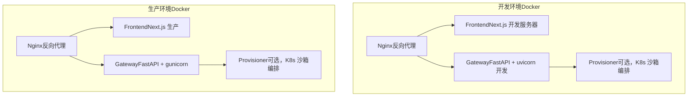
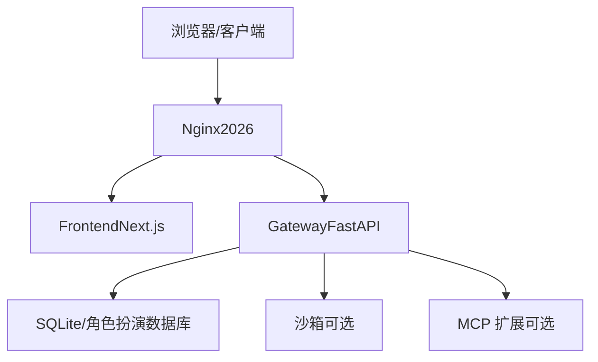
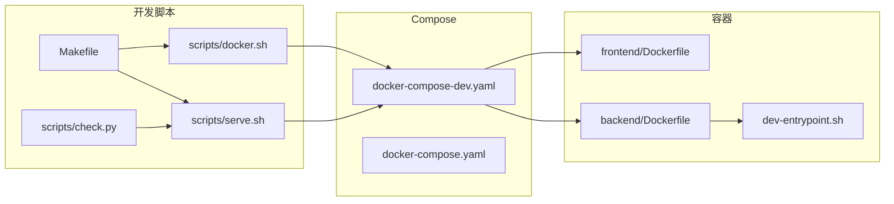

# 开发环境搭建

<cite>
**本文档引用的文件**
- [docker-compose-dev.yaml](file://docker/docker-compose-dev.yaml)
- [docker-compose.yaml](file://docker/docker-compose.yaml)
- [dev-entrypoint.sh](file://docker/dev-entrypoint.sh)
- [Dockerfile（后端）](file://backend/Dockerfile)
- [Dockerfile（前端）](file://frontend/Dockerfile)
- [Dockerfile（练习版前端）](file://practice/Dockerfile)
- [Makefile](file://Makefile)
- [serve.sh](file://scripts/serve.sh)
- [docker.sh](file://scripts/docker.sh)
- [check.py](file://scripts/check.py)
- [pyproject.toml（后端）](file://backend/pyproject.toml)
- [package.json（前端）](file://frontend/package.json)
- [config.example.yaml](file://config.example.yaml)
- [extensions_config.example.json](file://extensions_config.example.json)
</cite>

## 目录
1. [简介](#简介)
2. [项目结构](#项目结构)
3. [核心组件](#核心组件)
4. [架构总览](#架构总览)
5. [详细组件分析](#详细组件分析)
6. [依赖关系分析](#依赖关系分析)
7. [性能考虑](#性能考虑)
8. [故障排查指南](#故障排查指南)
9. [结论](#结论)
10. [附录](#附录)

## 简介
本指南面向 DeerFlow 项目的本地开发环境搭建，覆盖以下主题：
- Docker 开发环境的启动与配置
- MySQL 数据库设置（含角色扮演数据库）
- Python 环境准备与 uv 包管理器使用
- Node.js 环境配置与 pnpm 包管理器
- docker-compose.yml 配置详解（服务依赖、网络、卷挂载）
- 开发模式下的热更新机制（代码映射与自动重启）
- 环境变量、端口映射与健康检查
- 常见问题排查与解决方案

## 项目结构
DeerFlow 采用前后端分离与反向代理统一入口的多服务架构，开发模式下通过 docker-compose-dev.yaml 启动 Nginx、前端、后端网关与可选的沙箱编排器（Kubernetes 模式）。生产模式通过 docker-compose.yaml 提供统一反向代理与静态资源服务。

图表来源
- [docker-compose-dev.yaml:15-195](file://docker/docker-compose-dev.yaml#L15-L195)
- [docker-compose.yaml:25-150](file://docker/docker-compose.yaml#L25-L150)

章节来源
- [docker-compose-dev.yaml:1-195](file://docker/docker-compose-dev.yaml#L1-L195)
- [docker-compose.yaml:1-150](file://docker/docker-compose.yaml#L1-L150)

## 核心组件
- 反向代理（Nginx）
  - 开发：监听 2026 端口，路由到前端与网关
  - 生产：监听 2026 端口，路由到前端与网关
- 前端（Next.js）
  - 开发：dev 目标，端口 3000，支持热更新
  - 生产：prod 目标，端口 3000，预构建
- 网关（FastAPI）
  - 开发：uvicorn 开发服务器，支持热更新
  - 生产：gunicorn + uvicorn workers
- 沙箱编排器（Provisioner，可选）
  - Kubernetes 模式下用于管理沙箱 Pod 生命周期

章节来源
- [docker-compose-dev.yaml:62-181](file://docker/docker-compose-dev.yaml#L62-L181)
- [docker-compose.yaml:27-114](file://docker/docker-compose.yaml#L27-L114)
- [Dockerfile（前端）:26-51](file://frontend/Dockerfile#L26-L51)
- [Dockerfile（后端）:37-80](file://backend/Dockerfile#L37-L80)

## 架构总览
开发与生产环境均通过 Nginx 统一入口，前端与后端分别提供静态资源与 API 服务。开发模式下，前端与网关均启用热更新；生产模式下，前端与网关以优化方式运行。

图表来源
- [docker-compose-dev.yaml:62-181](file://docker/docker-compose-dev.yaml#L62-L181)
- [docker-compose.yaml:27-114](file://docker/docker-compose.yaml#L27-L114)
- [config.example.yaml:296-309](file://config.example.yaml#L296-L309)
- [extensions_config.example.json:1-45](file://extensions_config.example.json#L1-L45)

## 详细组件分析

### Docker 开发环境（docker-compose-dev.yaml）
- 服务定义
  - nginx：反向代理，端口 2026，依赖 frontend 与 gateway
  - frontend：Next.js 开发服务器，端口 3000，挂载 src 与 public，缓存 pnpm store
  - gateway：FastAPI 开发服务器，uvicorn 热更新，挂载 backend/ 并持久化 .venv 与 uv 缓存
  - provisioner：可选，Kubernetes 模式下管理沙箱 Pod
- 网络
  - deer-flow-dev：桥接网络，子网 192.168.200.0/24
- 卷挂载
  - 前端：src、public、next.config.js、pnpm store
  - 网关：backend/、.venv、uv 缓存、配置文件、技能目录、Docker socket
- 健康检查
  - provisioner：curl 探针，10s 间隔，5s 超时，6 次重试
- 环境变量
  - 通过 env_file 引入 .env 与 frontend/.env
  - 关键变量：DEER_FLOW_*、BETTER_AUTH_SECRET、NODE_ENV、DEER_FLOW_INTERNAL_GATEWAY_BASE_URL

章节来源
- [docker-compose-dev.yaml:15-195](file://docker/docker-compose-dev.yaml#L15-L195)

### 开发入口脚本（dev-entrypoint.sh）
- 功能
  - 解析并校验 UV_EXTRAS，生成 uv 的 --extra 参数
  - 执行 uv sync --all-packages 安装工作区成员可选依赖
  - 自愈：首次失败则重建 .venv 并重试
  - 启动 uvicorn，开启 --reload，并指定 reload_include
- 与 docker-compose-dev.yaml 的配合
  - gateway 服务通过 dev-entrypoint.sh 替代直接 uvicorn 命令，便于脚本化与校验

章节来源
- [dev-entrypoint.sh:1-86](file://docker/dev-entrypoint.sh#L1-L86)
- [docker-compose-dev.yaml:127-132](file://docker/docker-compose-dev.yaml#L127-L132)

### 前端 Dockerfile（frontend/Dockerfile）
- 目标
  - dev：仅安装依赖，启动 next dev
  - prod：安装依赖并构建，启动 next start
- 关键点
  - 使用 pnpm，支持 COREPACK_NPM_REGISTRY 与 registry 配置
  - 缓存 pnpm store，提升安装速度

章节来源
- [Dockerfile（前端）:1-51](file://frontend/Dockerfile#L1-L51)

### 后端 Dockerfile（backend/Dockerfile）
- 目标
  - 生产：两阶段构建，第一阶段安装依赖，第二阶段最小化运行时
- 关键点
  - 国内镜像源配置
  - 安装 gunicorn 与 uvicorn
  - 暴露 8001 端口，CMD 使用 gunicorn

章节来源
- [Dockerfile（后端）:1-80](file://backend/Dockerfile#L1-L80)

### 生产环境（docker-compose.yaml）
- 服务
  - nginx：反向代理，端口 2026
  - frontend：Next.js 生产镜像
  - gateway：FastAPI + uvicorn（生产）
  - provisioner：可选
- 关键环境变量
  - DEER_FLOW_PROJECT_ROOT、DEER_FLOW_HOME、DEER_FLOW_CONFIG_PATH、DEER_FLOW_EXTENSIONS_CONFIG_PATH
  - DEER_FLOW_DOCKER_SOCKET、DEER_FLOW_REPO_ROOT
  - BETTER_AUTH_SECRET
- 卷挂载
  - 配置文件、扩展配置、技能目录、数据目录、Docker socket
- 健康检查
  - provisioner：curl 探针

章节来源
- [docker-compose.yaml:25-150](file://docker/docker-compose.yaml#L25-L150)

### 环境变量与配置文件
- 配置文件
  - config.yaml：模型、工具、沙箱、记忆、数据库、运行事件、Subagent 等配置
  - extensions_config.json：MCP 扩展与服务器配置
- 关键变量
  - DEER_FLOW_*：路径与行为控制
  - BETTER_AUTH_SECRET：前端认证密钥
  - PORT：Nginx 监听端口
  - UV_EXTRAS：后端可选依赖（如 postgres）

章节来源
- [config.example.yaml:1-348](file://config.example.yaml#L1-L348)
- [extensions_config.example.json:1-45](file://extensions_config.example.json#L1-L45)
- [docker-compose-dev.yaml:165-174](file://docker/docker-compose-dev.yaml#L165-L174)
- [docker-compose.yaml:10-23](file://docker/docker-compose.yaml#L10-L23)

### 端口映射与访问
- 开发
  - Nginx：2026 → 2026
  - Frontend：3000 → 3000
  - Gateway：8001 → 8001
- 生产
  - Nginx：2026 → 2026
  - Frontend：3000 → 3000
  - Gateway：8001 → 8001

章节来源
- [docker-compose-dev.yaml:67-131](file://docker/docker-compose-dev.yaml#L67-L131)
- [docker-compose.yaml:30-74](file://docker/docker-compose.yaml#L30-L74)

### 热更新机制
- 前端（Next.js）
  - dev 目标启用热更新，开发服务器监听 3000 端口
- 后端（uvicorn）
  - 开发入口脚本 dev-entrypoint.sh 启动 uvicorn 时启用 --reload
  - reload-include 包含 *.yaml 与 .env，便于配置变更即时生效
- Makefile 与脚本
  - serve.sh 根据 --dev/--prod 切换 uvicorn 的 --reload 参数
  - docker.sh 自动检测沙箱模式并决定是否启动 provisioner

章节来源
- [dev-entrypoint.sh:83-86](file://docker/dev-entrypoint.sh#L83-L86)
- [serve.sh:131-135](file://scripts/serve.sh#L131-L135)
- [docker-compose-dev.yaml:96-132](file://docker/docker-compose-dev.yaml#L96-L132)

### MySQL 数据库设置
- 角色扮演数据库（RDS）
  - 主机、端口、数据库名、用户名、密码在配置文件中定义
  - 用于 practice 子项目与角色扮演场景的数据存储
- 迁移与初始化
  - backend/scripts 下包含数据库迁移脚本与初始化工具
- 建议
  - 在本地开发时，若不使用角色扮演功能，可保持默认 SQLite 后端
  - 若需要联调角色扮演，请确保网络可达 RDS 实例

章节来源
- [config.example.yaml:303-309](file://config.example.yaml#L303-L309)
- [backend/scripts](file://backend/scripts)

### Python 环境准备与 uv
- 包管理器
  - 使用 uv（pip/pep582）替代 pip，支持工作区与可选依赖
- 可选依赖
  - 通过 UV_EXTRAS 或配置文件解析，例如 postgres
- 依赖同步
  - docker-compose-dev.yaml 中通过 dev-entrypoint.sh 执行 uv sync --all-packages
  - 本地开发通过 Makefile 与 serve.sh 调用 uv sync

章节来源
- [pyproject.toml（后端）:28-37](file://backend/pyproject.toml#L28-L37)
- [dev-entrypoint.sh:12-16](file://docker/dev-entrypoint.sh#L12-L16)
- [Makefile:67-69](file://Makefile#L67-L69)

### Node.js 环境配置与 pnpm
- Node.js 版本要求
  - 前端 Dockerfile 使用 Node.js 22，本地检查脚本要求 Node.js >= 22
- 包管理器
  - pnpm 作为首选包管理器，支持 Corepack
- 依赖安装
  - 前端 Dockerfile 在 dev 目标下仅安装依赖，prod 目标下安装并构建
  - 本地开发通过 Makefile 与 serve.sh 安装前端依赖

章节来源
- [Dockerfile（前端）:10-22](file://frontend/Dockerfile#L10-L22)
- [check.py:70-111](file://scripts/check.py#L70-L111)
- [package.json（前端）:1-118](file://frontend/package.json#L1-L118)

## 依赖关系分析

图表来源
- [Makefile:1-184](file://Makefile#L1-L184)
- [serve.sh:1-294](file://scripts/serve.sh#L1-L294)
- [docker.sh:1-358](file://scripts/docker.sh#L1-L358)
- [check.py:1-171](file://scripts/check.py#L1-L171)
- [docker-compose-dev.yaml:1-195](file://docker/docker-compose-dev.yaml#L1-L195)
- [docker-compose.yaml:1-150](file://docker/docker-compose.yaml#L1-L150)
- [Dockerfile（前端）:1-51](file://frontend/Dockerfile#L1-L51)
- [Dockerfile（后端）:1-80](file://backend/Dockerfile#L1-L80)
- [dev-entrypoint.sh:1-86](file://docker/dev-entrypoint.sh#L1-L86)

章节来源
- [Makefile:1-184](file://Makefile#L1-L184)
- [docker-compose-dev.yaml:1-195](file://docker/docker-compose-dev.yaml#L1-L195)
- [docker-compose.yaml:1-150](file://docker/docker-compose.yaml#L1-L150)

## 性能考虑
- 前端缓存
  - pnpm store 挂载到容器内缓存目录，减少重复下载
- 后端缓存
  - uv 缓存卷挂载，避免 macOS/Docker Desktop 下符号链接问题导致的启动失败
- 依赖安装
  - 使用 uv 工作区与可选依赖，减少重复安装
- 网络与卷
  - 使用命名卷（.venv、uv-cache）持久化，避免每次重启重建

章节来源
- [docker-compose-dev.yaml:145-148](file://docker/docker-compose-dev.yaml#L145-L148)
- [dev-entrypoint.sh:74-79](file://docker/dev-entrypoint.sh#L74-L79)

## 故障排查指南

### 依赖缺失
- 症状：make check 报告缺少 Node.js、pnpm、uv、nginx
- 处理：根据提示安装对应工具，再次运行 make check

章节来源
- [check.py:60-167](file://scripts/check.py#L60-L167)

### Docker 无法连接
- 症状：docker.sh 提示 Docker daemon 不可达
- 处理：确认 Docker 已安装并启动，或切换到本地模式（无 Docker）

章节来源
- [docker.sh:73-85](file://scripts/docker.sh#L73-L85)

### 端口占用
- 症状：服务启动失败或端口被占用
- 处理：serve.sh 提供 stop 逻辑，先停止再启动；或手动释放端口

章节来源
- [serve.sh:74-88](file://scripts/serve.sh#L74-L88)

### uv 同步失败
- 症状：uv sync 失败或报错
- 处理：dev-entrypoint.sh 具备自愈逻辑，会重建 .venv 并重试一次；也可手动清理 .venv 后重启

章节来源
- [dev-entrypoint.sh:74-79](file://docker/dev-entrypoint.sh#L74-L79)

### 健康检查失败
- 症状：provisioner 健康检查失败
- 处理：检查 K8s API 服务器地址与 kubeconfig 路径，确认 extra_hosts 映射正确

章节来源
- [docker-compose-dev.yaml:55-60](file://docker/docker-compose-dev.yaml#L55-L60)
- [docker-compose.yaml:142-146](file://docker/docker-compose.yaml#L142-L146)

### 配置文件未生成
- 症状：启动时报错缺少 config.yaml
- 处理：使用 make setup 或 make config 生成配置文件，或复制 config.example.yaml

章节来源
- [docker.sh:189-209](file://scripts/docker.sh#L189-L209)

## 结论
通过本指南，您可以在本地快速搭建 DeerFlow 开发环境，涵盖 Docker 开发模式、Python 与 Node.js 环境、配置文件与数据库设置、热更新机制以及常见问题排查。建议优先使用 Docker 开发模式以获得一致的运行体验，并在需要时切换到本地模式进行更灵活的调试。

## 附录

### 环境变量一览（开发）
- DEER_FLOW_PROJECT_ROOT：项目根目录
- DEER_FLOW_HOME：运行时数据目录
- DEER_FLOW_CONFIG_PATH：配置文件路径
- DEER_FLOW_EXTENSIONS_CONFIG_PATH：扩展配置路径
- DEER_FLOW_DOCKER_SOCKET：Docker socket 路径
- DEER_FLOW_REPO_ROOT：仓库根目录
- BETTER_AUTH_SECRET：前端认证密钥
- PORT：Nginx 监听端口
- UV_EXTRAS：后端可选依赖（逗号或空格分隔）

章节来源
- [docker-compose-dev.yaml:165-174](file://docker/docker-compose-dev.yaml#L165-L174)
- [docker-compose.yaml:10-23](file://docker/docker-compose.yaml#L10-L23)

### 端口一览（开发）
- Nginx：2026
- Frontend：3000
- Gateway：8001
- Provisioner：8002（健康检查）

章节来源
- [docker-compose-dev.yaml:67-131](file://docker/docker-compose-dev.yaml#L67-L131)
- [docker-compose.yaml:30-74](file://docker/docker-compose.yaml#L30-L74)