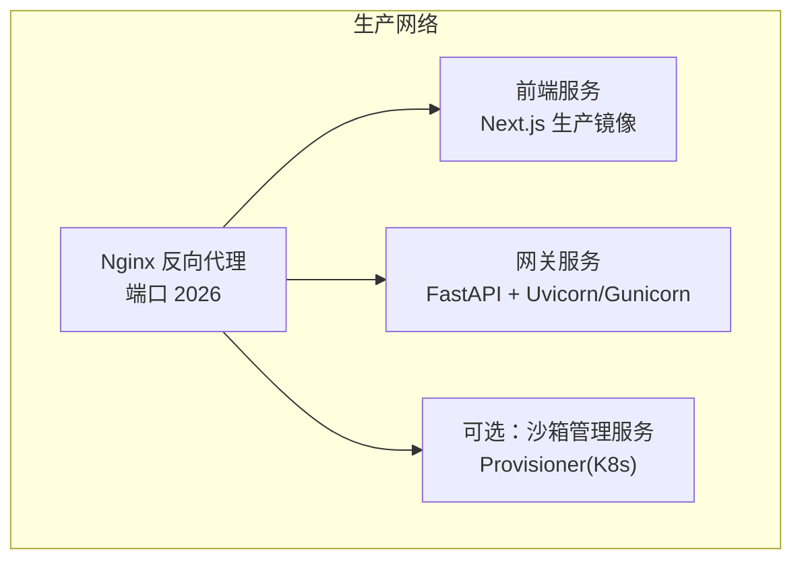
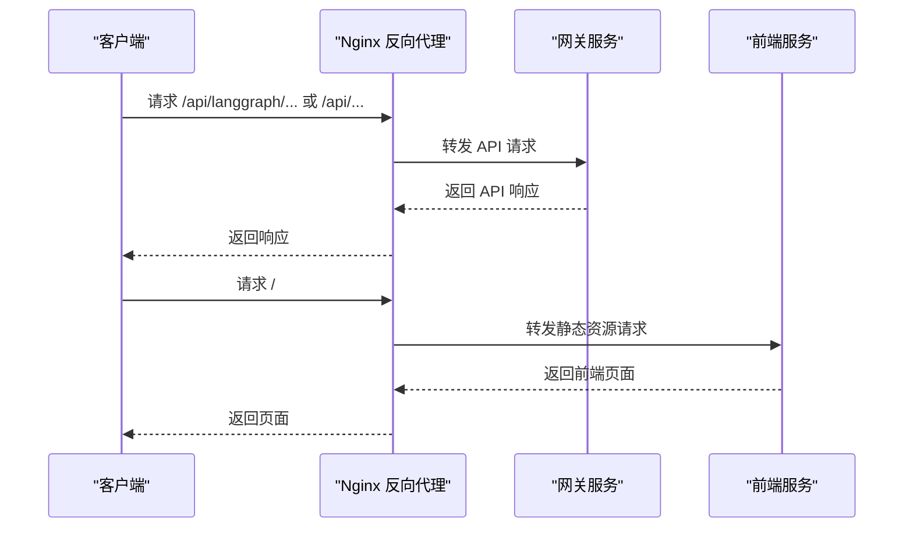
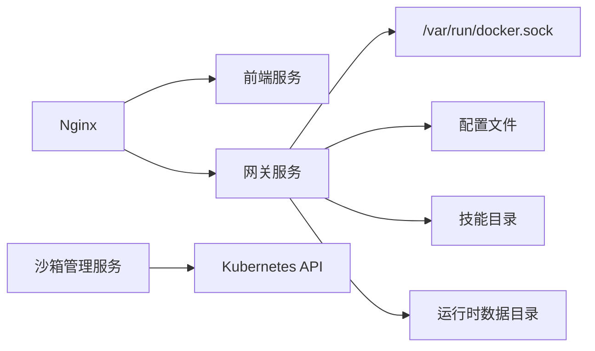

# 生产环境部署

<cite>
**本文档引用的文件**
- [docker-compose.yaml](file://docker/docker-compose.yaml)
- [docker-compose.prod.yml](file://docker-compose.prod.yml)
- [nginx.conf](file://docker/nginx/nginx.conf)
- [nginx.local.conf](file://docker/nginx/nginx.local.conf)
- [nginx.practice.conf](file://docker/nginx/nginx.practice.conf)
- [backend/Dockerfile](file://backend/Dockerfile)
- [frontend/Dockerfile](file://frontend/Dockerfile)
- [practice/Dockerfile](file://practice/Dockerfile)
- [scripts/deploy.sh](file://scripts/deploy.sh)
- [Makefile](file://Makefile)
- [config.example.yaml](file://config.example.yaml)
- [extensions_config.example.json](file://extensions_config.example.json)
- [scripts/configure.py](file://scripts/configure.py)
- [CONTRIBUTING.md](file://CONTRIBUTING.md)
- [Install.md](file://Install.md)
- [scripts/tool-error-degradation-detection.sh](file://scripts/tool-error-degradation-detection.sh)
</cite>

## 目录
1. [简介](#简介)
2. [项目结构](#项目结构)
3. [核心组件](#核心组件)
4. [架构总览](#架构总览)
5. [详细组件分析](#详细组件分析)
6. [依赖关系分析](#依赖关系分析)
7. [性能考虑](#性能考虑)
8. [故障排除指南](#故障排除指南)
9. [结论](#结论)
10. [附录](#附录)

## 简介
本指南面向生产环境部署 DeerFlow，提供容器化部署方案、反向代理与负载均衡配置、环境变量与安全设置、性能优化参数、完整部署流程（镜像构建、服务启动、健康检查与监控）、SSL 证书与域名绑定、CDN 集成最佳实践，以及部署后的验证与故障排除建议。

## 项目结构
生产部署采用 Docker Compose 编排，包含以下核心服务：
- Nginx 反向代理：统一入口、路由 API 与前端静态资源、CORS 处理、长连接与流式传输支持
- 前端服务：Next.js 生产镜像，提供 Web 界面
- 网关服务：FastAPI 网关与 Agent 运行时，提供 API、文档与健康检查
- 可选沙箱管理服务：Kubernetes 沙箱编排（本地 Docker Desktop/OrbStack）

图表来源
- [docker-compose.yaml:25-150](file://docker/docker-compose.yaml#L25-L150)
- [nginx.conf:20-234](file://docker/nginx/nginx.conf#L20-L234)

章节来源
- [docker-compose.yaml:1-150](file://docker/docker-compose.yaml#L1-L150)
- [Makefile:177-184](file://Makefile#L177-L184)

## 核心组件
- Nginx 反向代理
  - 路由规则：/api/langgraph/* → 网关；/api/*（除特定前缀） → 网关；其余 → 前端
  - 流式与长连接：SSE/Streaming 关闭缓冲、禁用代理缓存、设置超时
  - CORS：集中添加响应头，隐藏上游重复头
  - 上传：支持大文件上传与关闭请求缓冲
- 前端服务
  - 使用 Next.js 生产镜像，启动命令为 pnpm start
  - 通过 BETTER_AUTH_SECRET 保障会话安全
- 网关服务
  - 使用 Gunicorn + Uvicorn Worker 运行 FastAPI 应用
  - 挂载配置文件、技能目录、运行时数据目录与 Docker Socket（DooD）
  - 环境变量驱动 JWT、CORS、数据库与 LLM 配置
- 沙箱管理服务（可选）
  - 通过 K8s API 管理沙箱生命周期，健康检查端点 /health

章节来源
- [nginx.conf:20-234](file://docker/nginx/nginx.conf#L20-L234)
- [frontend/Dockerfile:37-51](file://frontend/Dockerfile#L37-L51)
- [backend/Dockerfile:72-80](file://backend/Dockerfile#L72-L80)
- [docker-compose.yaml:116-147](file://docker/docker-compose.yaml#L116-L147)

## 架构总览
生产部署采用“Nginx → 网关/前端”的双栈架构，Nginx 作为统一入口负责路由、CORS、流式传输与静态资源回源。网关提供 API 与文档，前端提供 Web 界面。

图表来源
- [nginx.conf:47-231](file://docker/nginx/nginx.conf#L47-L231)
- [docker-compose.yaml:27-114](file://docker/docker-compose.yaml#L27-L114)

## 详细组件分析

### Nginx 反向代理配置
- 路由策略
  - /api/langgraph/* → 重写为 /api/* 再转发至网关
  - /api/models、/api/memory、/api/mcp、/api/skills、/api/agents → 直接转发至网关
  - /api/threads/... 与 /api/threads/[^/]+/uploads → 转发至网关，支持大文件上传
  - /docs、/redoc、/openapi.json → 转发至网关（API 文档）
  - /health → 转发至网关（健康检查）
  - /api/sandboxes → 转发至 provisioner（可选）
  - 其他 /api/* → 转发至网关（未覆盖的 API）
  - 其余请求 → 转发至前端
- 流式与长连接
  - 关闭代理缓冲、禁用缓存、设置 X-Accel-Buffering=no
  - 设置超时：proxy_connect_timeout、proxy_send_timeout、proxy_read_timeout 均为 600s
  - 前端升级：Upgrade/Connection 头透传，支持 WebSocket
- CORS
  - 集中添加 Access-Control-Allow-* 响应头，隐藏上游重复头
  - OPTIONS 预检返回 204
- 上传优化
  - client_max_body_size 100M
  - 上传接口关闭请求缓冲

章节来源
- [nginx.conf:20-234](file://docker/nginx/nginx.conf#L20-L234)

### 前端服务（Next.js 生产镜像）
- 构建目标 prod：预构建并使用 pnpm start 启动
- 环境变量
  - BETTER_AUTH_SECRET：保障会话安全
  - DEER_FLOW_INTERNAL_GATEWAY_BASE_URL：指向网关地址
- Dockerfile 特性
  - 使用 node:22-alpine 基础镜像
  - 支持 NPM_REGISTRY 与 pnpm store 缓存优化

章节来源
- [frontend/Dockerfile:1-51](file://frontend/Dockerfile#L1-L51)
- [docker-compose.yaml:44-61](file://docker/docker-compose.yaml#L44-L61)

### 网关服务（FastAPI + Uvicorn/Gunicorn）
- 运行方式
  - Gunicorn + UvicornWorker，工作进程数默认 4
  - 暴露端口 8001
- 挂载与卷
  - 配置文件、扩展配置、技能目录、运行时数据目录
  - Docker Socket（DooD）：/var/run/docker.sock
  - CLI 认证目录（可选）：~/.claude、~/.codex
- 环境变量
  - JWT 密钥、CORS 源、数据库配置、LLM API Key/BaseURL
  - DEER_FLOW_* 路径与主机映射变量，确保 DooD 正确解析

章节来源
- [backend/Dockerfile:72-80](file://backend/Dockerfile#L72-L80)
- [docker-compose.yaml:63-114](file://docker/docker-compose.yaml#L63-L114)

### 沙箱管理服务（可选）
- 作用：在宿主 Kubernetes 集群中管理每个沙箱的 Pod/Service 生命周期
- 健康检查：/health 端点，间隔 10s，超时 5s，重试 6 次
- 环境变量：K8S 命名空间、沙箱镜像、HostPath/Volune 路径、KUBECONFIG 路径、节点主机名与 API Server

章节来源
- [docker-compose.yaml:116-147](file://docker/docker-compose.yaml#L116-L147)

### 生产环境 Compose（独立部署）
- 端口映射
  - 后端：8001 → 8001
  - 前端：4000 → 80（Nginx）
- 环境变量
  - DB_BACKEND=sqlite、SQLITE_DIR
  - 角色扮演数据库（云端 MySQL）：HOST/PORT/NAME/USER/PASSWORD
  - DEBUG=false、PORT=8001
  - AUTH_JWT_SECRET、CORS_ORIGINS（允许生产前端访问）
  - OPENAI_API_KEY/API_BASE（供 config.yaml 使用）

章节来源
- [docker-compose.prod.yml:1-53](file://docker-compose.prod.yml#L1-L53)

## 依赖关系分析
- 服务间依赖
  - Nginx 依赖前端与网关服务，确保其先启动
  - 网关依赖 Docker Socket（DooD）与配置文件
  - 前端依赖网关内部基础地址
- 外部依赖
  - Docker 引擎（DooD）
  - 可选：Kubernetes 集群与 kubeconfig
- 网络
  - 使用自定义桥接网络 deer-flow，便于服务发现与通信

图表来源
- [docker-compose.yaml:25-150](file://docker/docker-compose.yaml#L25-L150)

章节来源
- [docker-compose.yaml:25-150](file://docker/docker-compose.yaml#L25-L150)

## 性能考虑
- Nginx
  - 关闭代理缓冲与缓存，提升流式与长连接性能
  - 超时参数统一设为 600s，适配长时间请求
  - 前端静态资源禁用缓冲，避免临时文件写入失败
- 网关
  - Gunicorn + UvicornWorker，合理设置工作进程数
  - 仅挂载必要目录，减少 I/O 开销
- 前端
  - 生产镜像预构建，启动更快
  - pnpm store 缓存与 NPM_REGISTRY 优化安装速度

章节来源
- [nginx.conf:61-73](file://docker/nginx/nginx.conf#L61-L73)
- [backend/Dockerfile:78-80](file://backend/Dockerfile#L78-L80)
- [frontend/Dockerfile:16-22](file://frontend/Dockerfile#L16-L22)

## 故障排除指南
- 常见问题定位
  - 健康检查：访问 /health 确认网关可用
  - 日志查看：使用 make docker-logs 或 docker compose logs
  - Docker Socket：确认 /var/run/docker.sock 存在且可访问
  - CORS：确认 Nginx 添加了 Access-Control-Allow-* 响应头
- SSL 握手错误
  - 若出现 SSL 握手异常，参考工具脚本中的模拟与降级处理思路
- 部署脚本
  - deploy.sh 支持 build/start/down，自动检测沙箱模式并启动相应服务
- 本地开发对比
  - 本地开发使用 nginx.local.conf，生产使用 docker/nginx/nginx.conf

章节来源
- [scripts/deploy.sh:167-274](file://scripts/deploy.sh#L167-L274)
- [scripts/tool-error-degradation-detection.sh:42-81](file://scripts/tool-error-degradation-detection.sh#L42-L81)
- [nginx.local.conf:26-246](file://docker/nginx/nginx.local.conf#L26-L246)

## 结论
本指南提供了 DeerFlow 生产环境的完整部署方案：容器化编排、反向代理与路由、安全与性能优化、环境变量与配置、健康检查与监控、SSL 与域名绑定、CDN 集成建议，以及部署后验证与故障排除流程。按照本指南操作，可在生产环境中稳定运行 DeerFlow。

## 附录

### 环境变量清单（生产）
- 基础
  - PORT：Nginx 监听端口，默认 2026
  - DEER_FLOW_PROJECT_ROOT：项目根目录
  - DEER_FLOW_HOME：运行时数据目录
  - DEER_FLOW_CONFIG_PATH：config.yaml 路径
  - DEER_FLOW_EXTENSIONS_CONFIG_PATH：extensions_config.json 路径
  - DEER_FLOW_SKILLS_PATH：技能目录
  - DEER_FLOW_DOCKER_SOCKET：Docker Socket 路径
  - DEER_FLOW_REPO_ROOT：仓库根目录（DooD）
- 安全
  - BETTER_AUTH_SECRET：前端认证密钥
  - AUTH_JWT_SECRET：JWT 密钥
- 网关
  - DEER_FLOW_INTERNAL_GATEWAY_BASE_URL：网关内部地址
  - DEER_FLOW_CHANNELS_LANGGRAPH_URL、DEER_FLOW_CHANNELS_GATEWAY_URL
  - DEER_FLOW_HOST_BASE_DIR、DEER_FLOW_HOST_SKILLS_PATH、DEER_FLOW_SANDBOX_HOST
- 数据库
  - DB_BACKEND、SQLITE_DIR（SQLite）
  - ROLEPLAY_DB_HOST、ROLEPLAY_DB_PORT、ROLEPLAY_DB_NAME、ROLEPLAY_DB_USER、ROLEPLAY_DB_PASSWORD（MySQL）
- CORS
  - CORS_ORIGINS：允许的前端源
- LLM
  - OPENAI_API_KEY、OPENAI_API_BASE

章节来源
- [docker-compose.yaml:10-114](file://docker/docker-compose.yaml#L10-L114)
- [docker-compose.prod.yml:15-34](file://docker-compose.prod.yml#L15-L34)

### 部署流程（镜像构建 → 服务启动 → 健康检查 → 监控）
- 镜像构建
  - 使用 docker compose 构建 frontend 与 backend 镜像
- 服务启动
  - 启动 nginx、frontend、gateway；如启用 Kubernetes 沙箱，同时启动 provisioner
- 健康检查
  - 访问 /health 确认网关可用
  - provisioner 健康检查端点 /health
- 监控
  - 使用 docker compose logs 查看日志
  - Makefile 提供便捷命令（make docker-logs、make docker-logs-gateway、make docker-logs-frontend）

章节来源
- [scripts/deploy.sh:180-274](file://scripts/deploy.sh#L180-L274)
- [Makefile:177-184](file://Makefile#L177-L184)

### SSL 证书配置、域名绑定与 CDN 集成最佳实践
- SSL 证书
  - 将证书与私钥放置于 Nginx 配置中，启用 HTTPS 监听
  - 使用强密码套件与 TLS 1.2+/1.3
- 域名绑定
  - 在 Nginx 中配置 server_name，并将域名解析到服务器 IP
- CDN 集成
  - 前端静态资源通过 CDN 加速，API 仍经 Nginx → 网关
  - 注意 CDN 缓存策略与长连接兼容性

（本节为通用实践说明，不直接分析具体文件）

### 部署后验证步骤
- 访问 Web 界面：http://<域名或IP>:<PORT>
- 访问 API：http://<域名或IP>:<PORT>/api/*
- 访问文档：http://<域名或IP>:<PORT>/docs、/redoc、/openapi.json
- 健康检查：http://<域名或IP>:<PORT>/health
- 上传测试：尝试上传大文件，确认 client_max_body_size 与关闭缓冲生效

章节来源
- [nginx.conf:179-187](file://docker/nginx/nginx.conf#L179-L187)
- [docker-compose.yaml:25-42](file://docker/docker-compose.yaml#L25-L42)