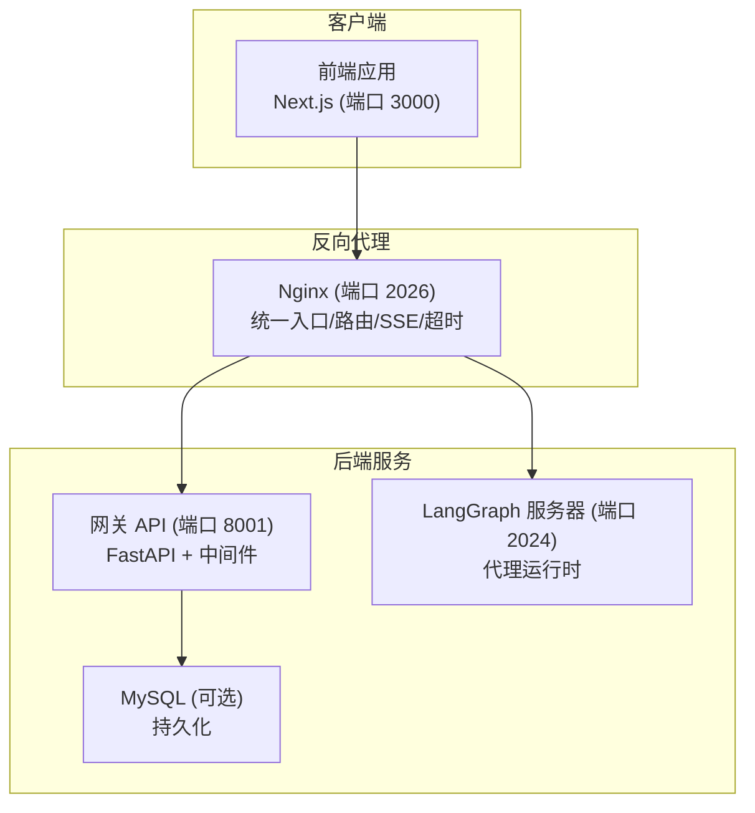
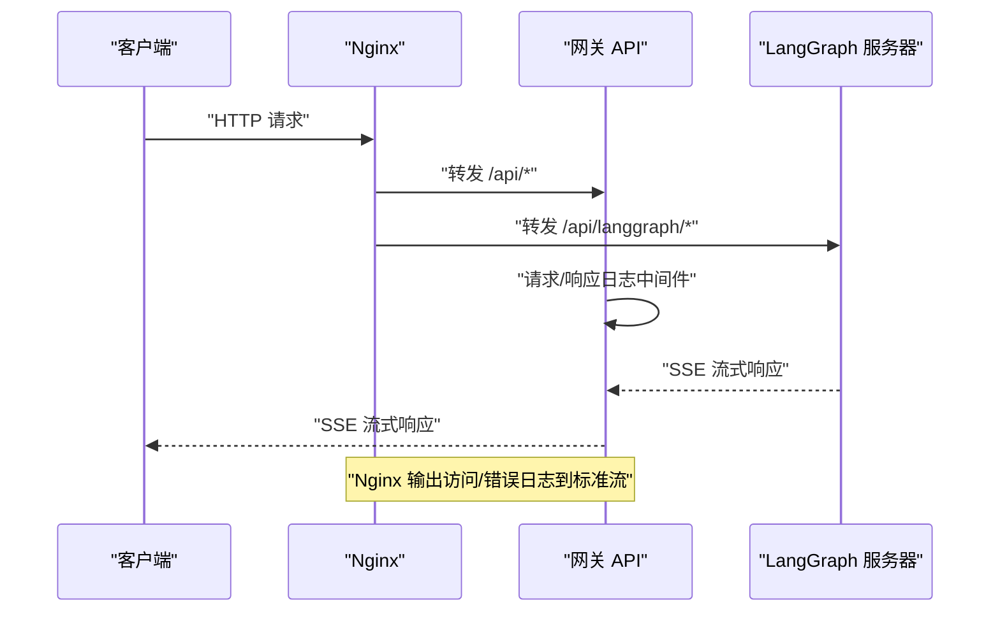
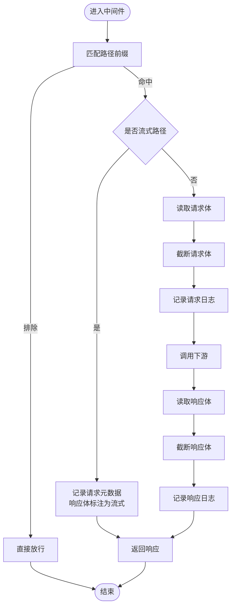
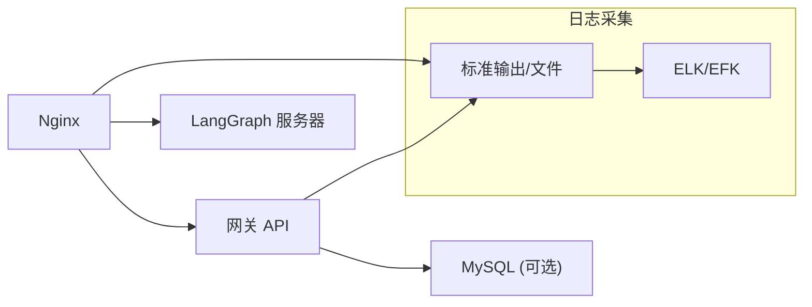

# 监控与日志

<cite>
**本文引用的文件**
- [CONFIGURATION.md](file://backend/docs/CONFIGURATION.md)
- [ARCHITECTURE.md](file://backend/docs/ARCHITECTURE.md)
- [logging_middleware.py](file://backend/app/gateway/logging_middleware.py)
- [nginx.conf](file://docker/nginx/nginx.conf)
- [docker-compose.yml](file://docker-compose.yml)
- [Makefile](file://Makefile)
- [CONTRIBUTING.md](file://CONTRIBUTING.md)
- [README.md](file://README.md)
- [middleware-execution-flow.md](file://backend/docs/middleware-execution-flow.md)
- [status.sh](file://skills/public/claude-to-deerflow/scripts/status.sh)
- [run_eval.py](file://skills/public/skill-creator/scripts/run_eval.py)
- [viewer.html](file://skills/public/skill-creator/eval-viewer/viewer.html)
- [eval_review.html](file://skills/public/skill-creator/assets/eval_review.html)
</cite>

## 目录
1. [简介](#简介)
2. [项目结构](#项目结构)
3. [核心组件](#核心组件)
4. [架构总览](#架构总览)
5. [详细组件分析](#详细组件分析)
6. [依赖分析](#依赖分析)
7. [性能考虑](#性能考虑)
8. [故障排查指南](#故障排查指南)
9. [结论](#结论)
10. [附录](#附录)

## 简介
本指南面向 DeerFlow 系统的监控与日志管理，聚焦以下目标：
- 系统监控架构与日志采集配置：应用日志、访问日志、错误日志的分类与落盘策略
- 性能监控指标：响应时间、吞吐量、资源使用率、错误率等
- 日志聚合与分析：ELK Stack 或类似方案的集成思路
- 告警机制：阈值设置、通知方式与故障自动恢复建议
- 日志轮转、存储管理与合规性要求

## 项目结构
DeerFlow 采用多服务架构，前端、后端网关、LangGraph 代理运行时、Nginx 反向代理共同组成系统。日志与监控涉及：
- Nginx 访问/错误日志输出至标准流，便于外部日志栈采集
- 后端网关内置请求/响应日志中间件，过滤大体量流式响应
- Docker Compose 将后端日志挂载到宿主机，便于统一采集
- 前端与后端均提供健康检查与状态查询脚本，辅助运维观测

图表来源
- [nginx.conf:20-232](file://docker/nginx/nginx.conf#L20-L232)
- [docker-compose.yml:26-66](file://docker-compose.yml#L26-L66)
- [ARCHITECTURE.md:1-51](file://backend/docs/ARCHITECTURE.md#L1-L51)

章节来源
- [nginx.conf:1-234](file://docker/nginx/nginx.conf#L1-L234)
- [docker-compose.yml:1-81](file://docker-compose.yml#L1-L81)
- [ARCHITECTURE.md:1-51](file://backend/docs/ARCHITECTURE.md#L1-L51)

## 核心组件
- 请求/响应日志中间件：记录 API 请求参数、响应状态与体内容（对流式响应进行特殊处理），并限制日志体量
- Nginx：统一入口、路由转发、SSE 支持、长连接超时、访问/错误日志输出到标准流
- Docker Compose：后端容器挂载日志目录，便于外部采集
- 健康检查与状态脚本：提供健康检查、模型/技能/线程等状态查询能力

章节来源
- [logging_middleware.py:1-153](file://backend/app/gateway/logging_middleware.py#L1-L153)
- [nginx.conf:13-15](file://docker/nginx/nginx.conf#L13-L15)
- [docker-compose.yml:40-42](file://docker-compose.yml#L40-L42)
- [status.sh:27-38](file://skills/public/claude-to-deerflow/scripts/status.sh#L27-L38)

## 架构总览
下图展示请求在系统中的流转路径，以及日志与监控的关键节点。

图表来源
- [nginx.conf:47-73](file://docker/nginx/nginx.conf#L47-L73)
- [logging_middleware.py:76-153](file://backend/app/gateway/logging_middleware.py#L76-L153)

章节来源
- [nginx.conf:47-73](file://docker/nginx/nginx.conf#L47-L73)
- [logging_middleware.py:76-153](file://backend/app/gateway/logging_middleware.py#L76-L153)

## 详细组件分析

### 请求/响应日志中间件
- 功能要点
  - 匹配 API 路径前缀，排除文档与静态资源
  - 区分流式路径（LangGraph/Threads/Runs），避免记录大体量响应体
  - 对非流式请求记录请求体；对流式响应仅记录占位信息
  - 对日志体进行截断，防止日志膨胀
- 日志分类
  - 应用日志：由中间件统一记录请求/响应元数据
  - 访问日志：由 Nginx 统一记录访问与错误
  - 错误日志：异常捕获与错误响应体记录（受截断保护）

图表来源
- [logging_middleware.py:43-153](file://backend/app/gateway/logging_middleware.py#L43-L153)

章节来源
- [logging_middleware.py:1-153](file://backend/app/gateway/logging_middleware.py#L1-L153)

### Nginx 日志与路由
- 访问/错误日志输出到标准流，便于容器日志驱动（如 Docker/Compose）或外部日志栈采集
- 路由规则将 /api/langgraph/* 重写为 /api/* 再转发给网关
- 对 SSE/流式场景关闭代理缓冲，设置长超时，确保实时性
- 对上传接口启用大文件支持与请求缓冲控制

章节来源
- [nginx.conf:13-15](file://docker/nginx/nginx.conf#L13-L15)
- [nginx.conf:47-73](file://docker/nginx/nginx.conf#L47-L73)
- [nginx.conf:125-137](file://docker/nginx/nginx.conf#L125-L137)

### Docker Compose 日志挂载
- 后端容器将日志目录挂载到宿主机，便于集中采集与轮转
- MySQL 容器配置健康检查，便于监控数据库可用性

章节来源
- [docker-compose.yml:40-42](file://docker-compose.yml#L40-L42)
- [docker-compose.yml:19-24](file://docker-compose.yml#L19-L24)

### 健康检查与状态查询
- 健康检查：通过 /health 接口判断服务可达性
- 状态脚本：支持列出模型、技能、代理、线程、内存等信息，辅助运维观测

章节来源
- [status.sh:27-38](file://skills/public/claude-to-deerflow/scripts/status.sh#L27-L38)
- [status.sh:40-68](file://skills/public/claude-to-deerflow/scripts/status.sh#L40-L68)

## 依赖分析
- 组件耦合
  - Nginx 作为统一入口，耦合网关与 LangGraph 服务
  - 网关中间件与上游 FastAPI 应用强耦合，需保持日志策略一致性
  - Docker Compose 将后端日志暴露到宿主机，降低外部采集成本
- 外部依赖
  - 外部日志栈（如 ELK/EFK）通过容器日志采集器对接 Nginx 与后端标准输出
  - MySQL 健康检查用于数据库可用性监控

图表来源
- [nginx.conf:13-15](file://docker/nginx/nginx.conf#L13-L15)
- [docker-compose.yml:40-42](file://docker-compose.yml#L40-L42)

章节来源
- [nginx.conf:13-15](file://docker/nginx/nginx.conf#L13-L15)
- [docker-compose.yml:40-42](file://docker-compose.yml#L40-L42)

## 性能考虑
- 缓存与加载
  - MCP 工具与配置基于文件时间戳缓存，变更时重新初始化
  - 技能解析在启动时缓存，减少运行时开销
- 流式传输
  - 使用 SSE 实现实时响应，降低首 token 时间
  - Nginx 关闭缓冲并设置长超时，保障流式体验
- 上下文管理
  - 摘要中间件在接近令牌上限时进行摘要，平衡性能与上下文长度

章节来源
- [ARCHITECTURE.md:466-485](file://backend/docs/ARCHITECTURE.md#L466-L485)
- [nginx.conf:61-70](file://docker/nginx/nginx.conf#L61-L70)

## 故障排查指南
- 健康检查失败
  - 使用状态脚本检查 /health 返回码，确认服务可达性
- API 文档不可达
  - 确认 /docs、/redoc、/openapi.json 路由已正确转发到网关
- 流式响应异常
  - 检查 Nginx 是否关闭缓冲、是否设置长超时
  - 确认中间件未对流式响应记录体内容
- 日志缺失
  - 检查 Nginx 访问/错误日志是否输出到标准流
  - 检查后端容器日志目录是否正确挂载
- Docker 权限问题
  - Linux 下为当前用户添加 docker 组，重新登录后重试

章节来源
- [status.sh:27-38](file://skills/public/claude-to-deerflow/scripts/status.sh#L27-L38)
- [nginx.conf:13-15](file://docker/nginx/nginx.conf#L13-L15)
- [docker-compose.yml:40-42](file://docker-compose.yml#L40-L42)
- [CONTRIBUTING.md:92-125](file://CONTRIBUTING.md#L92-L125)

## 结论
- DeerFlow 的日志体系以 Nginx 与网关中间件为核心，结合 Docker 标准输出实现统一采集
- 性能方面通过流式传输与缓存策略优化响应时间与吞吐量
- 建议在生产环境引入外部日志栈进行聚合与分析，并结合健康检查与状态脚本建立基础告警

## 附录

### 日志分类与落盘策略
- 应用日志
  - 网关中间件记录请求/响应元数据，流式响应仅记录占位信息
  - 建议将中间件日志输出到标准输出，交由容器日志驱动统一采集
- 访问日志
  - Nginx 将访问/错误日志输出到标准流，便于外部日志栈采集
- 错误日志
  - 异常与错误响应体经截断处理，避免日志膨胀

章节来源
- [logging_middleware.py:76-153](file://backend/app/gateway/logging_middleware.py#L76-L153)
- [nginx.conf:13-15](file://docker/nginx/nginx.conf#L13-L15)

### 性能监控指标建议
- 响应时间
  - 网关路由级：Nginx 计时与上游响应时间
  - LangGraph 级：SSE 首包延迟与整体完成时间
- 吞吐量
  - 每秒请求数（QPS）、每秒事件数（SSE 事件）
- 资源使用率
  - CPU/内存/磁盘 IO（容器与主机维度）
- 错误率
  - HTTP 5xx 比例、LangGraph 执行失败比例、工具调用失败比例

### 日志聚合与分析（ELK/EFK 集成）
- 输入
  - Nginx 访问/错误日志（标准输出）
  - 后端应用日志（标准输出）
- 处理
  - 使用 Filebeat/Fluent Bit 收集容器日志
  - 使用 Logstash/Fluentd 进行解析与字段提取
- 存储与可视化
  - Elasticsearch 存储，Kibana/类似面板进行可视化
- 建议字段
  - 时间戳、请求方法、路径、状态码、客户端 IP、响应体大小、错误信息等

### 告警机制配置
- 阈值设置
  - HTTP 5xx 错误率、响应时间 P95/P99、SSE 断流次数
- 通知方式
  - 邮件、IM（钉钉/飞书/Slack/Teams）机器人
- 故障自动恢复
  - 服务自愈：重启容器、扩容副本
  - 降级策略：禁用高开销工具/MCP 服务器

### 日志轮转、存储管理与合规
- 日志轮转
  - 使用 systemd-journald/docker 日志驱动自带轮转
  - 或使用 logrotate 对挂载的日志目录进行轮转
- 存储管理
  - 控制单文件大小与保留天数，定期清理过期日志
- 合规性
  - 限制敏感字段（如 API Key）入日志
  - 通过环境变量注入密钥，避免硬编码
  - 遵循最小可见原则，仅记录必要字段

章节来源
- [CONFIGURATION.md:318-329](file://backend/docs/CONFIGURATION.md#L318-L329)
- [docker-compose.yml:40-42](file://docker-compose.yml#L40-L42)

### 评估与度量参考
- 技能评估与指标
  - 技能评估脚本与报告页面展示了通过率、耗时等指标，可用于性能基线与回归对比

章节来源
- [run_eval.py:213-245](file://skills/public/skill-creator/scripts/run_eval.py#L213-L245)
- [viewer.html:1156-1180](file://skills/public/skill-creator/eval-viewer/viewer.html#L1156-L1180)
- [eval_review.html:44-85](file://skills/public/skill-creator/assets/eval_review.html#L44-L85)