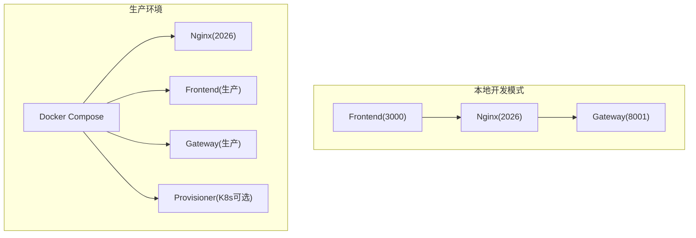
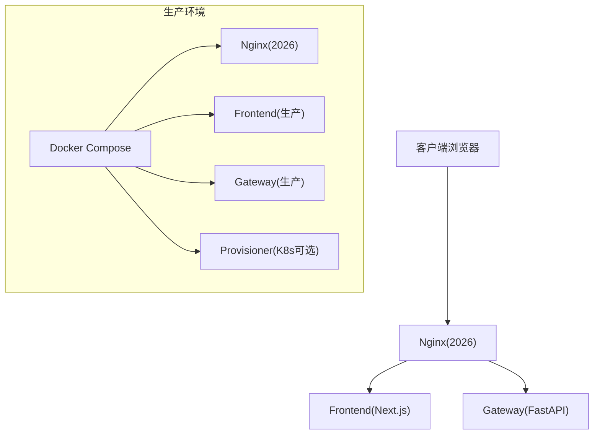
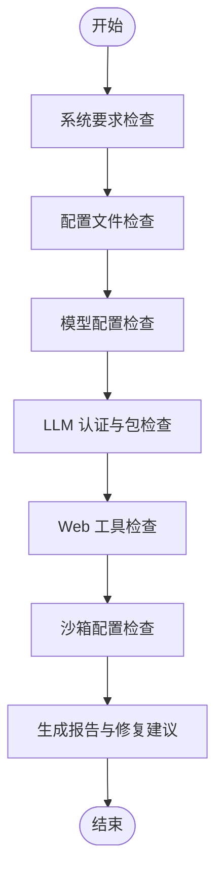
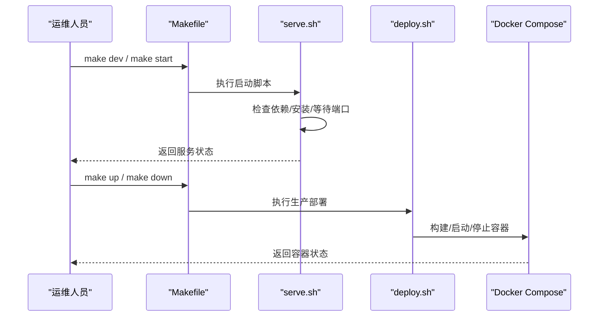
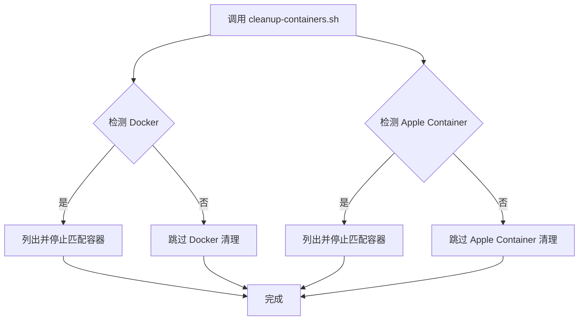
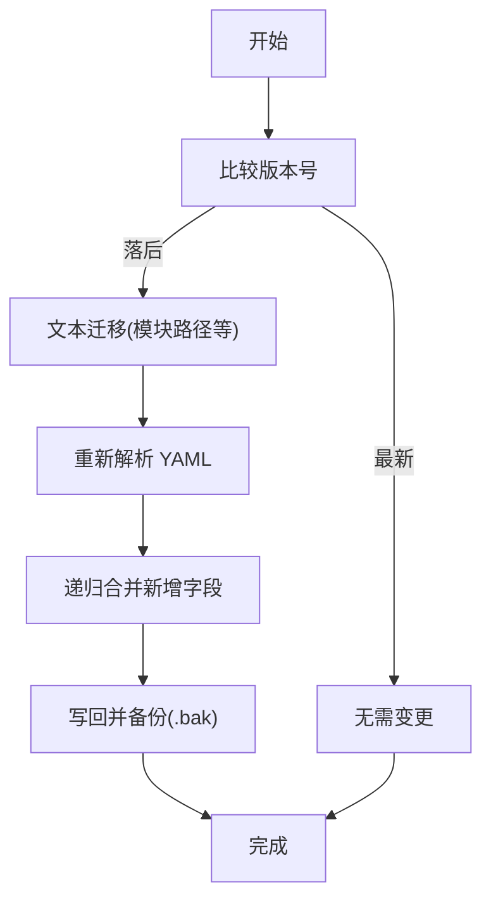
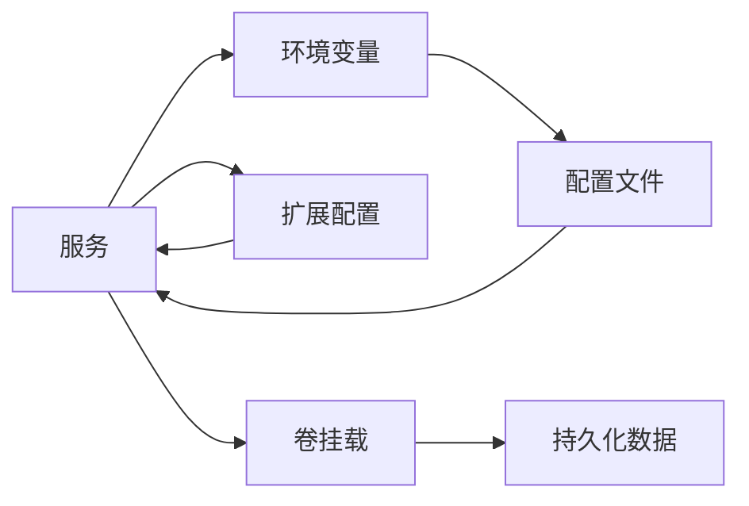

# 维护与故障排除

<cite>
**本文档引用的文件**
- [README.md](file://README.md)
- [backend/README.md](file://backend/README.md)
- [Makefile](file://Makefile)
- [scripts/doctor.py](file://scripts/doctor.py)
- [scripts/check.py](file://scripts/check.py)
- [scripts/setup_wizard.py](file://scripts/setup_wizard.py)
- [scripts/serve.sh](file://scripts/serve.sh)
- [scripts/deploy.sh](file://scripts/deploy.sh)
- [scripts/cleanup-containers.sh](file://scripts/cleanup-containers.sh)
- [scripts/wait-for-port.sh](file://scripts/wait-for-port.sh)
- [scripts/config-upgrade.sh](file://scripts/config-upgrade.sh)
- [scripts/tool-error-degradation-detection.sh](file://scripts/tool-error-degradation-detection.sh)
- [docker/docker-compose.yaml](file://docker/docker-compose.yaml)
</cite>

## 目录
1. [简介](#简介)
2. [项目结构](#项目结构)
3. [核心组件](#核心组件)
4. [架构总览](#架构总览)
5. [详细组件分析](#详细组件分析)
6. [依赖关系分析](#依赖关系分析)
7. [性能考虑](#性能考虑)
8. [故障排除指南](#故障排除指南)
9. [结论](#结论)
10. [附录](#附录)

## 简介
本操作手册面向 DeerFlow 系统的运维与支持团队，提供系统日常维护任务清单与最佳实践，涵盖数据库备份、缓存清理、日志清理与系统更新；同时给出常见故障的诊断方法与解决步骤，包括服务不可用、性能下降、内存泄漏与网络连接问题，并提供故障排除的系统化方法论（问题定位、根因分析与修复验证），以及紧急情况的应急预案与灾难恢复流程。最后，手册还包含运维脚本的使用说明与自动化工具的配置方法，帮助快速恢复与稳定运行。

## 项目结构
DeerFlow 采用前后端分离与容器化部署架构，核心服务通过 Nginx 反向代理统一入口，后端 Gateway 负责 REST API 与嵌入式代理运行时，前端 Next.js 提供用户界面，Docker Compose 管理多服务编排。运维脚本集中于 scripts/ 目录，Makefile 提供统一命令入口，便于一键安装、启动、停止与清理。

图表来源
- [scripts/serve.sh:255-268](file://scripts/serve.sh#L255-L268)
- [scripts/deploy.sh:25-42](file://scripts/deploy.sh#L25-L42)
- [docker/docker-compose.yaml:25-42](file://docker/docker-compose.yaml#L25-L42)

章节来源
- [README.md:205-318](file://README.md#L205-L318)
- [backend/README.md:7-41](file://backend/README.md#L7-L41)
- [Makefile:19-46](file://Makefile#L19-L46)

## 核心组件
- 健康检查与诊断：提供 make doctor 与独立脚本 doctor.py，覆盖系统要求、配置版本、模型配置、LLM 认证与包依赖、Web 能力、沙箱配置等。
- 启动与停止：serve.sh 统一管理 Gateway、Frontend、Nginx 的启动、停止与守护模式；deploy.sh 管理生产环境镜像构建与容器编排。
- 容器清理：cleanup-containers.sh 支持 Docker 与 Apple Container 运行时的沙箱容器清理。
- 端口等待：wait-for-port.sh 提供端口可用性检测，避免启动阶段误判。
- 配置升级：config-upgrade.sh 自动迁移与合并新增字段，生成备份。
- 故障降级检测：tool-error-degradation-detection.sh 检测工具失败降级能力，确保单点错误不中断会话。

章节来源
- [scripts/doctor.py:632-722](file://scripts/doctor.py#L632-L722)
- [scripts/serve.sh:74-102](file://scripts/serve.sh#L74-L102)
- [scripts/deploy.sh:167-178](file://scripts/deploy.sh#L167-L178)
- [scripts/cleanup-containers.sh:21-96](file://scripts/cleanup-containers.sh#L21-L96)
- [scripts/wait-for-port.sh:23-43](file://scripts/wait-for-port.sh#L23-L43)
- [scripts/config-upgrade.sh:46-156](file://scripts/config-upgrade.sh#L46-L156)
- [scripts/tool-error-degradation-detection.sh:27-219](file://scripts/tool-error-degradation-detection.sh#L27-L219)

## 架构总览
下图展示本地开发与生产环境的服务路由与依赖关系，便于在故障排查中快速定位问题来源。

图表来源
- [backend/README.md:37-41](file://backend/README.md#L37-L41)
- [docker/docker-compose.yaml:25-42](file://docker/docker-compose.yaml#L25-L42)

章节来源
- [backend/README.md:7-41](file://backend/README.md#L7-L41)
- [docker/docker-compose.yaml:1-24](file://docker/docker-compose.yaml#L1-L24)

## 详细组件分析

### 健康检查与诊断组件
- 功能概述：doctor.py 与 check.py 分别提供交互式健康检查与基础依赖检查，输出状态与修复建议，支持颜色输出与可读性优化。
- 关键流程：
  - 系统要求检查（Python、Node、pnpm、uv、nginx）
  - 配置文件存在性与版本检查
  - 模型配置与加载验证
  - LLM API 密钥与认证路径检查
  - Web 搜索/抓取工具配置与可用性
  - 沙箱执行模式与容器运行时检测
- 使用建议：
  - 日常巡检：make doctor 或直接运行 scripts/doctor.py
  - 依赖确认：make check 或 scripts/check.py
  - 配置升级：make config-upgrade 或 scripts/config-upgrade.sh

图表来源
- [scripts/doctor.py:650-718](file://scripts/doctor.py#L650-L718)
- [scripts/check.py:60-167](file://scripts/check.py#L60-L167)

章节来源
- [scripts/doctor.py:132-615](file://scripts/doctor.py#L132-L615)
- [scripts/check.py:60-167](file://scripts/check.py#L60-L167)

### 启动与停止组件
- 统一启动器：serve.sh 支持开发/生产模式、守护模式、跳过安装、停止与重启；自动等待端口可用并记录日志。
- 生产部署：deploy.sh 自动检测沙箱模式（local/aio/provisioner），处理配置与扩展配置文件，生成或加载 BETTER_AUTH_SECRET，并按需挂载 Docker Socket。
- Makefile 入口：提供 make dev/start/dev-daemon/start-daemon/clean/up/down 等常用命令，简化运维操作。

图表来源
- [Makefile:116-184](file://Makefile#L116-L184)
- [scripts/serve.sh:255-268](file://scripts/serve.sh#L255-L268)
- [scripts/deploy.sh:183-258](file://scripts/deploy.sh#L183-L258)

章节来源
- [Makefile:19-184](file://Makefile#L19-L184)
- [scripts/serve.sh:115-294](file://scripts/serve.sh#L115-L294)
- [scripts/deploy.sh:130-274](file://scripts/deploy.sh#L130-L274)

### 容器清理与端口等待组件
- 容器清理：cleanup-containers.sh 同时兼容 Docker 与 Apple Container，按前缀清理沙箱容器，避免残留导致资源占用与权限问题。
- 端口等待：wait-for-port.sh 通过 lsof/ss/netstat 检测端口监听状态，超时退出并返回错误码，便于脚本化等待与重试。

图表来源
- [scripts/cleanup-containers.sh:21-96](file://scripts/cleanup-containers.sh#L21-L96)

章节来源
- [scripts/cleanup-containers.sh:1-96](file://scripts/cleanup-containers.sh#L1-L96)
- [scripts/wait-for-port.sh:16-57](file://scripts/wait-for-port.sh#L16-L57)

### 配置升级与故障降级检测
- 配置升级：config-upgrade.sh 在版本落后时自动迁移模块路径等文本替换，并递归合并新增字段，保留原配置并生成 .bak 备份。
- 故障降级：tool-error-degradation-detection.sh 模拟工具调用异常，验证中间件链是否能将错误降级为会话继续，避免整次工具序列中断。

图表来源
- [scripts/config-upgrade.sh:46-156](file://scripts/config-upgrade.sh#L46-L156)

章节来源
- [scripts/config-upgrade.sh:1-156](file://scripts/config-upgrade.sh#L1-L156)
- [scripts/tool-error-degradation-detection.sh:27-219](file://scripts/tool-error-degradation-detection.sh#L27-L219)

## 依赖关系分析
- 服务耦合：Nginx 作为统一入口，Frontend 与 Gateway 并行运行；生产环境通过 Docker Compose 解耦各服务，支持按需启用 Provisioner。
- 外部依赖：容器运行时（Docker/Apple Container）、Node.js、pnpm、uv、nginx；生产环境需要 Docker Socket 权限以支持 DooD（Docker-outside-of-Docker）。
- 环境变量：DEER_FLOW_HOME、DEER_FLOW_CONFIG_PATH、DEER_FLOW_EXTENSIONS_CONFIG_PATH、BETTER_AUTH_SECRET、DEER_FLOW_DOCKER_SOCKET 等影响服务行为与数据持久化。

图表来源
- [docker/docker-compose.yaml:75-114](file://docker/docker-compose.yaml#L75-L114)
- [scripts/deploy.sh:58-128](file://scripts/deploy.sh#L58-L128)

章节来源
- [docker/docker-compose.yaml:1-150](file://docker/docker-compose.yaml#L1-L150)
- [scripts/deploy.sh:56-128](file://scripts/deploy.sh#L56-L128)

## 性能考虑
- 启动模式选择：开发模式开启热重载，适合调试；生产模式预构建前端，减少 IO 开销。
- 端口等待与超时：wait-for-port.sh 设置合理超时，避免长时间阻塞；serve.sh 在非守护模式下打印详细日志，便于定位慢启动原因。
- 容器资源：生产环境通过 Docker Compose 控制资源与重启策略；必要时调整 GATEWAY_WORKERS 以适配并发负载。
- 缓存与临时目录：serve.sh 创建并清理临时目录，避免磁盘碎片与权限问题。

[本节为通用指导，无需特定文件引用]

## 故障排除指南

### 服务不可用
- 快速自检
  - 使用 make doctor 或 scripts/doctor.py 检查系统要求、配置与 LLM 认证。
  - 使用 make check 或 scripts/check.py 确认 Node.js、pnpm、uv、nginx 是否就绪。
- 启动排查
  - 本地：执行 make dev 或 scripts/serve.sh --dev，查看 logs/{gateway,frontend,nginx}.log。
  - 生产：执行 make up 或 scripts/deploy.sh，确认容器状态与日志。
- 端口占用
  - 使用 scripts/wait-for-port.sh 检查端口监听状态，必要时使用 scripts/serve.sh --stop 停止旧进程。
- 容器残留
  - 使用 scripts/cleanup-containers.sh 清理沙箱容器，释放资源。

章节来源
- [scripts/doctor.py:632-722](file://scripts/doctor.py#L632-L722)
- [scripts/check.py:60-167](file://scripts/check.py#L60-L167)
- [scripts/serve.sh:74-102](file://scripts/serve.sh#L74-L102)
- [scripts/deploy.sh:167-178](file://scripts/deploy.sh#L167-L178)
- [scripts/wait-for-port.sh:16-57](file://scripts/wait-for-port.sh#L16-L57)
- [scripts/cleanup-containers.sh:1-96](file://scripts/cleanup-containers.sh#L1-L96)

### 性能下降
- 观察指标
  - 查看 Gateway 日志中的请求耗时与并发队列长度。
  - 检查沙箱容器数量与资源占用，必要时限制并发或切换到更安全的隔离模式。
- 调优建议
  - 切换至生产模式（make start）以减少前端热重载开销。
  - 调整 GATEWAY_WORKERS（docker-compose.yaml 中的 workers 数量）。
  - 清理临时目录与日志文件，释放磁盘空间。

章节来源
- [scripts/serve.sh:115-136](file://scripts/serve.sh#L115-L136)
- [docker/docker-compose.yaml:74-74](file://docker/docker-compose.yaml#L74-L74)

### 内存泄漏
- 排查步骤
  - 使用 make doctor 检查配置与依赖，排除外部因素。
  - 查看 Gateway 日志中异常堆栈与重复任务。
  - 使用 scripts/cleanup-containers.sh 清理沙箱容器，避免容器层内存累积。
- 修复建议
  - 升级至最新配置版本（make config-upgrade），应用迁移与补丁。
  - 限制并发子代理数量与超时时间，避免长时间运行任务。

章节来源
- [scripts/config-upgrade.sh:46-156](file://scripts/config-upgrade.sh#L46-L156)
- [scripts/cleanup-containers.sh:1-96](file://scripts/cleanup-containers.sh#L1-L96)

### 网络连接问题
- 常见症状
  - LLM 请求超时或认证失败。
  - Web 搜索/抓取工具报错。
- 排查步骤
  - 使用 scripts/doctor.py 检查 LLM API 密钥与认证路径。
  - 确认 .env 中对应密钥已设置且未被覆盖。
  - 生产环境确认 DEER_FLOW_DOCKER_SOCKET 可用（DooD 需要）。
- 修复建议
  - 重新运行 make setup 或 scripts/setup_wizard.py 生成最小化配置。
  - 如使用容器沙箱，确保 Docker/Apple Container 正常运行。

章节来源
- [scripts/doctor.py:289-440](file://scripts/doctor.py#L289-L440)
- [scripts/setup_wizard.py:21-166](file://scripts/setup_wizard.py#L21-L166)
- [scripts/deploy.sh:229-241](file://scripts/deploy.sh#L229-L241)

### 系统化方法论
- 问题定位
  - 明确现象与影响范围（单用户/全局、API/前端/沙箱）。
  - 截取关键日志与时间线，结合端口等待与容器状态进行交叉验证。
- 根因分析
  - 从配置文件入手，确认版本与字段一致性（make config-upgrade）。
  - 检查环境变量与卷挂载，确保数据持久化与密钥注入正确。
- 修复验证
  - 使用 tool-error-degradation-detection.sh 验证工具失败降级能力。
  - 通过 make doctor 与 make check 进行回归测试。

章节来源
- [scripts/config-upgrade.sh:46-156](file://scripts/config-upgrade.sh#L46-L156)
- [scripts/tool-error-degradation-detection.sh:27-219](file://scripts/tool-error-degradation-detection.sh#L27-L219)
- [scripts/doctor.py:632-722](file://scripts/doctor.py#L632-L722)
- [scripts/check.py:60-167](file://scripts/check.py#L60-L167)

### 应急预案与灾难恢复
- 应急响应
  - 立即执行 make stop 或 scripts/serve.sh --stop 停止所有服务，防止进一步损坏。
  - 备份当前配置与扩展配置（含 .bak），用于回滚。
  - 清理沙箱容器与临时目录，释放资源。
- 灾难恢复
  - 重新生成配置：make setup 或 scripts/setup_wizard.py。
  - 重建镜像与容器：make up 或 scripts/deploy.sh build + scripts/deploy.sh start。
  - 验证健康：make doctor + tool-error-degradation-detection.sh。

章节来源
- [scripts/serve.sh:74-102](file://scripts/serve.sh#L74-L102)
- [scripts/config-upgrade.sh:137-142](file://scripts/config-upgrade.sh#L137-L142)
- [scripts/deploy.sh:183-204](file://scripts/deploy.sh#L183-L204)
- [scripts/tool-error-degradation-detection.sh:27-219](file://scripts/tool-error-degradation-detection.sh#L27-L219)

## 结论
通过本操作手册提供的日常维护任务清单、故障排除方法与应急流程，运维团队可以系统化地保障 DeerFlow 的稳定运行。建议将健康检查与配置升级纳入例行巡检，结合端口等待与容器清理脚本，形成标准化的排障与恢复流程，确保在复杂场景下快速定位并解决问题。

[本节为总结性内容，无需特定文件引用]

## 附录

### 日常维护任务清单
- 每日
  - 运行 make doctor，关注警告项并及时修复。
  - 检查 logs/{gateway,frontend,nginx}.log，定位异常。
  - 清理临时目录与日志文件，保持磁盘空间充足。
- 每周
  - 执行 make config-upgrade，确保配置版本与字段完整。
  - 运行 tool-error-degradation-detection.sh，验证工具失败降级能力。
- 每月
  - 备份 config.yaml 与 extensions_config.json（含 .bak）。
  - 清理沙箱容器与历史日志，释放资源。

章节来源
- [scripts/doctor.py:632-722](file://scripts/doctor.py#L632-L722)
- [scripts/config-upgrade.sh:46-156](file://scripts/config-upgrade.sh#L46-L156)
- [scripts/tool-error-degradation-detection.sh:27-219](file://scripts/tool-error-degradation-detection.sh#L27-L219)
- [scripts/cleanup-containers.sh:1-96](file://scripts/cleanup-containers.sh#L1-L96)

### 运维脚本使用说明
- doctor.py：make doctor 或直接运行，输出状态与修复建议。
- check.py：make check，仅检查依赖是否存在。
- setup_wizard.py：make setup，交互式生成最小化配置。
- serve.sh：make dev/start/dev-daemon/start-daemon/clean/stop，统一控制服务生命周期。
- deploy.sh：make up/down，生产环境镜像构建与容器编排。
- cleanup-containers.sh：清理沙箱容器，兼容 Docker 与 Apple Container。
- wait-for-port.sh：等待端口可用，超时退出。
- config-upgrade.sh：升级配置版本并合并新增字段，生成 .bak。
- tool-error-degradation-detection.sh：检测工具失败降级能力。

章节来源
- [scripts/doctor.py:1-722](file://scripts/doctor.py#L1-L722)
- [scripts/check.py:1-171](file://scripts/check.py#L1-L171)
- [scripts/setup_wizard.py:1-166](file://scripts/setup_wizard.py#L1-L166)
- [scripts/serve.sh:1-294](file://scripts/serve.sh#L1-L294)
- [scripts/deploy.sh:1-274](file://scripts/deploy.sh#L1-L274)
- [scripts/cleanup-containers.sh:1-96](file://scripts/cleanup-containers.sh#L1-L96)
- [scripts/wait-for-port.sh:1-57](file://scripts/wait-for-port.sh#L1-L57)
- [scripts/config-upgrade.sh:1-156](file://scripts/config-upgrade.sh#L1-L156)
- [scripts/tool-error-degradation-detection.sh:1-219](file://scripts/tool-error-degradation-detection.sh#L1-L219)