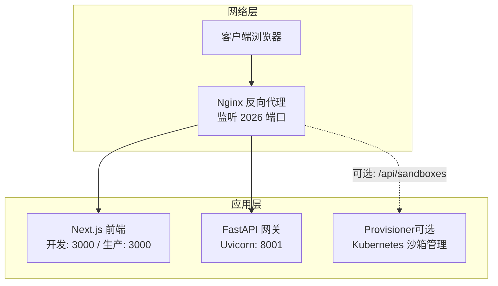
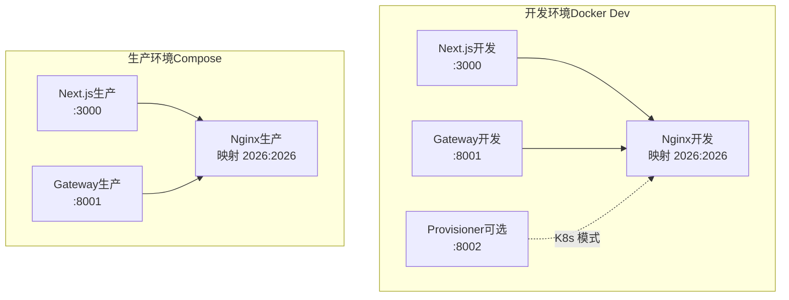
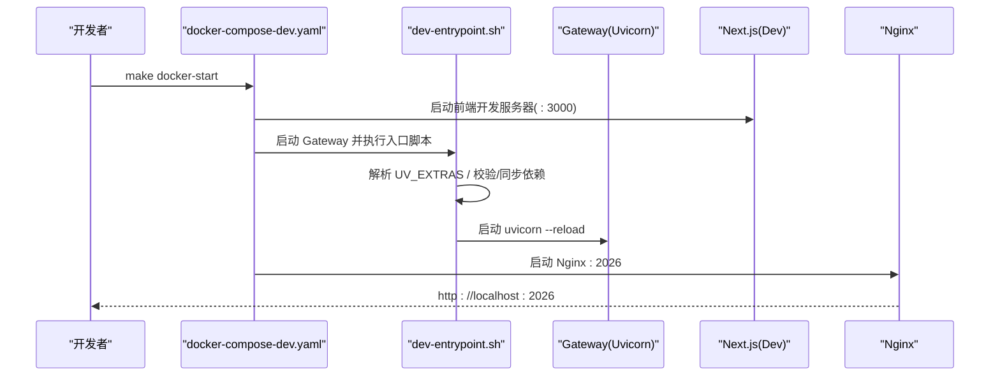
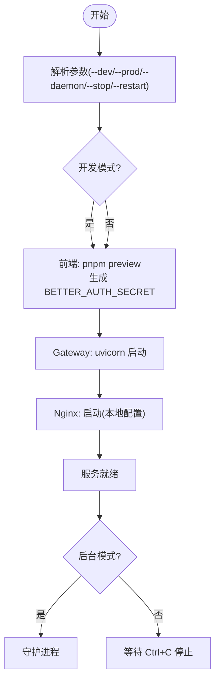
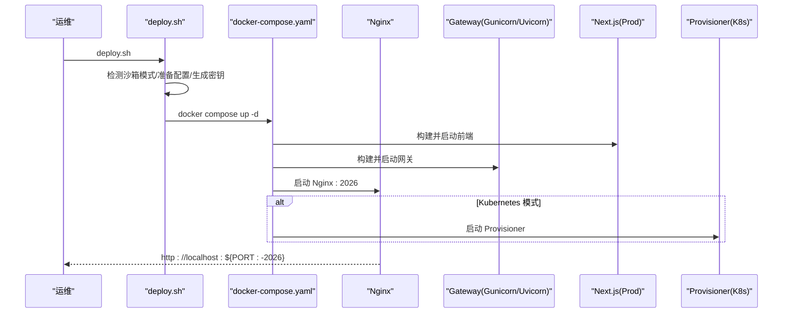
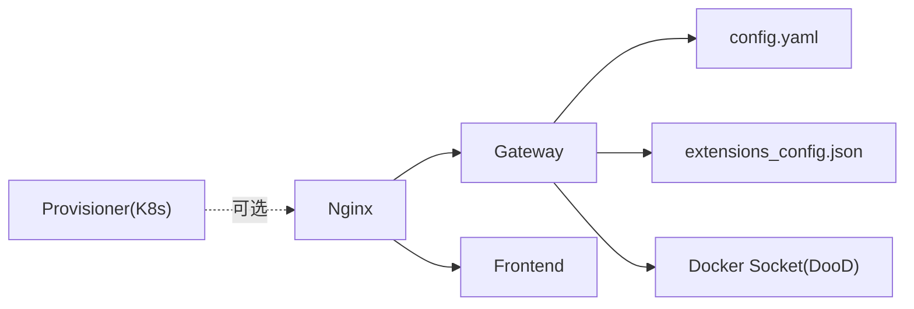

# 部署与运维

<cite>
**本文档引用的文件**
- [docker-compose.yaml](file://docker/docker-compose.yaml)
- [docker-compose-dev.yaml](file://docker/docker-compose-dev.yaml)
- [docker-compose.prod.yml](file://docker-compose.prod.yml)
- [dev-entrypoint.sh](file://docker/dev-entrypoint.sh)
- [Dockerfile（后端）](file://backend/Dockerfile)
- [Dockerfile（前端）](file://frontend/Dockerfile)
- [nginx.conf](file://docker/nginx/nginx.conf)
- [nginx.local.conf](file://docker/nginx/nginx.local.conf)
- [config.example.yaml](file://config.example.yaml)
- [extensions_config.example.json](file://extensions_config.example.json)
- [deploy.sh](file://scripts/deploy.sh)
- [Makefile](file://Makefile)
- [serve.sh](file://scripts/serve.sh)
- [docker.sh](file://scripts/docker.sh)
- [start-daemon.sh](file://scripts/start-daemon.sh)
</cite>

## 目录
1. [简介](#简介)
2. [项目结构](#项目结构)
3. [核心组件](#核心组件)
4. [架构总览](#架构总览)
5. [详细组件分析](#详细组件分析)
6. [依赖关系分析](#依赖关系分析)
7. [性能考量](#性能考量)
8. [故障排除指南](#故障排除指南)
9. [结论](#结论)
10. [附录](#附录)

## 简介
本指南面向运维与开发团队，提供 DeerFlow 在开发与生产环境的完整部署与运维操作手册。内容覆盖：
- 开发环境（Docker 开发环境与本地开发环境）
- 生产环境（容器编排、Nginx 代理、数据库配置）
- 监控与日志管理（访问日志、错误日志、健康检查）
- 故障排除与常见问题解决
- 运维自动化与最佳实践

## 项目结构
DeerFlow 采用前后端分离与反向代理统一入口的架构：
- 前端：Next.js（开发/生产镜像）
- 网关：FastAPI（Uvicorn + Gunicorn，提供 REST API 与 Agent 运行时）
- 反向代理：Nginx（统一路由 /api/* 与静态资源）
- 可选组件：沙箱 Provisioner（Kubernetes 模式）

图表来源
- [docker-compose.yaml:25-150](file://docker/docker-compose.yaml#L25-L150)
- [docker-compose-dev.yaml:15-195](file://docker/docker-compose-dev.yaml#L15-L195)
- [nginx.conf:20-234](file://docker/nginx/nginx.conf#L20-L234)

章节来源
- [docker-compose.yaml:1-150](file://docker/docker-compose.yaml#L1-L150)
- [docker-compose-dev.yaml:1-195](file://docker/docker-compose-dev.yaml#L1-L195)
- [nginx.conf:1-234](file://docker/nginx/nginx.conf#L1-L234)

## 核心组件
- Nginx 反向代理：集中处理 CORS、静态资源、/api/* 路由转发、长连接与流式传输支持。
- Next.js 前端：开发模式热重载，生产模式预构建与启动。
- FastAPI 网关：提供 REST API、LangGraph 兼容接口、Agent 运行时、内存与技能管理等。
- 可选 Provisioner：在 Kubernetes 模式下管理沙箱生命周期。

章节来源
- [nginx.conf:20-234](file://docker/nginx/nginx.conf#L20-L234)
- [Dockerfile（前端）:1-51](file://frontend/Dockerfile#L1-L51)
- [Dockerfile（后端）:1-80](file://backend/Dockerfile#L1-L80)
- [docker-compose.yaml:25-150](file://docker/docker-compose.yaml#L25-L150)

## 架构总览
下图展示生产与开发两种部署形态的关键差异与交互：

图表来源
- [docker-compose-dev.yaml:62-181](file://docker/docker-compose-dev.yaml#L62-L181)
- [docker-compose.yaml:27-114](file://docker/docker-compose.yaml#L27-L114)

章节来源
- [docker-compose-dev.yaml:1-195](file://docker/docker-compose-dev.yaml#L1-L195)
- [docker-compose.yaml:1-150](file://docker/docker-compose.yaml#L1-L150)

## 详细组件分析

### 开发环境（Docker 开发）
- 启动方式：通过 docker-compose-dev.yaml 启动，支持本地/容器化沙箱模式，可选 Kubernetes 模式。
- 关键特性：
  - 前端 Next.js 开发服务器（:3000），Nginx 作为统一入口（:2026）。
  - Gateway 使用 dev-entrypoint.sh 完成 uv extras 解析、依赖同步与热重载启动。
  - 支持挂载日志目录与 pnpm 缓存，提升开发体验。
  - 可选 Provisioner（K8s 模式），通过 host.docker.internal 访问宿主机服务。

图表来源
- [docker-compose-dev.yaml:116-181](file://docker/docker-compose-dev.yaml#L116-L181)
- [dev-entrypoint.sh:1-86](file://docker/dev-entrypoint.sh#L1-L86)
- [nginx.local.conf:26-246](file://docker/nginx/nginx.local.conf#L26-L246)

章节来源
- [docker-compose-dev.yaml:1-195](file://docker/docker-compose-dev.yaml#L1-L195)
- [dev-entrypoint.sh:1-86](file://docker/dev-entrypoint.sh#L1-L86)
- [nginx.local.conf:1-246](file://docker/nginx/nginx.local.conf#L1-L246)

### 本地开发环境（非容器）
- 启动方式：通过 Makefile 与 scripts/serve.sh 统一启动，支持开发/生产两种模式与后台守护。
- 关键特性：
  - 自动检测并解析 UV_EXTRAS，保证依赖一致性。
  - 前端生产预览模式下自动生成 BETTER_AUTH_SECRET。
  - 提供端口等待与失败回滚，便于快速定位问题。
  - 支持停止/重启/清理等运维动作。

图表来源
- [serve.sh:115-294](file://scripts/serve.sh#L115-L294)
- [Makefile:115-138](file://Makefile#L115-L138)

章节来源
- [serve.sh:1-294](file://scripts/serve.sh#L1-L294)
- [Makefile:1-184](file://Makefile#L1-L184)

### 生产环境（容器编排）
- 启动方式：通过 scripts/deploy.sh 与 docker/docker-compose.yaml 启动，自动识别沙箱模式并决定是否拉起 Provisioner。
- 关键特性：
  - Nginx 作为统一入口，映射 2026 端口；前端与网关分别运行在各自容器中。
  - Gateway 使用 Gunicorn + Uvicorn Worker，生产模式下禁用热重载。
  - 支持 Docker Socket（DooD）与宿主机路径映射，便于沙箱容器运行。
  - 支持 LangSmith Tracing 开关（通过环境变量控制）。

图表来源
- [deploy.sh:130-274](file://scripts/deploy.sh#L130-L274)
- [docker-compose.yaml:25-150](file://docker/docker-compose.yaml#L25-L150)

章节来源
- [deploy.sh:1-274](file://scripts/deploy.sh#L1-L274)
- [docker-compose.yaml:1-150](file://docker/docker-compose.yaml#L1-L150)

### Nginx 代理配置
- 路由策略：
  - /api/langgraph/* → 重写为 /api/* 后转发至 Gateway。
  - /api/*（除 langgraph）→ 直接转发至 Gateway。
  - /api/threads/*/uploads → 支持大文件上传与流式传输。
  - /api/threads/* → 转发至 Gateway。
  - /api/models、/api/memory、/api/mcp、/api/agents → 转发至 Gateway。
  - /docs、/redoc、/openapi.json → 文档路由转发。
  - /health → 健康检查。
  - /api/sandboxes（可选）→ 转发至 Provisioner。
  - 其他路径 → 转发至前端。
- 特性：
  - 中央化 CORS 处理，隐藏上游重复头。
  - 支持 SSE/长连接与流式传输。
  - IPv6 环境下适配监听配置。

章节来源
- [nginx.conf:20-234](file://docker/nginx/nginx.conf#L20-L234)
- [nginx.local.conf:26-246](file://docker/nginx/nginx.local.conf#L26-L246)

### 数据库与配置
- 配置文件：
  - config.example.yaml：包含模型、工具、沙箱、记忆、数据库、运行事件、Subagent 等完整参数说明。
  - extensions_config.example.json：MCP 扩展与技能配置示例。
- 数据库：
  - 应用数据：支持 sqlite（开发/单机）、postgres（生产）。
  - 对练模块：可配置独立 MySQL（云端 RDS 示例）。
- 环境变量：
  - 生产：PORT、DB_BACKEND、SQLITE_DIR、ROLEPLAY_*、AUTH_JWT_SECRET、CORS_ORIGINS、OPENAI_* 等。
  - 开发：DEER_FLOW_*、BETTER_AUTH_SECRET、UV_EXTRAS、Docker Socket 等。

章节来源
- [config.example.yaml:1-348](file://config.example.yaml#L1-L348)
- [extensions_config.example.json:1-45](file://extensions_config.example.json#L1-L45)
- [docker-compose.prod.yml:8-53](file://docker-compose.prod.yml#L8-L53)

### 后端镜像与启动
- 后端 Dockerfile：
  - 使用两阶段构建：builder 阶段安装依赖，runtime 阶段仅包含运行时与已安装依赖。
  - 国内源配置与最小化镜像体积。
  - CMD 使用 Gunicorn + Uvicorn Worker，暴露 8001 端口。
- 前端 Dockerfile：
  - 支持 dev（开发）与 prod（生产）目标。
  - dev 目标仅安装依赖；prod 目标构建并运行生产版本。

章节来源
- [Dockerfile（后端）:1-80](file://backend/Dockerfile#L1-L80)
- [Dockerfile（前端）:1-51](file://frontend/Dockerfile#L1-L51)

## 依赖关系分析
- 组件耦合：
  - Nginx 依赖 Gateway 与前端容器；Gateway 依赖配置文件与可选 Docker Socket。
  - Provisioner 仅在 Kubernetes 模式启用，且通过 host.docker.internal 与宿主通信。
- 外部依赖：
  - Docker（开发/生产）、Kubernetes（可选）、Nginx、Node.js（前端）、Python（后端）。
- 循环依赖：
  - 未发现直接循环依赖；路由通过 Nginx 明确分发。

图表来源
- [docker-compose.yaml:75-114](file://docker/docker-compose.yaml#L75-L114)
- [docker-compose-dev.yaml:133-181](file://docker/docker-compose-dev.yaml#L133-L181)

章节来源
- [docker-compose.yaml:1-150](file://docker/docker-compose.yaml#L1-L150)
- [docker-compose-dev.yaml:1-195](file://docker/docker-compose-dev.yaml#L1-L195)

## 性能考量
- 反向代理：
  - 启用代理缓冲关闭与流式传输，减少中间层阻塞，提升长连接与 SSE 性能。
  - 长超时配置（连接/发送/读取）适配长时间任务。
- 应用层：
  - 生产使用 Gunicorn + Uvicorn Worker，提高并发与稳定性。
  - 前端生产构建减少运行时开销。
- 开发体验：
  - dev-entrypoint.sh 支持 uv extras 校验与自愈重试，避免依赖缺失导致反复失败。
  - 前端热重载与日志落盘，缩短调试周期。

章节来源
- [nginx.conf:61-73](file://docker/nginx/nginx.conf#L61-L73)
- [Dockerfile（后端）:78-80](file://backend/Dockerfile#L78-L80)
- [dev-entrypoint.sh:67-86](file://docker/dev-entrypoint.sh#L67-L86)

## 故障排除指南
- 启动失败（Docker 开发）
  - 症状：Gateway 无法启动或端口占用。
  - 排查：查看 Gateway 日志；确认 UV_EXTRAS 合法性；检查 Docker Socket 是否可用。
  - 处理：使用 scripts/docker.sh logs 查看日志；修复配置后重启。
- 启动失败（本地开发）
  - 症状：前端/网关端口被占用或依赖安装失败。
  - 排查：serve.sh 会尝试停止占用端口的进程；检查依赖同步与 Python 环境。
  - 处理：使用 make stop 后重试；确保 Python 与 Node 环境可用。
- 生产部署
  - 症状：容器启动后无法访问或健康检查失败。
  - 排查：确认 config.yaml 与 extensions_config.json 存在；检查 BETTER_AUTH_SECRET 生成逻辑；验证端口映射。
  - 处理：使用 deploy.sh 重新构建与启动；查看容器日志。
- Nginx 路由异常
  - 症状：/api/* 404 或 CORS 问题。
  - 排查：确认路由规则与上游变量；检查是否命中正则或前缀匹配。
  - 处理：核对 nginx.conf 与 nginx.local.conf 的匹配顺序与变量设置。
- 数据库连接
  - 症状：应用无法连接数据库。
  - 排查：核对 DB_BACKEND、ROLEPLAY_* 环境变量；确认网络连通性。
  - 处理：在生产环境使用独立 MySQL；在开发环境使用 SQLite。

章节来源
- [scripts/docker.sh:240-272](file://scripts/docker.sh#L240-L272)
- [scripts/serve.sh:74-102](file://scripts/serve.sh#L74-L102)
- [deploy.sh:165-204](file://scripts/deploy.sh#L165-L204)
- [nginx.conf:47-234](file://docker/nginx/nginx.conf#L47-L234)
- [docker-compose.prod.yml:15-37](file://docker-compose.prod.yml#L15-L37)

## 结论
本指南提供了 DeerFlow 在开发与生产环境的完整部署与运维路径。通过标准化的容器编排、清晰的反向代理路由、完善的配置与日志体系，以及可扩展的沙箱与 Kubernetes 模式，能够满足从本地开发到生产上线的多样化需求。建议在生产环境中结合监控与告警策略，持续优化性能与稳定性。

## 附录

### 常用运维命令
- 开发环境（Docker）
  - 初始化沙箱镜像：make docker-init
  - 启动：make docker-start
  - 查看日志：make docker-logs
  - 停止：make docker-stop
- 本地开发
  - 启动：make dev 或 make start
  - 后台运行：make dev-daemon 或 make start-daemon
  - 停止：make stop
- 生产
  - 启动：make up
  - 停止：make down
  - 一键部署：scripts/deploy.sh

章节来源
- [Makefile:35-46](file://Makefile#L35-L46)
- [scripts/docker.sh:304-322](file://scripts/docker.sh#L304-L322)
- [scripts/deploy.sh:177-183](file://scripts/deploy.sh#L177-L183)