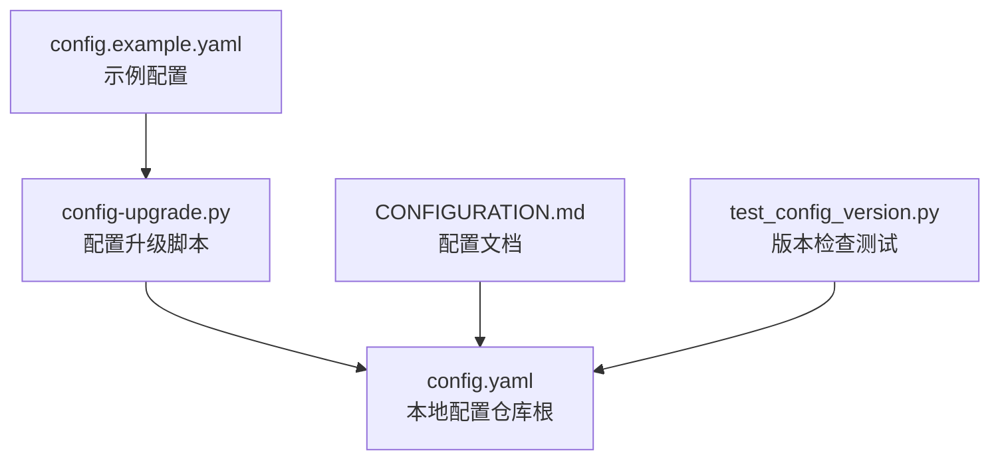
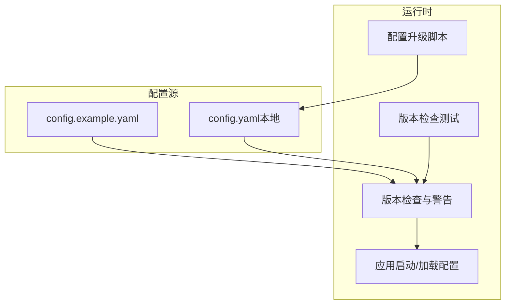
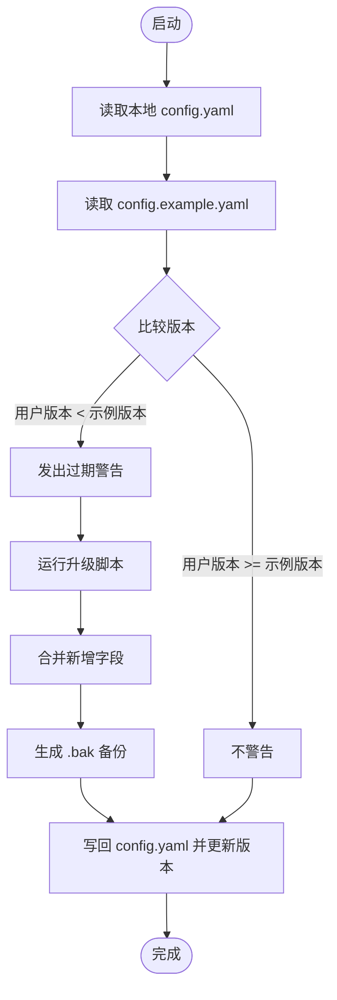
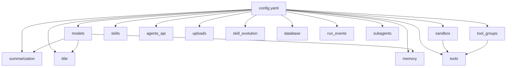

# 基础配置

<cite>
**本文引用的文件**
- [config.example.yaml](file://config.example.yaml)
- [CONFIGURATION.md](file://backend/docs/CONFIGURATION.md)
- [config-upgrade.py](file://scripts/config-upgrade.py)
- [test_config_version.py](file://backend/tests/test_config_version.py)
- [config.yaml（后端示例）](file://backend/config.yaml)
</cite>

## 目录
1. [简介](#简介)
2. [项目结构](#项目结构)
3. [核心组件](#核心组件)
4. [架构总览](#架构总览)
5. [详细组件分析](#详细组件分析)
6. [依赖关系分析](#依赖关系分析)
7. [性能考量](#性能考量)
8. [故障排查指南](#故障排查指南)
9. [结论](#结论)
10. [附录](#附录)

## 简介
本指南面向 DeerFlow 的基础配置，聚焦主配置文件 config.yaml 的结构与各配置项的作用、参数含义与最佳实践。内容覆盖日志级别、模型配置（models）、工具组配置（tool_groups）、工具配置（tools）、沙箱（sandbox）、技能（skills）、会话标题生成（title）、对话摘要（summarization）、Agents API（agents_api）、文件上传（uploads）、记忆（memory）、Skill 自进化（skill_evolution）、数据库（database）、运行事件（run_events）、Subagent（subagents）等模块，并解释配置版本管理机制与配置验证规则，提供常见场景的配置范式与排错建议。

## 项目结构
- 配置文件位于仓库根目录，示例文件为 config.example.yaml；后端示例文件为 backend/config.yaml。
- 配置升级脚本为 scripts/config-upgrade.py，负责将本地配置与示例对齐并备份。
- 文档 backend/docs/CONFIGURATION.md 提供了完整的配置说明、版本管理与最佳实践。
- 测试 backend/tests/test_config_version.py 验证配置版本检查逻辑与兼容性。

图表来源
- [config.example.yaml:1-348](file://config.example.yaml#L1-L348)
- [config-upgrade.py:1-118](file://scripts/config-upgrade.py#L1-L118)
- [CONFIGURATION.md:1-377](file://backend/docs/CONFIGURATION.md#L1-L377)
- [test_config_version.py:1-126](file://backend/tests/test_config_version.py#L1-L126)

章节来源
- [config.example.yaml:1-348](file://config.example.yaml#L1-L348)
- [CONFIGURATION.md:1-377](file://backend/docs/CONFIGURATION.md#L1-L377)
- [config-upgrade.py:1-118](file://scripts/config-upgrade.py#L1-L118)
- [test_config_version.py:1-126](file://backend/tests/test_config_version.py#L1-L126)

## 核心组件
- 配置版本管理：config_version 字段用于跟踪 schema 变更，启动时若本地版本低于示例版本则发出警告，并可通过升级脚本合并新字段。
- 日志级别：log_level 控制全局日志输出粒度。
- 模型配置（models）：定义可用的大模型及其接入方式、鉴权、超时、重试、温度、最大输出 Token、能力开关（视觉、思维链、推理努力、工具调用）等。
- 工具组配置（tool_groups）：按功能域组织工具，便于 Agent 按组选择工具集合。
- 工具配置（tools）：具体工具的类路径、所属组、可选参数（如最大结果数、第三方密钥等）。
- 沙箱（sandbox）：定义沙箱执行提供者与安全限制（是否允许宿主机 bash、各类输出上限等）。
- 技能（skills）：Skills 容器挂载路径等。
- 会话标题生成（title）：是否启用、最大词数/字符数、使用的模型名。
- 对话摘要（summarization）：是否启用、触发条件（基于 Token 数或消息数）、保留策略、摘要提示词、最近 Skill 调用保留策略等。
- Agents API（agents_api）：是否启用 REST API。
- 文件上传（uploads）：单次最大文件数、单文件最大大小、总大小限制、PDF 转换器与自动转换选项。
- 记忆（memory）：是否启用、存储路径、防抖时间、模型名、最大事实数、置信度阈值、是否注入到 System Prompt、注入 Token 上限等。
- Skill 自进化（skill_evolution）：是否启用、审核模型名。
- 数据库（database）：后端类型（内存/SQLite/Postgres）、SQLite 目录、角色扮演数据库连接信息。
- 运行事件（run_events）：事件存储后端、单条追踪内容最大字符数、是否追踪 Token 使用量。
- Subagent（subagents）：超时、自定义 Agent 列表（描述、系统提示、工具、技能、模型继承、最大轮次、超时等）。

章节来源
- [config.example.yaml:1-348](file://config.example.yaml#L1-L348)
- [CONFIGURATION.md:18-377](file://backend/docs/CONFIGURATION.md#L18-L377)

## 架构总览
下图展示配置文件在系统中的作用与关键交互点：示例配置驱动版本检查与升级；本地配置决定运行时行为；测试保障版本兼容性。

图表来源
- [config.example.yaml:1-348](file://config.example.yaml#L1-L348)
- [config-upgrade.py:1-118](file://scripts/config-upgrade.py#L1-L118)
- [test_config_version.py:1-126](file://backend/tests/test_config_version.py#L1-L126)

## 详细组件分析

### 配置版本管理与验证规则
- 版本字段：config_version 用于标记 schema 版本。
- 缺失处理：未设置 config_version 的配置被视为版本 0。
- 升级流程：当示例版本高于本地版本时，启动时发出“过期”警告；使用升级脚本将示例中的新增字段合并到本地配置，并创建 .bak 备份。
- 兼容性测试：测试覆盖缺失版本、匹配版本、旧版本、示例文件不存在、字符串版本号比较、用户版本较新等场景。

图表来源
- [CONFIGURATION.md:5-17](file://backend/docs/CONFIGURATION.md#L5-L17)
- [config-upgrade.py:13-118](file://scripts/config-upgrade.py#L13-L118)
- [test_config_version.py:35-126](file://backend/tests/test_config_version.py#L35-L126)

章节来源
- [CONFIGURATION.md:5-17](file://backend/docs/CONFIGURATION.md#L5-L17)
- [config-upgrade.py:13-118](file://scripts/config-upgrade.py#L13-L118)
- [test_config_version.py:35-126](file://backend/tests/test_config_version.py#L35-L126)

### 日志级别（log_level）
- 作用：控制全局日志输出粒度（trace, debug, info, warning, error, critical）。
- 影响：影响启动阶段与运行时的调试信息量，便于定位问题与性能分析。

章节来源
- [config.example.yaml:7-8](file://config.example.yaml#L7-L8)

### 模型配置（models）
- 结构要点：
  - name：模型标识符，用于在 Agent 中引用。
  - display_name：前端显示名称。
  - use：LangChain 集成类路径，支持多种提供商（OpenAI、Anthropic、DeepSeek、Claude Code OAuth、Codex CLI、任意 LangChain 兼容提供者）。
  - model：API 模型名称。
  - api_key/base_url/request_timeout/max_retries/max_tokens/temperature：鉴权、网关、超时、重试、输出上限与采样温度。
  - supports_vision/supports_thinking/supports_reasoning_effort/tool_calling：能力开关。
  - when_thinking_enabled/extra_body：部分模型启用思维模式时的额外请求体配置。
- 常见场景：
  - 多模型配置：将常用模型置于列表前部作为默认模型。
  - OpenAI 兼容网关：通过 base_url 指向第三方网关（如 Novita、OpenRouter），并根据需要设置 supports_thinking 等。
  - 思维模式：某些模型需使用补丁后的 Chat 模型以正确传递 thought_signature。
- 注意事项：
  - CLI 后端提供商的鉴权来源与限制（例如 Codex Responses API 对 max_tokens 的限制）。
  - 温度范围与特定提供商要求（如 MiniMax 的温度区间）。

章节来源
- [config.example.yaml:18-115](file://config.example.yaml#L18-L115)
- [CONFIGURATION.md:20-168](file://backend/docs/CONFIGURATION.md#L20-L168)

### 工具组配置（tool_groups）
- 作用：按功能域组织工具，便于 Agent 按组选择工具集合。
- 常见分组：web（搜索、抓取）、file:read（只读文件操作）、file:write（写入文件操作）、bash（命令行执行）等。
- 使用：Agent 在配置中可按组启用工具，提升权限与安全边界可控。

章节来源
- [config.example.yaml:122-127](file://config.example.yaml#L122-L127)
- [CONFIGURATION.md:169-179](file://backend/docs/CONFIGURATION.md#L169-L179)

### 工具配置（tools）
- 结构要点：
  - name：工具标识符。
  - group：所属工具组。
  - use：工具类路径。
  - 其他参数：如 max_results、api_key、api_url、client_id、knowledge_base_id 等（视具体工具而定）。
- 内置工具示例：web_search、web_fetch、ls、read_file、write_file、str_replace、bash 等。
- 最佳实践：
  - 将敏感参数通过环境变量注入（$VAR）。
  - 仅启用必要的工具组与工具，降低风险面。

章节来源
- [config.example.yaml:132-168](file://config.example.yaml#L132-L168)
- [CONFIGURATION.md:181-202](file://backend/docs/CONFIGURATION.md#L181-L202)

### 沙箱配置（sandbox）
- 作用：定义沙箱执行提供者与安全限制，确保代码与命令在受控环境中运行。
- 关键参数：
  - use：沙箱提供者类路径（本地/容器/Kubernetes）。
  - allow_host_bash：是否允许在宿主机执行 bash 命令（默认关闭）。
  - 各类输出上限：bash_output_max_chars、read_file_output_max_chars、ls_output_max_chars。
- 模式选择：
  - 本地执行：适合简单场景，默认提供者。
  - Docker 执行：隔离更强，适合生产。
  - Kubernetes 执行：通过 provisioner 在本地集群 Pod 中运行，适合复杂部署。

章节来源
- [config.example.yaml:181-187](file://config.example.yaml#L181-L187)
- [CONFIGURATION.md:203-233](file://backend/docs/CONFIGURATION.md#L203-L233)

### 技能配置（skills）
- 作用：配置 Skills 容器挂载路径等，使 Agent 能发现并加载技能。
- 关键参数：
  - container_path：容器挂载路径（默认 /mnt/skills）。
- 最佳实践：
  - 保持 skills 目录结构清晰，每个技能包含 SKILL.md 元数据。
  - 可按 Agent 精细化过滤技能集（在 Agent 级别配置中指定 skills 列表）。

章节来源
- [config.example.yaml:192-194](file://config.example.yaml#L192-L194)
- [CONFIGURATION.md:264-288](file://backend/docs/CONFIGURATION.md#L264-L288)

### 会话标题生成（title）
- 作用：自动为新会话生成标题，提升用户体验。
- 关键参数：
  - enabled：是否启用。
  - max_words/max_chars：标题长度限制。
  - model_name：使用的模型名（null 表示使用默认模型）。

章节来源
- [config.example.yaml:199-204](file://config.example.yaml#L199-L204)

### 对话摘要（summarization）
- 作用：长对话自动摘要，避免上下文过长导致性能与成本问题。
- 关键参数：
  - enabled：是否启用。
  - model_name：摘要模型（null 表示使用轻量模型）。
  - trigger：触发条件（type: tokens 或 messages；value: 阈值）。
  - keep：保留策略（type: messages；value: 保留最近 N 条消息）。
  - trim_tokens_to_summarize：摘要时处理的 Token 数上限。
  - summary_prompt：自定义摘要提示词（null 使用默认）。
  - preserve_recent_skill_*：最近 Skill 调用的保留策略与 Token 上限。
  - skill_file_read_tool_names：用于读取技能文件的工具名称列表。

章节来源
- [config.example.yaml:209-238](file://config.example.yaml#L209-L238)

### Agents API（agents_api）
- 作用：启用 Agent 管理的 REST API。
- 关键参数：
  - enabled：是否启用。

章节来源
- [config.example.yaml:243-245](file://config.example.yaml#L243-L245)

### 文件上传（uploads）
- 作用：限制用户上传文件的数量、大小与格式转换策略。
- 关键参数：
  - max_files：单次最大上传文件数。
  - max_file_size：单个文件最大大小（字节）。
  - max_total_size：总上传大小限制（字节）。
  - auto_convert_documents：是否自动转换文档格式。
  - pdf_converter：PDF 转换器（auto、pdftotext、pymupdf）。

章节来源
- [config.example.yaml:250-256](file://config.example.yaml#L250-L256)

### 记忆（memory）
- 作用：存储用户偏好与对话上下文，提升个性化体验。
- 关键参数：
  - enabled：是否启用。
  - storage_path：记忆存储路径（绝对/相对/空字符串三种语义）。
  - debounce_seconds：记忆更新防抖时间（秒）。
  - model_name：记忆更新使用的模型（null 使用默认模型）。
  - max_facts：最大存储事实数量。
  - fact_confidence_threshold：事实置信度阈值。
  - injection_enabled：是否将记忆注入到 System Prompt。
  - max_injection_tokens：注入到 System Prompt 的最大 Token 数。

章节来源
- [config.example.yaml:261-283](file://config.example.yaml#L261-L283)

### Skill 自进化（skill_evolution）
- 作用：Agent 自动创建与优化 Skills 的功能。
- 关键参数：
  - enabled：是否启用。
  - moderation_model_name：审核模型（null 表示不审核）。

章节来源
- [config.example.yaml:288-294](file://config.example.yaml#L288-L294)

### 数据库（database）
- 作用：应用数据存储后端配置。
- 关键参数：
  - backend：数据库类型（memory、sqlite、postgres）。
  - sqlite_dir：SQLite 数据库目录。
  - roleplay_db_*：角色扮演数据库连接信息（主机、端口、库名、用户名、密码）。

章节来源
- [config.example.yaml:299-309](file://config.example.yaml#L299-L309)

### 运行事件（run_events）
- 作用：记录与追踪对话运行过程中的事件。
- 关键参数：
  - backend：事件存储后端（memory、db、jsonl）。
  - max_trace_content：单个追踪内容最大字符数。
  - track_token_usage：是否追踪 Token 使用量。

章节来源
- [config.example.yaml:314-320](file://config.example.yaml#L314-L320)

### Subagent（subagents）
- 作用：配置子 Agent，用于处理特定类型任务。
- 关键参数：
  - timeout_seconds：默认超时。
  - custom_agents：自定义 Agent 列表，包含描述、系统提示、工具、技能、模型继承、最大轮次、超时等。

章节来源
- [config.example.yaml:325-348](file://config.example.yaml#L325-L348)

## 依赖关系分析
- 配置文件与运行时的关系：示例配置驱动版本检查与升级；本地配置决定运行时行为；测试保障版本兼容性。
- 配置项之间的耦合：
  - 模型配置与工具/沙箱/记忆等模块存在间接耦合（如模型选择影响摘要与记忆质量）。
  - 工具组与工具配置耦合，Agent 通过组启用工具集合。
  - 沙箱配置影响工具执行的安全边界与输出上限。
- 外部依赖：
  - 环境变量注入（$VAR）用于密钥与路径等敏感配置。
  - 第三方网关（如 Novita、OpenRouter）与提供商（OpenAI、Anthropic、DeepSeek、MiniMax）。

图表来源
- [config.example.yaml:1-348](file://config.example.yaml#L1-L348)

章节来源
- [config.example.yaml:1-348](file://config.example.yaml#L1-L348)

## 性能考量
- Token 使用统计：开启 token_usage.enabled 可辅助成本与性能监控。
- 摘要策略：合理设置触发阈值与保留策略，平衡上下文长度与信息保留。
- 模型温度与最大输出：根据任务稳定性与创造性需求调整，避免过高温度导致输出不可控。
- 沙箱输出上限：限制 bash/read_file/ls 等输出字符数，防止内存与网络压力过大。
- 数据库与事件存储：根据吞吐量选择 backend（memory/db/jsonl），并控制单条追踪内容大小。

## 故障排查指南
- “配置文件未找到”
  - 确保 config.yaml 位于项目根目录（deer-flow/config.yaml）。
  - 若运行时工作目录不在项目根，请设置 DEER_FLOW_PROJECT_ROOT 或 DEER_FLOW_CONFIG_PATH。
- “配置版本过期”
  - 启动时出现过期警告，使用升级脚本合并新字段并备份。
  - 升级脚本会自动创建 .bak 备份，合并新增字段并更新 config_version。
- “无效的 API 密钥”
  - 检查环境变量是否正确设置，确认 $ 前缀用于引用环境变量。
- “Skills 未加载”
  - 检查 skills 目录是否存在、每个技能是否包含有效的 SKILL.md。
  - 如使用自定义路径，检查 skills.path 或 DEER_FLOW_SKILLS_PATH。
- “Docker 沙箱无法启动”
  - 确认 Docker 已运行，端口 8080（或配置端口）可用，镜像可访问。
- “版本检查异常”
  - 测试覆盖了缺失版本、字符串版本号比较、示例文件不存在等场景，确保升级脚本与测试逻辑一致。

章节来源
- [CONFIGURATION.md:353-377](file://backend/docs/CONFIGURATION.md#L353-L377)
- [config-upgrade.py:13-118](file://scripts/config-upgrade.py#L13-L118)
- [test_config_version.py:35-126](file://backend/tests/test_config_version.py#L35-L126)

## 结论
本指南系统梳理了 DeerFlow 的基础配置，从配置版本管理、日志级别、模型与工具体系、沙箱与技能、到会话标题生成、摘要、API、上传、记忆、自进化、数据库、运行事件与 Subagent 等模块，给出了参数含义、最佳实践与排错建议。建议在本地先行验证配置变更，结合升级脚本与测试保障版本兼容性，并通过合理的模型与工具组合、沙箱安全策略与摘要策略，获得稳定且高性能的运行效果。

## 附录
- 配置文件位置与优先级
  - 优先级顺序：代码指定路径 > 环境变量 DEER_FLOW_CONFIG_PATH > 项目根下的 config.yaml > 当前工作目录下的 config.yaml > 兼容性路径。
- 环境变量
  - 支持 $VAR 形式的环境变量注入，常见变量包括 OPENAI_API_KEY、ANTHROPIC_API_KEY、DEEPSEEK_API_KEY、NOVITA_API_KEY、TAVILY_API_KEY、DEER_FLOW_PROJECT_ROOT、DEER_FLOW_CONFIG_PATH、DEER_FLOW_EXTENSIONS_CONFIG_PATH、DEER_FLOW_HOME、DEER_FLOW_SKILLS_PATH、GATEWAY_ENABLE_DOCS 等。

章节来源
- [CONFIGURATION.md:331-334](file://backend/docs/CONFIGURATION.md#L331-L334)
- [CONFIGURATION.md:309-330](file://backend/docs/CONFIGURATION.md#L309-L330)