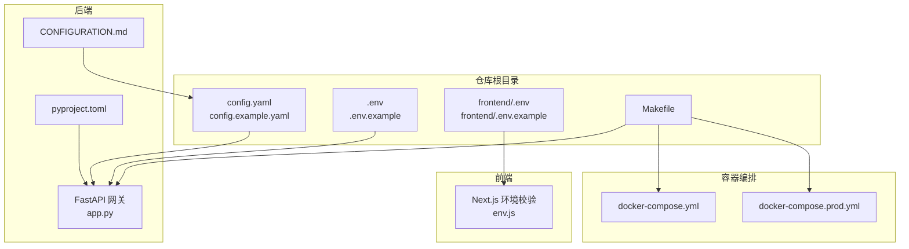
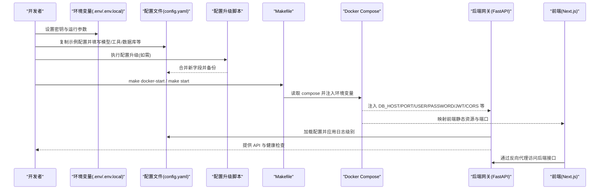
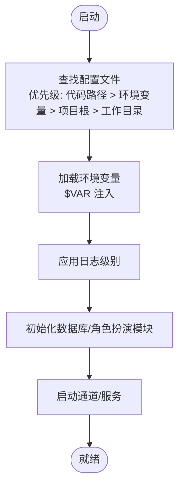
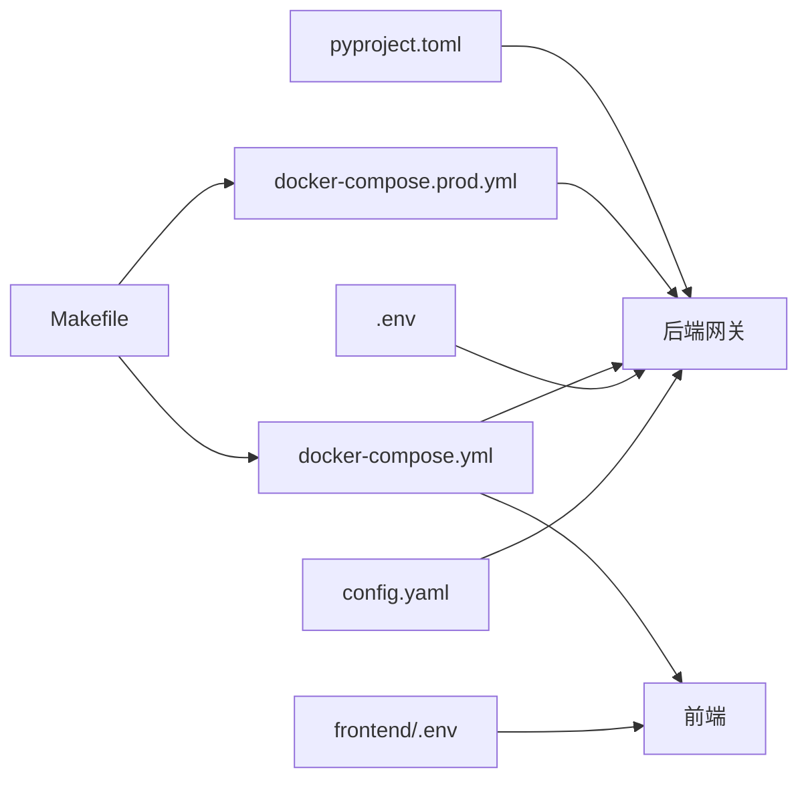

# 环境特定配置

<cite>
**本文引用的文件**
- [config.example.yaml](file://config.example.yaml)
- [extensions_config.example.json](file://extensions_config.example.json)
- [docker-compose.yml](file://docker-compose.yml)
- [docker-compose.prod.yml](file://docker-compose.prod.yml)
- [backend/docs/CONFIGURATION.md](file://backend/docs/CONFIGURATION.md)
- [backend/app/gateway/app.py](file://backend/app/gateway/app.py)
- [frontend/src/env.js](file://frontend/src/env.js)
- [scripts/config-upgrade.py](file://scripts/config-upgrade.py)
- [scripts/config-upgrade.sh](file://scripts/config-upgrade.sh)
- [scripts/configure.py](file://scripts/configure.py)
- [Makefile](file://Makefile)
- [backend/pyproject.toml](file://backend/pyproject.toml)
</cite>

## 目录
1. [简介](#简介)
2. [项目结构](#项目结构)
3. [核心组件](#核心组件)
4. [架构总览](#架构总览)
5. [详细组件分析](#详细组件分析)
6. [依赖关系分析](#依赖关系分析)
7. [性能考量](#性能考量)
8. [故障排查指南](#故障排查指南)
9. [结论](#结论)
10. [附录](#附录)

## 简介
本指南面向 DeerFlow 在不同环境（开发、测试、生产）下的配置策略，系统讲解环境变量使用、配置文件的环境切换机制与配置继承规则，并覆盖容器化部署（Docker）与 Kubernetes（通过 provisioner 模式）的最佳实践。同时提供配置模板与示例，帮助开发者在不同部署环境中正确配置 DeerFlow；并包含配置安全性、敏感信息保护与最小暴露原则的指导。

## 项目结构
- 配置文件位于仓库根目录，示例配置为 config.example.yaml，实际运行配置为 config.yaml（不在版本控制中）。
- 前端 Next.js 使用 env.js 进行运行时环境变量校验与暴露。
- 后端 FastAPI 网关在启动阶段加载配置并应用日志级别。
- Docker Compose 提供开发与生产两种编排方式，支持环境变量注入与端口映射。
- Makefile 提供统一的开发与部署命令，贯穿配置生成、升级与服务启停。

**图表来源**
- [config.example.yaml](file://config.example.yaml)
- [docker-compose.yml](file://docker-compose.yml)
- [docker-compose.prod.yml](file://docker-compose.prod.yml)
- [backend/app/gateway/app.py](file://backend/app/gateway/app.py)
- [frontend/src/env.js](file://frontend/src/env.js)
- [backend/docs/CONFIGURATION.md](file://backend/docs/CONFIGURATION.md)
- [backend/pyproject.toml](file://backend/pyproject.toml)
- [Makefile](file://Makefile)

**章节来源**
- [Makefile](file://Makefile)
- [config.example.yaml](file://config.example.yaml)
- [backend/docs/CONFIGURATION.md](file://backend/docs/CONFIGURATION.md)

## 核心组件
- 配置文件与版本管理
  - config.example.yaml 包含 config_version 字段，用于跟踪配置模式变更；当示例版本高于本地配置时，启动阶段会发出警告并建议执行配置升级。
  - 提供 scripts/config-upgrade.py 与 scripts/config-upgrade.sh 以自动化合并缺失字段并备份旧配置。
- 环境变量与注入
  - 配置文件支持 $VAR 形式的环境变量注入；常见变量包括 OPENAI_API_KEY、ANTHROPIC_API_KEY、DEER_FLOW_PROJECT_ROOT、DEER_FLOW_CONFIG_PATH、DEER_FLOW_EXTENSIONS_CONFIG_PATH、DEER_FLOW_HOME 等。
  - 前端 Next.js 使用 env.js 对客户端与服务端变量进行严格校验，仅将必要的 NEXT_PUBLIC_* 变量暴露给浏览器。
- 配置定位与优先级
  - 配置查找顺序：代码指定路径 > DEER_FLOW_CONFIG_PATH > 项目根目录下的 config.yaml > 当前工作目录下的 config.yaml > 兼容性路径。
- 容器化与编排
  - docker-compose.yml 提供开发模式（本地代码映射、热更新、健康检查、依赖服务）。
  - docker-compose.prod.yml 提供生产模式（SQLite 后端、外部 Roleplay 数据库、CORS 与 JWT 等生产必需项）。
- 后端网关与日志
  - 后端在启动阶段加载配置并应用日志级别；同时初始化 LangGraph 运行时、角色扮演数据库与通道服务。

**章节来源**
- [backend/docs/CONFIGURATION.md](file://backend/docs/CONFIGURATION.md)
- [scripts/config-upgrade.py](file://scripts/config-upgrade.py)
- [scripts/config-upgrade.sh](file://scripts/config-upgrade.sh)
- [frontend/src/env.js](file://frontend/src/env.js)
- [backend/app/gateway/app.py](file://backend/app/gateway/app.py)
- [docker-compose.yml](file://docker-compose.yml)
- [docker-compose.prod.yml](file://docker-compose.prod.yml)

## 架构总览
下图展示从环境变量到配置文件再到运行时应用的整体流程，以及容器编排如何注入环境变量与端口映射。

**图表来源**
- [scripts/config-upgrade.py](file://scripts/config-upgrade.py)
- [scripts/config-upgrade.sh](file://scripts/config-upgrade.sh)
- [Makefile](file://Makefile)
- [docker-compose.yml](file://docker-compose.yml)
- [docker-compose.prod.yml](file://docker-compose.prod.yml)
- [backend/app/gateway/app.py](file://backend/app/gateway/app.py)
- [frontend/src/env.js](file://frontend/src/env.js)

## 详细组件分析

### 开发环境配置
- 本地开发
  - 使用 docker-compose.yml 启动，包含 MySQL、后端、前端三服务；后端通过 volumes 将本地代码映射到容器，支持热更新；后端环境变量包含 DB_*、DEBUG、PORT 等。
  - 前端通过 Nginx 提供静态资源服务，端口映射至 80；开发模式下可直接访问 http://localhost。
- 环境变量与密钥
  - 建议在根目录 .env 中设置 OPENAI_API_KEY、ANTHROPIC_API_KEY 等；配置文件中通过 $VAR 引用这些变量。
  - 前端 NEXT_PUBLIC_* 变量用于暴露给浏览器，其余变量仅在服务端使用。
- 配置生成与升级
  - 使用 make config 生成 config.yaml 与 .env；使用 make config-upgrade 合并示例配置的新字段并备份旧配置。

**章节来源**
- [docker-compose.yml](file://docker-compose.yml)
- [frontend/src/env.js](file://frontend/src/env.js)
- [scripts/configure.py](file://scripts/configure.py)
- [scripts/config-upgrade.py](file://scripts/config-upgrade.py)
- [scripts/config-upgrade.sh](file://scripts/config-upgrade.sh)
- [Makefile](file://Makefile)

### 测试环境配置
- Docker Compose 测试
  - 使用 docker-compose.yml 进行联调测试，确保各服务健康与端口可达；可通过 docker-logs 查看日志。
- 前端测试
  - Next.js 环境校验在构建时进行，若未通过校验可设置 SKIP_ENV_VALIDATION 跳过校验（不推荐在生产使用）。
- 配置一致性
  - 建议在测试环境复用开发环境的 .env，但将 DB_* 指向测试数据库实例，避免污染生产数据。

**章节来源**
- [docker-compose.yml](file://docker-compose.yml)
- [frontend/src/env.js](file://frontend/src/env.js)
- [Makefile](file://Makefile)

### 生产环境配置
- 生产编排
  - 使用 docker-compose.prod.yml 启动，后端镜像 deerflow-backend:latest，前端 deerflow-frontend:latest；后端监听 8001 端口，前端 4000 端口。
  - 关键环境变量：
    - DB_BACKEND=sqlite 与 SQLITE_DIR 指向 SQLite 存储目录
    - ROLEPLAY_DB_* 指向云端 MySQL（Roleplay 模块）
    - DEBUG=false、PORT=8001
    - AUTH_JWT_SECRET=your-secure-jwt-secret-here-32-chars-minimum
    - CORS_ORIGINS=http://<生产前端域名>:4000
    - OPENAI_API_KEY、OPENAI_API_BASE 等模型密钥与网关
- 安全加固
  - 仅暴露必要端口；通过反向代理（Nginx）统一入口与 TLS；限制 CORS 源；使用强 JWT 密钥；避免在配置文件中硬编码敏感信息。

**章节来源**
- [docker-compose.prod.yml](file://docker-compose.prod.yml)
- [backend/docs/CONFIGURATION.md](file://backend/docs/CONFIGURATION.md)

### 配置文件与环境切换机制
- 配置定位优先级
  - 代码指定路径 > DEER_FLOW_CONFIG_PATH > 项目根目录 config.yaml > 当前工作目录 config.yaml > 兼容性路径。
- 环境变量注入
  - 配置文件中使用 $VAR 引用环境变量；compose 中通过 environment 注入变量；前端 env.js 校验并暴露 NEXT_PUBLIC_*。
- 配置版本与迁移
  - config_version 字段用于版本迁移；升级脚本会递归合并缺失字段并备份旧配置。

**图表来源**
- [backend/app/gateway/app.py](file://backend/app/gateway/app.py)
- [backend/docs/CONFIGURATION.md](file://backend/docs/CONFIGURATION.md)

**章节来源**
- [backend/docs/CONFIGURATION.md](file://backend/docs/CONFIGURATION.md)
- [backend/app/gateway/app.py](file://backend/app/gateway/app.py)

### 配置继承与分组
- 模型与工具分组
  - models 与 tools 支持分组（如 file:read、file:write、bash），便于按能力集启用/禁用。
- 子代理与技能
  - subagents.timeout_seconds 与 custom_agents.* 支持按任务类型配置超时与工具/技能集合；skills.path 与 container_path 控制技能目录映射。
- 扩展配置（MCP）
  - extensions_config.example.json 提供 MCP 服务器与拦截器的配置模板，支持通过环境变量注入令牌等敏感信息。

**章节来源**
- [config.example.yaml](file://config.example.yaml)
- [extensions_config.example.json](file://extensions_config.example.json)

### 容器化部署与 Kubernetes 最佳实践
- Docker 开发模式
  - 通过 make docker-start 启动，compose 会根据配置决定是否启动 provisioner（Kubernetes 沙箱模式）。
- Docker 生产模式
  - 使用 docker-compose.prod.yml，后端镜像独立部署，前端镜像独立部署；通过环境变量注入数据库与 JWT 配置。
- Kubernetes（通过 provisioner）
  - sandbox.use 指定 AioSandboxProvider，并通过 provisioner_url 指向 provisioner 服务；provisioner 服务仅在该模式下启动。
  - 建议在本地 K8s（如 Docker Desktop/K3s）中运行，确保网络连通与资源充足。

**章节来源**
- [docker-compose.yml](file://docker-compose.yml)
- [docker-compose.prod.yml](file://docker-compose.prod.yml)
- [backend/docs/CONFIGURATION.md](file://backend/docs/CONFIGURATION.md)

## 依赖关系分析
- 配置依赖
  - 后端网关依赖配置文件中的 models、database、sandbox、memory 等段落；前端依赖 NEXT_PUBLIC_* 环境变量。
- 编排依赖
  - docker-compose.yml 依赖 MySQL 服务健康；后端依赖数据库可用；前端依赖后端 API 可达。
- 版本与兼容
  - pyproject.toml 指定后端依赖与索引源；Makefile 提供统一命令入口，贯穿配置生成、升级与服务启停。

**图表来源**
- [backend/app/gateway/app.py](file://backend/app/gateway/app.py)
- [frontend/src/env.js](file://frontend/src/env.js)
- [docker-compose.yml](file://docker-compose.yml)
- [docker-compose.prod.yml](file://docker-compose.prod.yml)
- [backend/pyproject.toml](file://backend/pyproject.toml)
- [Makefile](file://Makefile)

**章节来源**
- [backend/pyproject.toml](file://backend/pyproject.toml)
- [Makefile](file://Makefile)

## 性能考量
- 沙箱隔离与性能
  - Docker 沙箱提供更好的隔离与稳定性，适合生产；本地沙箱更简单但不具备安全边界。
- 数据库选择
  - 开发使用 SQLite；生产使用外部 MySQL（Roleplay 模块）以提升并发与可靠性。
- 日志与追踪
  - 合理设置 log_level 与 run_events.backend；在生产关闭不必要的文档端点（enable_docs=false）以减少开销。

[本节为通用建议，无需特定文件引用]

## 故障排查指南
- 配置文件未找到
  - 确认 config.yaml 位于项目根目录或通过 DEER_FLOW_CONFIG_PATH 指定；或通过 DEER_FLOW_PROJECT_ROOT 指定项目根。
- 环境变量未生效
  - 检查配置文件中是否使用 $VAR 引用；确认 .env/.env.local 中已设置对应变量；前端 NEXT_PUBLIC_* 仅在服务端可见。
- 配置升级失败
  - 使用 scripts/config-upgrade.py 或 scripts/config-upgrade.sh；查看备份文件 config.yaml.bak 并手动合并差异。
- Docker 启动异常
  - 检查 docker-compose.yml 中的环境变量与端口映射；确认 MySQL 健康；在 Linux 下检查 docker 组权限。
- 前端环境校验失败
  - 设置 SKIP_ENV_VALIDATION=true 临时跳过校验（不推荐生产使用）；或完善 env.js 中的 schema。

**章节来源**
- [backend/docs/CONFIGURATION.md](file://backend/docs/CONFIGURATION.md)
- [scripts/config-upgrade.py](file://scripts/config-upgrade.py)
- [scripts/config-upgrade.sh](file://scripts/config-upgrade.sh)
- [frontend/src/env.js](file://frontend/src/env.js)
- [docker-compose.yml](file://docker-compose.yml)

## 结论
通过明确的配置文件版本管理、严格的环境变量注入与暴露策略、清晰的容器编排与部署流程，DeerFlow 能够在开发、测试与生产环境中保持一致的行为与安全基线。建议始终使用环境变量管理敏感信息，避免硬编码；在生产中启用强 JWT 密钥、限制 CORS 源与端口暴露，并定期执行配置升级以获得最新特性与修复。

[本节为总结，无需特定文件引用]

## 附录

### 环境变量清单与用途
- 后端常用
  - OPENAI_API_KEY、ANTHROPIC_API_KEY、DEEPSEEK_API_KEY、NOVITA_API_KEY、TAVILY_API_KEY、DEER_FLOW_PROJECT_ROOT、DEER_FLOW_CONFIG_PATH、DEER_FLOW_EXTENSIONS_CONFIG_PATH、DEER_FLOW_HOME、GATEWAY_ENABLE_DOCS
- 生产必需
  - AUTH_JWT_SECRET、CORS_ORIGINS、DB_BACKEND、SQLITE_DIR、ROLEPLAY_DB_HOST、ROLEPLAY_DB_PORT、ROLEPLAY_DB_NAME、ROLEPLAY_DB_USER、ROLEPLAY_DB_PASSWORD、DEBUG、PORT
- 前端常用
  - NEXT_PUBLIC_BACKEND_BASE_URL、NEXT_PUBLIC_LANGGRAPH_BASE_URL、NEXT_PUBLIC_STATIC_WEBSITE_ONLY、NODE_ENV

**章节来源**
- [backend/docs/CONFIGURATION.md](file://backend/docs/CONFIGURATION.md)
- [docker-compose.prod.yml](file://docker-compose.prod.yml)
- [frontend/src/env.js](file://frontend/src/env.js)

### 配置模板与示例路径
- 完整配置示例：config.example.yaml
- 扩展配置（MCP）示例：extensions_config.example.json
- 开发编排示例：docker-compose.yml
- 生产编排示例：docker-compose.prod.yml
- 前端环境校验：frontend/src/env.js
- 配置生成与升级：scripts/configure.py、scripts/config-upgrade.py、scripts/config-upgrade.sh
- 后端依赖与索引：backend/pyproject.toml
- 统一命令入口：Makefile

**章节来源**
- [config.example.yaml](file://config.example.yaml)
- [extensions_config.example.json](file://extensions_config.example.json)
- [docker-compose.yml](file://docker-compose.yml)
- [docker-compose.prod.yml](file://docker-compose.prod.yml)
- [frontend/src/env.js](file://frontend/src/env.js)
- [scripts/configure.py](file://scripts/configure.py)
- [scripts/config-upgrade.py](file://scripts/config-upgrade.py)
- [scripts/config-upgrade.sh](file://scripts/config-upgrade.sh)
- [backend/pyproject.toml](file://backend/pyproject.toml)
- [Makefile](file://Makefile)