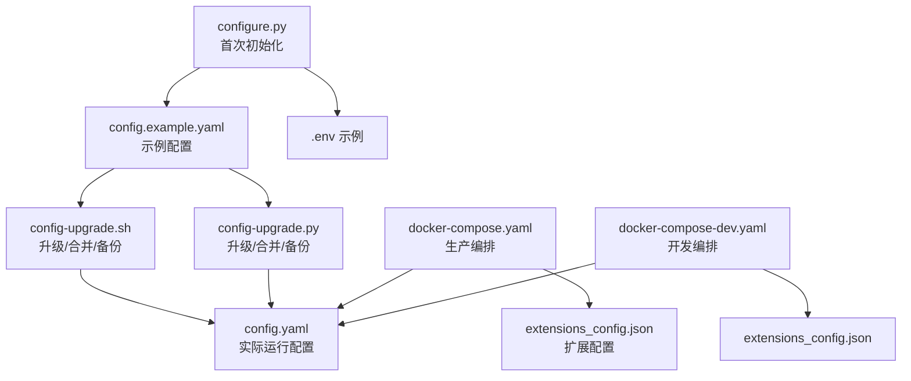
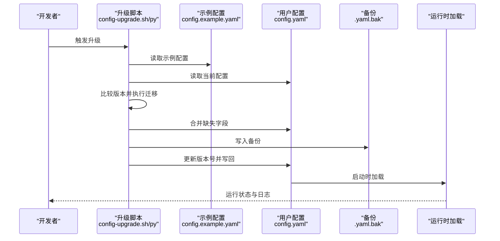
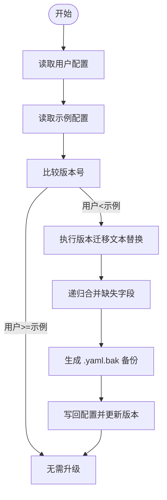
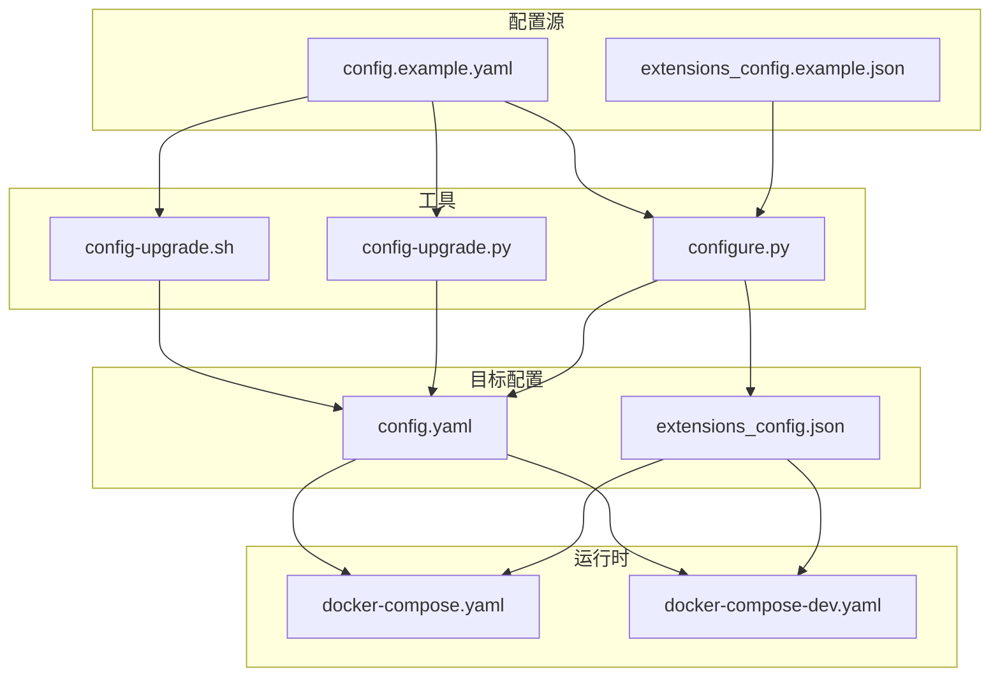

# 配置最佳实践

<cite>
**本文档引用的文件**
- [CONFIGURATION.md](file://backend/docs/CONFIGURATION.md)
- [config.example.yaml](file://config.example.yaml)
- [config.yaml](file://backend/config.yaml)
- [config-upgrade.py](file://scripts/config-upgrade.py)
- [config-upgrade.sh](file://scripts/config-upgrade.sh)
- [configure.py](file://scripts/configure.py)
- [docker-compose.yaml](file://docker/docker-compose.yaml)
- [docker-compose-dev.yaml](file://docker/docker-compose-dev.yaml)
- [extensions_config.example.json](file://extensions_config.example.json)
- [test_config_version.py](file://backend/tests/test_config_version.py)
</cite>

## 目录
1. [简介](#简介)
2. [项目结构](#项目结构)
3. [核心组件](#核心组件)
4. [架构总览](#架构总览)
5. [详细组件分析](#详细组件分析)
6. [依赖关系分析](#依赖关系分析)
7. [性能考虑](#性能考虑)
8. [故障排查指南](#故障排查指南)
9. [结论](#结论)
10. [附录](#附录)

## 简介
本指南面向 DeerFlow 的配置管理，系统总结配置命名规范、分层设计、版本管理、文档维护等最佳实践，并提供性能调优、安全、监控等常见场景的解决方案。同时覆盖配置变更影响评估、回滚策略、迁移指南、错误排查、自动化与工具使用建议，以及配置审计与合规性检查的指导原则。

## 项目结构
DeerFlow 的配置体系围绕以下关键文件与脚本展开：
- 配置文件
  - config.example.yaml：完整示例与默认值，包含 config_version 字段用于版本控制
  - config.yaml：实际运行配置，位于项目根目录或 backend 子目录
  - extensions_config.example.json：扩展配置示例（MCP 服务器、拦截器等）
- 版本升级与初始化脚本
  - config-upgrade.sh / config-upgrade.py：自动升级与合并缺失字段，生成备份
  - configure.py：首次初始化复制示例配置与 .env
- 运行时环境
  - docker-compose.yaml / docker-compose-dev.yaml：容器编排，映射配置文件与环境变量

**图表来源**
- [config.example.yaml:1-348](file://config.example.yaml#L1-L348)
- [config-upgrade.sh:1-156](file://scripts/config-upgrade.sh#L1-L156)
- [config-upgrade.py:1-118](file://scripts/config-upgrade.py#L1-L118)
- [configure.py:1-59](file://scripts/configure.py#L1-L59)
- [docker-compose.yaml:1-150](file://docker/docker-compose.yaml#L1-L150)
- [docker-compose-dev.yaml:1-195](file://docker/docker-compose-dev.yaml#L1-L195)

**章节来源**
- [CONFIGURATION.md:1-377](file://backend/docs/CONFIGURATION.md#L1-L377)
- [config.example.yaml:1-348](file://config.example.yaml#L1-L348)
- [config.yaml:1-348](file://backend/config.yaml#L1-L348)
- [docker-compose.yaml:1-150](file://docker/docker-compose.yaml#L1-L150)
- [docker-compose-dev.yaml:1-195](file://docker/docker-compose-dev.yaml#L1-L195)

## 核心组件
- 配置版本管理
  - 通过 config_version 字段跟踪 schema 变更；当本地版本低于示例版本时，启动阶段发出警告并提示使用升级脚本
  - 升级脚本会递归合并缺失字段，同时保留现有值并生成 .yaml.bak 备份
- 配置优先级与位置
  - 搜索顺序：代码指定路径 > 环境变量 DEER_FLOW_CONFIG_PATH > 项目根目录 config.yaml > backend/config.yaml
  - 建议将 config.yaml 放置在项目根目录，并在非根目录启动时设置 DEER_FLOW_PROJECT_ROOT 或 DEER_FLOW_CONFIG_PATH
- 环境变量与密钥
  - 支持 $VARNAME 形式的环境变量替换，敏感信息（API Key）应通过环境变量注入
  - 常用环境变量包括 DEER_FLOW_PROJECT_ROOT、DEER_FLOW_CONFIG_PATH、DEER_FLOW_EXTENSIONS_CONFIG_PATH、DEER_FLOW_HOME、DEER_FLOW_SKILLS_PATH 等
- 扩展配置（MCP）
  - extensions_config.json 用于声明 MCP 拦截器与服务器，支持 stdio 类型与环境变量注入

**章节来源**
- [CONFIGURATION.md:5-16](file://backend/docs/CONFIGURATION.md#L5-L16)
- [CONFIGURATION.md:318-342](file://backend/docs/CONFIGURATION.md#L318-L342)
- [CONFIGURATION.md:329-330](file://backend/docs/CONFIGURATION.md#L329-L330)
- [extensions_config.example.json:1-45](file://extensions_config.example.json#L1-L45)
- [config-upgrade.sh:14-35](file://scripts/config-upgrade.sh#L14-L35)
- [config-upgrade.py:13-34](file://scripts/config-upgrade.py#L13-L34)

## 架构总览
配置生命周期从“示例模板”到“实际运行”，贯穿“升级合并”“备份”“验证”“运行时加载”的闭环。

**图表来源**
- [config-upgrade.sh:46-155](file://scripts/config-upgrade.sh#L46-L155)
- [config-upgrade.py:36-115](file://scripts/config-upgrade.py#L36-L115)
- [CONFIGURATION.md:5-16](file://backend/docs/CONFIGURATION.md#L5-L16)

## 详细组件分析

### 配置命名规范
- 字段命名采用小写加下划线风格，语义清晰，便于跨语言解析
- 分组字段（如 models、tools、sandbox、memory 等）保持层级结构，避免扁平化导致歧义
- 环境变量统一前缀（如 DEER_FLOW_、OPENAI_、ANTHROPIC_ 等），减少冲突

**章节来源**
- [config.example.yaml:1-348](file://config.example.yaml#L1-L348)
- [CONFIGURATION.md:318-330](file://backend/docs/CONFIGURATION.md#L318-L330)

### 配置分层设计
- 层级划分
  - 基础层：日志、令牌统计、数据库、运行事件
  - 模型层：多模型配置、兼容网关、思考模式支持
  - 工具层：工具组、具体工具、工具搜索
  - 安全隔离层：沙箱模式（本地/容器/Kubernetes）、挂载路径
  - 功能层：技能、标题生成、摘要、记忆、子代理、上传、Agents API
- 层间依赖
  - 模型层依赖工具层能力；沙箱层决定工具与技能的执行边界；功能层依赖基础层与安全隔离层

**章节来源**
- [config.example.yaml:14-348](file://config.example.yaml#L14-L348)
- [CONFIGURATION.md:20-377](file://backend/docs/CONFIGURATION.md#L20-L377)

### 配置版本管理
- 版本字段：config_version
- 升级流程：比较版本 → 文本迁移（值替换）→ 递归合并 → 写回并更新版本 → 生成备份
- 测试保障：单元测试覆盖缺失版本视为 0、匹配版本不告警、旧版本告警、字符串版本号不报错、用户版本高于示例不告警等场景

**图表来源**
- [config-upgrade.sh:63-133](file://scripts/config-upgrade.sh#L63-L133)
- [config-upgrade.py:43-94](file://scripts/config-upgrade.py#L43-L94)
- [test_config_version.py:35-125](file://backend/tests/test_config_version.py#L35-L125)

**章节来源**
- [CONFIGURATION.md:5-16](file://backend/docs/CONFIGURATION.md#L5-L16)
- [config-upgrade.sh:78-93](file://scripts/config-upgrade.sh#L78-L93)
- [config-upgrade.py:53-68](file://scripts/config-upgrade.py#L53-L68)
- [test_config_version.py:35-125](file://backend/tests/test_config_version.py#L35-L125)

### 配置文档维护
- 将所有新增/变更选项同步到 config.example.yaml，确保示例与实际一致
- 在 CONFIGURATION.md 中补充使用说明与注意事项
- 为复杂配置（如模型、沙箱、MCP）提供最小可运行示例与注释说明

**章节来源**
- [CONFIGURATION.md:349-351](file://backend/docs/CONFIGURATION.md#L349-L351)
- [config.example.yaml:1-348](file://config.example.yaml#L1-L348)

### 常见配置场景与优化建议

#### 性能调优配置
- 模型层
  - 合理设置 request_timeout、max_retries、max_tokens、temperature，平衡吞吐与稳定性
  - 对高延迟网关（如兼容接口）适当提高 request_timeout
- 沙箱层
  - 本地模式 allow_host_bash 默认关闭，生产建议使用容器/K8s 模式提升隔离与稳定性
  - 通过 mounts 映射常用路径，减少 I/O 开销
- 记忆与摘要
  - memory.debounce_seconds 控制写入频率，避免频繁落盘
  - summarization.trigger 与 keep 参数根据对话长度与上下文预算动态调整

**章节来源**
- [config.example.yaml:18-348](file://config.example.yaml#L18-L348)
- [CONFIGURATION.md:203-231](file://backend/docs/CONFIGURATION.md#L203-L231)

#### 安全配置
- 环境变量注入敏感信息，避免硬编码
- Docker 编排中仅映射必要卷与端口，限制权限
- MCP 服务器与拦截器按需启用，避免暴露不必要的系统能力

**章节来源**
- [CONFIGURATION.md:318-330](file://backend/docs/CONFIGURATION.md#L318-L330)
- [docker-compose.yaml:75-95](file://docker/docker-compose.yaml#L75-L95)
- [extensions_config.example.json:1-45](file://extensions_config.example.json#L1-L45)

#### 监控配置
- run_events.backend 选择 memory/db/jsonl，结合 max_trace_content 与 track_token_usage 控制开销
- token_usage.enabled 可开启令牌用量统计，辅助成本控制

**章节来源**
- [config.example.yaml:310-321](file://config.example.yaml#L310-L321)
- [CONFIGURATION.md:10-12](file://backend/docs/CONFIGURATION.md#L10-L12)

### 配置变更影响评估
- 变更范围识别：逐项比对 config_version 与示例差异，确认新增/删除/修改字段
- 影响面评估：模型变更可能影响工具调用与输出；沙箱变更影响工具执行边界；MCP 变更影响外部服务接入
- 回归验证：针对关键路径（模型调用、工具执行、沙箱隔离、MCP 交互）进行端到端测试

**章节来源**
- [test_config_version.py:35-84](file://backend/tests/test_config_version.py#L35-L84)

### 配置回滚策略
- 回滚触发条件：升级后出现异常、功能退化、性能下降
- 回滚步骤：使用 .yaml.bak 备份恢复，必要时降级到上一个已知稳定版本
- 预防措施：升级前保留备份，小步快跑，灰度验证

**章节来源**
- [config-upgrade.sh:137-139](file://scripts/config-upgrade.sh#L137-L139)
- [config-upgrade.py:97-99](file://scripts/config-upgrade.py#L97-L99)

### 配置迁移指南
- 初次使用：运行 configure.py 复制示例配置与 .env
- 升级流程：执行 config-upgrade.sh 或 config-upgrade.py，自动合并缺失字段并生成备份
- 迁移清单：对照 CONFIGURATION.md 与示例配置，逐项核对新增字段与默认值

**章节来源**
- [configure.py:20-54](file://scripts/configure.py#L20-L54)
- [config-upgrade.sh:30-35](file://scripts/config-upgrade.sh#L30-L35)
- [config-upgrade.py:30-34](file://scripts/config-upgrade.py#L30-L34)

### 配置错误的常见原因与排查
- 配置文件未找到
  - 检查 config.yaml 是否位于项目根目录或 backend 子目录
  - 若运行目录不在项目根，请设置 DEER_FLOW_PROJECT_ROOT 或 DEER_FLOW_CONFIG_PATH
- 环境变量未生效
  - 确认 $VARNAME 语法正确，且环境变量已导出
- 技能加载失败
  - 检查 skills 目录存在性与 SKILL.md 完整性
  - 如使用自定义路径，核对 DEER_FLOW_SKILLS_PATH 与 skills.path
- Docker 沙箱启动失败
  - 确认 Docker 服务可用、端口未被占用、镜像可达
  - 生产编排中检查卷映射与网络连通性

**章节来源**
- [CONFIGURATION.md:353-373](file://backend/docs/CONFIGURATION.md#L353-L373)
- [docker-compose.yaml:75-95](file://docker/docker-compose.yaml#L75-L95)

### 配置自动化与工具使用建议
- 初始化：首次部署运行 configure.py，一键生成 config.yaml 与 .env
- 升级：定期执行 config-upgrade.sh / config-upgrade.py，保持与示例配置同步
- 编排：生产使用 docker-compose.yaml，开发使用 docker-compose-dev.yaml，按需切换
- 扩展：通过 extensions_config.json 管理 MCP 服务器与拦截器，按需启用

**章节来源**
- [configure.py:20-54](file://scripts/configure.py#L20-L54)
- [config-upgrade.sh:1-156](file://scripts/config-upgrade.sh#L1-L156)
- [docker-compose.yaml:1-150](file://docker/docker-compose.yaml#L1-L150)
- [docker-compose-dev.yaml:1-195](file://docker/docker-compose-dev.yaml#L1-L195)

### 配置审计与合规性检查
- 审计清单
  - 配置版本一致性：config_version 与示例对比
  - 敏感信息：确认 API Key 通过环境变量注入，未提交到仓库
  - 权限最小化：仅映射必要卷与端口，禁用不必要的 MCP 服务器
  - 日志与追踪：run_events.backend 与 token_usage 合理配置
- 合规性要点
  - 严格区分开发/测试/生产配置，避免交叉污染
  - 定期审查 extensions_config.json，清理不再使用的 MCP 服务器
  - 建立变更审批流程，重大变更需双人复核与回归测试

**章节来源**
- [CONFIGURATION.md:344-351](file://backend/docs/CONFIGURATION.md#L344-L351)
- [extensions_config.example.json:1-45](file://extensions_config.example.json#L1-L45)

## 依赖关系分析
配置系统的关键依赖与耦合点：
- 升级脚本依赖示例配置与用户配置，输出备份与合并后的配置
- 运行时通过环境变量与文件路径定位配置，容器编排负责卷映射与网络
- 扩展配置独立于主配置，但与运行时加载逻辑耦合

**图表来源**
- [config.example.yaml:1-348](file://config.example.yaml#L1-L348)
- [extensions_config.example.json:1-45](file://extensions_config.example.json#L1-L45)
- [config-upgrade.sh:1-156](file://scripts/config-upgrade.sh#L1-L156)
- [config-upgrade.py:1-118](file://scripts/config-upgrade.py#L1-L118)
- [configure.py:1-59](file://scripts/configure.py#L1-L59)
- [docker-compose.yaml:1-150](file://docker/docker-compose.yaml#L1-L150)
- [docker-compose-dev.yaml:1-195](file://docker/docker-compose-dev.yaml#L1-L195)

**章节来源**
- [docker-compose.yaml:75-95](file://docker/docker-compose.yaml#L75-L95)
- [docker-compose-dev.yaml:133-173](file://docker/docker-compose-dev.yaml#L133-L173)

## 性能考虑
- 配置解析与加载
  - 优先使用环境变量与示例配置，减少磁盘 IO 与解析开销
  - 合理设置日志级别与追踪粒度，避免过度记录
- 沙箱与工具
  - 生产优先容器/K8s 沙箱，减少本地模式的资源竞争
  - 通过挂载映射减少文件系统往返
- 模型与网关
  - 对高延迟网关增加超时与重试，避免阻塞主线程
  - 合理设置温度与 token 上限，平衡质量与成本

[本节为通用指导，无需特定文件来源]

## 故障排查指南
- 启动阶段
  - 版本告警：若出现“config.yaml 过旧”的警告，执行升级脚本并核对新增字段
  - 配置未找到：检查 DEER_FLOW_PROJECT_ROOT/DEER_FLOW_CONFIG_PATH 与工作目录
- 运行阶段
  - 模型调用失败：核对 API Key、base_url、request_timeout
  - 工具执行异常：检查沙箱模式与挂载路径，确认权限与容量
  - MCP 服务器不可用：核对命令、参数、环境变量与鉴权

**章节来源**
- [CONFIGURATION.md:353-373](file://backend/docs/CONFIGURATION.md#L353-L373)
- [test_config_version.py:35-125](file://backend/tests/test_config_version.py#L35-L125)

## 结论
通过规范的命名与分层、严格的版本管理与升级流程、完善的文档与自动化工具，DeerFlow 的配置体系实现了可演进、可审计、可回滚的工程化管理。建议团队在日常运维中坚持“先示例、后变更、再升级、再验证”的流程，配合容器编排与环境变量治理，持续提升系统的稳定性与安全性。

[本节为总结性内容，无需特定文件来源]

## 附录
- 快速检查清单
  - config_version 与示例一致
  - 敏感信息通过环境变量注入
  - Docker 编排映射正确、权限最小化
  - 升级脚本执行成功并生成备份
  - 关键路径回归测试通过

[本节为通用附录，无需特定文件来源]