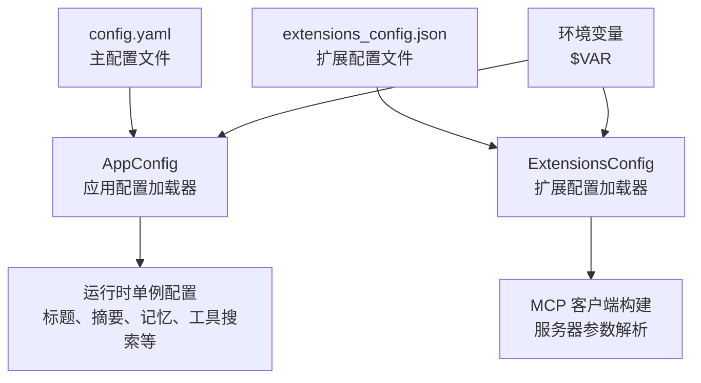
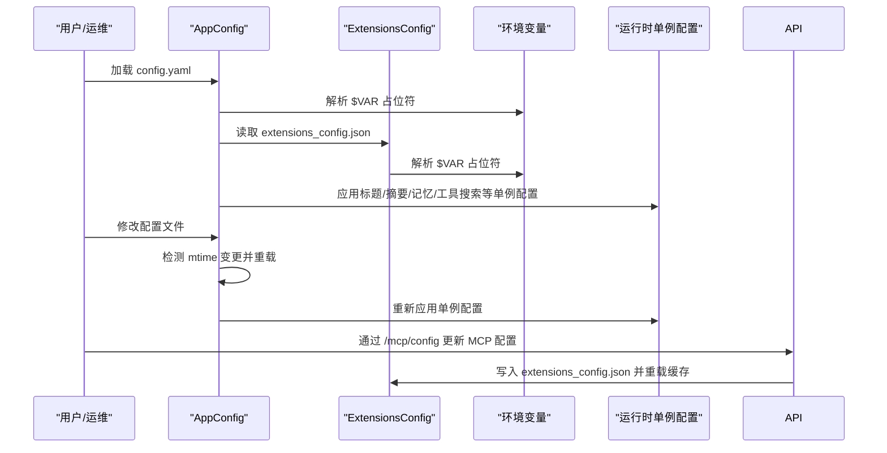
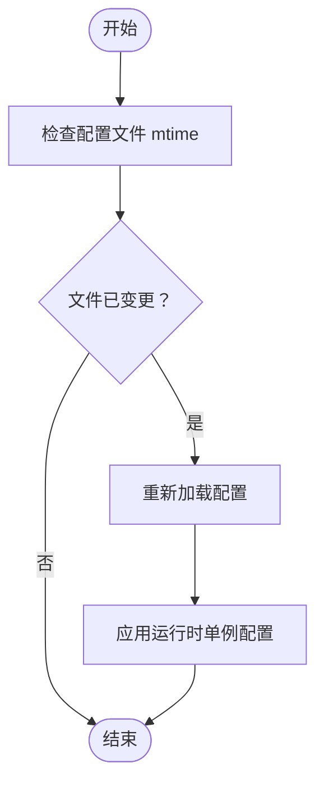
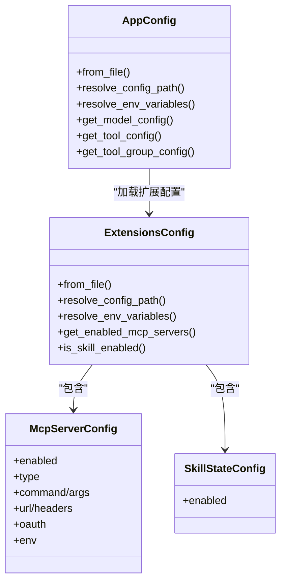

# 配置管理

<cite>
**本文档引用的文件**
- [config.example.yaml](file://config.example.yaml)
- [extensions_config.example.json](file://extensions_config.example.json)
- [app_config.py](file://backend/packages/harness/deerflow/config/app_config.py)
- [extensions_config.py](file://backend/packages/harness/deerflow/config/extensions_config.py)
- [config-upgrade.sh](file://scripts/config-upgrade.sh)
- [configure.py](file://scripts/configure.py)
- [config.py](file://backend/app/gateway/config.py)
- [mcp.py](file://backend/app/gateway/routers/mcp.py)
- [client.py](file://backend/packages/harness/deerflow/mcp/client.py)
- [test_config_version.py](file://backend/tests/test_config_version.py)
- [test_mcp_client_config.py](file://backend/tests/test_mcp_client_config.py)
- [test_acp_config.py](file://backend/tests/test_acp_config.py)
- [README_zh.md](file://README_zh.md)
</cite>

## 目录
1. [简介](#简介)
2. [项目结构](#项目结构)
3. [核心组件](#核心组件)
4. [架构总览](#架构总览)
5. [详细组件分析](#详细组件分析)
6. [依赖关系分析](#依赖关系分析)
7. [性能考虑](#性能考虑)
8. [故障排除指南](#故障排除指南)
9. [结论](#结论)
10. [附录](#附录)

## 简介
本指南面向 DeerFlow 的配置管理，系统性阐述配置文件格式、环境变量解析、动态配置更新机制，并深入讲解主配置文件 config.yaml 的各项配置项（模型、沙箱、MCP 服务器、IM 渠道等），以及扩展配置 extensions_config.json 的使用方法与高级选项。同时提供最佳实践与常见场景示例，帮助开发者正确配置与优化 DeerFlow 的运行环境。

## 项目结构
DeerFlow 的配置体系由两部分组成：
- 主配置文件：config.yaml，包含模型、工具、沙箱、技能、记忆、数据库、运行事件等核心配置
- 扩展配置文件：extensions_config.json，用于 MCP 服务器与技能状态管理

图表来源
- [app_config.py:152-185](file://backend/packages/harness/deerflow/config/app_config.py#L152-L185)
- [extensions_config.py:124-149](file://backend/packages/harness/deerflow/config/extensions_config.py#L124-L149)

章节来源
- [config.example.yaml:1-348](file://config.example.yaml#L1-L348)
- [extensions_config.example.json:1-45](file://extensions_config.example.json#L1-L45)

## 核心组件
- AppConfig：统一的应用配置入口，负责解析 config.yaml、合并扩展配置、加载运行时单例配置、动态重载与环境变量解析
- ExtensionsConfig：独立的扩展配置模块，负责 MCP 服务器与技能状态的加载、验证与缓存
- 环境变量解析：支持在 config.yaml 和 extensions_config.json 中使用 $ENV_VAR 形式的占位符
- 动态配置更新：支持监听配置文件变更并自动重载，以及通过 API 更新 MCP 配置

章节来源
- [app_config.py:91-121](file://backend/packages/harness/deerflow/config/app_config.py#L91-L121)
- [extensions_config.py:57-69](file://backend/packages/harness/deerflow/config/extensions_config.py#L57-L69)

## 架构总览
下图展示了配置系统的整体交互流程，从文件加载到运行时生效的关键步骤：

图表来源
- [app_config.py:357-398](file://backend/packages/harness/deerflow/config/app_config.py#L357-L398)
- [extensions_config.py:225-241](file://backend/packages/harness/deerflow/config/extensions_config.py#L225-L241)
- [mcp.py:104-166](file://backend/app/gateway/routers/mcp.py#L104-L166)

## 详细组件分析

### 主配置文件 config.yaml 结构与配置项详解
- 配置版本与日志级别
  - config_version：用于版本迁移与校验
  - log_level：日志级别映射到 logging 模块
- 模型配置（models）
  - 多模型支持，首项为默认模型
  - 关键字段：name、display_name、use、model、api_key、base_url、request_timeout、max_retries、max_tokens、temperature、supports_vision、supports_thinking、supports_reasoning_effort、tool_calling
- 工具组与工具（tool_groups、tools）
  - tool_groups：按功能分组（如 web、file:read、file:write、bash）
  - tools：具体工具定义，包含 name、group、use、max_results 等
- 工具搜索（tool_search）
  - enabled：是否启用工具搜索推荐
- 沙箱配置（sandbox）
  - use：沙箱提供者类路径
  - allow_host_bash、bash_output_max_chars、read_file_output_max_chars、ls_output_max_chars：安全与输出限制
- Skills 容器路径（skills）
  - container_path：容器挂载路径
- 会话标题生成（title）
  - enabled、max_words、max_chars、model_name
- 对话摘要（summarization）
  - enabled、model_name、trigger（type: tokens/messages, value）、keep（type: messages, value）、trim_tokens_to_summarize、summary_prompt、preserve_recent_skill_*、skill_file_read_tool_names
- Agents API（agents_api）
  - enabled：是否启用 Agents API
- 文件上传（uploads）
  - max_files、max_file_size、max_total_size、auto_convert_documents、pdf_converter
- 记忆（memory）
  - enabled、storage_path、debounce_seconds、model_name、max_facts、fact_confidence_threshold、injection_enabled、max_injection_tokens
- Skill 自我进化（skill_evolution）
  - enabled、moderation_model_name
- 数据库（database）
  - backend（sqlite/postgres/memory）、sqlite_dir、Roleplay MySQL 配置
- 运行事件（run_events）
  - backend（memory/db/jsonl）、max_trace_content、track_token_usage
- Subagent（subagents）
  - timeout_seconds、custom_agents：包含描述、system_prompt、tools、skills、model、max_turns、timeout_seconds
- 其他配置
  - token_usage.enabled：是否启用 Token 使用量统计
  - timezone：时区设置
  - circuit_breaker：失败阈值与恢复时间
  - dashscope、oss：第三方服务配置
  - checkpointer、stream_bridge：运行时持久化与流桥接配置

章节来源
- [config.example.yaml:1-348](file://config.example.yaml#L1-L348)

### 扩展配置 extensions_config.json 使用方法
- 结构概览
  - mcpInterceptors：MCP 拦截器列表（包名:函数路径）
  - mcpServers：MCP 服务器集合，每项包含 enabled、type、command/args（stdio）或 url/headers（sse/http）、env、oauth、description
  - skills：技能状态集合（默认启用公共/自定义技能）
- 环境变量解析
  - 在字符串值前使用 $VAR 将被解析为环境变量，未解析时存储为空字符串
- MCP 服务器类型与参数
  - stdio：command、args、env
  - http/sse：url、headers、oauth（可选）
- 技能状态
  - is_skill_enabled：若未显式配置，默认启用 public/custom 技能

章节来源
- [extensions_config.example.json:1-45](file://extensions_config.example.json#L1-L45)
- [extensions_config.py:36-49](file://backend/packages/harness/deerflow/config/extensions_config.py#L36-L49)
- [extensions_config.py:152-180](file://backend/packages/harness/deerflow/config/extensions_config.py#L152-L180)

### 环境变量管理
- 支持位置
  - config.yaml：字符串值以 $ 开头的占位符会被解析
  - extensions_config.json：同上
- 解析策略
  - 未找到对应环境变量时，将替换为空字符串，避免传递原始占位符
- 网关配置（GatewayConfig）
  - 通过环境变量覆盖 host、port、cors_origins、enable_docs

章节来源
- [app_config.py:280-302](file://backend/packages/harness/deerflow/config/app_config.py#L280-L302)
- [extensions_config.py:152-180](file://backend/packages/harness/deerflow/config/extensions_config.py#L152-L180)
- [config.py:18-29](file://backend/app/gateway/config.py#L18-L29)

### 动态配置更新机制
- 配置文件监听与自动重载
  - AppConfig 缓存当前配置与文件修改时间，当检测到变更时自动重新加载
  - 支持通过 reload_app_config() 强制重载
- 扩展配置缓存与重载
  - ExtensionsConfig 提供 get_extensions_config()/reload_extensions_config()/reset_extensions_config()
- MCP 配置在线更新
  - 通过 /api/mcp/config 接口 PUT 更新，保存到 extensions_config.json 并触发缓存重载
  - MCP 客户端根据 enabled 状态构建服务器参数

图表来源
- [app_config.py:389-398](file://backend/packages/harness/deerflow/config/app_config.py#L389-L398)
- [app_config.py:401-414](file://backend/packages/harness/deerflow/config/app_config.py#L401-L414)
- [extensions_config.py:225-241](file://backend/packages/harness/deerflow/config/extensions_config.py#L225-L241)

章节来源
- [app_config.py:357-467](file://backend/packages/harness/deerflow/config/app_config.py#L357-L467)
- [mcp.py:104-166](file://backend/app/gateway/routers/mcp.py#L104-L166)

### 配置版本与升级
- 版本检查
  - AppConfig._check_config_version 会在用户配置版本低于示例版本时发出警告
- 升级脚本
  - config-upgrade.sh：对比版本并合并缺失字段，备份原配置
- 初始化脚本
  - configure.py：在项目根目录生成 config.yaml、.env、前端 .env

章节来源
- [app_config.py:235-278](file://backend/packages/harness/deerflow/config/app_config.py#L235-L278)
- [config-upgrade.sh:1-76](file://scripts/config-upgrade.sh#L1-L76)
- [configure.py:20-58](file://scripts/configure.py#L20-L58)

### IM 渠道配置（示例）
- channels.langgraph_url、gateway_url：LangGraph 与网关地址
- 全局 session 默认值：assistant_id、recursion_limit、thinking_enabled、is_plan_mode、subagent_enabled
- 各渠道配置示例：飞书、企业微信、Slack、Telegram、钉钉
- 按渠道/按用户覆盖：支持覆盖 assistant_id、config、context、users 下的个性化设置

章节来源
- [README_zh.md:253-315](file://README_zh.md#L253-L315)

## 依赖关系分析
- 配置加载依赖
  - AppConfig 依赖 ExtensionsConfig（MCP 服务器与技能状态）
  - 运行时单例配置（标题、摘要、记忆、工具搜索、守卫等）在应用时注入
- 环境变量依赖
  - 通过 os.getenv 解析，未解析时返回空字符串
- MCP 客户端依赖
  - 仅启用的服务器参与构建，不合法配置会被跳过并记录错误

图表来源
- [app_config.py:91-121](file://backend/packages/harness/deerflow/config/app_config.py#L91-L121)
- [extensions_config.py:57-69](file://backend/packages/harness/deerflow/config/extensions_config.py#L57-L69)
- [extensions_config.py:36-49](file://backend/packages/harness/deerflow/config/extensions_config.py#L36-L49)
- [extensions_config.py:51-55](file://backend/packages/harness/deerflow/config/extensions_config.py#L51-L55)

章节来源
- [app_config.py:122-185](file://backend/packages/harness/deerflow/config/app_config.py#L122-L185)
- [extensions_config.py:124-149](file://backend/packages/harness/deerflow/config/extensions_config.py#L124-L149)

## 性能考虑
- 配置文件监听
  - 通过比较文件修改时间实现轻量级热重载，避免频繁全量解析
- 输出限制
  - 沙箱与工具输出的最大字符数限制，防止内存与网络压力过大
- 摘要与记忆
  - 合理设置摘要触发阈值与保留条数，控制上下文长度与存储开销
- 数据库后端
  - 生产环境建议使用 postgres，sqlite 适合本地开发
- Token 使用统计
  - 在需要成本控制时启用 token_usage，结合 run_events 的跟踪能力

## 故障排除指南
- 配置版本过旧
  - 现象：启动时出现版本警告
  - 处理：运行升级脚本，合并新字段并备份原配置
- 环境变量未解析
  - 现象：$VAR 显示为空字符串
  - 处理：确认环境变量存在，或在配置中直接填写值
- MCP 服务器无法连接
  - 现象：构建服务器参数时报错或未启用
  - 处理：检查 enabled、type、command/url、args/headers、env 是否完整；确保 stdio 的 command 存在，http/sse 的 url 正确
- 配置未生效
  - 现象：修改配置后行为不变
  - 处理：确认文件路径解析优先级；对于 MCP 配置，通过 /api/mcp/config 更新并观察日志

章节来源
- [test_config_version.py:35-125](file://backend/tests/test_config_version.py#L35-L125)
- [test_mcp_client_config.py:9-93](file://backend/tests/test_mcp_client_config.py#L9-L93)
- [mcp.py:104-166](file://backend/app/gateway/routers/mcp.py#L104-L166)

## 结论
DeerFlow 的配置管理采用“主配置 + 扩展配置”的双轨设计，结合环境变量解析与动态重载机制，既保证了灵活性，又确保了运行时的稳定性。通过合理设置模型、沙箱、MCP 与 IM 渠道等关键配置，可以有效提升系统的安全性、可维护性与性能表现。

## 附录

### 配置最佳实践
- 优先使用环境变量管理敏感信息，避免硬编码
- 为生产环境选择合适的数据库后端与输出限制
- 合理配置摘要与记忆策略，平衡上下文长度与存储成本
- 使用升级脚本保持配置版本同步，减少迁移风险
- 对 MCP 服务器进行最小权限配置，严格控制 env 与命令参数

### 常见配置场景示例
- 多模型切换：在 models 列表中定义多个模型，首项作为默认模型
- 启用 MCP 服务器：在 extensions_config.json 中添加 enabled=true 的服务器条目
- IM 渠道接入：在 config.yaml 的 channels 段落中配置各渠道的认证参数与会话默认值
- 网关部署：通过环境变量调整网关 host/port/cors_origins/enable_docs

章节来源
- [config.example.yaml:18-115](file://config.example.yaml#L18-L115)
- [extensions_config.example.json:5-43](file://extensions_config.example.json#L5-L43)
- [README_zh.md:253-315](file://README_zh.md#L253-L315)
- [config.py:18-29](file://backend/app/gateway/config.py#L18-L29)