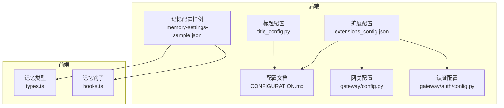
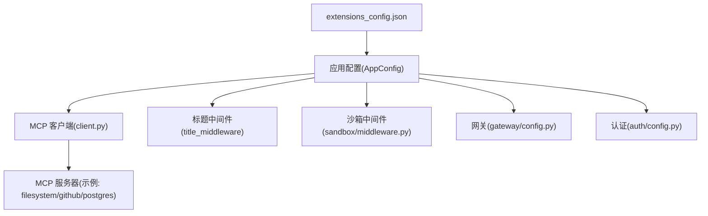
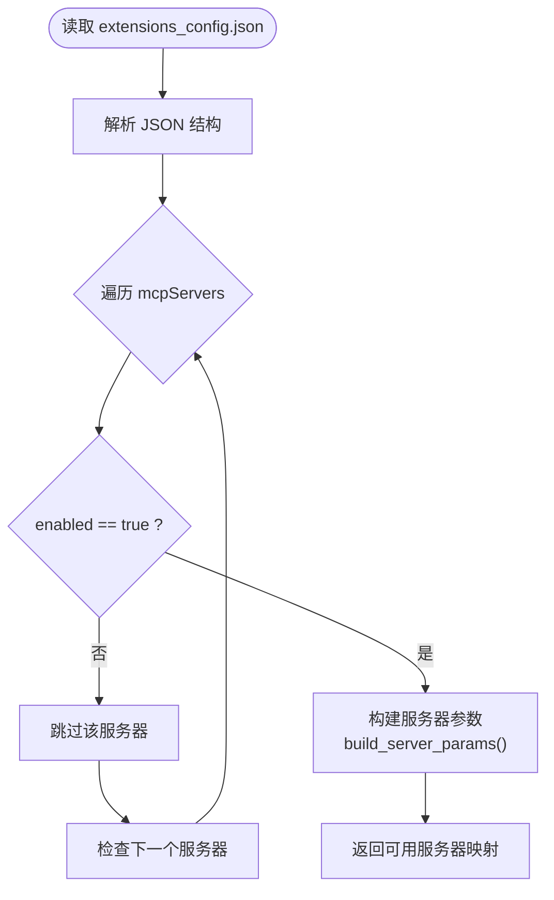
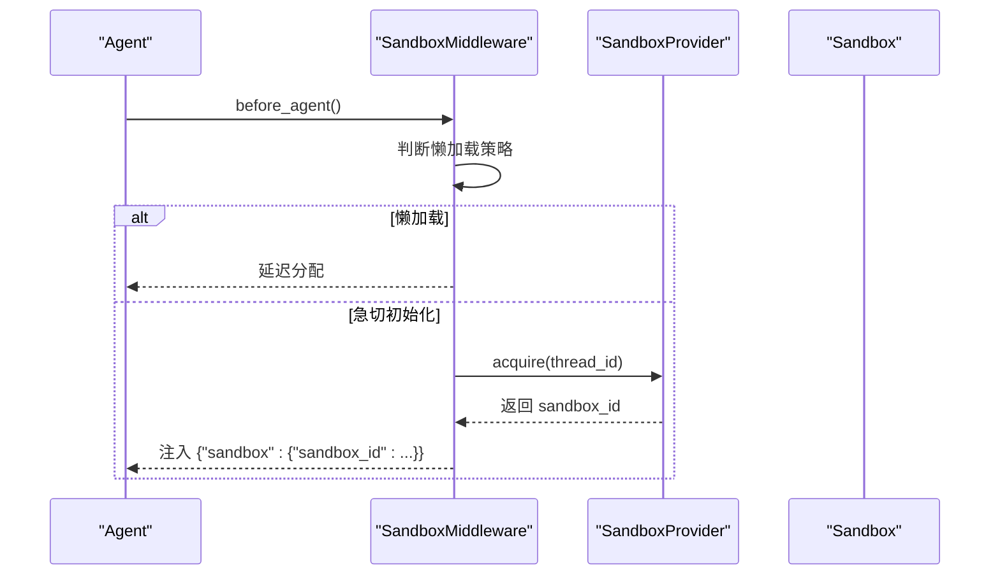
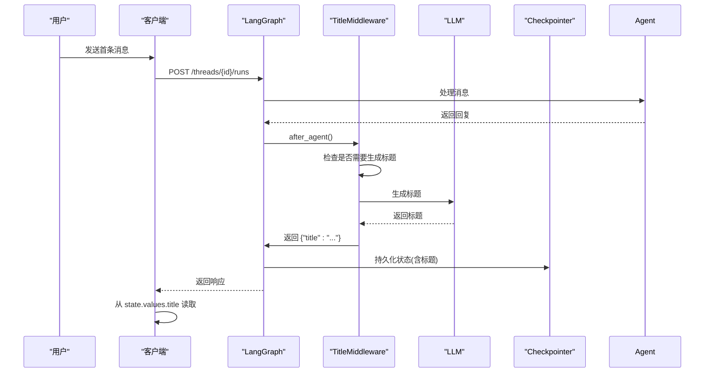
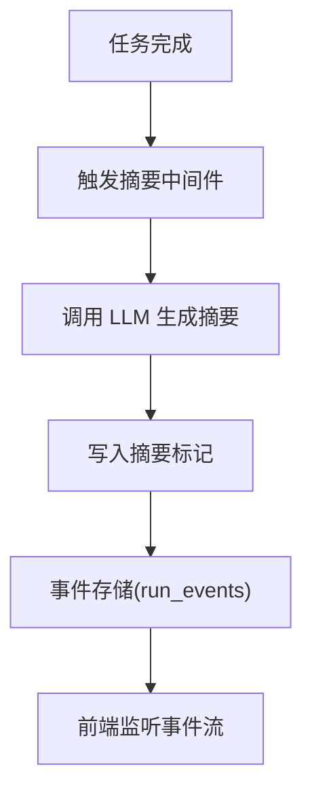
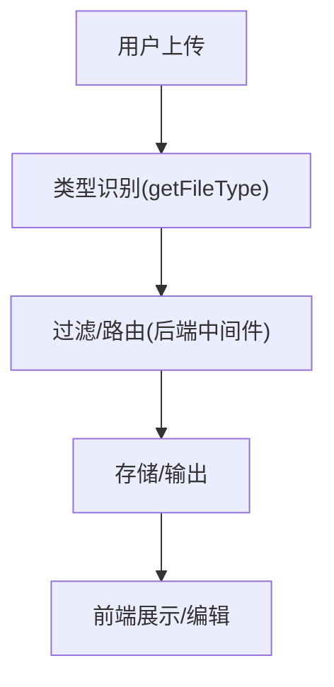
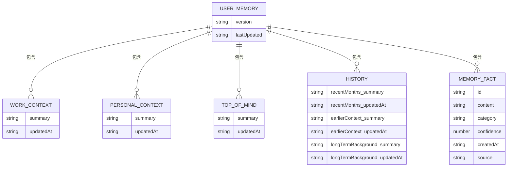
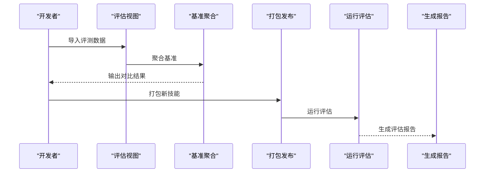
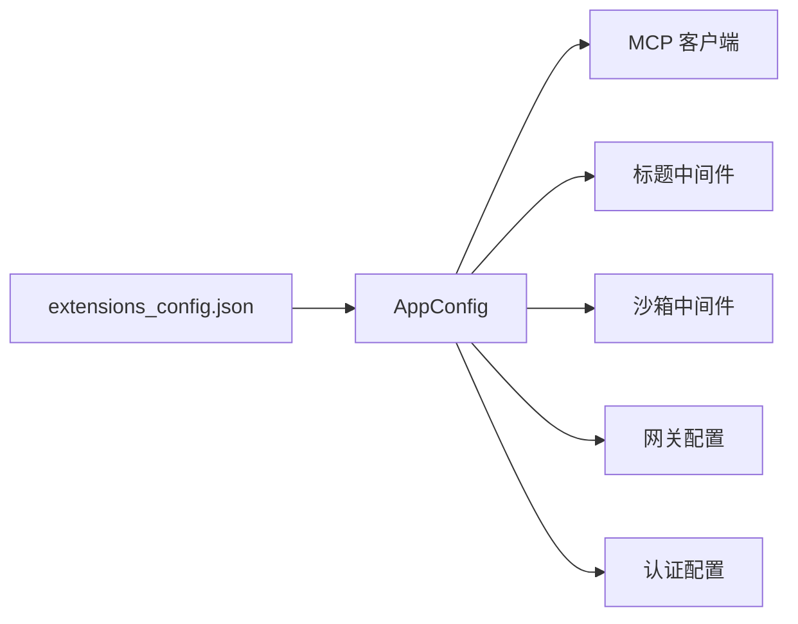

# 高级配置

<cite>
**本文引用的文件**
- [extensions_config.json](file://extensions_config.json)
- [extensions_config.example.json](file://extensions_config.example.json)
- [CONFIGURATION.md](file://backend/docs/CONFIGURATION.md)
- [AUTO_TITLE_GENERATION.md](file://backend/docs/AUTO_TITLE_GENERATION.md)
- [title_config.py](file://backend/packages/harness/deerflow/config/title_config.py)
- [config.py](file://backend/app/gateway/config.py)
- [config.py](file://backend/app/gateway/auth/config.py)
- [sandbox_info.py](file://backend/packages/harness/deerflow/community/aio_sandbox/sandbox_info.py)
- [middleware.py](file://backend/packages/harness/deerflow/sandbox/middleware.py)
- [client.py](file://backend/packages/harness/deerflow/mcp/client.py)
- [memory-settings-sample.json](file://backend/docs/memory-settings-sample.json)
- [types.ts](file://frontend/src/core/memory/types.ts)
- [hooks.ts](file://frontend/src/core/memory/hooks.ts)
- [test_acp_config.py](file://backend/tests/test_acp_config.py)
- [test_mcp_client_config.py](file://backend/tests/test_mcp_client_config.py)
</cite>

## 目录
1. [简介](#简介)
2. [项目结构](#项目结构)
3. [核心组件](#核心组件)
4. [架构总览](#架构总览)
5. [详细组件分析](#详细组件分析)
6. [依赖分析](#依赖分析)
7. [性能考量](#性能考量)
8. [故障排查指南](#故障排查指南)
9. [结论](#结论)
10. [附录](#附录)

## 简介
本指南面向需要精细化控制 DeerFlow 行为的高级用户与运维人员，系统讲解“扩展配置”extensions_config.json 的使用方法与高级选项，并结合后端配置文档与前端实现，完整覆盖以下主题：
- 扩展配置（extensions_config.json）：MCP 服务器、拦截器、技能扩展等
- 沙箱配置（sandbox）：执行模式、隔离边界、容器挂载与绑定
- 会话标题生成配置（title）：自动标题生成策略、持久化与回退
- 对话摘要配置（summarization）：摘要中间件与事件流集成
- 文件上传配置（uploads）：类型识别、过滤与路由
- 记忆配置（memory）：事实抽取、注入与持久化
- 技能自我进化配置（skill_evolution）：技能评估、评测与迭代
- 数据库配置（database）：连接池、迁移与隔离
- 运行事件配置（run_events）：事件存储、分页与查询
- 配置优先级、动态更新与配置迁移
- 复杂场景示例：多租户、性能优化、安全加固

## 项目结构
与高级配置直接相关的文件主要分布在：
- 后端文档与配置：backend/docs、backend/packages/harness/deerflow/config
- 扩展配置样例：extensions_config.example.json、extensions_config.json
- 前端记忆与上传：frontend/src/core/memory、frontend/src/core/utils

**图表来源**
- [CONFIGURATION.md:1-377](file://backend/docs/CONFIGURATION.md#L1-L377)
- [extensions_config.json:1-44](file://extensions_config.json#L1-L44)
- [title_config.py:1-54](file://backend/packages/harness/deerflow/config/title_config.py#L1-L54)
- [config.py:1-30](file://backend/app/gateway/config.py#L1-L30)
- [config.py:1-58](file://backend/app/gateway/auth/config.py#L1-L58)
- [memory-settings-sample.json:1-115](file://backend/docs/memory-settings-sample.json#L1-L115)
- [types.ts:1-54](file://frontend/src/core/memory/types.ts#L1-L54)
- [hooks.ts:1-84](file://frontend/src/core/memory/hooks.ts#L1-L84)

**章节来源**
- [CONFIGURATION.md:1-377](file://backend/docs/CONFIGURATION.md#L1-L377)
- [extensions_config.json:1-44](file://extensions_config.json#L1-L44)

## 核心组件
- 扩展配置（extensions_config.json）：定义 MCP 服务器、拦截器与技能扩展，支持按需启用与环境变量注入。
- 标题生成（title）：基于中间件在首次对话后自动生成标题，并持久化至状态。
- 沙箱（sandbox）：支持本地与容器两种执行模式，提供挂载与绑定配置。
- 记忆（memory）：事实抽取、分类、置信度与注入，支持前端查询与变更。
- 文件上传（uploads）：类型识别与路由，配合后端上传中间件与路由。
- 数据库（database）：通过全局配置与迁移脚本管理持久化层。
- 运行事件（run_events）：事件存储、分页与查询接口。

**章节来源**
- [extensions_config.json:1-44](file://extensions_config.json#L1-L44)
- [CONFIGURATION.md:203-377](file://backend/docs/CONFIGURATION.md#L203-L377)
- [AUTO_TITLE_GENERATION.md:1-259](file://backend/docs/AUTO_TITLE_GENERATION.md#L1-L259)
- [memory-settings-sample.json:1-115](file://backend/docs/memory-settings-sample.json#L1-L115)

## 架构总览
下图展示扩展配置与核心模块的交互关系，以及配置加载与生效路径。

**图表来源**
- [extensions_config.json:1-44](file://extensions_config.json#L1-L44)
- [client.py:45-68](file://backend/packages/harness/deerflow/mcp/client.py#L45-L68)
- [middleware.py:32-65](file://backend/packages/harness/deerflow/sandbox/middleware.py#L32-L65)
- [config.py:1-30](file://backend/app/gateway/config.py#L1-L30)
- [config.py:1-58](file://backend/app/gateway/auth/config.py#L1-L58)

## 详细组件分析

### 扩展配置（extensions_config.json）详解
- MCP 拦截器（mcpInterceptors）：用于增强 MCP 通信的安全与可观测性，支持模块路径与工厂函数形式。
- MCP 服务器（mcpServers）：支持多种类型（如 stdio、http），可配置命令、参数、环境变量与描述；仅启用 enabled=true 的服务器。
- 技能扩展（skills）：用于声明技能行为或覆盖默认配置，示例中包含知识检索技能的空配置对象。

**图表来源**
- [extensions_config.json:1-44](file://extensions_config.json#L1-L44)
- [client.py:45-68](file://backend/packages/harness/deerflow/mcp/client.py#L45-L68)

**章节来源**
- [extensions_config.json:1-44](file://extensions_config.json#L1-L44)
- [extensions_config.example.json:1-45](file://extensions_config.example.json#L1-L45)
- [test_mcp_client_config.py:51-93](file://backend/tests/test_mcp_client_config.py#L51-L93)

### 沙箱配置（sandbox）
- 本地执行：适合单用户、低风险场景，默认禁用主机 bash，强调安全边界。
- Docker 执行：提供更强隔离，支持端口绑定、自动启动、容器前缀与挂载。
- Kubernetes 模式：通过 provisioner 在本地集群 Pod 中运行，适合开发与测试。
- 中间件懒加载：默认延迟获取沙箱以提升性能，必要时可改为急切初始化。

**图表来源**
- [middleware.py:32-65](file://backend/packages/harness/deerflow/sandbox/middleware.py#L32-L65)
- [sandbox_info.py:9-41](file://backend/packages/harness/deerflow/community/aio_sandbox/sandbox_info.py#L9-L41)
- [CONFIGURATION.md:203-262](file://backend/docs/CONFIGURATION.md#L203-L262)

**章节来源**
- [CONFIGURATION.md:203-262](file://backend/docs/CONFIGURATION.md#L203-L262)
- [middleware.py:32-65](file://backend/packages/harness/deerflow/sandbox/middleware.py#L32-L65)
- [sandbox_info.py:9-41](file://backend/packages/harness/deerflow/community/aio_sandbox/sandbox_info.py#L9-L41)

### 会话标题生成配置（title）
- 触发条件：首次对话（1个用户消息 + 1个助手回复）后自动生成。
- 存储位置：ThreadState.title，通过 checkpointer 持久化。
- 配置项：启用开关、最大词数、最大字符数、模型名与提示模板。
- 容错策略：失败时使用用户消息前若干词作为回退标题。

**图表来源**
- [AUTO_TITLE_GENERATION.md:146-167](file://backend/docs/AUTO_TITLE_GENERATION.md#L146-L167)
- [title_config.py:6-32](file://backend/packages/harness/deerflow/config/title_config.py#L6-L32)

**章节来源**
- [AUTO_TITLE_GENERATION.md:61-83](file://backend/docs/AUTO_TITLE_GENERATION.md#L61-L83)
- [title_config.py:1-54](file://backend/packages/harness/deerflow/config/title_config.py#L1-L54)

### 对话摘要配置（summarization）
- 摘要中间件：在任务完成后对已完成子任务进行摘要，减少上下文窗口压力。
- 事件流：与运行事件（run_events）协同，支持分页与查询。
- 前端集成：通过 SSE/事件流监听摘要标记与结果。

[此图为概念性流程，不对应具体源码文件，故不提供图表来源]

**章节来源**
- [CONFIGURATION.md:1-377](file://backend/docs/CONFIGURATION.md#L1-L377)

### 文件上传配置（uploads）
- 类型识别：根据文件扩展名映射语言类型，用于前端高亮与渲染。
- 过滤与路由：后端上传中间件与路由负责校验、转换与存储。
- 前端工具：提供文件名、扩展名提取与代码文件判定工具。

**图表来源**
- [frontend 文件工具:154-171](file://frontend/src/core/utils/files.tsx#L154-L171)

**章节来源**
- [frontend 文件工具:97-171](file://frontend/src/core/utils/files.tsx#L97-L171)
- [CONFIGURATION.md:1-377](file://backend/docs/CONFIGURATION.md#L1-L377)

### 记忆配置（memory）
- 数据结构：用户工作/个人/当前思维、历史近期/早期/长期背景、事实列表（含置信度与来源）。
- 前端模型：定义记忆事实、用户记忆结构与更新输入。
- 钩子与 API：提供加载、导入、创建、更新、删除与清理等操作的 React Query 钩子。

**图表来源**
- [memory-settings-sample.json:1-115](file://backend/docs/memory-settings-sample.json#L1-L115)
- [types.ts:1-54](file://frontend/src/core/memory/types.ts#L1-L54)

**章节来源**
- [memory-settings-sample.json:1-115](file://backend/docs/memory-settings-sample.json#L1-L115)
- [types.ts:1-54](file://frontend/src/core/memory/types.ts#L1-L54)
- [hooks.ts:1-84](file://frontend/src/core/memory/hooks.ts#L1-L84)

### 技能自我进化配置（skill_evolution）
- 评测与对比：通过评估视图与基准聚合脚本，比较新旧技能表现。
- 迭代流程：初始化、快速验证、打包发布、运行评估与报告生成。
- 配置迁移：当应用配置版本升级时，确保技能配置兼容与迁移。

**图表来源**
- [test_acp_config.py:124-165](file://backend/tests/test_acp_config.py#L124-L165)

**章节来源**
- [test_acp_config.py:124-165](file://backend/tests/test_acp_config.py#L124-L165)

### 数据库配置（database）
- 全局配置：通过 config.database 统一管理用户表等共享数据库资源。
- 迁移脚本：提供多版本迁移与隔离字段的脚本，确保数据一致性。
- 连接池与隔离：建议生产环境使用连接池与用户隔离策略。

**章节来源**
- [CONFIGURATION.md:1-377](file://backend/docs/CONFIGURATION.md#L1-L377)

### 运行事件配置（run_events）
- 事件存储：记录运行过程中的关键事件，支持分页查询。
- 与摘要协作：事件流中包含摘要标记，便于前端实时展示。

**章节来源**
- [CONFIGURATION.md:1-377](file://backend/docs/CONFIGURATION.md#L1-L377)

## 依赖分析
- 扩展配置依赖应用配置加载器，后者负责解析并注入到 MCP 客户端。
- 标题生成依赖中间件与状态持久化（checkpointer）。
- 沙箱中间件依赖沙箱提供者与元数据（SandboxInfo）。
- 认证与网关配置独立于扩展配置，但受环境变量影响。

**图表来源**
- [extensions_config.json:1-44](file://extensions_config.json#L1-L44)
- [client.py:45-68](file://backend/packages/harness/deerflow/mcp/client.py#L45-L68)
- [middleware.py:32-65](file://backend/packages/harness/deerflow/sandbox/middleware.py#L32-L65)
- [config.py:1-30](file://backend/app/gateway/config.py#L1-L30)
- [config.py:1-58](file://backend/app/gateway/auth/config.py#L1-L58)

**章节来源**
- [extensions_config.json:1-44](file://extensions_config.json#L1-L44)
- [client.py:45-68](file://backend/packages/harness/deerflow/mcp/client.py#L45-L68)
- [middleware.py:32-65](file://backend/packages/harness/deerflow/sandbox/middleware.py#L32-L65)
- [config.py:1-30](file://backend/app/gateway/config.py#L1-L30)
- [config.py:1-58](file://backend/app/gateway/auth/config.py#L1-L58)

## 性能考量
- 沙箱懒加载：默认延迟分配，减少冷启动开销；若频繁工具调用可切换为急切初始化。
- 标题生成：增加约 0.5–1 秒延迟，可通过更快模型或降低词数/字符数优化。
- MCP 服务器：仅启用必要的服务器，避免无效进程与资源占用。
- 记忆注入：合理设置事实数量与置信度阈值，避免上下文膨胀。
- 上传与摘要：在大文件场景下启用分块与流式处理，降低内存峰值。

[本节为通用性能指导，不直接分析具体文件，故不提供章节来源]

## 故障排查指南
- 扩展配置未生效
  - 检查 DEER_FLOW_EXTENSIONS_CONFIG_PATH 环境变量或代码指定路径
  - 确认 enabled=true 且参数合法（如 stdio 需 command，http 需 url）
- 标题未生成
  - 确认首次对话条件满足（1 用户消息 + 1 助手回复）
  - 检查 state.values.title 读取位置，而非 thread.metadata.title
- 沙箱无法启动
  - Docker 端口冲突或镜像不可达；检查端口绑定与网络
- 认证问题
  - AUTH_JWT_SECRET 未设置时会生成临时密钥，重启后会话失效
- 记忆异常
  - 前端查询键值与后端存储结构一致；检查置信度与分类字段

**章节来源**
- [test_mcp_client_config.py:51-93](file://backend/tests/test_mcp_client_config.py#L51-L93)
- [AUTO_TITLE_GENERATION.md:197-216](file://backend/docs/AUTO_TITLE_GENERATION.md#L197-L216)
- [config.py:33-51](file://backend/app/gateway/auth/config.py#L33-L51)

## 结论
通过 extensions_config.json 与后端配置体系，DeerFlow 提供了从执行隔离、智能标题、记忆注入到 MCP 扩展的全链路高级能力。建议在生产环境遵循“最小权限、明确隔离、可观测与可迁移”的原则，结合本指南的性能与安全建议，实现稳定高效的部署与运维。

[本节为总结性内容，不直接分析具体文件，故不提供章节来源]

## 附录

### 配置优先级与动态更新
- 配置优先级：代码指定路径 > 环境变量指定路径 > 项目根目录 config.yaml > 当前工作目录 fallback
- 动态更新：应用配置重载时会清理旧的 MCP 代理（如移除 acp_agents），需确保新配置完整
- 扩展配置：通过 DEER_FLOW_EXTENSIONS_CONFIG_PATH 指定，支持热更新

**章节来源**
- [CONFIGURATION.md:335-342](file://backend/docs/CONFIGURATION.md#L335-L342)
- [test_acp_config.py:124-165](file://backend/tests/test_acp_config.py#L124-L165)

### 复杂场景示例
- 多租户配置
  - 使用用户隔离字段与数据库迁移脚本，确保租户数据边界
  - 认证层通过 JWT 签名密钥与 OAuth 配置实现身份域划分
- 性能优化配置
  - 沙箱懒加载、更短标题限制、禁用不必要的 MCP 服务器
- 安全配置
  - 禁用本地主机 bash、严格容器挂载、最小权限的 MCP 服务器环境变量

**章节来源**
- [CONFIGURATION.md:203-262](file://backend/docs/CONFIGURATION.md#L203-L262)
- [config.py:21-28](file://backend/app/gateway/auth/config.py#L21-L28)